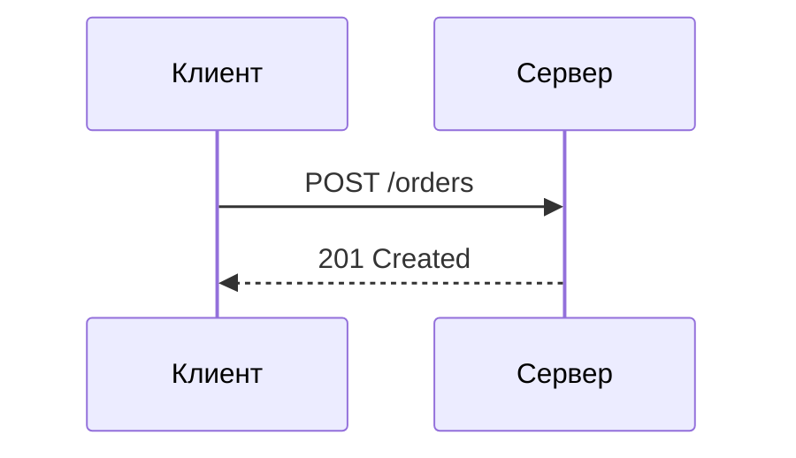

# Как дополнять справочник

Весь контент лежит в папке `docs/` в виде Markdown-файлов. Один файл — одна страница.

## Добавить новую страницу

1. Создайте файл, например `docs/design/hateoas.md`.
2. Начните его с заголовка первого уровня `# Название` — он станет заголовком страницы.
3. Пропишите страницу в боковом меню: `docs/.vitepress/config.mts`, массив `sidebar`.
4. Запустите `npm run dev` и проверьте страницу в браузере.
5. Перед коммитом выполните `npm run build` — сборка упадёт, если на сайте есть битые ссылки.

## Структура страницы

Рекомендуемый порядок разделов (не обязательно все):

1. `# Заголовок` и 1–3 предложения: что это и зачем.
2. Суть и принцип работы (схемы, таблицы).
3. Примеры (HTTP-запросы и ответы, JSON).
4. Когда применять / когда не применять.
5. Типичные ошибки и антипаттерны.
6. «На что обратить внимание аналитику» — практический чек-лист.
7. «Стандарты и ссылки» — RFC и официальные спецификации.

## Стиль текста

- Пишем по-русски, кратко и по делу. Термин на английском — в скобках при первом упоминании: «идемпотентность (idempotency)».
- Названия заголовков, методов, кодов — как в стандарте: `Content-Type`, `PATCH`, `409 Conflict`.
- Ссылаемся на актуальные стандарты: HTTP Semantics — RFC 9110, HTTP Caching — RFC 9111, Problem Details — RFC 9457 и т. д.

## Синтаксис Markdown, который поддерживает сайт

**Ссылки между страницами** — абсолютный путь без `.md`:

```md
[Идемпотентность](/design/idempotency)
[Код 409](/http/status-codes#409)
```

**Якоря.** Если на заголовок будут ссылаться с других страниц, задайте явный якорь латиницей:

```md
## Optimistic locking {#optimistic-locking}
```

**Выноски:**

```md
::: tip Совет
Текст
:::

::: warning Внимание
Текст
:::

::: danger Опасно
Текст
:::

::: info
Текст
:::

::: details Пример целиком
Скрытый под спойлер текст
:::
```

**Код** — всегда указывайте язык: `http`, `json`, `bash`, `yaml`, `xml`, `graphql`, `protobuf`, `js`, `python`, `sql`.

````md
```http
GET /api/v1/orders/42 HTTP/1.1
Host: api.example.com
Accept: application/json
```
````

**Вкладки с вариантами кода:**

````md
::: code-group

```bash [curl]
curl https://api.example.com/orders
```

```http [HTTP]
GET /orders HTTP/1.1
```

:::
````

**Диаграммы** — Mermaid (sequence, flowchart, state и др.):

````md

````

## Подводные камни

VitePress обрабатывает Markdown как шаблон Vue, поэтому **вне блоков кода**:

- не используйте двойные фигурные скобки `{{ }}` — Vue попытается их вычислить. Если нужно — оберните в `<span v-pre>…</span>`;
- не пишите угловые скобки как текст: `Bearer <token>` сломает сборку. Берите такое в обратные кавычки (`` `Bearer <token>` ``) или пишите `&lt;token&gt;`.

Внутри блоков кода (```` ``` ````) и инлайн-кода (`` ` ``) всё можно.
