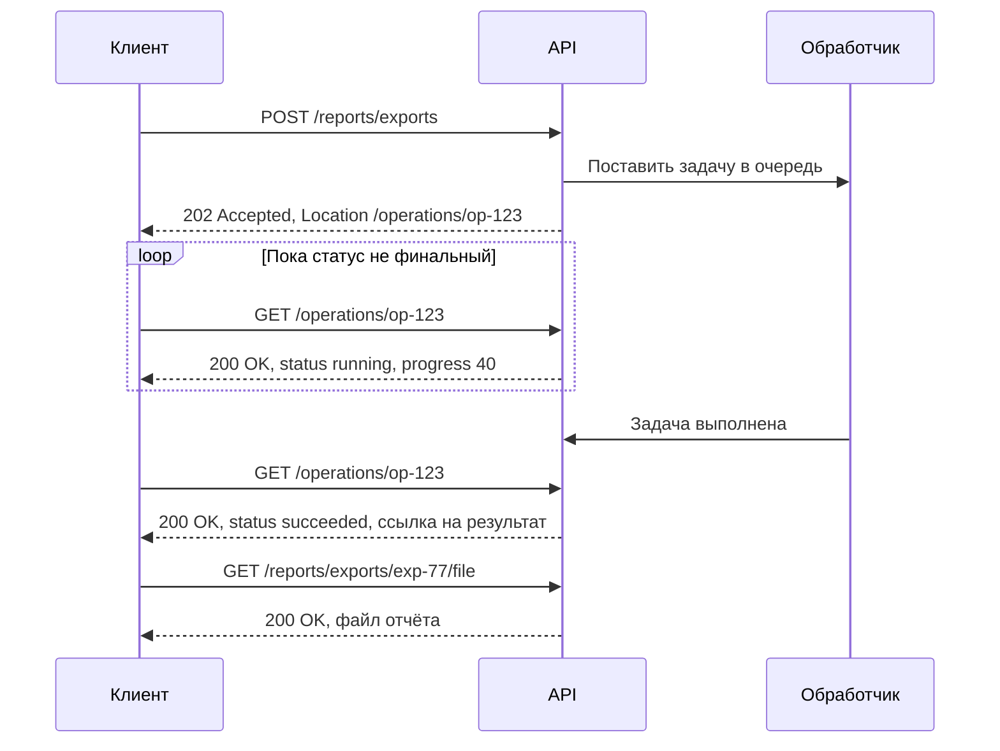
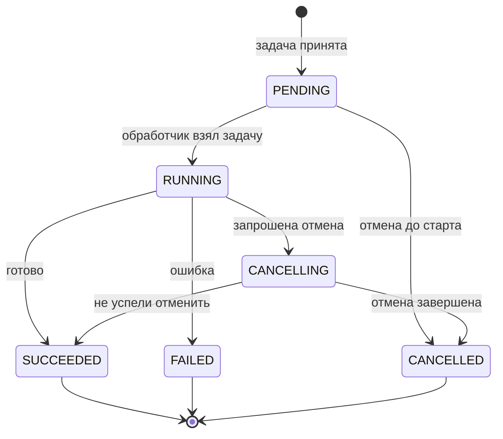
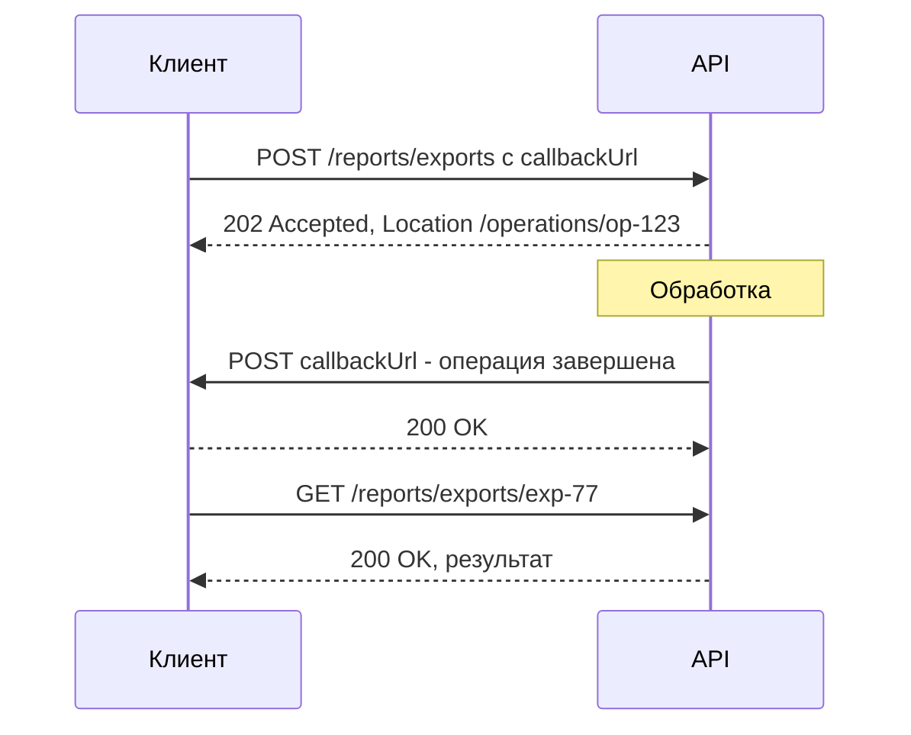
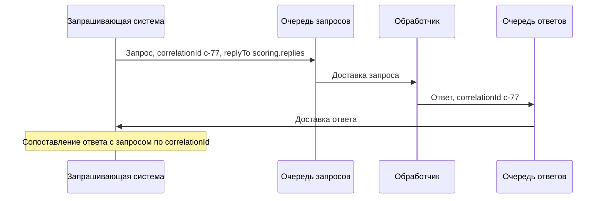

# Длительные и асинхронные операции

Если операция выполняется дольше нескольких секунд — формирование отчёта, импорт файла, скоринг, выпуск карты, — держать HTTP-соединение открытым до её завершения нельзя. Вместо этого сервер **принимает задачу**, сразу отвечает `202 Accepted` и даёт клиенту способ узнать результат: опрос ресурса операции, колбэк или сообщение в брокере.

## Проблема долгих запросов {#problem}

Синхронный запрос на минуту ломается сразу в нескольких местах:

| Где | Что происходит |
|---|---|
| Балансировщики, прокси, API-шлюзы | У каждого свой таймаут ожидания ответа (часто 30–60 секунд; у AWS API Gateway — около 29 секунд по умолчанию). Шлюз отдаёт `504`, а операция продолжает выполняться |
| HTTP-клиент | Таймаут чтения клиента меньше времени операции → ошибка, клиент повторяет → **операция запускается второй раз** |
| Сервер | Поток/соединение занято всё время операции; при сотне таких запросов пул исчерпан |
| Мобильная сеть | Соединение рвётся, результат теряется |
| Пользователь | Ждёт без индикации прогресса |

Правило практики: если время выполнения p99 приближается к нескольким секундам или **непредсказуемо** (зависит от объёма данных, внешних систем, очередей) — проектируйте операцию асинхронной.

## Паттерн 202 Accepted + ресурс операции {#202-pattern}

Код `202 Accepted` (RFC 9110) означает: «запрос принят к обработке, но обработка не завершена». Сам по себе он не говорит, как узнать результат — поэтому сервер создаёт **ресурс операции** (status monitor) и возвращает ссылку на него в заголовке `Location`.



### Запуск операции — пример «экспорт отчёта» {#export-example}

```http
POST /api/v1/reports/exports HTTP/1.1
Host: api.example.com
Content-Type: application/json
Idempotency-Key: 3e4d5c6b-7a89-4b0c-9d1e-2f3a4b5c6d7e

{
  "reportType": "TRANSACTIONS",
  "period": { "from": "2026-09-01", "to": "2026-09-30" },
  "format": "CSV"
}
```

```http
HTTP/1.1 202 Accepted
Location: /api/v1/operations/op-123
Retry-After: 5
Content-Type: application/json

{
  "id": "op-123",
  "status": "PENDING",
  "createdAt": "2026-10-03T10:00:00Z",
  "links": { "self": "/api/v1/operations/op-123", "cancel": "/api/v1/operations/op-123:cancel" }
}
```

- `Location` — URI ресурса операции, который клиент будет опрашивать.
- `Retry-After` — рекомендуемая пауза перед первым опросом (в секундах).
- Тело дублирует ссылку — клиентам удобнее читать из JSON.
- `Idempotency-Key` защищает от запуска двух одинаковых экспортов при повторе запроса (см. [Идемпотентность](/design/idempotency)).

### Модель ресурса операции {#operation-model}

| Поле | Тип | Описание |
|---|---|---|
| `id` | string | Идентификатор операции |
| `status` | enum | `PENDING`, `RUNNING`, `SUCCEEDED`, `FAILED`, `CANCELLED` (+ `CANCELLING` при необходимости) |
| `progress` | integer 0–100 | Процент выполнения, если его можно оценить |
| `createdAt`, `startedAt`, `finishedAt` | date-time | Временные метки |
| `expiresAt` | date-time | До какого момента операция и её результат доступны |
| `result` / `resultUrl` | object / URI | Результат (если небольшой) или ссылка на созданный ресурс |
| `error` | Problem Details | Причина неуспеха, в формате [ошибок API](/design/errors) |
| `type` / `operationType` | string | Тип операции, если ресурс общий для разных операций |
| `links` | object | `self`, `cancel`, `result` |



`SUCCEEDED`, `FAILED`, `CANCELLED` — **финальные** статусы: после них статус не меняется. Это нужно явно указать в контракте, чтобы клиент знал, когда прекращать опрос.

### Опрос статуса (polling) {#polling}

::: code-group

```http [В процессе]
GET /api/v1/operations/op-123 HTTP/1.1
Host: api.example.com

HTTP/1.1 200 OK
Retry-After: 10
Content-Type: application/json

{
  "id": "op-123",
  "status": "RUNNING",
  "progress": 40,
  "createdAt": "2026-10-03T10:00:00Z",
  "startedAt": "2026-10-03T10:00:03Z"
}
```

```http [Успех]
GET /api/v1/operations/op-123 HTTP/1.1
Host: api.example.com

HTTP/1.1 200 OK
Content-Type: application/json

{
  "id": "op-123",
  "status": "SUCCEEDED",
  "progress": 100,
  "createdAt": "2026-10-03T10:00:00Z",
  "finishedAt": "2026-10-03T10:02:41Z",
  "expiresAt": "2026-10-10T10:02:41Z",
  "resultUrl": "/api/v1/reports/exports/exp-77"
}
```

```http [Ошибка]
GET /api/v1/operations/op-123 HTTP/1.1
Host: api.example.com

HTTP/1.1 200 OK
Content-Type: application/json

{
  "id": "op-123",
  "status": "FAILED",
  "finishedAt": "2026-10-03T10:01:12Z",
  "error": {
    "type": "https://api.example.com/problems/report-too-large",
    "title": "Отчёт слишком большой",
    "status": 422,
    "detail": "За выбранный период более 5 000 000 строк. Сократите период.",
    "code": "REPORT_TOO_LARGE"
  }
}
```

:::

::: warning Ошибка операции — это не ошибка запроса статуса
`GET /operations/op-123` успешно вернул состояние операции — значит, ответ `200`, даже если сама операция `FAILED`. Код `4xx`/`5xx` на запрос статуса означает проблему с **самим запросом статуса** (`404` — нет такой операции или она истекла).
:::

Правила опроса для клиента:

- первый опрос — не раньше `Retry-After`;
- интервал растёт (например, 2 → 5 → 10 → 30 секунд), сервер может подсказывать его через `Retry-After` в каждом ответе;
- общий таймаут ожидания (например, 30 минут) — после него клиент перестаёт опрашивать и сигнализирует об инциденте;
- опрос учитывается в [лимитах запросов](/design/rate-limiting) — слишком частый опрос получит `429`.

### Завершение: 303 See Other или ссылка в теле {#completion}

Два распространённых варианта:

| Вариант | Как выглядит | Плюсы | Минусы |
|---|---|---|---|
| `200 OK` + ссылка на результат в теле | `"resultUrl": "/reports/exports/exp-77"` | Клиент явно видит статус и решает, что делать; единообразно для всех статусов | Нужен дополнительный запрос за результатом |
| `303 See Other` + `Location` на результат | После завершения `GET /operations/op-123` отвечает `303` | Клиенты, следующие редиректам, «сами» получают результат | Многие HTTP-клиенты автоматически следуют редиректу — клиент не видит статус операции; неудобно, если нужно получить и статус, и результат |

```http
GET /api/v1/operations/op-123 HTTP/1.1

HTTP/1.1 303 See Other
Location: /api/v1/reports/exports/exp-77
```

Для интеграций система–система чаще выбирают **`200` со ссылкой в теле** — так проще и предсказуемее. Google AIP-151 и Microsoft (Azure) используют именно такую модель: ресурс операции со статусом и результатом/ссылкой.

### Отмена операции {#cancel}

```http
POST /api/v1/operations/op-123:cancel HTTP/1.1
Host: api.example.com

HTTP/1.1 202 Accepted
Content-Type: application/json

{ "id": "op-123", "status": "CANCELLING" }
```

- Отмена — **запрос**, а не гарантия: операция может успеть завершиться. Финальный статус клиент узнаёт опросом.
- Варианты API: `POST /operations/{id}:cancel` (стиль Google), `POST /operations/{id}/cancel`, `DELETE /operations/{id}` (но `DELETE` обычно означает «удалить запись об операции», лучше не смешивать).
- Отмена финальной операции → `409 Conflict` или идемпотентный `200` с текущим статусом — зафиксируйте.
- Опишите, что происходит с частично выполненной работой: откат, частичный результат, компенсация.

## Колбэк (webhook) по завершении {#callback}

Вместо опроса клиент передаёт URL, на который сервер отправит уведомление о завершении (см. [Webhooks](/protocols/webhooks)).

```http
POST /api/v1/reports/exports HTTP/1.1
Content-Type: application/json
Idempotency-Key: 3e4d5c6b-7a89-4b0c-9d1e-2f3a4b5c6d7e

{
  "reportType": "TRANSACTIONS",
  "period": { "from": "2026-09-01", "to": "2026-09-30" },
  "callbackUrl": "https://client.example.org/hooks/report-ready"
}
```

```http
POST /hooks/report-ready HTTP/1.1
Host: client.example.org
Content-Type: application/json
X-Signature: sha256=8f4b2c...

{
  "eventId": "evt-5521",
  "eventType": "operation.completed",
  "operationId": "op-123",
  "status": "SUCCEEDED",
  "resultUrl": "https://api.example.com/api/v1/reports/exports/exp-77",
  "occurredAt": "2026-10-03T10:02:41Z"
}
```



::: tip Колбэк + опрос
Колбэки теряются: клиент был недоступен, ретраи исчерпаны. Надёжная схема — **колбэк как сигнал**, а опрос ресурса операции как запасной путь и как источник истины. Уведомление может быть «тонким» (только `operationId` и статус), а данные клиент забирает запросом — так безопаснее, чем передавать результат в колбэке.
:::

Что нужно для колбэков: подпись или mTLS, политика повторов отправки, идемпотентная обработка у получателя (по `eventId`), регистрация/валидация URL (защита от SSRF — нельзя слать запросы на произвольные внутренние адреса).

## Prefer: respond-async {#prefer}

Заголовок `Prefer` (RFC 7240) позволяет клиенту выразить **предпочтение** синхронной или асинхронной обработки, а серверу — сообщить, учёл ли он его (`Preference-Applied`).

```http
POST /api/v1/documents/convert HTTP/1.1
Prefer: respond-async, wait=10
Content-Type: application/json

{ "documentId": "doc-9", "targetFormat": "PDF" }
```

- `respond-async` — клиент предпочитает асинхронный ответ;
- `wait=10` — клиент готов ждать до 10 секунд;
- сервер может уложиться и вернуть `200`/`201` сразу, либо вернуть `202` с `Location`.

```http
HTTP/1.1 202 Accepted
Preference-Applied: respond-async
Location: /api/v1/operations/op-456
```

Это удобно для операций, которые **обычно** быстрые, но иногда долгие: клиент поддерживает обе ветки, сервер выбирает. Минус — клиенту всегда нужно уметь обрабатывать оба варианта ответа.

## Асинхронный request-reply через брокер {#messaging}

Внутри периметра, где у систем есть общий брокер (см. [Брокеры сообщений](/protocols/messaging)), асинхронный запрос-ответ строят на сообщениях:



- **`correlationId`** — идентификатор, по которому запрашивающий сопоставляет ответ с запросом (в JMS — `JMSCorrelationID`, в AMQP/RabbitMQ — свойство `correlation_id`, в Kafka — заголовок сообщения).
- **`replyTo`** — куда отправить ответ (очередь/топик). Позволяет нескольким клиентам использовать один обработчик.
- Нужен **таймаут ожидания ответа** и обработка «опоздавших» ответов (ответ пришёл, когда запрашивающий уже сдался).
- Сообщения должны обрабатываться идемпотентно — брокеры обычно гарантируют доставку «хотя бы раз».

Подробнее — в [Интеграционных паттернах](/reliability/integration-patterns).

## Загрузка большого файла с асинхронной обработкой {#upload-example}

Типовой сценарий: клиент загружает файл реестра, сервер проверяет и импортирует его несколько минут.

1. `POST /imports` с метаданными → `201 Created` + presigned URL для загрузки (см. [Пакетные операции](/design/bulk)).
2. Клиент загружает файл по presigned URL напрямую в хранилище.
3. `POST /imports/imp-5:start` → `202 Accepted`, `Location: /operations/op-789`.
4. Опрос `/operations/op-789` → `SUCCEEDED` с отчётом: сколько строк загружено, ссылка на файл ошибок по строкам.

```json
{
  "id": "op-789",
  "status": "SUCCEEDED",
  "result": {
    "totalRows": 120000,
    "imported": 119874,
    "rejected": 126,
    "rejectedRowsReportUrl": "/api/v1/imports/imp-5/errors.csv"
  }
}
```

::: info Частичный успех — тоже успех операции
Если операция обработала часть данных, статус обычно `SUCCEEDED` с детальной статистикой, а `FAILED` — только если результат непригоден целиком. Это нужно явно описать.
:::

## Сравнение подходов {#comparison}

| Подход | Задержка узнавания результата | Нагрузка | Требования к клиенту | Надёжность | Когда применять |
|---|---|---|---|---|---|
| Синхронно с большим таймаутом | Мгновенно | Держит соединения | Минимальные | Низкая (таймауты шлюзов) | Операции до нескольких секунд |
| `202` + опрос | Интервал опроса | Лишние запросы | Цикл опроса | Высокая, клиент сам контролирует | **Базовый вариант** для любых API |
| `202` + колбэк | Минимальная | Минимальная | Публичный HTTPS-эндпоинт, проверка подписи | Средняя (колбэки теряются) | Партнёр готов принимать вебхуки |
| Колбэк + опрос как резерв | Минимальная | Небольшая | Оба механизма | Высокая | Критичные процессы |
| `Prefer: respond-async` | Зависит от сервера | — | Обе ветки ответа | Высокая | Операции переменной длительности |
| Request-reply через брокер | Минимальная | Минимальная | Доступ к брокеру | Высокая | Внутренние системы с общим брокером |
| [SSE](/protocols/sse) / [WebSocket](/protocols/websocket) | Мгновенно, с прогрессом | Постоянное соединение | Поддержка протокола | Средняя | UI с отображением прогресса |

## Типичные ошибки {#mistakes}

- **Нет TTL у операций**: таблица операций растёт бесконечно; клиент не знает, сколько хранится результат. Нужен `expiresAt` и явный срок хранения (например, 7 дней), после — `404` или `410`.
- **Нет идемпотентности запуска**: повтор `POST` после таймаута запускает второй тяжёлый экспорт. Нужен `Idempotency-Key` или дедупликация по параметрам.
- `202` без `Location` — клиент не знает, где искать результат.
- Ресурс операции отвечает `500`, если операция `FAILED`.
- Нет финальных статусов или они не описаны — клиент опрашивает вечно.
- Клиент опрашивает каждые 100 мс без ограничения времени ожидания.
- Колбэк — единственный способ узнать результат, без возможности опроса.
- Результат операции в колбэке целиком (большой объём, ПДн) без подписи.
- Нет ограничения на число одновременно запущенных операций одного клиента.
- Доступ к операции не проверяется — клиент A может прочитать операцию клиента B по угаданному `id` (BOLA, см. [OWASP API Top 10](/security/owasp-api)).
- Отмена «обещается», но в реальности не останавливает обработку.

## На что обратить внимание аналитику {#checklist}

- [ ] Обосновано, какие операции асинхронные (оценка времени выполнения p99, таймауты шлюзов на пути запроса).
- [ ] Описан запрос запуска: `202 Accepted`, `Location`, `Retry-After`, тело с `id`.
- [ ] Запуск идемпотентен (`Idempotency-Key`), описано поведение при повторе.
- [ ] Модель ресурса операции: поля, перечень статусов, **финальные статусы**, диаграмма переходов.
- [ ] Формат ошибки операции (Problem Details в поле `error`) и формат частичного успеха.
- [ ] Способ получения результата: ссылка в теле или `303`; где и сколько хранится результат.
- [ ] Рекомендуемый интервал опроса и максимальное время ожидания на стороне клиента.
- [ ] TTL операции и результата (`expiresAt`), ответ после истечения.
- [ ] Отмена: поддерживается ли, эндпоинт, поведение для финальных статусов, судьба частичных результатов.
- [ ] Колбэк: формат, подпись, политика повторов, регистрация URL, опрос как резерв.
- [ ] Права доступа к операциям: клиент видит только свои.
- [ ] Лимиты: число одновременных операций, частота опроса.

## Стандарты и ссылки {#links}

- [RFC 9110 — HTTP Semantics: 202 Accepted](https://www.rfc-editor.org/rfc/rfc9110#name-202-accepted)
- [RFC 9110 — HTTP Semantics: 303 See Other](https://www.rfc-editor.org/rfc/rfc9110#name-303-see-other)
- [RFC 7240 — Prefer Header for HTTP](https://www.rfc-editor.org/rfc/rfc7240)
- [Google AIP-151 — Long-running operations](https://google.aip.dev/151)
- [Microsoft REST API Guidelines — Long-running operations](https://github.com/microsoft/api-guidelines/blob/vNext/azure/Guidelines.md)
- [Microsoft Azure Architecture Center — Asynchronous Request-Reply pattern](https://learn.microsoft.com/en-us/azure/architecture/patterns/async-request-reply)
- [Enterprise Integration Patterns — Request-Reply, Correlation Identifier, Return Address](https://www.enterpriseintegrationpatterns.com/patterns/messaging/RequestReply.html)
- [Zalando RESTful API Guidelines](https://opensource.zalando.com/restful-api-guidelines/)
