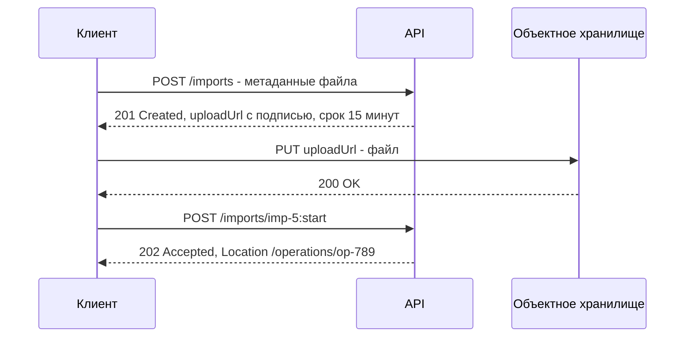

# Пакетные операции

Пакетные операции (bulk, batch) позволяют обработать много объектов одним HTTP-запросом: создать 500 заказов, обновить остатки по 10 000 товаров, выполнить несколько разных вызовов за один round-trip. Главные вопросы при проектировании — **атомарность**, **формат поэлементных результатов**, **лимиты** и **идемпотентность**.

## Зачем {#why}

| Проблема без пакетов | Как помогает пакет |
|---|---|
| 10 000 отдельных запросов × 50 мс сетевой задержки = 8+ минут | Один запрос или несколько десятков пакетов |
| Упор в [лимиты запросов](/design/rate-limiting) | Один пакет считается одним запросом (или взвешенно) |
| Накладные расходы на TLS, заголовки, аутентификацию каждого запроса | Платятся один раз |
| Невозможно атомарно изменить несколько ресурсов | Пакет можно сделать транзакционным |
| Мобильный клиент делает 15 запросов при открытии экрана | Один batch-запрос |

Но пакеты усложняют обработку ошибок, повторы и мониторинг. Если объёмы небольшие — отдельные запросы проще.

## Виды пакетных операций {#types}

| Вид | Что делает | Пример |
|---|---|---|
| **Bulk** — однотипная операция над массивом | Создать / обновить / удалить много ресурсов одного типа | `POST /orders:batchCreate` с массивом заказов |
| **Batch** — набор разных операций | Несколько произвольных запросов в одном конверте | `POST /$batch`: `GET /users/1`, `PATCH /orders/5`, `DELETE /carts/9` |
| **Массовая загрузка файлом** | Файл (CSV, JSON Lines) обрабатывается асинхронно | `POST /imports` + загрузка файла |

## Bulk: массив однотипных объектов {#bulk}

Варианты URI:

| Вариант | Пример | Комментарий |
|---|---|---|
| Отдельный эндпоинт | `POST /orders/bulk`, `POST /orders/batch` | Просто и наглядно; `bulk` выглядит как ресурс, что формально не по REST, но широко распространено |
| Пользовательский метод (стиль Google AIP) | `POST /orders:batchCreate`, `POST /orders:batchUpdate`, `POST /orders:batchDelete` | Явно отделяет действие от ресурса |
| Тот же эндпоинт с массивом | `POST /orders` с телом-массивом | Один URI принимает и объект, и массив — усложняет схему и обработку ошибок. Лучше избегать |

```http
POST /api/v1/orders:batchCreate HTTP/1.1
Host: api.example.com
Content-Type: application/json
Idempotency-Key: 0c1d2e3f-4a5b-4c6d-8e7f-9a0b1c2d3e4f

{
  "requests": [
    { "externalId": "EXT-1001", "customerId": "c-15", "items": [ { "sku": "A-1", "quantity": 2 } ] },
    { "externalId": "EXT-1002", "customerId": "c-16", "items": [ { "sku": "B-7", "quantity": 1 } ] },
    { "externalId": "EXT-1003", "customerId": "c-99", "items": [ { "sku": "C-3", "quantity": 5 } ] }
  ]
}
```

::: tip Обёртка, а не голый массив
Тело `{"requests": [...]}` лучше, чем `[...]`: в объект можно позже добавить параметры пакета (`"atomic": true`, `"validateOnly": true`) без ломающего изменения. Тот же принцип — для ответа.
:::

## Атомарность или частичный успех {#atomicity}

| | Атомарно (всё или ничего) | Частичный успех |
|---|---|---|
| Поведение | Ошибка в одном элементе — весь пакет отклоняется, ничего не сохранено | Успешные элементы сохраняются, ошибочные — нет |
| Ответ при ошибке | `4xx`/`5xx` с Problem Details, `errors[]` с указателем на элементы | `200 OK` или `207 Multi-Status` с результатом по каждому элементу |
| Повтор | Исправить и отправить весь пакет | Отправить только неуспешные элементы |
| Плюсы | Простая семантика, консистентность | Плохие данные не блокируют хорошие; удобно для массовых загрузок |
| Минусы | Одна ошибка блокирует тысячи записей; транзакция на большой объём дорогая | Клиент обязан разбирать результат поэлементно |
| Когда | Связанные данные (заказ и его позиции, проводки баланса) | Независимые записи: остатки, цены, справочники |

Можно дать выбор клиенту параметром (`"atomic": true` / `false`), но это удваивает число сценариев тестирования.

### Атомарный пакет — ответ при ошибке

```http
HTTP/1.1 422 Unprocessable Content
Content-Type: application/problem+json

{
  "type": "https://api.example.com/problems/batch-validation-error",
  "title": "Пакет отклонён",
  "status": 422,
  "detail": "Пакет не обработан: ошибки в 1 элементе из 3. Ни один заказ не создан.",
  "errors": [
    { "pointer": "#/requests/2/customerId", "code": "CUSTOMER_NOT_FOUND", "detail": "Клиент c-99 не найден" }
  ]
}
```

### Частичный успех — ответ 207 или 200 {#partial-success}

`207 Multi-Status` пришёл из WebDAV (RFC 4918) и формально предполагает XML-тело; в JSON API его используют по соглашению. Альтернатива — `200 OK` со списком результатов. Главное — **всегда** результат по каждому элементу и сводка.

```http
HTTP/1.1 207 Multi-Status
Content-Type: application/json

{
  "results": [
    { "index": 0, "externalId": "EXT-1001", "status": 201, "id": "ord-501" },
    { "index": 1, "externalId": "EXT-1002", "status": 201, "id": "ord-502" },
    {
      "index": 2,
      "externalId": "EXT-1003",
      "status": 422,
      "error": {
        "type": "https://api.example.com/problems/customer-not-found",
        "title": "Клиент не найден",
        "status": 422,
        "detail": "Клиент c-99 не найден",
        "code": "CUSTOMER_NOT_FOUND"
      }
    }
  ],
  "summary": { "total": 3, "succeeded": 2, "failed": 1 }
}
```

Правила для поэлементного ответа:

- порядок результатов совпадает с порядком в запросе **и** есть явная связь (`index` и/или бизнес-ключ `externalId`);
- у каждого элемента свой статус и ошибка в формате [Problem Details](/design/errors);
- сводка `summary` для быстрых проверок и логов;
- если **все** элементы неуспешны — договоритесь: всё равно `207`/`200` или общий `4xx`;
- ошибка уровня всего пакета (невалидный JSON, превышен размер, нет прав) — обычный `4xx` без поэлементных результатов.

| Код ответа | Когда |
|---|---|
| `200 OK` | Пакет обработан, результат по элементам в теле (подход Google AIP) |
| `207 Multi-Status` | То же, с явным сигналом «смотри результат по элементам» |
| `202 Accepted` | Пакет принят для асинхронной обработки |
| `400` / `422` | Пакет отклонён целиком (атомарный режим или ошибка конверта) |
| `413 Content Too Large` | Превышен размер пакета |

## Batch: разные операции в одном запросе {#batch}

### JSON batch (Microsoft Graph, OData 4.01)

```http
POST https://graph.microsoft.com/v1.0/$batch HTTP/1.1
Content-Type: application/json

{
  "requests": [
    { "id": "1", "method": "GET", "url": "/me" },
    { "id": "2", "method": "GET", "url": "/me/messages?$top=5" },
    {
      "id": "3",
      "method": "PATCH",
      "url": "/me/events/AAMk...",
      "headers": { "Content-Type": "application/json" },
      "body": { "subject": "Перенос встречи" },
      "dependsOn": [ "1" ]
    }
  ]
}
```

```json
{
  "responses": [
    { "id": "1", "status": 200, "body": { "displayName": "Иван Петров" } },
    { "id": "3", "status": 200, "body": { "subject": "Перенос встречи" } },
    { "id": "2", "status": 429, "headers": { "Retry-After": "10" }, "body": { "error": { "code": "TooManyRequests" } } }
  ]
}
```

- Каждая операция имеет `id`, ответы сопоставляются по нему (**порядок ответов не гарантирован**).
- `dependsOn` задаёт порядок выполнения.
- Внешний ответ — `200`, даже если отдельные операции неуспешны.
- У Microsoft Graph есть ограничение на число запросов в одном batch (20); проверяйте актуальные лимиты в документации.

### multipart/mixed (OData $batch, Google API)

Классический формат: каждая часть multipart-тела — отдельный HTTP-запрос. В OData запросы на изменение можно объединить в **changeset** — он выполняется атомарно.

```http
POST /odata/$batch HTTP/1.1
Content-Type: multipart/mixed; boundary=batch_36522ad7

--batch_36522ad7
Content-Type: application/http
Content-Transfer-Encoding: binary

GET Products(1) HTTP/1.1
Accept: application/json

--batch_36522ad7
Content-Type: multipart/mixed; boundary=changeset_77162fcd

--changeset_77162fcd
Content-Type: application/http
Content-ID: 1

POST Orders HTTP/1.1
Content-Type: application/json

{ "CustomerId": 15, "Total": 1200.00 }
--changeset_77162fcd--
--batch_36522ad7--
```

Подробнее о протоколе — в разделе [OData](/protocols/odata).

| Формат | Плюсы | Минусы |
|---|---|---|
| JSON batch | Легко читать и генерировать, работает с любым JSON-инструментом | Нет стандарта вне Microsoft Graph / OData 4.01 |
| multipart/mixed | Стандартизован в OData, произвольные тела частей | Сложно формировать и отлаживать, плохая поддержка в инструментах |

::: warning Batch — не замена правильному API
Универсальный batch усложняет авторизацию (права проверяются для каждой вложенной операции), лимитирование, логирование и трассировку. Если клиенту постоянно нужен набор вызовов — возможно, нужен отдельный эндпоинт под этот сценарий.
:::

## Лимиты на размер пакета {#limits}

| Что ограничить | Типичное значение | Ответ при превышении |
|---|---|---|
| Число элементов в пакете | 100–1000 | `413` или `400` с понятным `type` |
| Размер тела запроса | 1–10 МБ (часто ограничено шлюзом) | `413 Content Too Large` |
| Время синхронной обработки | Чтобы уложиться в таймауты шлюзов | Перевод в асинхронный режим |
| Число пакетов в единицу времени | Отдельный [rate limit](/design/rate-limiting) | `429` |

Лимиты должны быть **задокументированы и проверяться до обработки**: нельзя обработать 700 элементов и упасть на 701-м.

## Идемпотентность пакетов {#idempotency}

Повтор пакета после таймаута — главный источник дублей. Варианты защиты (см. [Идемпотентность](/design/idempotency)):

- **`Idempotency-Key` на весь пакет**: сервер сохраняет ответ и при повторе с тем же ключом возвращает его же. Подходит для атомарных пакетов.
- **Бизнес-ключ на каждый элемент** (`externalId`, номер документа клиента): сервер дедуплицирует элементы — повторно отправленный элемент возвращает `200` с уже созданным `id` (или `409` с указанием существующего объекта). Это работает и для частичного успеха: клиент повторяет только неуспешные элементы, а случайно повторённые успешные не задваиваются.
- Для обновлений — upsert по ключу (`PUT`-семантика), а не инкременты (`"stock": "+5"` неидемпотентен).

::: tip
Для пакетов с частичным успехом **поэлементный бизнес-ключ обязателен** — ключ на весь пакет не поможет, если клиент повторяет подмножество элементов.
:::

## Асинхронная обработка больших пакетов {#async}

Если пакет обрабатывается дольше нескольких секунд — принимайте его асинхронно:

```http
POST /api/v1/stock:batchUpdate HTTP/1.1
Content-Type: application/json

{ "requests": [ "... 50 000 позиций ..." ] }

HTTP/1.1 202 Accepted
Location: /api/v1/operations/op-901
```

Результат по элементам — в ресурсе операции или отдельным файлом-отчётом (`/imports/imp-5/errors.csv`). Подробно — [Длительные и асинхронные операции](/design/async-operations).

## Загрузка файлов {#file-upload}

### multipart/form-data — файл вместе с метаданными

```http
POST /api/v1/documents HTTP/1.1
Content-Type: multipart/form-data; boundary=----b1

------b1
Content-Disposition: form-data; name="metadata"
Content-Type: application/json

{ "type": "CONTRACT", "clientId": "c-15" }
------b1
Content-Disposition: form-data; name="file"; filename="contract.pdf"
Content-Type: application/pdf

...двоичные данные...
------b1--
```

Подходит для файлов до десятков мегабайт. Альтернатива — тело запроса целиком файл (`Content-Type: application/pdf`), а метаданные в query или отдельным запросом.

### Chunked / resumable upload — протокол tus

Для больших файлов и нестабильных сетей нужна возобновляемая загрузка: при обрыве клиент узнаёт, сколько байт дошло, и продолжает с этого места. Открытый протокол **tus** (tus.io) определяет:

```http
POST /files HTTP/1.1
Tus-Resumable: 1.0.0
Upload-Length: 734003200
Upload-Metadata: filename cmVlc3RyLmNzdg==

HTTP/1.1 201 Created
Location: https://upload.example.com/files/24e533e0
Tus-Resumable: 1.0.0
```

```http
PATCH /files/24e533e0 HTTP/1.1
Tus-Resumable: 1.0.0
Upload-Offset: 0
Content-Type: application/offset+octet-stream
Content-Length: 5242880

...первые 5 МБ...

HTTP/1.1 204 No Content
Upload-Offset: 5242880
```

```http
HEAD /files/24e533e0 HTTP/1.1
Tus-Resumable: 1.0.0

HTTP/1.1 200 OK
Upload-Offset: 5242880
Upload-Length: 734003200
```

- `POST` создаёт загрузку, `PATCH` дописывает фрагмент с указанного смещения, `HEAD` возвращает текущее смещение после обрыва.
- На основе tus в IETF разрабатывается черновик стандарта «Resumable Uploads for HTTP».
- Альтернатива — собственная схема: `POST /uploads` → загрузка частей `PUT /uploads/{id}/parts/{n}` → `POST /uploads/{id}:complete` (так устроен S3 Multipart Upload).

### Presigned URL — загрузка напрямую в хранилище



- API выдаёт временную подписанную ссылку (S3/MinIO presigned URL) — файл идёт напрямую в хранилище, минуя API и его лимиты на размер тела.
- Срок жизни ссылки — минуты; ссылка разрешает только одну операцию над одним объектом.
- После загрузки клиент сообщает API о готовности (или хранилище шлёт событие).
- Контрольная сумма (`Content-MD5`, SHA-256) — для проверки целостности.

| Способ | Размер файла | Возобновление | Нагрузка на API | Сложность |
|---|---|---|---|---|
| Тело запроса / multipart | До десятков МБ | Нет | Весь трафик через API | Низкая |
| tus / chunked | Гигабайты | Да | Через сервис загрузки | Средняя |
| Presigned URL | До пределов хранилища (multipart для очень больших) | С multipart upload хранилища | Только метаданные | Средняя |
| [Файловый обмен](/protocols/file-exchange) (SFTP) | Любой | Зависит от клиента | Нет | Отдельная инфраструктура |

## Типичные ошибки {#mistakes}

- Нет лимита на размер пакета — один клиент присылает 500 000 элементов и кладёт сервис.
- Ответ `200 OK` без результатов по элементам — клиент не знает, что не сохранилось.
- Результаты без `index`/бизнес-ключа, и порядок не гарантирован.
- Частичный успех без поэлементной идемпотентности: повтор создаёт дубли успешных элементов.
- Атомарная транзакция на 100 000 записей — блокировки и таймауты базы.
- Синхронная обработка большого пакета → `504` на шлюзе, а пакет продолжает обрабатываться.
- В batch-запросе не проверяются права для каждой вложенной операции.
- Большие файлы в base64 внутри JSON: +33 % к объёму, вся строка в памяти.
- Presigned URL с долгим сроком жизни или с правом на произвольный путь.

## На что обратить внимание аналитику {#checklist}

- [ ] Обоснована нужность пакетного API: объёмы, частота, ограничения по лимитам.
- [ ] Выбран вид: bulk однотипных объектов / batch разных операций / загрузка файла.
- [ ] Зафиксирована атомарность: всё или ничего либо частичный успех (или выбор клиентом).
- [ ] Описан формат ответа: код (`200`/`207`), результат по каждому элементу, связь по `index` и бизнес-ключу, сводка.
- [ ] Ошибки элементов — в общем формате [Problem Details](/design/errors).
- [ ] Лимиты: число элементов, размер тела, частота пакетов; поведение при превышении.
- [ ] Идемпотентность: ключ на пакет и/или бизнес-ключ на каждый элемент.
- [ ] Порог перехода в асинхронный режим и модель операции.
- [ ] Для файлов: способ загрузки, максимальный размер, форматы, кодировка, контрольная сумма, срок жизни ссылок, формат отчёта об ошибках по строкам.
- [ ] Порядок обработки элементов (важен ли, гарантируется ли).

## Стандарты и ссылки {#links}

- [RFC 4918 — WebDAV (207 Multi-Status)](https://www.rfc-editor.org/rfc/rfc4918#section-11.1)
- [RFC 7578 — multipart/form-data](https://www.rfc-editor.org/rfc/rfc7578)
- [RFC 2046 — MIME Media Types (multipart/mixed)](https://www.rfc-editor.org/rfc/rfc2046)
- [Google AIP-231…235 — Batch methods](https://google.aip.dev/233)
- [Microsoft Graph — JSON batching](https://learn.microsoft.com/en-us/graph/json-batching)
- [OData Version 4.01 — Batch Requests](https://docs.oasis-open.org/odata/odata/v4.01/odata-v4.01-part1-protocol.html)
- [tus — Resumable upload protocol](https://tus.io/protocols/resumable-upload)
- [IETF draft — Resumable Uploads for HTTP](https://datatracker.ietf.org/doc/draft-ietf-httpbis-resumable-upload/)
- [Amazon S3 — Presigned URLs](https://docs.aws.amazon.com/AmazonS3/latest/userguide/using-presigned-url.html)
- [Zalando RESTful API Guidelines — Batch/bulk requests](https://opensource.zalando.com/restful-api-guidelines/#152)
