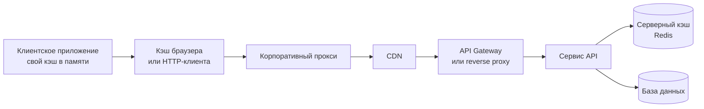
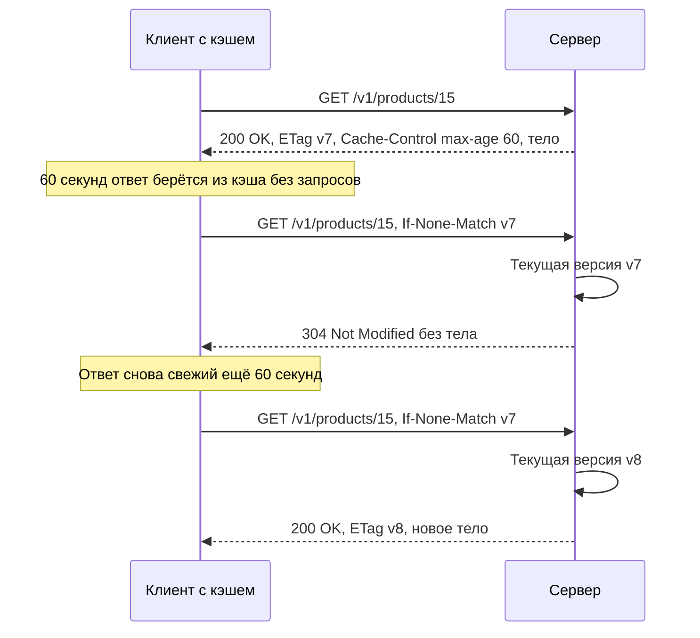

# Кэширование HTTP

Кэширование (caching) — повторное использование ранее полученного ответа вместо нового запроса к источнику. Правильно настроенный кэш снимает нагрузку с сервера и ускоряет клиентов; неправильно настроенный — показывает устаревшие данные или, что хуже, отдаёт персональные данные одного пользователя другому. Правила кэширования в HTTP задаёт RFC 9111.

## Где живёт кэш



| Уровень | Тип по RFC 9111 | Кто управляет | Что важно |
|---|---|---|---|
| Кэш приложения (в памяти клиента) | — (вне HTTP) | Разработчик клиента | Может учитывать или игнорировать заголовки HTTP — нужно договориться |
| Браузер, HTTP-клиент (OkHttp, HttpClient) | Частный (private) | Клиент | Хранит ответы для одного пользователя |
| Корпоративный прокси | Общий (shared) | Сеть клиента | Ответы видят многие пользователи |
| CDN | Общий | Владелец API | Ключевой слой для публичного контента, есть API сброса |
| API Gateway, reverse proxy (nginx, Varnish) | Общий | Владелец API | Можно кэшировать даже то, что не кэширует клиент |
| Серверный кэш (Redis, Memcached) | — (вне HTTP) | Сервис | Кэш данных, а не HTTP-ответов |

::: info Частный и общий кэш
**Частный** (private) кэш обслуживает одного пользователя. **Общий** (shared) — многих. Почти все опасные ошибки кэширования — когда персональный ответ попадает в общий кэш.
:::

## Cache-Control

Главный заголовок управления кэшированием. Директивы разделяются запятыми; используется и в запросе, и в ответе.

```http
HTTP/1.1 200 OK
Cache-Control: public, max-age=3600, stale-while-revalidate=60
ETag: "v42"
Content-Type: application/json
```

### Директивы ответа

| Директива | Смысл | Пример |
|---|---|---|
| `max-age=N` | Ответ свежий N секунд с момента генерации | `max-age=600` |
| `s-maxage=N` | То же, но только для **общих** кэшей; для них важнее `max-age`. Подразумевает `proxy-revalidate` | `max-age=60, s-maxage=600` |
| `no-cache` | Хранить **можно**, но перед каждым использованием — обязательная валидация у сервера | `no-cache` + `ETag` |
| `no-store` | **Не хранить** вообще ни в каком кэше | Финансовые и чувствительные данные |
| `private` | Только частный кэш (браузер, клиент), общим кэшам хранить нельзя | Профиль пользователя |
| `public` | Можно хранить в общих кэшах, даже если обычно нельзя (например, при запросе с `Authorization`) | Публичный справочник |
| `must-revalidate` | Устаревший ответ нельзя отдавать без успешной валидации — при недоступности сервера будет `504` | Цены, остатки |
| `proxy-revalidate` | Как `must-revalidate`, но только для общих кэшей | |
| `no-transform` | Посредникам запрещено менять тело (пережимать картинки, менять кодировку) | |
| `must-understand` | Хранить, только если кэш понимает правила кэширования для этого кода ответа; используется вместе с `no-store` | `must-understand, no-store` |
| `immutable` (RFC 8246) | Ответ не изменится, пока свежий — не нужно валидировать даже при обновлении страницы | Статика с хэшем в имени |
| `stale-while-revalidate=N` (RFC 5861) | N секунд после устаревания можно отдавать старый ответ, обновляя его в фоне | `max-age=60, stale-while-revalidate=30` |
| `stale-if-error=N` (RFC 5861) | N секунд после устаревания можно отдавать старый ответ, если сервер вернул ошибку `5xx` или недоступен | `stale-if-error=86400` |

### Директивы запроса

| Директива | Смысл |
|---|---|
| `max-age=N` | Клиент согласен на ответ не старше N секунд. `max-age=0` — фактически требует валидацию |
| `max-stale[=N]` | Клиент согласен на устаревший ответ (не более чем на N секунд) |
| `min-fresh=N` | Ответ должен оставаться свежим ещё минимум N секунд |
| `no-cache` | Не использовать сохранённый ответ без валидации у сервера («жёсткое обновление») |
| `no-store` | Не сохранять ни запрос, ни ответ |
| `no-transform` | Посредникам не менять тело |
| `only-if-cached` | Отдать только из кэша; если нет — `504 Gateway Timeout` |
| `stale-if-error=N` (RFC 5861) | Клиент согласен на устаревший ответ при ошибке сервера |

::: danger no-cache — это не «не кэшировать»
Самая частая путаница. `no-cache` разрешает хранить ответ, но требует **проверять** его у сервера перед каждым использованием (обычно дешёвым условным запросом с `304`). Запрет хранения — это `no-store`. Для чувствительных данных нужен именно `no-store`.
:::

::: warning Устаревшие заголовки
`Pragma: no-cache` — пережиток HTTP/1.0, в RFC 9111 объявлен устаревшим; оставляйте его только ради очень старых посредников. `Expires` (абсолютная дата) работает, но при наличии `max-age` игнорируется. Заголовок `Warning` из RFC 9111 удалён.
:::

## Свежесть и эвристическое кэширование

Ответ **свежий** (fresh), пока его возраст меньше срока свежести (freshness lifetime). Срок вычисляется в порядке приоритета:

1. `s-maxage` (только для общих кэшей);
2. `max-age`;
3. `Expires` минус `Date`;
4. **эвристика** — если явного срока нет.

Возраст ответа кэш сообщает в заголовке `Age` (секунды).

::: warning Эвристическое кэширование
Если в ответе нет ни `Cache-Control`, ни `Expires`, а код ответа кэшируемый по умолчанию (например, `200`), кэш **вправе сам придумать** срок свежести. Типичная эвристика — 10% от времени, прошедшего с `Last-Modified`: документ, изменённый 10 дней назад, кэш будет считать свежим сутки. Поэтому у каждого ответа API должен быть **явный** `Cache-Control` — даже если это `no-store`.
:::

## Валидация: ETag и Last-Modified

Когда ответ устарел (или помечен `no-cache`), кэш не скачивает его заново, а спрашивает сервер «изменилось ли?».

| Валидатор | Формат | Точность | Комментарий |
|---|---|---|---|
| `ETag` сильный | `ETag: "a1b2c3"` | Побайтовое совпадение | Нужен для `If-Match`, `Range` |
| `ETag` слабый | `ETag: W/"a1b2c3"` | Семантическая эквивалентность | Подходит для `If-None-Match`; например, тело отличается только сжатием или порядком полей |
| `Last-Modified` | `Last-Modified: Tue, 14 May 2024 10:21:00 GMT` | 1 секунда | Не ловит несколько изменений за секунду; используйте как дополнение к `ETag` |

Как вычислить `ETag`: номер версии строки в БД (`rowVersion`), хэш тела ответа, хэш от `updatedAt` + `id`. Номер версии дешевле: не нужно формировать тело, чтобы ответить `304`.

### Условный запрос и 304 Not Modified



::: code-group

```http [Первый запрос]
GET /v1/products/15 HTTP/1.1
Host: api.example.com

HTTP/1.1 200 OK
Cache-Control: max-age=60
ETag: "v7"
Last-Modified: Tue, 14 May 2024 10:21:00 GMT
Content-Type: application/json

{ "id": "15", "name": "Кабель", "price": "350.00" }
```

```http [Валидация: не изменился]
GET /v1/products/15 HTTP/1.1
Host: api.example.com
If-None-Match: "v7"
If-Modified-Since: Tue, 14 May 2024 10:21:00 GMT

HTTP/1.1 304 Not Modified
Cache-Control: max-age=60
ETag: "v7"
```

```http [Валидация: изменился]
GET /v1/products/15 HTTP/1.1
Host: api.example.com
If-None-Match: "v7"

HTTP/1.1 200 OK
Cache-Control: max-age=60
ETag: "v8"
Content-Type: application/json

{ "id": "15", "name": "Кабель", "price": "390.00" }
```

:::

- `If-None-Match` имеет приоритет над `If-Modified-Since`: если есть оба, сервер смотрит на `ETag`.
- В `304` тела нет, но должны быть `ETag`, `Cache-Control`, `Vary` и другие заголовки, которые были бы в `200`.
- `If-None-Match` использует **слабое** сравнение, а `If-Match` (для записи) — **сильное**. Про `If-Match` и защиту от потерянных обновлений — [Конкурентный доступ](/design/concurrency).

## Vary

`Vary` перечисляет заголовки запроса, от которых зависит ответ. Кэш хранит отдельную копию для каждой комбинации их значений.

```http
HTTP/1.1 200 OK
Cache-Control: public, max-age=300
Vary: Accept, Accept-Encoding, Accept-Language
```

- Ответ зависит от согласования формата и языка — укажите соответствующие заголовки. См. [Медиатипы и согласование](/http/content-negotiation).
- `Vary: Authorization` технически разделит кэш по токенам, но для персональных данных правильнее `private` или `no-store`.
- `Vary: *` — ответ фактически не переиспользуется.
- Чем больше заголовков в `Vary`, тем ниже доля попаданий в кэш.

## Что кэшируемо

| Методы | Кэшируемость |
|---|---|
| `GET`, `HEAD` | Да — основной случай |
| `POST` | Формально возможно при явном сроке свежести и `Content-Location`, на практике кэши этого не делают |
| `PUT`, `PATCH`, `DELETE` | Нет. Успешный ответ на них **инвалидирует** кэш по этому URI |

Коды ответа, кэшируемые **по умолчанию** (эвристически, без явного `Cache-Control`) по RFC 9110: `200`, `203`, `204`, `206`, `300`, `301`, `308`, `404`, `405`, `410`, `414`, `501`. Остальные коды кэшируются только при явном разрешении. Кэширование `404` — частый сюрприз: ресурс создан, а клиент ещё минуту видит «не найден». Подробнее о кодах — [Коды состояния](/http/status-codes).

## Инвалидация

> «В информатике есть только две сложные вещи: инвалидация кэша и придумывание имён» — Фил Карлтон.

| Способ | Как | Ограничения |
|---|---|---|
| Истечение срока (TTL) | `max-age` | Данные могут быть устаревшими до N секунд — это нужно принять как бизнес-требование |
| Валидация | `no-cache` + `ETag` | Запрос к серверу на каждое использование, но дешёвый |
| Инвалидация небезопасным методом | Успешный `PUT`/`POST`/`DELETE` по URI сбрасывает кэш этого URI (RFC 9111, раздел 4.4) | Работает только в кэше, через который прошёл запрос; другие кэши и связанные URI (`/products?category=5`) не узнают |
| Сброс в CDN (purge) | API провайдера CDN, теги (surrogate keys) | Специфично для провайдера, занимает время |
| Версионирование URL (cache busting) | `/static/app.3f9a1c.js` + `immutable` | Только для статики и неизменяемых данных |

::: tip Совет
Для API выбирайте короткий `max-age` (или `0`) + `ETag` и валидацию. Долгий `max-age` — только для данных, которые действительно редко меняются или неизменяемы, и где устаревание допустимо по бизнесу. Срок допустимого устаревания — **бизнес-требование**, его нужно согласовать и записать.
:::

## Серверное кэширование

Кэш данных внутри сервиса (Redis, Memcached, кэш в памяти) — вне HTTP, клиенту не виден.

| Паттерн | Как работает |
|---|---|
| **Cache-aside** (lazy loading) | Сервис читает из кэша, при промахе — из БД и кладёт в кэш с TTL. При изменении — удаляет ключ |
| Read-through | То же, но загрузку из БД выполняет сам кэш-слой |
| Write-through | Запись идёт в кэш и синхронно в БД |
| Write-behind | Запись в кэш, в БД — асинхронно (риск потери) |

Проблемы: устаревшие данные при изменении в обход сервиса (другая система пишет в ту же БД), лавина промахов (cache stampede) при одновременном истечении популярных ключей, рассогласование между экземплярами локальных кэшей. Защита — TTL с разбросом, блокировка на перезагрузку ключа, инвалидация по событиям изменения.

## Кэширование и персональные данные

::: danger Опасно
`Cache-Control: public` (или отсутствие заголовка при эвристическом кэшировании) на персональном ответе может привести к тому, что CDN или прокси отдаст профиль, счёт или заказ одного пользователя другому. Классический инцидент: `GET /users/me` закэширован на CDN — у всех пользователей один и тот же «я».
:::

Правила:

- Ответ, зависящий от пользователя, — `private` (если устаревание допустимо) или `no-store`.
- По RFC 9111 общий кэш не хранит ответ на запрос с `Authorization`, **если** в ответе нет `public`, `s-maxage` или `must-revalidate`. Поэтому `public` на ответе персонального эндпоинта снимает эту защиту.
- Ответы с токенами, паролями, секретами — всегда `no-store` (для токенов OAuth 2.0 это требование RFC 6749). См. [OAuth 2.0](/security/oauth2).
- Не полагайтесь на `Vary: Cookie` и `Vary: Authorization` как на защиту — не все кэши и CDN корректно их обрабатывают.
- Gateway и CDN по умолчанию должны **не кэшировать** API; кэширование включается явно для конкретных публичных ресурсов.

## Типовые политики

| Ресурс | Cache-Control | Валидатор | Комментарий |
|---|---|---|---|
| Публичные справочники (страны, валюты, единицы измерения) | `public, max-age=3600, stale-while-revalidate=300` | `ETag` | Меняются редко |
| Каталог товаров, цены для витрины | `public, max-age=60, s-maxage=300, stale-if-error=600` | `ETag` | Согласуйте допустимую задержку цен |
| Профиль пользователя, `/users/me` | `private, no-cache` | `ETag` | Только частный кэш, всегда валидация |
| Заказы, документы пользователя | `private, no-cache` или `no-store` | `ETag` | `ETag` пригодится и для [If-Match](/design/concurrency) |
| Баланс, финансовые операции, платёжные данные | `no-store` | — | Никакого кэширования |
| Ответ с токеном доступа | `no-store` | — | Требование OAuth 2.0 |
| Статика с хэшем в имени файла | `public, max-age=31536000, immutable` | — | Новая версия — новое имя |
| Файл отчёта по постоянной ссылке | `private, max-age=0, must-revalidate` | `ETag`, `Last-Modified` | |
| Результаты поиска и списки | `private, max-age=0` или `no-cache` | Опционально | Кэш списков сложно инвалидировать |
| Health check, метрики | `no-store` | — | Всегда актуальное состояние |
| Ошибки `5xx` | `no-store` | — | Иначе ошибка «залипнет» |

## Диагностика

- `Age` — сколько секунд ответ провёл в кэше.
- `Cache-Status` (RFC 9211) — стандартный заголовок, в котором кэши сообщают о попадании или промахе: `Cache-Status: ExampleCDN; hit; ttl=120`.
- `CDN-Cache-Control` (RFC 9213) — отдельные директивы только для CDN, не влияющие на браузеры.
- Нестандартные `X-Cache: HIT`, `X-Cache-Status` — у многих CDN и nginx.

Описание заголовков — [Заголовки HTTP](/http/headers).

## Типичные ошибки

- `no-cache` вместо `no-store` для чувствительных данных.
- `public` или отсутствие `Cache-Control` на персональных ответах.
- Нет `Cache-Control` вообще — срабатывает эвристическое кэширование.
- `ETag`, который меняется при каждом запросе (хэш от тела с текущим временем) — валидация бесполезна.
- `ETag` без учёта представления: разные `Accept` или `?fields=` дают один `ETag`.
- Кэширование `404` сразу после создания ресурса.
- Длинный `max-age` на данных, которые меняются, без механизма инвалидации.
- Кэширование ответов `5xx`.
- Забытый `Vary` при согласовании формата или языка.

## На что обратить внимание аналитику

- [ ] Для каждого `GET`-эндпоинта задана политика `Cache-Control`, в том числе явный `no-store`, где кэш не нужен.
- [ ] Согласован с бизнесом допустимый срок устаревания данных.
- [ ] Персональные ответы — `private` или `no-store`; `public` — только для действительно общих данных.
- [ ] Определён валидатор (`ETag` и/или `Last-Modified`) и как он вычисляется.
- [ ] Сервер поддерживает `If-None-Match` и отвечает `304`.
- [ ] Указан `Vary` для ответов, зависящих от `Accept`, `Accept-Language`, `Accept-Encoding`.
- [ ] Описано, кэширует ли что-то gateway или CDN и как сбрасывается кэш.
- [ ] Для серверного кэша — TTL, способ инвалидации, поведение при изменении данных в обход сервиса.
- [ ] Ответы с токенами и секретами — `no-store`.
- [ ] Клиентская сторона интеграции знает, учитывать ли заголовки кэширования.

## Стандарты и ссылки

- [RFC 9111 — HTTP Caching](https://www.rfc-editor.org/rfc/rfc9111)
- [RFC 9110 — HTTP Semantics (условные запросы, ETag, раздел 13)](https://www.rfc-editor.org/rfc/rfc9110#section-13)
- [RFC 5861 — HTTP Cache-Control Extensions for Stale Content](https://www.rfc-editor.org/rfc/rfc5861)
- [RFC 8246 — HTTP Immutable Responses](https://www.rfc-editor.org/rfc/rfc8246)
- [RFC 9211 — The Cache-Status HTTP Response Header Field](https://www.rfc-editor.org/rfc/rfc9211)
- [RFC 9213 — Targeted HTTP Cache Control (CDN-Cache-Control)](https://www.rfc-editor.org/rfc/rfc9213)
- [RFC 6749 — OAuth 2.0, раздел 5.1 (no-store для токенов)](https://www.rfc-editor.org/rfc/rfc6749#section-5.1)
- [MDN — HTTP caching](https://developer.mozilla.org/en-US/docs/Web/HTTP/Guides/Caching)
- [Google AIP-154 — Resource freshness validation](https://google.aip.dev/154)
- [Zalando RESTful API Guidelines — кэширование](https://opensource.zalando.com/restful-api-guidelines/)
