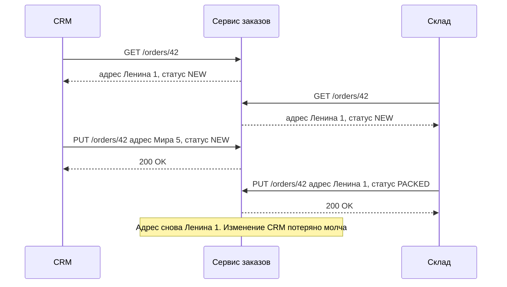
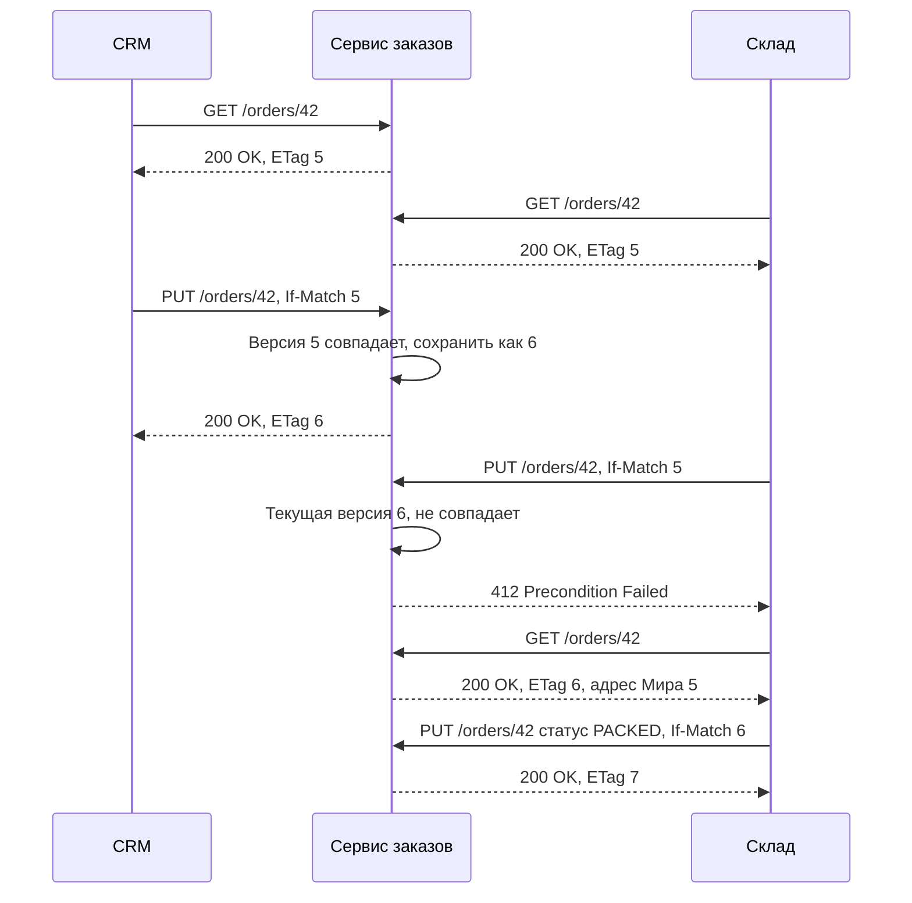
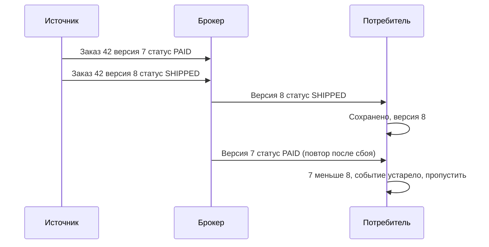

# Конкурентный доступ

Что происходит, когда две системы или два пользователя одновременно меняют один и тот же ресурс. Без явной защиты побеждает тот, кто записал последним, а изменения первого молча теряются. В HTTP для этого есть стандартный механизм — условные запросы с `ETag` и `If-Match`; в асинхронных интеграциях — версии сущностей.

## Проблема потерянного обновления

Потерянное обновление (lost update): оба клиента прочитали одну и ту же версию, каждый изменил своё поле и записал объект целиком. Второй затёр изменения первого.



Никто не получил ошибку, данные испорчены, и обнаружится это только при доставке по старому адресу. Проблема возникает с `PUT`, с `PATCH` (если два клиента меняют одно поле или поле зависит от другого) и с операциями «прочитать — вычислить — записать» (остатки, лимиты, счётчики).

## Optimistic locking {#optimistic-locking}

Оптимистичная блокировка (optimistic locking, optimistic concurrency control) исходит из того, что конфликты редки: ресурс не блокируется, но при записи сервер проверяет, что клиент изменяет ту версию, которую читал. Если версия изменилась — запись отклоняется.

### Через ETag и If-Match

1. Сервер отдаёт текущую версию ресурса в заголовке `ETag`.
2. Клиент при изменении передаёт её в `If-Match`.
3. Сервер атомарно сравнивает: совпадает — применяет изменение и возвращает новый `ETag`; не совпадает — `412 Precondition Failed`.



::: code-group

```http [Чтение]
GET /v1/orders/42 HTTP/1.1
Host: api.example.com

HTTP/1.1 200 OK
ETag: "5"
Content-Type: application/json

{ "id": "42", "status": "NEW", "deliveryAddress": "ул. Ленина, 1" }
```

```http [Успешная запись]
PATCH /v1/orders/42 HTTP/1.1
Host: api.example.com
If-Match: "5"
Content-Type: application/merge-patch+json

{ "deliveryAddress": "ул. Мира, 5" }

HTTP/1.1 200 OK
ETag: "6"
Content-Type: application/json

{ "id": "42", "status": "NEW", "deliveryAddress": "ул. Мира, 5" }
```

```http [Конфликт: 412]
PATCH /v1/orders/42 HTTP/1.1
Host: api.example.com
If-Match: "5"
Content-Type: application/merge-patch+json

{ "status": "PACKED" }

HTTP/1.1 412 Precondition Failed
ETag: "6"
Content-Type: application/problem+json

{
  "type": "https://api.example.com/problems/version-mismatch",
  "title": "Ресурс был изменён другим клиентом",
  "status": 412,
  "detail": "Ожидалась версия 5, текущая версия 6. Перечитайте ресурс и повторите изменение.",
  "currentVersion": "6"
}
```

```http [Нет If-Match: 428]
PATCH /v1/orders/42 HTTP/1.1
Host: api.example.com
Content-Type: application/merge-patch+json

{ "status": "PACKED" }

HTTP/1.1 428 Precondition Required
Content-Type: application/problem+json

{
  "type": "https://api.example.com/problems/precondition-required",
  "title": "Для изменения ресурса требуется заголовок If-Match",
  "status": 428
}
```

:::

Ключевые моменты:

- `If-Match` использует **сильное** сравнение — слабые `ETag` (`W/"5"`) для него не годятся. Если сервер отдаёт только слабые `ETag`, для записи нужен другой валидатор.
- Проверка версии и запись должны быть **атомарными**: `UPDATE orders SET ..., version = version + 1 WHERE id = 42 AND version = 5`. Ноль изменённых строк — конфликт. Проверка в коде, а затем отдельный `UPDATE` оставляют окно для гонки.
- [`412 Precondition Failed`](/http/status-codes#412) (RFC 9110) — условие запроса не выполнено. [`428 Precondition Required`](/http/status-codes#428) (RFC 6585) — сервер требует условный запрос, а клиент его не прислал. Без `428` клиент, «забывший» `If-Match`, тихо обходит защиту.
- `If-Unmodified-Since` с датой — альтернатива `If-Match`, но точность в одну секунду; для API предпочтителен `ETag`.

### Полезные варианты условий

| Заголовок | Значение | Применение |
|---|---|---|
| `If-Match: "5"` | Изменить, только если текущая версия 5 | Оптимистичная блокировка при `PUT`, `PATCH`, `DELETE`, действиях `POST /orders/42/cancel` |
| `If-Match: *` | Изменить, только если ресурс существует | `PUT` только как обновление, без случайного создания |
| `If-None-Match: *` | Выполнить, только если ресурса **нет** | `PUT` только как создание, без перезаписи существующего — иначе `412` |
| `If-Unmodified-Since: дата` | Изменить, если не менялся с даты | Когда нет `ETag` |

### Через версию в теле

Не все клиенты и посредники удобно работают с заголовками (например, low-code платформы, ESB, генераторы клиентов). Тогда версия передаётся полем ресурса.

```http
PUT /v1/orders/42 HTTP/1.1
Content-Type: application/json

{ "id": "42", "version": 5, "status": "PACKED", "deliveryAddress": "ул. Ленина, 1" }

HTTP/1.1 409 Conflict
Content-Type: application/problem+json

{
  "type": "https://api.example.com/problems/version-conflict",
  "title": "Конфликт версий",
  "status": 409,
  "detail": "Передана версия 5, текущая версия 6",
  "currentVersion": 6
}
```

| | `ETag` + `If-Match` | Версия в теле (`version`, `rowVersion`) |
|---|---|---|
| Стандартность | RFC 9110, понимают кэши и библиотеки | Соглашение API |
| Код при конфликте | `412 Precondition Failed` | [`409 Conflict`](/http/status-codes#409) |
| Работает с `DELETE` и действиями без тела | Да | Нет — нужен параметр или заголовок |
| Видимость в модели | Вне тела, легко забыть | В схеме, видно в OpenAPI |
| Совместимость с кэшированием | `ETag` одновременно и для [кэша](/design/caching) | Нет |

::: tip Рекомендация
Используйте `ETag` + `If-Match` как основной механизм. Дублируйте версию полем в теле (только для чтения), если это удобно потребителям. Значение `ETag` для клиента — непрозрачная строка: не вычисляйте его на клиенте и не сравнивайте как число.
:::

## Пессимистичная блокировка

Пессимистичная блокировка (pessimistic locking) — ресурс захватывается до изменения, остальные ждут или получают отказ.

```http
POST /v1/documents/77/lock HTTP/1.1
Content-Type: application/json

{ "ttlSeconds": 300 }

HTTP/1.1 201 Created
Content-Type: application/json

{ "lockId": "lk-9f2", "owner": "user-15", "expiresAt": "2024-05-14T10:26:00Z" }
```

```http
PUT /v1/documents/77 HTTP/1.1
Lock-Token: lk-9f2
Content-Type: application/json

{ "title": "Договор поставки" }

HTTP/1.1 423 Locked
Content-Type: application/problem+json

{
  "type": "https://api.example.com/problems/resource-locked",
  "title": "Документ заблокирован другим пользователем",
  "status": 423,
  "lockedBy": "user-15",
  "expiresAt": "2024-05-14T10:26:00Z"
}
```

`423 Locked` определён в WebDAV (RFC 4918), в обычных REST API его используют как соглашение; заголовок `Lock-Token` в примере — тоже собственный.

Почему в REST её избегают:

- **Противоречит отсутствию состояния**: сервер хранит, кто и что держит.
- **Брошенные блокировки**: клиент упал, сеть оборвалась — ресурс заблокирован до истечения TTL.
- **Масштабирование**: блокировка должна быть общей для всех экземпляров сервиса (БД, Redis), с корректным истечением.
- **Задержки**: остальные клиенты ждут, растут таймауты.

Когда оправдана: длительное ручное редактирование документа, где потеря работы пользователя дорога (юридические документы, сложные формы), и операции, которые нельзя откатить. Обязательно: TTL, продление, принудительное снятие администратором, явный ответ «кем и до какого времени занято».

## Сравнение подходов

| Подход | Как работает | Плюсы | Минусы | Когда применять |
|---|---|---|---|---|
| **Last-write-wins** | Побеждает последняя запись | Просто, без конфликтов на клиенте | Молчаливая потеря изменений | Данные с одним владельцем, телеметрия, некритичные настройки |
| **Optimistic locking (ETag / version)** | Проверка версии при записи | Нет блокировок, масштабируется, стандартно для HTTP | Клиент должен обрабатывать конфликт: перечитать и повторить | По умолчанию для изменяемых ресурсов |
| **Pessimistic locking** | Захват ресурса на время изменения | Нет конфликтов при записи | Брошенные блокировки, состояние на сервере | Длительное ручное редактирование |
| **Атомарные операции на сервере** | Клиент передаёт намерение, а не новое значение: `POST /accounts/1/debit` | Нет гонки «прочитал — записал» | Нужна бизнес-операция на каждое действие | Остатки, балансы, счётчики |
| **Слияние изменений (merge)** | Сервер объединяет непересекающиеся изменения | Меньше конфликтов | Сложность, неочевидные правила | Документы с многими редакторами |

## Конфликты при создании

Два одновременных `POST` с одинаковыми бизнес-данными создают дубли. Защита:

- **Уникальный индекс** на естественном ключе (номер документа, `externalId`, ИНН + КПП). Второй запрос получает [`409 Conflict`](/http/status-codes#409) с идентификатором существующего ресурса.
- **`Idempotency-Key`** — защищает от повторов одного и того же запроса, но не от двух разных запросов с одинаковыми данными. См. [Идемпотентность](/design/idempotency).
- **`PUT` с клиентским ID и `If-None-Match: *`** — создать, только если ещё не существует.

```http
PUT /v1/customers/INN-7707083893 HTTP/1.1
If-None-Match: *
Content-Type: application/json

{ "name": "ООО Ромашка", "inn": "7707083893" }

HTTP/1.1 412 Precondition Failed
```

Проверка «есть ли такой» запросом `GET` перед `POST` **не защищает** от гонки: между проверкой и созданием может пройти другой запрос. Работает только ограничение на уровне хранилища.

## Last-write-wins и слияние изменений

**Last-write-wins** (LWW) допустим, если это осознанное решение: у данных один источник истины, а остальные системы только читают. Тогда это надо записать в постановке.

Как уменьшить число конфликтов, не отказываясь от оптимистичной блокировки:

- **`PATCH` вместо `PUT`**: клиент отправляет только изменённые поля, и сервер может применить его поверх новой версии, если поля не пересекаются (проверка версии на уровне полей или групп полей).
- **Разделение ресурса** по владельцам: адрес доставки меняет CRM через `/orders/42/delivery`, статус — склад через действия. У каждого подресурса своя версия.
- **Трёхстороннее слияние** (three-way merge): сервер сравнивает базовую версию, версию клиента и текущую — используется в редакторах документов.
- **CRDT** — структуры данных, сливающиеся без конфликтов; применяются в офлайн-приложениях и совместном редактировании, в интеграциях учётных систем редки.

## Конкурентность в асинхронных интеграциях {#async-ordering}

В событийных интеграциях проблема та же, но выглядит иначе: события об изменениях приходят **не по порядку** или **повторно**.

Причины нарушения порядка:

- повторная доставка после сбоя приходит позже следующих событий;
- несколько параллельных потребителей или партиций;
- вебхуки отправляются параллельно и с ретраями;
- события из разных систем об одной сущности.



Способы защиты:

| Способ | Как | Ограничения |
|---|---|---|
| **Версия сущности в событии** | Источник увеличивает `version` при каждом изменении; потребитель применяет событие, только если `version` больше сохранённой | Требует монотонной версии у источника. Самый надёжный способ |
| **Timestamp изменения** | Сравнение `updatedAt` | Расхождение часов, одинаковые метки — используйте только если время ставит одна БД |
| **Порядок в партиции** | В Kafka ключ сообщения = ID сущности, все события сущности в одной партиции и по порядку | Порядок только внутри партиции; ретраи потребителя и DLQ его нарушают |
| **Тонкие события + запрос состояния** | Событие только сообщает «заказ 42 изменён», потребитель запрашивает `GET /orders/42` и получает актуальное состояние | Дополнительная нагрузка на API, но порядок событий не важен |
| **Полное состояние в событии** | Событие несёт весь объект, а не дельту | Вместе с версией позволяет просто отбрасывать устаревшие события |

```sql
-- применить событие, только если оно новее сохранённого
UPDATE orders_replica
SET status = :status, version = :version
WHERE id = :id AND version < :version;
```

::: warning Дельты без версий опасны
Событие вида «статус изменён с PAID на SHIPPED» или «количество увеличено на 5», применённое не по порядку или дважды, портит данные необратимо. Передавайте полное состояние (или значимую часть) с версией, а дубли отсекайте [идемпотентным потребителем](/design/idempotency). Подробнее — [Брокеры сообщений](/protocols/messaging), [Webhooks](/protocols/webhooks), [Интеграционные паттерны](/reliability/integration-patterns).
:::

## Как описать в постановке

```yaml
resource: /v1/orders/{id}
concurrency:
  mechanism: optimistic locking, ETag + If-Match
  etagSource: orders.version, целое число, увеличивается при каждом изменении
  etagStrength: strong
  requiredFor: [PUT, PATCH, DELETE, POST /cancel]
  onMissingPrecondition: 428 Precondition Required
  onVersionMismatch: 412 Precondition Failed, тело RFC 9457 с currentVersion
  clientOnConflict: перечитать ресурс, повторно применить изменения, при пересечении полей — ручной разбор
creation:
  uniqueKey: externalId
  onDuplicate: 409 Conflict с existingId
events:
  orderChanged:
    payload: полное состояние заказа + version
    ordering: ключ партиции = orderId
    consumerRule: применять, если version больше сохранённой, иначе пропустить
```

## Типичные ошибки

- Нет никакой защиты — молчаливый last-write-wins там, где у данных несколько авторов.
- `If-Match` поддерживается, но не обязателен — клиенты его не передают, и защита не работает. Нужен `428`.
- Проверка версии и запись не атомарны.
- Слабый `ETag` используется для `If-Match`.
- Клиент на `412` автоматически повторяет тот же запрос с новым `ETag`, не перечитав данные, — это тот же last-write-wins.
- Проверка дубликатов через `GET` перед `POST` вместо уникального ограничения.
- Пессимистичные блокировки без TTL.
- Сравнение событий по времени из разных систем.
- Применение дельт без версий в асинхронной интеграции.

## На что обратить внимание аналитику

- [ ] Определено, кто ещё может менять ресурс (пользователи, другие системы, фоновые задачи).
- [ ] Выбран механизм: optimistic locking, атомарные операции, LWW (осознанно) или блокировки.
- [ ] Описано, откуда берётся `ETag` (версия, хэш), сильный ли он.
- [ ] Указаны методы, требующие `If-Match`, и ответы `412` и `428`.
- [ ] Описано действие клиента при конфликте: перечитать, слить, показать пользователю.
- [ ] Для создания — уникальный ключ и ответ `409` с идентификатором существующего ресурса.
- [ ] Для операций «прочитать — вычислить — записать» (остатки, балансы) — атомарные серверные операции.
- [ ] Для событий — версия сущности, ключ партиционирования, правило отбрасывания устаревших событий, идемпотентность.
- [ ] Если используются блокировки — TTL, продление, снятие, ответ `423` с владельцем.

## Стандарты и ссылки

- [RFC 9110, раздел 13 — Conditional Requests (If-Match, If-None-Match, 412)](https://www.rfc-editor.org/rfc/rfc9110#section-13)
- [RFC 9110, раздел 8.8.3 — ETag](https://www.rfc-editor.org/rfc/rfc9110#section-8.8.3)
- [RFC 6585 — Additional HTTP Status Codes (428 Precondition Required)](https://www.rfc-editor.org/rfc/rfc6585)
- [RFC 4918 — WebDAV (423 Locked)](https://www.rfc-editor.org/rfc/rfc4918)
- [RFC 9457 — Problem Details for HTTP APIs](https://www.rfc-editor.org/rfc/rfc9457)
- [Google AIP-154 — Resource freshness validation](https://google.aip.dev/154)
- [Microsoft REST API Guidelines — Conditional requests](https://github.com/microsoft/api-guidelines)
- [Zalando RESTful API Guidelines — оптимистичная блокировка](https://opensource.zalando.com/restful-api-guidelines/)
- [Martin Fowler — Optimistic Offline Lock](https://martinfowler.com/eaaCatalog/optimisticOfflineLock.html)
