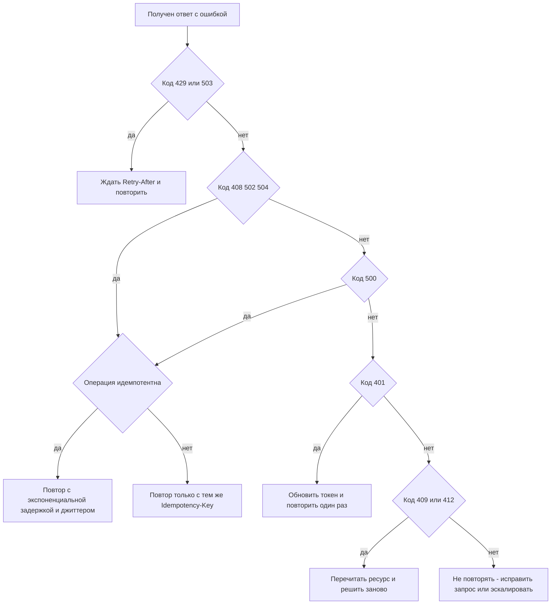

# Обработка ошибок

Ошибка — такая же часть контракта API, как успешный ответ. Хорошо спроектированная ошибка позволяет клиенту **автоматически** решить, что делать дальше (исправить запрос, повторить позже, обратиться в поддержку), а человеку — быстро понять причину. Стандартный формат для HTTP API — Problem Details (RFC 9457).

## Принципы {#principles}

Ответ с ошибкой состоит из трёх слоёв, и каждый нужен своему потребителю:

| Слой | Для кого | Пример |
|---|---|---|
| HTTP-код состояния | Инфраструктура (прокси, шлюзы, ретраи, мониторинг) и клиентская библиотека | `422 Unprocessable Content` |
| Машиночитаемый тип / код ошибки | Код клиента: ветвление логики | `"type": "https://api.example.com/problems/insufficient-funds"` |
| Человекочитаемое сообщение | Разработчик клиента, оператор, логи | `"detail": "На счёте 40817… недостаточно средств: доступно 150.00 RUB"` |

Базовые правила:

1. **Правильный HTTP-код.** Код — первое, на что смотрят балансировщики, API-шлюзы, политики повторов и алерты. См. [Коды состояния](/http/status-codes).
2. **Никаких `200 OK` с ошибкой внутри.** Ответ `200` с телом `{"success": false}` ломает кэширование, мониторинг (доля ошибок выглядит нулевой), ретраи и SDK.
3. **Машиночитаемый идентификатор ошибки** — стабильный, не меняется между релизами и не зависит от языка. Клиент ветвится по нему, а не по тексту.
4. **Сообщение не парсится.** Текст `detail` может меняться и локализоваться — клиент не должен разбирать его регулярками.
5. **Единый формат для всех эндпоинтов**, включая ошибки, которые генерирует шлюз (401 от API Gateway, 413 от nginx, 504 от балансировщика) — их нужно перехватывать и приводить к общему виду.
6. **Ошибка должна быть безопасной** — без стектрейсов, SQL и внутренних адресов (см. [ниже](#security)).

::: danger Антипаттерн: 200 с ошибкой внутри
```http
HTTP/1.1 200 OK
Content-Type: application/json

{ "success": false, "errorCode": 1042, "errorMessage": "Order not found" }
```
Мониторинг покажет 100 % успешных ответов, кэш может сохранить «ошибку», шлюз не применит политику повторов, а клиент обязан проверять поле `success` в каждом ответе.
:::

::: info Исключения
Протоколы поверх HTTP со своим конвертом ошибок (SOAP Fault, [JSON-RPC](/protocols/json-rpc), [GraphQL](/protocols/graphql)) исторически возвращают ошибки уровня приложения в теле ответа `200`. Это особенность протокола, а не образец для REST.
:::

## Problem Details — RFC 9457 {#problem-details}

RFC 9457 «Problem Details for HTTP APIs» (2023) заменил RFC 7807 (2016). Он определяет JSON-объект (и XML-вариант) для описания ошибки и медиатипы:

- `application/problem+json`
- `application/problem+xml`

### Стандартные поля {#fields}

| Поле | Тип | Обязательно | Назначение |
|---|---|---|---|
| `type` | URI-ссылка | Нет (по умолчанию `about:blank`) | **Главный идентификатор типа проблемы.** Клиент ветвится по нему. Желательно, чтобы URI вёл на страницу документации |
| `title` | строка | Нет | Краткое человекочитаемое описание **типа** проблемы. Не меняется от случая к случаю (кроме локализации) |
| `status` | число | Нет | HTTP-код. Дублирует код ответа «для удобства» — должен совпадать с фактическим |
| `detail` | строка | Нет | Описание **конкретного случая**: что именно не так и как исправить |
| `instance` | URI-ссылка | Нет | Идентификатор конкретного случая ошибки (например, ссылка на запись в журнале инцидентов) |

Помимо стандартных полей допускаются **расширения (extension members)** — любые дополнительные поля верхнего уровня: `errors`, `traceId`, `balance`, `retryAfter` и т. п. Клиенты обязаны игнорировать неизвестные расширения.

::: tip type = about:blank
Если `type` не указан или равен `about:blank`, проблема не имеет дополнительной семантики сверх HTTP-кода, а `title` должен совпадать с текстовой фразой кода (например, `Not Found`). Для бизнес-ошибок всегда задавайте собственный `type`.
:::

Что изменилось в RFC 9457 по сравнению с RFC 7807:

- создан реестр IANA для общих типов проблем (problem types registry);
- описан способ передать **несколько проблем одного типа** (через расширение-массив, как `errors` в примере ниже);
- уточнено, что `type` может быть относительной ссылкой, но рекомендуется абсолютный URI;
- даны рекомендации не использовать `type`-URI, по которым нельзя получить документацию, если это вводит в заблуждение.

### Полный пример {#example}

```http
POST /api/v1/payments HTTP/1.1
Host: api.example.com
Content-Type: application/json
Accept: application/json, application/problem+json
Idempotency-Key: 7f9c2d1e-8a4b-4c3d-9e1f-2a3b4c5d6e7f

{ "accountId": "40817810099910004312", "amount": "1500.00", "currency": "RUB" }
```

```http
HTTP/1.1 422 Unprocessable Content
Content-Type: application/problem+json
Content-Language: ru

{
  "type": "https://api.example.com/problems/insufficient-funds",
  "title": "Недостаточно средств",
  "status": 422,
  "detail": "На счёте недостаточно средств для списания 1500.00 RUB. Доступно: 150.00 RUB.",
  "instance": "/api/v1/payments/attempts/b3f1c9a2",
  "code": "PAYMENT_INSUFFICIENT_FUNDS",
  "traceId": "4bf92f3577b34da6a3ce929d0e0e4736",
  "balance": "150.00",
  "currency": "RUB"
}
```

Здесь `code`, `traceId`, `balance`, `currency` — расширения. Клиент может показать пользователю доступный баланс, не разбирая текст `detail`.

### Ошибки валидации {#validation}

Когда в запросе несколько некорректных полей, их нужно вернуть **все сразу**, а не по одному. RFC 9457 предлагает для этого массив-расширение, где каждый элемент указывает на поле через JSON Pointer (RFC 6901):

```http
HTTP/1.1 400 Bad Request
Content-Type: application/problem+json

{
  "type": "https://api.example.com/problems/validation-error",
  "title": "Запрос не прошёл валидацию",
  "status": 400,
  "detail": "Исправьте ошибки в полях и повторите запрос.",
  "traceId": "0af7651916cd43dd8448eb211c80319c",
  "errors": [
    {
      "pointer": "#/customer/email",
      "code": "INVALID_FORMAT",
      "detail": "Значение не является корректным email-адресом"
    },
    {
      "pointer": "#/items/2/quantity",
      "code": "OUT_OF_RANGE",
      "detail": "Количество должно быть от 1 до 999",
      "min": 1,
      "max": 999
    },
    {
      "pointer": "#/deliveryDate",
      "code": "REQUIRED",
      "detail": "Поле обязательно"
    }
  ]
}
```

- `pointer` — JSON Pointer на место в теле запроса. В примере RFC 9457 он записан как фрагмент URI (`#/age`); встречается и «голый» вариант `/items/2/quantity` — выберите один и зафиксируйте.
- Для ошибок в параметрах запроса и заголовках используйте отдельные поля, например `"parameter": "limit"` или `"header": "Idempotency-Key"` (так сделано в JSON:API).
- `code` у каждого элемента — машиночитаемая причина (`REQUIRED`, `INVALID_FORMAT`, `TOO_LONG`, `OUT_OF_RANGE`, `NOT_UNIQUE`), чтобы клиент мог подсветить поле и подобрать собственный текст.

::: tip 400 или 422?
Распространённое соглашение: `400 Bad Request` — запрос синтаксически некорректен или не соответствует схеме (не тот тип, нет обязательного поля); `422 Unprocessable Content` — запрос корректен по форме, но нарушает бизнес-правила (недостаточно средств, дата доставки в прошлом). Оба варианта допустимы — важно зафиксировать правило в гайдлайне и применять единообразно.
:::

## Альтернативные форматы {#alternatives}

::: code-group

```json [Google (AIP-193)]
{
  "error": {
    "code": 400,
    "message": "Invalid value for field 'quantity'.",
    "status": "INVALID_ARGUMENT",
    "details": [
      {
        "@type": "type.googleapis.com/google.rpc.ErrorInfo",
        "reason": "QUANTITY_OUT_OF_RANGE",
        "domain": "orders.example.com",
        "metadata": { "max": "999" }
      },
      {
        "@type": "type.googleapis.com/google.rpc.BadRequest",
        "fieldViolations": [
          { "field": "items[2].quantity", "description": "Must be 1..999" }
        ]
      }
    ]
  }
}
```

```json [Microsoft REST API Guidelines]
{
  "error": {
    "code": "BadArgument",
    "message": "Multiple errors in ContactInfo data",
    "target": "ContactInfo",
    "details": [
      { "code": "NullValue", "target": "PhoneNumber", "message": "Phone number must not be null" },
      { "code": "MalformedValue", "target": "Address", "message": "Address is not valid" }
    ],
    "innererror": { "code": "PhoneNumberValidation" }
  }
}
```

```json [JSON:API]
{
  "errors": [
    {
      "id": "c1d2e3",
      "status": "422",
      "code": "OUT_OF_RANGE",
      "title": "Invalid attribute",
      "detail": "Quantity must be between 1 and 999.",
      "source": { "pointer": "/data/attributes/quantity" },
      "meta": { "max": 999 }
    }
  ]
}
```

```json [Кастомный (типичный)]
{
  "errorCode": "ORDER_NOT_FOUND",
  "message": "Заказ 42 не найден",
  "timestamp": "2026-10-03T12:00:00Z",
  "path": "/api/v1/orders/42",
  "traceId": "4bf92f3577b34da6a3ce929d0e0e4736"
}
```

:::

| Критерий | RFC 9457 | Google AIP-193 | Microsoft | JSON:API | Кастомный |
|---|---|---|---|---|---|
| Стандарт | IETF RFC | Гайдлайн Google | Гайдлайн Microsoft | Спецификация JSON:API | Нет |
| Отдельный медиатип | `application/problem+json` | Нет | Нет | `application/vnd.api+json` | Нет |
| Идентификатор ошибки | `type` (URI) | `status` + `reason` | `code` | `code` | Произвольный |
| Несколько ошибок | Через расширение | `details[]` | `details[]` | `errors[]` нативно | Как договоритесь |
| Указатель на поле | Расширение (`pointer`) | `fieldViolations[].field` | `target` | `source.pointer` | Как договоритесь |
| Поддержка фреймворками | Spring 6+, ASP.NET Core, многие другие | gRPC-экосистема | Azure SDK | Библиотеки JSON:API | Ручная |
| Когда выбирать | **По умолчанию для новых REST API** | API в стиле Google / gRPC-транскодинг | Экосистема Azure / Graph | Если весь API на JSON:API | Только если уже есть и менять дорого |

::: tip Рекомендация
Для новых интеграций — RFC 9457 с расширениями `code`, `traceId` и `errors[]`. Если формат партнёра другой, не спорьте о вкусах: важнее, чтобы формат был **один и задокументирован**.
:::

## Каталог бизнес-кодов ошибок {#error-catalog}

HTTP-кодов мало: `422` может означать десятки разных бизнес-ситуаций. Поэтому в спецификации интеграции ведут **каталог ошибок** — таблицу всех возможных проблем с действием, которое должен выполнить клиент.

| Код (`code`) | `type` | HTTP | Описание | Действие клиента | Повторять? |
|---|---|---|---|---|---|
| `VALIDATION_ERROR` | `/problems/validation-error` | 400 | Нарушена схема запроса | Исправить запрос по `errors[]` | Нет |
| `UNAUTHENTICATED` | `/problems/unauthenticated` | 401 | Нет токена или он истёк | Обновить токен и повторить один раз | После обновления токена |
| `ACCESS_DENIED` | `/problems/access-denied` | 403 | Нет прав на операцию | Эскалация, проверить права/скоупы | Нет |
| `ORDER_NOT_FOUND` | `/problems/order-not-found` | 404 | Заказ не существует | Проверить идентификатор, сверить справочники | Нет |
| `ORDER_ALREADY_PAID` | `/problems/order-already-paid` | 409 | Заказ уже оплачен | Считать операцию выполненной, запросить статус | Нет |
| `VERSION_CONFLICT` | `/problems/version-conflict` | 412 | ETag устарел | Перечитать ресурс, применить изменения заново | Да, после перечитывания |
| `INSUFFICIENT_FUNDS` | `/problems/insufficient-funds` | 422 | Недостаточно средств | Показать пользователю, предложить другой способ | Нет |
| `LIMIT_EXCEEDED` | `/problems/rate-limit` | 429 | Превышен лимит запросов | Ждать `Retry-After` | Да, после паузы |
| `INTERNAL_ERROR` | `/problems/internal` | 500 | Непредвиденная ошибка | Повторить с тем же `Idempotency-Key`, затем эскалация | Да, ограниченно |
| `DEPENDENCY_UNAVAILABLE` | `/problems/dependency-unavailable` | 503 | Недоступна смежная система | Повторить с экспоненциальной задержкой | Да |

Правила ведения каталога:

- код — `UPPER_SNAKE_CASE`, на английском, с доменным префиксом при большом количестве (`PAYMENT_`, `ORDER_`);
- код **никогда не переиспользуется** с другим смыслом и не удаляется без версии API — клиенты на него завязаны;
- добавление нового кода ошибки — потенциально ломающее изменение: старый клиент его не знает. Клиент должен иметь ветку «неизвестный код → обработать по HTTP-статусу» (см. [Версионирование](/design/versioning));
- для каждого кода указано **действие клиента** — это самое полезное для разработчиков потребителя.

## 4xx против 5xx и повторяемость {#retryable}

| Класс | Чья вина | Повторять тот же запрос? |
|---|---|---|
| `4xx` | Клиента: запрос некорректен, нет прав, конфликт состояния | **Нет** — ответ не изменится, пока клиент не изменит запрос или состояние. Исключения ниже |
| `5xx` | Сервера или инфраструктуры | **Можно**, с задержкой и ограничением числа попыток, если операция идемпотентна |



| Код | Повторяемый | Условие |
|---|---|---|
| `408 Request Timeout` | Да | Идемпотентная операция или есть ключ идемпотентности |
| `409 Conflict` | Иногда | Только после перечитывания состояния; бизнес-конфликт (дубликат) — нет |
| `412 Precondition Failed` | После перечитывания | Получить свежий `ETag`, см. [Конкурентный доступ](/design/concurrency) |
| `425 Too Early` | Да | Повтор после завершения TLS-рукопожатия |
| `429 Too Many Requests` | Да | После `Retry-After`, см. [Rate limiting](/design/rate-limiting) |
| `500 Internal Server Error` | Ограниченно | Ошибка может быть детерминированной — 1–2 попытки, затем эскалация |
| `502 Bad Gateway` | Да | Идемпотентность обязательна |
| `503 Service Unavailable` | Да | Уважать `Retry-After` |
| `504 Gateway Timeout` | Да, осторожно | Операция могла выполниться! Только идемпотентно |
| Прочие `4xx` | Нет | — |

::: warning Таймаут ≠ неуспех
`504` или обрыв соединения не означают, что операция не выполнена — она могла завершиться на сервере. Повтор неидемпотентного `POST` без [ключа идемпотентности](/design/idempotency) приведёт к дублю (двойной платёж). Подробно — в разделе [Таймауты и повторы](/reliability/timeouts-retries).
:::

Явный признак повторяемости можно передать расширением — это избавляет клиента от угадывания по кодам:

```json
{
  "type": "https://api.example.com/problems/dependency-unavailable",
  "title": "Смежная система недоступна",
  "status": 503,
  "detail": "Сервис скоринга временно недоступен.",
  "retryable": true,
  "traceId": "4bf92f3577b34da6a3ce929d0e0e4736"
}
```

## Что нельзя показывать в ошибках {#security}

Сообщения об ошибках — частый источник утечек (OWASP API8:2023 Security Misconfiguration, см. [OWASP API Top 10](/security/owasp-api)).

| Не показывать | Почему | Что вместо |
|---|---|---|
| Стектрейсы, имена классов, номера строк | Раскрывают стек технологий и версии библиотек | `traceId` для поиска в логах |
| Тексты SQL-запросов, имена таблиц, ошибки СУБД | Помогают SQL-инъекциям | Общий `INTERNAL_ERROR` |
| Внутренние хосты, IP, порты, пути к файлам | Карта внутренней сети | Ничего |
| Содержимое токенов, паролей, ключей | Компрометация | Ничего |
| Персональные данные других лиц | Нарушение 152-ФЗ / GDPR | Маскированные значения |
| Различие «пользователь не найден» / «неверный пароль» | Перебор учётных записей (user enumeration) | Единое «неверные учётные данные» |
| `403` для чужого ресурса, когда сам факт существования секретен | Подтверждает существование объекта | `404 Not Found` |

::: danger Режим отладки
Фреймворки по умолчанию часто отдают стектрейс в теле ответа в dev-режиме. Убедитесь, что в постановке и на тестовых стендах, доступных партнёрам, этот режим выключен.
:::

## Correlation ID в ошибке {#correlation-id}

Каждая ошибка должна содержать идентификатор, по которому поддержка найдёт запрос в логах обеих систем:

```http
HTTP/1.1 500 Internal Server Error
Content-Type: application/problem+json
traceparent: 00-4bf92f3577b34da6a3ce929d0e0e4736-00f067aa0ba902b7-01
X-Request-ID: 9c1e4b7a-2f3d-4e5a-8b6c-7d8e9f0a1b2c

{
  "type": "https://api.example.com/problems/internal",
  "title": "Внутренняя ошибка",
  "status": 500,
  "detail": "Не удалось обработать запрос. Обратитесь в поддержку, указав traceId.",
  "traceId": "4bf92f3577b34da6a3ce929d0e0e4736",
  "requestId": "9c1e4b7a-2f3d-4e5a-8b6c-7d8e9f0a1b2c"
}
```

- `traceId` — из W3C Trace Context (`traceparent`), если в системах есть распределённая трассировка;
- `requestId` — идентификатор запроса; если клиент прислал свой `X-Request-ID`, сервер должен вернуть его же;
- клиент обязан **логировать** эти идентификаторы при каждой ошибке.

Подробнее — в разделе [Наблюдаемость](/reliability/observability).

## Локализация сообщений {#localization}

- `type` и `code` **не локализуются** — это идентификаторы.
- `title` и `detail` можно локализовать по заголовку `Accept-Language`; язык ответа указывается в `Content-Language`.
- В B2B-интеграциях (система ↔ система) обычно достаточно одного языка; для API, чьи сообщения показываются конечным пользователям, договоритесь: показывает ли клиент `detail` как есть или строит свой текст по `code`.
- Параметры сообщения (сумма, лимит, имя поля) передавайте отдельными полями — тогда клиент соберёт сообщение на своём языке сам.

```http
GET /api/v1/orders/42 HTTP/1.1
Accept-Language: en

HTTP/1.1 404 Not Found
Content-Type: application/problem+json
Content-Language: en

{ "type": "https://api.example.com/problems/order-not-found", "title": "Order not found", "status": 404, "detail": "Order 42 does not exist.", "code": "ORDER_NOT_FOUND" }
```

## Ошибки в пакетных операциях {#batch-errors}

Если один запрос обрабатывает много элементов (см. [Пакетные операции](/design/bulk)), возможны три стратегии:

| Стратегия | Код ответа | Тело |
|---|---|---|
| Атомарно (всё или ничего) | `4xx`/`5xx` при любой ошибке | Problem Details с `errors[]`, где `pointer` указывает на элемент: `#/items/3/sku` |
| Частичный успех, WebDAV-стиль | `207 Multi-Status` | Массив результатов со статусом по каждому элементу |
| Частичный успех, простой стиль | `200 OK` | Массив результатов + сводка `succeeded`/`failed` |

```http
HTTP/1.1 207 Multi-Status
Content-Type: application/json

{
  "results": [
    { "index": 0, "status": 201, "id": "ord-1001" },
    { "index": 1, "status": 409, "error": {
        "type": "https://api.example.com/problems/duplicate-order",
        "title": "Заказ уже существует",
        "status": 409,
        "detail": "Заказ с externalId EXT-77 уже создан",
        "code": "ORDER_DUPLICATE" } },
    { "index": 2, "status": 201, "id": "ord-1002" }
  ],
  "summary": { "total": 3, "succeeded": 2, "failed": 1 }
}
```

::: warning
При частичном успехе клиент **обязан** разбирать результат по каждому элементу: код ответа `200`/`207` не означает, что всё прошло. Пропишите это в постановке явно.
:::

## Ситуация → код → type {#situation-table}

| Ситуация | HTTP-код | Пример `type` |
|---|---|---|
| Невалидный JSON, нарушена схема | `400` | `/problems/validation-error` |
| Неизвестный параметр запроса (при строгой валидации) | `400` | `/problems/unknown-parameter` |
| Нет токена / токен истёк | `401` | `/problems/unauthenticated` |
| Токен валиден, но нет прав (скоупа) | `403` | `/problems/access-denied` |
| Ресурс не найден (или скрыт) | `404` | `/problems/order-not-found` |
| Метод не поддерживается | `405` | `about:blank` |
| Неподдерживаемый `Accept` | `406` | `about:blank` |
| Дубликат, недопустимый переход статуса | `409` | `/problems/order-already-paid` |
| Ресурс удалён навсегда | `410` | `/problems/resource-gone` |
| Устаревший `ETag` в `If-Match` | `412` | `/problems/version-conflict` |
| Требуется `If-Match`, а его нет | `428` | `/problems/precondition-required` |
| Тело слишком большое | `413` | `/problems/payload-too-large` |
| Неподдерживаемый `Content-Type` | `415` | `about:blank` |
| Нарушение бизнес-правила | `422` | `/problems/insufficient-funds` |
| Превышен лимит запросов | `429` | `/problems/rate-limit` |
| Непредвиденная ошибка сервера | `500` | `/problems/internal` |
| Ошибка ответа смежной системы | `502` | `/problems/upstream-error` |
| Перегрузка, обслуживание | `503` | `/problems/service-unavailable` |
| Таймаут смежной системы | `504` | `/problems/upstream-timeout` |

Подробная семантика каждого кода — в разделе [Коды состояния](/http/status-codes) (например, [404](/http/status-codes#404), [409](/http/status-codes#409), [422](/http/status-codes#422), [429](/http/status-codes#429)).

## Описание в OpenAPI {#openapi}

Общую схему ошибки выносят в `components` и переиспользуют во всех операциях (см. [OpenAPI](/specs/openapi)):

```yaml
components:
  schemas:
    Problem:
      type: object
      properties:
        type:     { type: string, format: uri-reference, default: about:blank }
        title:    { type: string }
        status:   { type: integer, minimum: 100, maximum: 599 }
        detail:   { type: string }
        instance: { type: string, format: uri-reference }
        code:     { type: string, example: ORDER_NOT_FOUND }
        traceId:  { type: string }
        errors:
          type: array
          items:
            type: object
            properties:
              pointer: { type: string, example: "#/items/0/quantity" }
              code:    { type: string }
              detail:  { type: string }
      additionalProperties: true
  responses:
    NotFound:
      description: Ресурс не найден
      content:
        application/problem+json:
          schema: { $ref: '#/components/schemas/Problem' }
```

## Типичные ошибки {#mistakes}

- `200 OK` с `{"success": false}` или `"status": "ERROR"` в теле.
- Один код `500` на всё, включая ошибки валидации.
- Код `400` на всё, без машиночитаемой причины — клиент не может отличить «нет поля» от «недостаточно средств».
- Валидация «по одной ошибке за раз»: клиент исправляет поле, получает следующую ошибку, и так пять итераций.
- Текст ошибки — единственный идентификатор, и клиент парсит его регуляркой.
- Разный формат ошибок у разных эндпоинтов или у шлюза и сервиса (шлюз отдаёт HTML-страницу `502`).
- Стектрейс или SQL в `detail`.
- Нет `traceId` — поддержка двух компаний неделю ищет запрос в логах.
- Повтор `4xx` в цикле: клиент «долбит» сервер заведомо неуспешным запросом.
- `status` в теле не совпадает с HTTP-кодом ответа.

## На что обратить внимание аналитику {#checklist}

- [ ] Выбран и задокументирован единый формат ошибок (рекомендуется RFC 9457, `application/problem+json`).
- [ ] Определено соглашение 400 vs 422, 401 vs 403, 403 vs 404 для чужих ресурсов.
- [ ] Составлен каталог бизнес-ошибок: `code`/`type`, HTTP-статус, описание, **действие клиента**, повторяемость.
- [ ] Для каждой операции в спецификации перечислены возможные ошибки (а не только `200`).
- [ ] Формат ошибок валидации: массив `errors[]`, указатель на поле (JSON Pointer), код причины.
- [ ] Описано, какие ошибки повторяемые, с какой задержкой и сколько раз; согласовано с [политикой повторов](/reliability/timeouts-retries).
- [ ] Неидемпотентные операции защищены [ключом идемпотентности](/design/idempotency) на случай повторов после `5xx`/таймаутов.
- [ ] В каждой ошибке есть `traceId`/`requestId`; клиент их логирует.
- [ ] Ошибки шлюза/балансировщика приведены к общему формату.
- [ ] Ошибки не содержат стектрейсов, SQL, внутренних адресов, ПДн.
- [ ] Определён язык сообщений и правило локализации; клиент не парсит `detail`.
- [ ] Для пакетных операций определена стратегия: атомарно или частичный успех, формат поэлементных результатов.
- [ ] Клиент корректно обрабатывает **неизвестный** код ошибки (fallback по HTTP-статусу).

## Стандарты и ссылки {#links}

- [RFC 9457 — Problem Details for HTTP APIs](https://www.rfc-editor.org/rfc/rfc9457)
- [RFC 9110 — HTTP Semantics, раздел 15 (коды состояния)](https://www.rfc-editor.org/rfc/rfc9110#section-15)
- [RFC 6901 — JSON Pointer](https://www.rfc-editor.org/rfc/rfc6901)
- [IANA HTTP Problem Types registry](https://www.iana.org/assignments/http-problem-types/http-problem-types.xhtml)
- [Google AIP-193 — Errors](https://google.aip.dev/193)
- [Microsoft REST API Guidelines](https://github.com/microsoft/api-guidelines)
- [Zalando RESTful API Guidelines — Errors](https://opensource.zalando.com/restful-api-guidelines/#errors)
- [JSON:API — Errors](https://jsonapi.org/format/#errors)
- [OWASP API Security Top 10 (2023)](https://owasp.org/API-Security/editions/2023/en/0x11-t10/)
- [W3C Trace Context](https://www.w3.org/TR/trace-context/)
