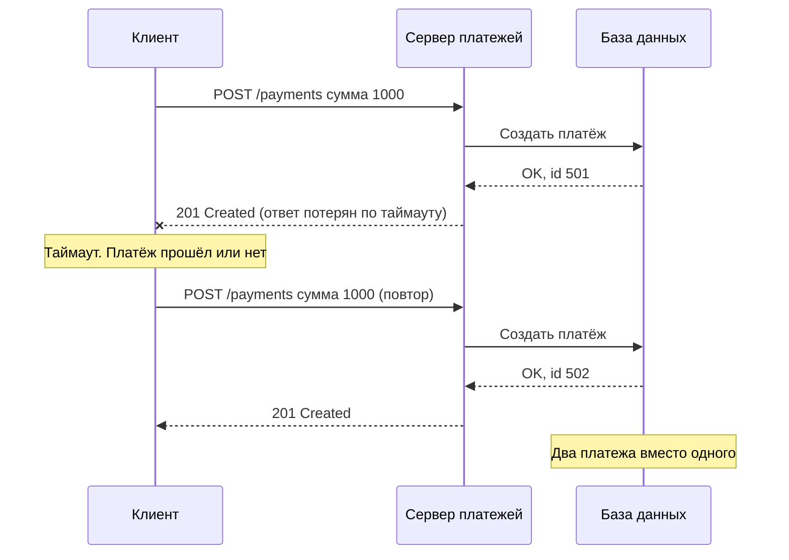
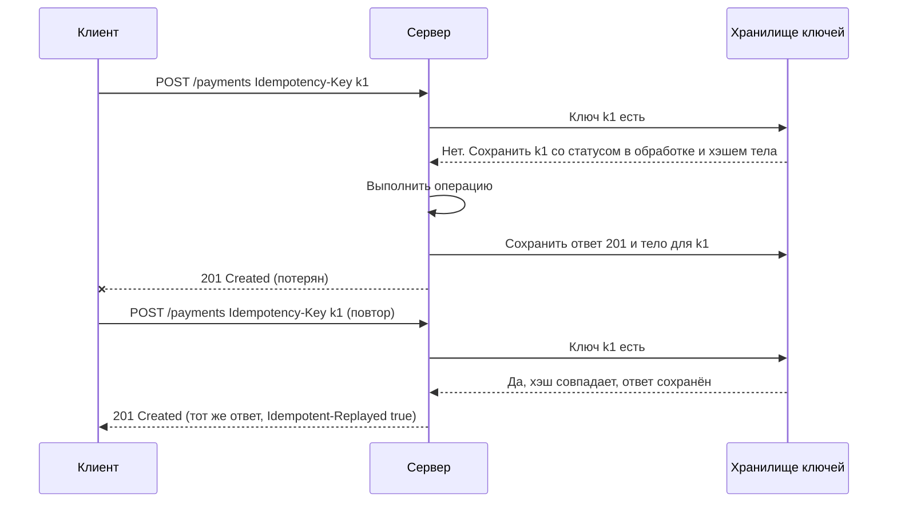
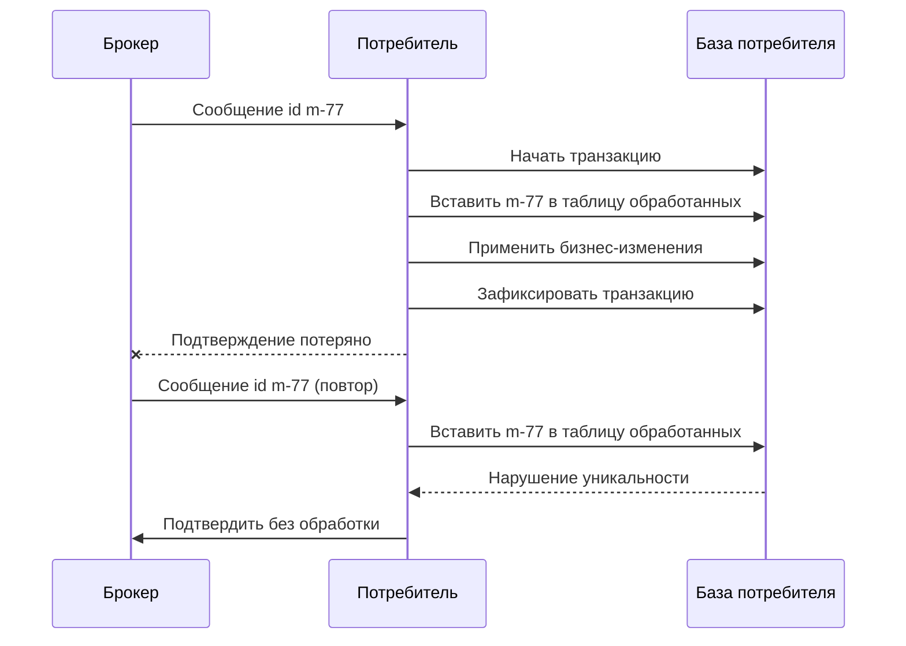

# Идемпотентность

Идемпотентность (idempotency) — свойство операции давать один и тот же результат на сервере, сколько бы раз её ни повторили. Это главное условие безопасных повторов: без неё любой таймаут в интеграции превращается в вопрос «списали деньги один раз или два?».

## Определение и отличие от безопасности

RFC 9110 (раздел 9.2) различает два свойства методов:

| Свойство | Определение | Пример |
|---|---|---|
| **Безопасный** (safe) | Клиент не запрашивает изменения состояния сервера — «только чтение» | `GET /orders/42` |
| **Идемпотентный** (idempotent) | Эффект N одинаковых запросов на сервере такой же, как от одного | `PUT /orders/42` с одним и тем же телом, `DELETE /orders/42` |

Каждый безопасный метод идемпотентен, но не наоборот: `DELETE` меняет состояние, но повтор ничего не добавляет.

::: info Важно: речь об эффекте, а не об ответе
Идемпотентность касается **состояния на сервере**, а не одинаковости ответов. Первый `DELETE` вернёт `204`, второй — `404`, и это не нарушает идемпотентность: ресурса нет в обоих случаях. Также не считаются нарушением побочные эффекты вроде записей в журнал или счётчиков запросов.
:::

## Методы HTTP

| Метод | Безопасный | Идемпотентный | Комментарий |
|---|---|---|---|
| `GET`, `HEAD`, `OPTIONS`, `TRACE` | Да | Да | Не должны менять состояние |
| `PUT` | Нет | Да | Полная замена: повтор приводит к тому же состоянию |
| `DELETE` | Нет | Да | Повтор — ресурса всё так же нет |
| `POST` | Нет | **Нет** | Каждый вызов может создать новый ресурс. Идемпотентность — только через `Idempotency-Key` или естественный ключ |
| `PATCH` | Нет | **Не гарантируется** | Зависит от содержимого патча (см. ниже) |

Подробно о методах — [Методы HTTP](/http/methods).

::: warning Идемпотентность метода — это обещание, а не факт
Таблица описывает **семантику**, которую сервер обязан соблюдать. Если `PUT` на сервере реализован как «добавить строку в историю и увеличить остаток», он не идемпотентен — и клиенты, прокси и библиотеки, автоматически повторяющие `PUT`, создадут дубли. Аналитику нужно явно проверить и описать поведение реализации.
:::

## Зачем нужна: ответ потерялся

Клиент не может отличить «запрос не дошёл» от «запрос выполнен, но ответ потерялся». В обоих случаях он видит таймаут.



Источники повторов в реальных интеграциях:

- таймаут клиента меньше времени обработки на сервере;
- обрыв соединения, перезапуск пода, балансировщик закрыл соединение;
- автоматические ретраи в HTTP-клиенте, API-gateway, service mesh;
- пользователь дважды нажал кнопку «Оплатить»;
- брокер сообщений повторно доставил сообщение (at-least-once);
- повторная отправка вебхука, если получатель не ответил `2xx` вовремя.

Политика повторов описана в разделе [Таймауты и повторы](/reliability/timeouts-retries). Повторять можно **только** идемпотентные операции — поэтому `POST` нужно сделать идемпотентным явно.

## Idempotency-Key {#idempotency-key}

Стандартный способ сделать `POST` (и `PATCH`) идемпотентным: клиент передаёт уникальный ключ операции, сервер запоминает результат и при повторе с тем же ключом возвращает сохранённый ответ, не выполняя операцию снова. Подход популяризован Stripe и стандартизуется в черновике IETF `draft-ietf-httpapi-idempotency-key-header`.

### Как это работает



Алгоритм на сервере:

1. Взять ключ из заголовка. Нет ключа там, где он обязателен, → `400 Bad Request`.
2. Посчитать отпечаток запроса (fingerprint): хэш тела, метода и пути.
3. Атомарно вставить запись `(клиент, ключ)` со статусом «в обработке» — уникальный индекс или `SET NX` в Redis.
4. Если запись уже есть:
   - статус «в обработке» → `409 Conflict` (конкурентный повтор);
   - отпечаток отличается → `422 Unprocessable Content` (ключ переиспользован с другим телом);
   - статус «завершён» → вернуть сохранённый код и тело.
5. Выполнить операцию, сохранить код и тело ответа, перевести запись в «завершён».
6. Удалить запись по истечении TTL.

### Пример: первый запрос и повтор

::: code-group

```http [Первый запрос]
POST /v1/payments HTTP/1.1
Host: api.example.com
Content-Type: application/json
Idempotency-Key: "8e03978e-40d5-43e8-bc93-6894a57f9324"

{ "orderId": "42", "amount": "1000.00", "currency": "RUB" }

HTTP/1.1 201 Created
Location: /v1/payments/501
Content-Type: application/json

{ "id": "501", "status": "SUCCEEDED", "amount": "1000.00" }
```

```http [Повтор с тем же ключом]
POST /v1/payments HTTP/1.1
Host: api.example.com
Content-Type: application/json
Idempotency-Key: "8e03978e-40d5-43e8-bc93-6894a57f9324"

{ "orderId": "42", "amount": "1000.00", "currency": "RUB" }

HTTP/1.1 201 Created
Location: /v1/payments/501
Idempotent-Replayed: true
Content-Type: application/json

{ "id": "501", "status": "SUCCEEDED", "amount": "1000.00" }
```

```http [Конкурентный повтор]
HTTP/1.1 409 Conflict
Content-Type: application/problem+json
Retry-After: 1

{
  "type": "https://api.example.com/problems/idempotency-request-in-progress",
  "title": "Запрос с этим ключом ещё обрабатывается",
  "status": 409
}
```

```http [Тот же ключ, другое тело]
HTTP/1.1 422 Unprocessable Content
Content-Type: application/problem+json

{
  "type": "https://api.example.com/problems/idempotency-key-reused",
  "title": "Ключ идемпотентности использован с другим телом запроса",
  "status": 422
}
```

```http [Ключ не передан]
HTTP/1.1 400 Bad Request
Content-Type: application/problem+json

{
  "type": "https://api.example.com/problems/idempotency-key-missing",
  "title": "Заголовок Idempotency-Key обязателен для этой операции",
  "status": 400
}
```

:::

::: info Кавычки в значении
В черновике IETF значение — строка в формате Structured Fields (RFC 9651, ранее RFC 8941), поэтому пишется в кавычках: `Idempotency-Key: "8e03..."`. Stripe и многие API принимают ключ без кавычек. Зафиксируйте формат в контракте; сервер разумно должен принимать оба варианта. Заголовок `Idempotent-Replayed` — практика Stripe, не стандарт.
:::

Форматы ответов об ошибках — [Ошибки (RFC 9457)](/design/errors), коды — [`409`](/http/status-codes#409), [`422`](/http/status-codes#422), [`400`](/http/status-codes#400).

### Параметры, которые нужно зафиксировать

| Параметр | Типовое решение | Комментарий |
|---|---|---|
| Формат ключа | UUID v4, до 255 символов | Генерирует клиент; один ключ — одна бизнес-операция, а не одна HTTP-попытка |
| Область уникальности | Клиент (по токену) + ключ, иногда + путь | Иначе ключи разных клиентов могут совпасть |
| TTL | 24 часа (Stripe), от нескольких часов до 7 дней | Должен превышать максимальное окно повторов клиента |
| Отпечаток | SHA-256 нормализованного тела + метод + путь | Без отпечатка ошибка клиента (тот же ключ на другой платёж) останется незамеченной |
| Какие ответы сохранять | Успешные `2xx` и бизнес-ошибки `4xx` | Ошибки валидации до начала обработки обычно не сохраняют |
| Ответы `5xx` | Либо сохранять (Stripe), либо снимать блокировку ключа и позволять повтор | Если транзакция откатилась целиком, безопаснее разрешить повтор |
| Обязательность | Обязателен для денежных и необратимых операций | Опционален — для остальных `POST` |
| Где хранить | Та же БД, что и бизнес-данные, в одной транзакции; или Redis | В одной транзакции — нет окна, когда операция выполнена, а ключ не записан |

::: danger Частая ошибка
Клиент генерирует **новый** ключ на каждую попытку повтора — защита не работает. Ключ создаётся один раз при формировании бизнес-операции (например, при создании платёжного поручения в учётной системе), сохраняется и переиспользуется во всех повторах.
:::

## Естественные ключи идемпотентности

Часто ключ уже есть в предметной области — и он надёжнее технического UUID, потому что переживает перезапуск клиента и даже повторную выгрузку из учётной системы.

| Пример | Естественный ключ |
|---|---|
| Выгрузка документов из 1С/ERP | Номер и дата документа, GUID документа в учётной системе |
| Платёжное поручение | Номер платежа + ИНН плательщика + дата |
| Заказ из интернет-магазина | `externalOrderId` + код магазина |
| Событие из брокера | `messageId` / `eventId` |

Реализация: уникальный индекс на поле в БД. Повтор создания приводит к нарушению уникальности, и сервер:

- либо возвращает существующий ресурс (`200 OK` и `Location` на него) — **идемпотентное создание**;
- либо отвечает [`409 Conflict`](/http/status-codes#409) с идентификатором существующего ресурса в теле.

```http
POST /v1/orders HTTP/1.1
Content-Type: application/json

{ "externalId": "SHOP-1-000123", "items": [ ... ] }

HTTP/1.1 409 Conflict
Content-Type: application/problem+json

{
  "type": "https://api.example.com/problems/duplicate-order",
  "title": "Заказ с таким externalId уже существует",
  "status": 409,
  "existingId": "42",
  "existingUri": "/v1/orders/42"
}
```

::: tip Создание через PUT
Если клиент сам назначает идентификатор, создание можно сделать через `PUT /orders/{externalId}` — оно идемпотентно по определению: первый вызов возвращает `201 Created`, повторный — `200 OK`.
:::

## PUT и DELETE на практике

### PUT

`PUT` идемпотентен, пока сервер **полностью заменяет** состояние ресурса присланным. Нарушения на практике:

- сервер генерирует при каждом `PUT` новую версию документа с новым номером;
- `PUT` вызывает побочные эффекты: отправку письма, создание движения по складу;
- сервер вычисляет поля относительно текущего значения (`balance = balance + amount`).

`PUT` не защищает от перезаписи чужих изменений: два клиента с разными телами — это не повтор, а гонка. Для этого — [`If-Match`](/design/concurrency).

### DELETE: 204 или 404 при повторе

| Вариант | Поведение | Плюсы | Минусы |
|---|---|---|---|
| **404 при повторе** | Первый `DELETE` → `204`, повтор → `404 Not Found` | Честно отражает состояние, соответствует RFC 9110 | Клиент, повторивший запрос после таймаута, видит «ошибку» и должен понимать, что для `DELETE` это успех |
| **204 всегда** | Удаление несуществующего — тоже `204` | Ретраи прозрачны, клиенту проще | Опечатка в ID не обнаруживается; нельзя отличить «удалил» от «и не было» |
| **Мягкое удаление** | Повтор → `204` или `410 Gone`, ресурс помечен удалённым | Можно различить «удалён» и «не существовал» | Нужно хранить метки удаления |

::: tip Рекомендация
Выберите один вариант и опишите в контракте. Для интеграций «система — система» удобно: `DELETE` существующего → `204`, повтор → `404`, а **клиент трактует `404` на `DELETE` как успех**. Это правило прописывается в постановке для потребителя.
:::

## PATCH и идемпотентность

`PATCH` (RFC 5789) не идемпотентен по определению, но конкретный патч может им быть:

| Патч | Идемпотентен | Почему |
|---|---|---|
| JSON Merge Patch (RFC 7396): `{ "status": "PAID" }` | Да | Устанавливает значение |
| JSON Patch (RFC 6902): `replace /status` | Да | Устанавливает значение |
| JSON Patch: `add /items/-` | **Нет** | Каждый повтор добавляет элемент в конец массива |
| Произвольный: `{ "increment": 5 }` | **Нет** | Операция относительно текущего значения |

Чтобы сделать неидемпотентный `PATCH` безопасным для повторов — добавьте `Idempotency-Key` или условие `If-Match`: повтор с устаревшим `ETag` получит `412 Precondition Failed` вместо двойного применения. См. [Конкурентный доступ](/design/concurrency).

## Идемпотентный потребитель сообщений {#idempotent-consumer}

Брокеры сообщений, вебхуки и outbox-рассылка почти всегда работают с гарантией **at-least-once**: сообщение может прийти повторно (после ребалансировки консьюмеров, падения до подтверждения, повторной отправки). Получатель обязан быть идемпотентным.



Способы:

| Способ | Как работает | Когда подходит |
|---|---|---|
| **Таблица обработанных сообщений** (inbox, dedup table) | Уникальный `messageId` вставляется в той же транзакции, что и бизнес-изменения | Универсально, надёжно |
| **Естественная идемпотентность** | Обработка — это `upsert` по бизнес-ключу или установка значения | Синхронизация справочников, статусов |
| **Проверка версии** | Сообщение несёт версию сущности, устаревшие версии отбрасываются | Потоки изменений (CDC), см. [Конкурентный доступ](/design/concurrency) |
| **Дедупликация в брокере** | Окно дедупликации по ID (Azure Service Bus, Amazon SQS FIFO, идемпотентный продюсер Kafka) | Дополнительная защита, ограничена окном и границами брокера |

::: warning Внимание
Дедупликация в памяти процесса (кэш последних ID) не переживает перезапуск и не работает при нескольких экземплярах потребителя. Хранить признак обработки нужно в той же персистентной базе, что и результат. Подробнее — [Брокеры сообщений](/protocols/messaging), [Интеграционные паттерны](/reliability/integration-patterns), [Webhooks](/protocols/webhooks).
:::

## «Exactly-once» — миф

| Гарантия доставки | Смысл | Риск |
|---|---|---|
| **At-most-once** | Отправили и забыли, без повторов | Потеря сообщений |
| **At-least-once** | Повторяем до подтверждения | Дубли |
| **Exactly-once** | Ровно одна доставка и обработка | В распределённой системе с независимыми участниками недостижима |

В распределённой системе нельзя гарантировать ровно однократную **доставку** — из-за той же проблемы потерянного подтверждения. Достижима ровно однократная **обработка** (effectively-once):

**at-least-once доставка + идемпотентная обработка = эффект ровно один раз.**

::: info Про «exactly-once» в Kafka
Транзакции Kafka обеспечивают exactly-once внутри цепочки «прочитал из Kafka — записал в Kafka». Как только обработка затрагивает внешнюю систему (БД, REST-вызов, отправку письма), гарантия заканчивается, и идемпотентность нужно обеспечивать самому.
:::

## Как описать в постановке

```yaml
# Фрагмент описания операции
operation: POST /v1/payments
idempotency:
  mechanism: Idempotency-Key header
  required: true
  keyFormat: UUID v4, генерирует система-источник при создании платёжного поручения
  keyScope: client_id + key
  ttl: 24h
  fingerprint: SHA-256 тела запроса
  onReplay: вернуть сохранённый ответ, заголовок Idempotent-Replayed true
  onConcurrent: 409 Conflict, Retry-After 1
  onPayloadMismatch: 422 Unprocessable Content
  onMissingKey: 400 Bad Request
  on5xx: ключ освобождается, повтор выполняет операцию заново
naturalKey: externalPaymentId, уникальный индекс, повтор после TTL даёт 409 с existingId
clientRetryPolicy: до 5 повторов, экспоненциальная задержка, только с тем же ключом
```

## Типичные ошибки

- Новый `Idempotency-Key` на каждую попытку повтора.
- Ключ и бизнес-изменения хранятся в разных хранилищах без атомарности — окно, где операция выполнена, а ключ не записан.
- Нет проверки отпечатка — тот же ключ «случайно» применён к другому платежу, и клиент получает ответ от чужой операции.
- TTL ключа меньше, чем окно повторов (клиент ретраит до 48 часов, а ключ живёт 1 час).
- Автоматические ретраи `POST` в gateway или HTTP-клиенте без ключа.
- Потребитель сообщений подтверждает сообщение **до** фиксации транзакции — потеря, или **после** без дедупликации — дубль.
- Уверенность, что брокер даёт exactly-once, и отсутствие дедупликации на стороне получателя.
- `PUT`, реализованный с побочными эффектами (письмо, движение денег).

## На что обратить внимание аналитику

- [ ] Для каждой операции указано: безопасна ли она, идемпотентна ли, можно ли её повторять.
- [ ] Все `POST` с денежными и необратимыми последствиями защищены `Idempotency-Key` или естественным ключом.
- [ ] Определены формат, область уникальности, TTL ключа и кто его генерирует.
- [ ] Описаны ответы на повтор, конкурентный повтор (`409`), другое тело (`422`), отсутствие ключа (`400`).
- [ ] Определено поведение при `5xx`: сохраняется ли ответ или ключ освобождается.
- [ ] Для `DELETE` выбрано поведение при повторе, и потребитель знает, как трактовать `404`.
- [ ] Для `PATCH` указано, идемпотентен ли конкретный формат патча.
- [ ] Потребители сообщений и вебхуков дедуплицируют по `messageId` или бизнес-ключу.
- [ ] Политика повторов клиента согласована с TTL ключей — см. [Таймауты и повторы](/reliability/timeouts-retries).
- [ ] Описано, как сверять данные, если статус операции неизвестен (запрос статуса по ключу или естественному ID).

## Стандарты и ссылки

- [RFC 9110, раздел 9.2 — Common Method Properties (safe, idempotent)](https://www.rfc-editor.org/rfc/rfc9110#section-9.2)
- [IETF draft — The Idempotency-Key HTTP Header Field](https://datatracker.ietf.org/doc/draft-ietf-httpapi-idempotency-key-header/)
- [RFC 5789 — PATCH Method for HTTP](https://www.rfc-editor.org/rfc/rfc5789)
- [RFC 7396 — JSON Merge Patch](https://www.rfc-editor.org/rfc/rfc7396)
- [RFC 6902 — JSON Patch](https://www.rfc-editor.org/rfc/rfc6902)
- [RFC 9651 — Structured Field Values for HTTP](https://www.rfc-editor.org/rfc/rfc9651)
- [Stripe API — Idempotent requests](https://docs.stripe.com/api/idempotent_requests)
- [Google AIP-155 — Request identification](https://google.aip.dev/155)
- [Zalando RESTful API Guidelines — раздел об идемпотентности](https://opensource.zalando.com/restful-api-guidelines/)
- [Microservices.io — Idempotent Consumer](https://microservices.io/patterns/communication-style/idempotent-consumer.html)
