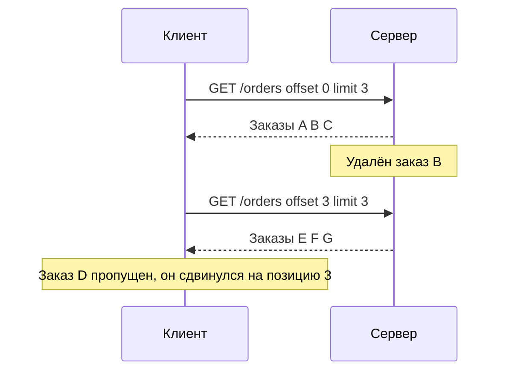
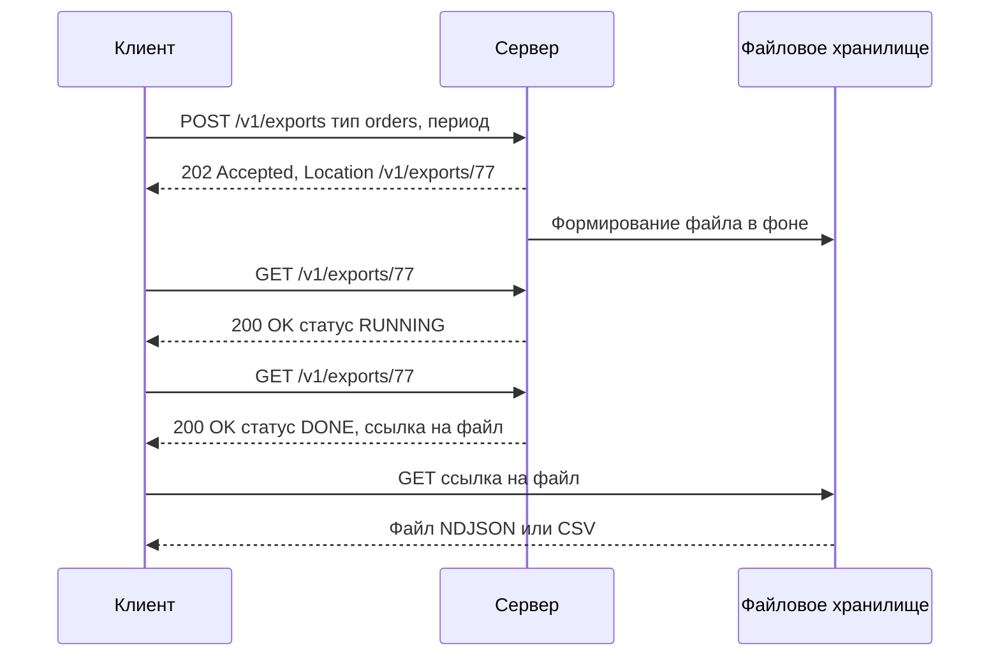

# Пагинация

Пагинация (pagination) — выдача большой коллекции порциями (страницами). Без неё один запрос `GET /orders` однажды вернёт миллион записей, положит сервер, сеть и клиента. Выбор подхода определяет производительность, консистентность выгрузки и то, как потребитель будет синхронизировать данные.

## Зачем нужна

- **Защита сервера и БД** от тяжёлых запросов и исчерпания памяти.
- **Предсказуемое время ответа** и размер ответа — укладываемся в таймауты.
- **Удобство клиента**: UI показывает страницами, интеграция обрабатывает порциями.
- **Возможность возобновления** выгрузки после сбоя — с той страницы, где остановились.

::: warning Правило
Любой эндпоинт, возвращающий коллекцию, которая **может** вырасти, пагинируется с первого релиза. Добавить пагинацию позже — ломающее изменение: старые клиенты получат только первую страницу и решат, что это всё.
:::

## Подходы

### Offset / limit (page / size)

Клиент указывает смещение и размер страницы (или номер страницы и её размер).

::: code-group

```http [offset и limit]
GET /v1/orders?offset=40&limit=20&sort=-createdAt HTTP/1.1
Host: api.example.com

HTTP/1.1 200 OK
Content-Type: application/json

{
  "data": [ { "id": "981" }, { "id": "980" } ],
  "pagination": {
    "offset": 40,
    "limit": 20,
    "total": 1253
  }
}
```

```http [page и size]
GET /v1/orders?page=3&size=20&sort=-createdAt HTTP/1.1
Host: api.example.com

HTTP/1.1 200 OK
Content-Type: application/json

{
  "data": [ { "id": "981" }, { "id": "980" } ],
  "pagination": {
    "page": 3,
    "size": 20,
    "totalElements": 1253,
    "totalPages": 63
  }
}
```

```sql [SQL на сервере]
SELECT * FROM orders
ORDER BY created_at DESC, id DESC
LIMIT 20 OFFSET 40;
```

:::

Плюсы: просто, можно перейти на любую страницу, легко показать «стр. 3 из 63».

Минусы:

- **Производительность падает с ростом offset**: БД читает и отбрасывает все предыдущие строки. `OFFSET 1000000` — это чтение миллиона строк ради двадцати.
- **Пропуски и дубли** при изменении данных между запросами страниц.



При вставке новой записи в начало — наоборот, последний элемент предыдущей страницы придёт повторно.

### Cursor-based (непрозрачный курсор)

Сервер возвращает курсор — непрозрачную (opaque) строку, указывающую на позицию после последнего элемента. Клиент передаёт её в следующем запросе и не интерпретирует.

```http
GET /v1/orders?limit=20 HTTP/1.1
Host: api.example.com

HTTP/1.1 200 OK
Content-Type: application/json

{
  "data": [ { "id": "1000", "createdAt": "2024-05-14T10:21:00Z" } ],
  "pagination": {
    "limit": 20,
    "nextCursor": "eyJjcmVhdGVkQXQiOiIyMDI0LTA1LTE0VDEwOjIxOjAwWiIsImlkIjoiOTgxIn0",
    "hasMore": true
  }
}
```

```http
GET /v1/orders?limit=20&cursor=eyJjcmVhdGVkQXQiOiIyMDI0LTA1LTE0VDEwOjIxOjAwWiIsImlkIjoiOTgxIn0 HTTP/1.1
Host: api.example.com
```

Внутри курсора — обычно base64url от JSON с ключом последней записи:

```json
{ "createdAt": "2024-05-14T10:21:00Z", "id": "981" }
```

::: tip Курсор должен быть непрозрачным
- Кодируйте **base64url** (без `+`, `/`, `=`) — его не нужно экранировать в URL.
- Документируйте курсор как «строку, которую нельзя разбирать». Тогда формат можно менять без ломающих изменений.
- При необходимости подписывайте курсор (HMAC), чтобы клиент не подделал его и не обошёл фильтры доступа.
- Курсор связан с фильтрами и сортировкой запроса: менять их при переходе по курсору нельзя — либо зашейте их в курсор, либо возвращайте `400`.
- Указывайте срок жизни курсора, если он есть (например, курсор поиска в Elasticsearch).
:::

### Keyset / seek

Технически то же, что курсор, но ключ передаётся явно: «дай записи после этого ID».

```http
GET /v1/orders?limit=20&afterId=981 HTTP/1.1
```

```sql
-- простой случай: сортировка по уникальному возрастающему id
SELECT * FROM orders WHERE id > 981 ORDER BY id LIMIT 20;

-- сортировка по неуникальному полю: добавляем id как tie-breaker
SELECT * FROM orders
WHERE (created_at, id) < ('2024-05-14T10:21:00Z', 981)
ORDER BY created_at DESC, id DESC
LIMIT 20;
```

Плюсы: постоянная скорость на любой глубине при наличии индекса по `(created_at, id)`, нет пропусков и дублей при вставках и удалениях. Минусы: нельзя перейти на произвольную страницу, ключ раскрывает внутреннее устройство — поэтому в публичных API его обычно заворачивают в непрозрачный курсор.

### Time-based (по времени изменения)

Разновидность keyset, где ключ — время. Основа **инкрементальной синхронизации**: «дай всё, что изменилось после моей последней выгрузки».

```http
GET /v1/orders?updatedSince=2024-05-14T00:00:00Z&limit=500 HTTP/1.1
```

::: warning Подводные камни time-based
- **Одинаковые метки времени**: на границе страницы записи с тем же `updatedAt` теряются или дублируются. Используйте составной ключ `(updatedAt, id)` в курсоре.
- **Поздняя фиксация транзакций**: запись с `updatedAt = 10:00:00` может закоммититься в `10:00:05`, когда клиент уже забрал период до `10:00:03`. Решения: перекрытие окна (запрашивать с запасом в несколько минут и дедуплицировать), монотонный номер изменения (sequence, `changeVersion`) вместо времени.
- **Расхождение часов** между узлами, если время ставит не БД.
- **Удаления** не видны в выборке по `updatedAt` — нужны мягкое удаление или отдельный поток удалений.
:::

### Link header (RFC 8288)

Ссылки навигации передаются в заголовке `Link` — так делает, например, GitHub API. Тело остаётся чистым массивом.

```http
HTTP/1.1 200 OK
Content-Type: application/json
Link: <https://api.example.com/v1/orders?cursor=b2Zmc2V0OjIw&limit=20>; rel="next",
      <https://api.example.com/v1/orders?cursor=b2Zmc2V0OjA&limit=20>; rel="prev",
      <https://api.example.com/v1/orders?limit=20>; rel="first"

[ { "id": "1000" }, { "id": "999" } ]
```

Стандартные отношения (IANA Link Relations): `next`, `prev` (синоним `previous`), `first`, `last`. Для курсорной пагинации `last` обычно не отдают. В реальном ответе заголовок — одна строка, перенос здесь для читаемости.

Клиент **не собирает URL сам**, а переходит по ссылке `next`, пока она есть. Тот же приём применим и в теле — блок `links`.

## Сравнение подходов

| Критерий | Offset / page | Cursor (opaque) | Keyset / seek | Time-based |
|---|---|---|---|---|
| Производительность на глубоких страницах | Плохая, растёт с offset | Постоянная | Постоянная | Постоянная |
| Пропуски и дубли при вставках/удалениях | Есть | Нет | Нет | Нет при составном ключе |
| Переход на N-ю страницу | Да | Нет | Нет | Нет |
| Общее количество (total) | Обычно есть | Опционально | Опционально | Обычно нет |
| Требует стабильной уникальной сортировки | Да | Да | Да | Да, `(time, id)` |
| Возобновление выгрузки после сбоя | Ненадёжно | Да | Да | Да |
| Инкрементальная синхронизация | Нет | Частично | Частично | Да |
| Сложность реализации | Низкая | Средняя | Средняя | Средняя |
| Типичное применение | UI-таблицы, небольшие справочники | Публичные API, ленты, интеграции | Внутренние API, выгрузки | Синхронизация изменений между системами |

::: tip Выбор
- Интеграция «система — система», большие объёмы, выгрузка «всего» → **cursor** или **keyset**.
- Синхронизация изменений → **time-based** с составным курсором или номером изменения.
- UI с номерами страниц и небольшая коллекция (до десятков тысяч строк) → **offset/page** допустим.
:::

## Формат ответа

### Конверт (envelope)

```json
{
  "data": [
    { "id": "1000", "status": "PAID" },
    { "id": "999", "status": "NEW" }
  ],
  "pagination": {
    "limit": 20,
    "nextCursor": "eyJpZCI6Ijk5OSJ9",
    "prevCursor": "eyJpZCI6IjEwMDAiLCJkaXIiOiJiYWNrIn0",
    "hasMore": true
  },
  "links": {
    "self": "/v1/orders?limit=20",
    "next": "/v1/orders?limit=20&cursor=eyJpZCI6Ijk5OSJ9"
  }
}
```

| Вариант | Плюсы | Минусы |
|---|---|---|
| Конверт `data` + `pagination`/`meta` + `links` | Метаданные рядом с данными, легко расширять | Чуть больше вложенность |
| Голый массив + заголовки (`Link`, `X-Total-Count`) | Тело — просто список | Корневой массив нельзя расширить без ломающего изменения, заголовки теряются некоторыми прокси и не видны в части инструментов |

::: tip Рекомендация
Возвращайте **объект-конверт**, а не голый массив: в объект можно добавить поле, не сломав клиентов. Эту же структуру используйте во всех коллекциях API.
:::

### Признак последней страницы

- `nextCursor` отсутствует или `null` — страниц больше нет. Это **единственный** надёжный признак.
- Неполная страница (`data.length` меньше `limit`) **не** признак конца: сервер вправе вернуть меньше элементов (например, после фильтрации прав доступа). То же правило явно сформулировано в Google AIP-158.
- Пустая страница с `nextCursor` допустима — клиент продолжает.

## Total count и его стоимость

`COUNT(*)` по большой таблице с фильтрами может быть дороже, чем сама выборка страницы.

| Вариант | Как |
|---|---|
| Не возвращать total | Только `hasMore`. Подходит для интеграций и лент |
| По запросу | `?includeTotal=true` — клиент платит за счёт, только когда нужно |
| Приблизительный | Оценка из статистики БД с пометкой `totalIsEstimate: true` |
| Ограниченный | Считать до порога: `"total": 10000, "totalIsLowerBound": true` |
| В заголовке | `X-Total-Count: 1253` — нестандартный, но распространённый |

## Размер страницы и лимиты

| Параметр | Типовое значение | Комментарий |
|---|---|---|
| Размер по умолчанию | 20–100 | Применяется, если `limit` не указан |
| Максимум | 100–1000 | Зависит от размера записи; ограничивает нагрузку |
| Минимум | 1 | `limit=0` — ошибка или «только total», описать явно |

Поведение при превышении максимума — два варианта, выберите один:

- **Урезать до максимума** (рекомендация Google AIP-158) и вернуть фактический `limit` в ответе;
- **Отклонить** запрос с `400 Bad Request`.

## Некорректные параметры

| Ситуация | Ответ |
|---|---|
| `limit=abc`, `limit=-5`, `offset=-1` | [`400 Bad Request`](/http/status-codes#400) с указанием параметра |
| Повреждённый или поддельный курсор | `400 Bad Request` |
| Курсор с другими фильтрами или сортировкой | `400 Bad Request` |
| Истёкший курсор | `400 Bad Request` или [`410 Gone`](/http/status-codes#410) — описать в контракте |
| `page` за пределами последней страницы | `200 OK` с пустым `data` (не `404`) |

```json
{
  "type": "https://api.example.com/problems/invalid-parameter",
  "title": "Некорректный параметр запроса",
  "status": 400,
  "errors": [
    { "parameter": "limit", "detail": "Должно быть целым числом от 1 до 500" }
  ]
}
```

Формат ошибок — [Ошибки (RFC 9457)](/design/errors).

## Стабильная сортировка — обязательное условие

Пагинация без **детерминированного** порядка недетерминирована: SQL без `ORDER BY` не гарантирует порядок, а сортировка по неуникальному полю (`createdAt`, `status`) может по-разному упорядочивать равные значения от запроса к запросу.

- Всегда добавляйте уникальное поле последним ключом сортировки: `ORDER BY created_at DESC, id DESC`.
- Сортировка по умолчанию должна быть задокументирована.
- Для keyset/cursor нужен индекс, совпадающий с сортировкой.
- Поля, по которым разрешена сортировка, — белый список (см. [Фильтрация и сортировка](/design/filtering)).

## Пагинация в GraphQL (Relay)

В GraphQL де-факто стандарт — спецификация Relay Cursor Connections:

```graphql
query {
  orders(first: 20, after: "Y3Vyc29yOjQy") {
    edges {
      cursor
      node { id status total }
    }
    pageInfo {
      hasNextPage
      hasPreviousPage
      startCursor
      endCursor
    }
  }
}
```

Аргументы `first`/`after` — вперёд, `last`/`before` — назад. Подробнее — [GraphQL](/protocols/graphql). В [OData](/protocols/odata) используются `$top`, `$skip` и серверная ссылка `@odata.nextLink`.

## Выгрузка больших объёмов

Пагинация — для чтения порциями, а не для массовой выгрузки миллионов записей. Перебор 50 000 страниц занимает часы, ломается на любом сбое и создаёт пиковую нагрузку.

Для полной выгрузки сделайте **отдельный асинхронный экспорт**:



Подробнее — [Асинхронные операции](/design/async-operations), [Файловый обмен](/protocols/file-exchange), [Пакетные операции](/design/bulk). Схема интеграции «первичная полная выгрузка + инкрементальная синхронизация по `updatedSince`» — самая надёжная для репликации справочников и документов.

## Типичные ошибки

- Нет пагинации в первой версии API.
- Сортировка без уникального tie-breaker — дубли и пропуски на границах страниц.
- Offset-пагинация для выгрузки миллионов записей.
- Клиент считает неполную страницу последней.
- Клиент собирает курсор или парсит его содержимое.
- Обязательный `total` на каждом запросе к большой таблице.
- Синхронизация по `updatedAt` без учёта одинаковых меток времени и поздних транзакций.
- Выгрузка «всего» без лимита при отсутствии параметров (`GET /orders` отдаёт всё).
- Разные параметры пагинации в разных ресурсах одного API (`page/size` и `offset/limit`).

## На что обратить внимание аналитику

- [ ] Выбран подход к пагинации и применён единообразно во всех коллекциях.
- [ ] Указаны имена параметров (`limit`, `cursor` или `page`, `size`), размер по умолчанию и максимальный.
- [ ] Определено поведение при превышении максимума (урезание или `400`) и при некорректных параметрах.
- [ ] Задана сортировка по умолчанию с уникальным последним ключом.
- [ ] Описан формат ответа: конверт, признак последней страницы, ссылки.
- [ ] Решено, нужен ли `total`, и как он считается.
- [ ] Для курсоров — срок жизни, связь с фильтрами, непрозрачность.
- [ ] Для синхронизации — ключ изменений (`updatedAt` + `id` или номер версии), перекрытие окна, обработка удалений.
- [ ] Для массовой выгрузки предусмотрен отдельный асинхронный экспорт.
- [ ] Учтены [rate limiting](/design/rate-limiting) и [таймауты](/reliability/timeouts-retries) при последовательном переборе страниц.

## Стандарты и ссылки

- [RFC 8288 — Web Linking](https://www.rfc-editor.org/rfc/rfc8288)
- [IANA — Link Relation Types](https://www.iana.org/assignments/link-relations/link-relations.xhtml)
- [RFC 4648 — Base16, Base32, Base64 (base64url, раздел 5)](https://www.rfc-editor.org/rfc/rfc4648#section-5)
- [Google AIP-158 — Pagination](https://google.aip.dev/158)
- [Microsoft REST API Guidelines](https://github.com/microsoft/api-guidelines)
- [Zalando RESTful API Guidelines — Pagination](https://opensource.zalando.com/restful-api-guidelines/)
- [GraphQL Cursor Connections Specification (Relay)](https://relay.dev/graphql/connections.htm)
- [JSON:API — Pagination](https://jsonapi.org/format/#fetching-pagination)
- [GitHub REST API — Using pagination](https://docs.github.com/en/rest/using-the-rest-api/using-pagination-in-the-rest-api)
- [Use The Index, Luke — Paging Through Results (keyset)](https://use-the-index-luke.com/no-offset)
