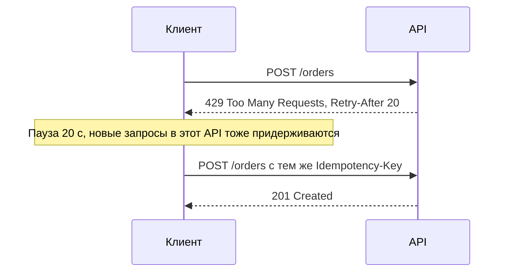

# Ограничение частоты запросов

Ограничение частоты запросов (rate limiting) — механизм, который ограничивает число запросов клиента за единицу времени и отклоняет лишние ответом `429 Too Many Requests`. Для аналитика это часть контракта: лимиты, поведение при превышении и ожидаемая реакция клиента должны быть согласованы до запуска интеграции.

## Зачем ограничивать {#why}

| Цель | Пример |
|---|---|
| Защита от перегрузки | Ошибка в клиенте запустила бесконечный цикл запросов — без лимита ляжет сервис и его база |
| Справедливое распределение | Один «шумный» партнёр не должен деградировать сервис для остальных (noisy neighbour) |
| Защита от злоупотреблений | Перебор паролей, скрейпинг каталога, перебор идентификаторов (OWASP API4:2023 Unrestricted Resource Consumption) |
| Контроль стоимости | Каждый вызов платного внешнего сервиса (скоринг, SMS, геокодер) стоит денег |
| Тарификация | Тарифы: Free — 100 запросов в минуту, Business — 1000 |
| Защита смежных систем | Сервис сам упирается в лимит провайдера и транслирует его своим клиентам |

## Алгоритмы {#algorithms}

### Fixed window — фиксированное окно {#fixed-window}

Время делится на интервалы (например, минуты), для каждого ведётся счётчик. Счётчик превысил лимит — отказ до начала следующего окна.

- **Плюсы:** очень простой, один счётчик на ключ, легко реализуется в Redis (`INCR` + `EXPIRE`).
- **Минусы:** «всплеск на границе окна»: при лимите 100 в минуту клиент может отправить 100 запросов в 12:00:59 и ещё 100 в 12:01:00 — 200 запросов за 2 секунды.

### Sliding window log — скользящий журнал {#sliding-log}

Хранится время каждого запроса. При новом запросе удаляются записи старше окна и считается количество оставшихся.

- **Плюсы:** абсолютно точный лимит в любом скользящем окне.
- **Минусы:** память пропорциональна числу запросов (при лимите 10 000 в час — до 10 000 меток на клиента).

### Sliding window counter — скользящий счётчик {#sliding-counter}

Компромисс: хранятся счётчики текущего и предыдущего фиксированных окон, а оценка считается взвешенно:

```text
оценка = счётчик_текущего + счётчик_предыдущего × (доля предыдущего окна, ещё попадающая в скользящее окно)

Пример: лимит 100/мин, сейчас 12:01:15 (прошло 25 % текущего окна)
предыдущее окно: 80 запросов, текущее: 30
оценка = 30 + 80 × 0,75 = 90 → запрос разрешён
```

- **Плюсы:** два счётчика на ключ, сглаживает всплеск на границе.
- **Минусы:** приближённый (предполагает равномерное распределение запросов в предыдущем окне).

### Token bucket — ведро токенов {#token-bucket}

В «ведре» ёмкостью `B` токенов; токены добавляются со скоростью `r` в секунду (не больше ёмкости). Каждый запрос забирает токен; нет токенов — отказ.

- **Плюсы:** разрешает контролируемые всплески (burst) до `B` при средней скорости `r`; эффективен по памяти (число токенов + время последнего пополнения). Стандарт де-факто для API-шлюзов (AWS API Gateway, Envoy, многие другие).
- **Минусы:** нужно согласовывать два параметра — скорость и размер всплеска.


### Leaky bucket — дырявое ведро {#leaky-bucket}

Запросы попадают в очередь фиксированного размера и «вытекают» на обработку с постоянной скоростью. Очередь заполнена — отказ.

- **Плюсы:** идеально ровный исходящий поток — удобно защищать хрупкую систему за собой (legacy, внешний провайдер с жёстким лимитом).
- **Минусы:** добавляет задержку (запрос ждёт в очереди); всплески не обрабатываются быстрее. В варианте «как счётчик» (без очереди) близок к token bucket; вариация — алгоритм GCRA.

### Сравнение {#comparison}

| Алгоритм | Точность | Всплески | Память на ключ | Сложность | Когда применять |
|---|---|---|---|---|---|
| Fixed window | Низкая (до 2× на границе) | Неконтролируемые на границе | 1 счётчик | Минимальная | Квоты на длинные периоды (сутки, месяц), некритичные лимиты |
| Sliding window log | Точная | Нет | O(число запросов) | Средняя | Малые лимиты, где важна точность (попытки входа) |
| Sliding window counter | Хорошая | Сглажены | 2 счётчика | Низкая | Универсальный вариант для API |
| Token bucket | Хорошая | **Разрешены до B** | 2 значения | Низкая | API-шлюзы, публичные API, лимиты «скорость + burst» |
| Leaky bucket | Хорошая | Сглаживаются в очередь | Очередь | Средняя | Выравнивание нагрузки на хрупкий downstream |

## Ключи лимитирования {#keys}

Лимит всегда считается «на что-то» — ключ определяет, чей счётчик увеличивать.

| Ключ | Когда | Подводные камни |
|---|---|---|
| Клиент (`client_id`, API-ключ, организация) | **Основной вариант для B2B-интеграций** | Один партнёр с несколькими системами делит лимит — договоритесь, на что он выдаётся |
| Пользователь (субъект токена) | Публичные API, мобильные приложения | Нужно аутентифицировать до лимитирования |
| IP-адрес | Неаутентифицированные эндпоинты, защита от перебора | NAT и прокси: тысячи пользователей за одним IP; IPv6 — у атакующего миллионы адресов |
| Эндпоинт / операция | Тяжёлые операции (поиск, отчёты, экспорт) получают свой, меньший лимит | Нужно документировать лимит каждой операции |
| Комбинация | `client_id` + операция, `client_id` + метод | Растёт число счётчиков |
| Глобальный | Защита сервиса целиком | Один клиент может «съесть» глобальный лимит у всех |

Обычно лимиты **многоуровневые**: глобальный на сервис, на клиента, на тяжёлые операции, плюс отдельный — на попытки аутентификации по IP.

## Квоты и лимиты скорости {#quota-vs-rate}

| | Лимит скорости (rate limit) | Квота (quota) |
|---|---|---|
| Период | Секунды, минуты | Сутки, месяц |
| Цель | Защита от всплесков и перегрузки | Бизнес-ограничение, тариф, биллинг |
| Пример | 50 запросов в секунду | 1 000 000 запросов в месяц |
| Сброс | Непрерывно / каждое окно | В начале периода (часто по календарю — уточните часовой пояс) |
| Реакция при превышении | `429` + короткий `Retry-After` | `429` или `403` до конца периода, предложение сменить тариф |

## Ответ при превышении {#response}

Стандартный ответ — `429 Too Many Requests` (RFC 6585) с заголовком `Retry-After` (RFC 9110) и телом в формате [Problem Details](/design/errors):

```http
HTTP/1.1 429 Too Many Requests
Content-Type: application/problem+json
Retry-After: 30
RateLimit-Policy: "per-minute";q=100;w=60
RateLimit: "per-minute";r=0;t=30

{
  "type": "https://api.example.com/problems/rate-limit-exceeded",
  "title": "Превышен лимит запросов",
  "status": 429,
  "detail": "Лимит 100 запросов в минуту для клиента crm-prod исчерпан. Повторите через 30 секунд.",
  "traceId": "4bf92f3577b34da6a3ce929d0e0e4736"
}
```

`Retry-After` бывает двух видов:

```http
Retry-After: 120
Retry-After: Sat, 03 Oct 2026 12:30:00 GMT
```

Число секунд предпочтительнее: не зависит от рассинхронизации часов клиента и сервера.

::: info 429 или 503?
`429` — «**ты** превысил свой лимит». `503 Service Unavailable` (тоже с `Retry-After`) — «сервис перегружен **в целом** или на обслуживании», причина не в конкретном клиенте. См. [429](/http/status-codes#429) и [503](/http/status-codes#503).
:::

## Заголовки лимитов {#headers}

### Распространённые нестандартные заголовки {#x-ratelimit}

Используются многими API (GitHub, Twitter/X и др.), но **не стандартизованы**, и семантика различается:

```http
HTTP/1.1 200 OK
X-RateLimit-Limit: 5000
X-RateLimit-Remaining: 4987
X-RateLimit-Reset: 1790000000
```

| Заголовок | Смысл |
|---|---|
| `X-RateLimit-Limit` | Лимит в текущем окне |
| `X-RateLimit-Remaining` | Сколько запросов осталось |
| `X-RateLimit-Reset` | Когда окно сбросится: **у одних API — Unix-время, у других — секунды до сброса** |

::: warning
Если партнёр использует `X-RateLimit-Reset`, обязательно уточните, что в нём: абсолютное время или относительное. Это частая причина ошибок клиентского троттлинга.
:::

### Стандартизуемые заголовки RateLimit и RateLimit-Policy {#ietf-ratelimit}

Рабочая группа IETF HTTPAPI разрабатывает черновик «RateLimit header fields for HTTP» (`draft-ietf-httpapi-ratelimit-headers`). На момент написания это **черновик**, формат менялся между версиями:

- в ранних версиях были три заголовка `RateLimit-Limit`, `RateLimit-Remaining`, `RateLimit-Reset` (их можно встретить в действующих API);
- в актуальных версиях — два заголовка в формате Structured Fields:

```http
HTTP/1.1 200 OK
RateLimit-Policy: "burst";q=100;w=60, "daily";q=10000;w=86400
RateLimit: "burst";r=42;t=18
```

| Заголовок / параметр | Смысл |
|---|---|
| `RateLimit-Policy` | Перечень политик, действующих для клиента; у каждой — имя |
| `q` | Квота (сколько единиц разрешено) |
| `w` | Окно в секундах |
| `RateLimit` | Текущее состояние ближайшей к исчерпанию политики |
| `r` | Оставшееся количество |
| `t` | Секунд до сброса (восстановления квоты) |

::: tip
Прежде чем закладывать заголовки в контракт, сверьтесь с актуальной версией черновика и зафиксируйте **конкретный формат** в спецификации интеграции, не ссылаясь просто на «стандарт».
:::

## Поведение клиента {#client}

Правильный клиент не ждёт `429`, а старается их не получать, а получив — корректно реагирует.



Требования к клиенту, которые стоит записать в постановку:

1. **Уважать `Retry-After`.** Не повторять раньше указанного времени. Пауза относится ко всем запросам в этот API с этим ключом лимита, а не только к одному.
2. **Экспоненциальная задержка с джиттером**, если `Retry-After` нет: `задержка = min(максимум, база × 2^попытка)` плюс случайная составляющая, чтобы тысячи клиентов не повторили одновременно (thundering herd). Подробно — в [Таймауты и повторы](/reliability/timeouts-retries).
3. **Ограничение числа повторов** и общего времени на операцию.
4. **Клиентский троттлинг**: если лимит известен (100 в минуту), клиент сам ограничивает исходящий поток — тем же token bucket на своей стороне, по `Remaining` из заголовков.
5. **Очередь вместо потери**: при пакетной загрузке задания ставятся в очередь и отправляются в темпе лимита.
6. **Идемпотентность повторов** — повтор `POST` после `429` безопасен (запрос не обработан), но при смешении с таймаутами нужен [ключ идемпотентности](/design/idempotency).
7. **Мониторинг**: доля `429` — метрика, по которой видно, что лимит пора пересматривать или клиент работает неправильно.

## Throttling и rate limiting {#throttling}

Термины часто используют как синонимы, но есть оттенок:

| | Rate limiting | Throttling |
|---|---|---|
| Что происходит с лишним запросом | Отклоняется (`429`) | Замедляется: ставится в очередь, обрабатывается позже |
| Где | Обычно сервер / шлюз | Сервер (очередь) или клиент (самоограничение) |
| Пример | 101-й запрос в минуту получает `429` | Запросы сверх 10/с ждут в очереди и обрабатываются с задержкой |

## Лимиты на конкурентность {#concurrency-limits}

Лимит скорости не защищает от **долгих** запросов: 10 запросов в секунду по 30 секунд каждый — это 300 одновременно выполняющихся операций. Поэтому отдельно ограничивают число **одновременных** запросов (concurrency limit, in-flight requests):

- «не более 5 одновременных запросов на экспорт от одного клиента»;
- при превышении — `429` (с указанием причины в `type`) или `503`;
- для тяжёлых операций лучше перейти на [асинхронную модель](/design/async-operations) и ограничивать число активных задач.

Адаптивные лимиты (adaptive concurrency) динамически меняют допустимую конкурентность по задержкам ответов — это уже защита сервиса, см. [Паттерны устойчивости](/reliability/resilience-patterns).

## Лимиты на размер {#size-limits}

| Код | Когда | Что согласовать |
|---|---|---|
| `413 Content Too Large` | Тело запроса больше допустимого | Максимальный размер тела (часто 1–10 МБ на шлюзе), количество элементов в пакете — см. [Пакетные операции](/design/bulk) |
| `414 URI Too Long` | Слишком длинный URI (часто из-за огромных фильтров в query) | Практический предел — несколько КБ; для сложных фильтров — `POST /search` или `QUERY` |
| `431 Request Header Fields Too Large` | Слишком большие заголовки (огромные cookie, JWT) | Размер токена, число заголовков |

Кроме размеров запроса ограничивают также: размер страницы (`limit` не более 100 — см. [Пагинация](/design/pagination)), глубину вложенности JSON, длину строк, число элементов массива, сложность запроса (в [GraphQL](/protocols/graphql)).

## Что согласовать с партнёром {#agreement}

| Параметр | Пример записи в спецификации |
|---|---|
| Лимит скорости | 50 запросов в секунду на `client_id` для всех операций |
| Burst | Допускается всплеск до 100 запросов |
| Окно и алгоритм | Скользящее окно 1 секунда / token bucket |
| Отдельные лимиты операций | `POST /reports` — не более 10 в минуту, не более 2 одновременно |
| Квоты | 5 000 000 запросов в календарный месяц (по UTC) |
| Ключ лимита | Лимит на организацию, общий для всех её систем |
| Ответ при превышении | `429` + `Retry-After` в секундах + Problem Details |
| Заголовки состояния | `RateLimit-Policy` и `RateLimit` в каждом ответе (формат зафиксирован в приложении) |
| Ожидаемое поведение клиента | Пауза по `Retry-After`, не более 3 повторов, экспоненциальная задержка с джиттером |
| Пиковые сценарии | Ночная выгрузка 200 000 записей — через пакетный эндпоинт, окно 01:00–05:00 |
| Тестовый стенд | Лимиты на стенде ниже/выше продуктивных? |
| Изменение лимитов | Снижение лимитов — с уведомлением за N дней |
| Мониторинг и эскалация | Кому писать при систематических `429` |

## Типичные ошибки {#mistakes}

- Лимиты не задокументированы — партнёр узнаёт о них из продакшна.
- `429` без `Retry-After` и без тела — клиент не знает, сколько ждать.
- Ответ `500` или `503` при превышении лимита клиентом — клиент повторяет немедленно.
- Клиент повторяет `429` сразу и в цикле, усугубляя проблему.
- Лимит по IP для B2B-интеграции: все запросы партнёра идут через один NAT-шлюз — и упираются в лимит, рассчитанный на одного пользователя.
- Лимит считается на каждом экземпляре сервиса отдельно: при 4 репликах фактический лимит в 4 раза больше и плавает при масштабировании. Нужен распределённый счётчик (Redis) или лимитирование на шлюзе.
- Нет отдельного лимита для тяжёлых операций — 10 запросов отчётов в секунду кладут базу.
- Неоднозначный `X-RateLimit-Reset` (секунды или Unix-время).
- Пакетная загрузка после простоя отправляет всё накопленное сразу.

## На что обратить внимание аналитику {#checklist}

- [ ] Зафиксированы лимиты: скорость, burst, окно, квоты, ключ лимита.
- [ ] Определены отдельные лимиты для тяжёлых операций и лимиты конкурентности.
- [ ] Описан ответ при превышении: `429`, `Retry-After`, формат тела.
- [ ] Решено, какие заголовки состояния лимита возвращаются, и их точный формат.
- [ ] Описано ожидаемое поведение клиента: пауза, повторы, джиттер, клиентский троттлинг.
- [ ] Пиковые и пакетные сценарии укладываются в лимиты (посчитайте: объём ÷ лимит = время выгрузки).
- [ ] Согласованы лимиты на размер: тело, URI, заголовки, число элементов в пакете, размер страницы.
- [ ] Учтены лимиты смежных систем, которые сервис вызывает сам.
- [ ] Определено, где реализуется лимит (шлюз или сервис) и как он считается при нескольких репликах.
- [ ] Есть мониторинг доли `429` и порядок пересмотра лимитов.

## Стандарты и ссылки {#links}

- [RFC 6585 — Additional HTTP Status Codes (429, 431)](https://www.rfc-editor.org/rfc/rfc6585)
- [RFC 9110 — HTTP Semantics: Retry-After, 413, 414](https://www.rfc-editor.org/rfc/rfc9110#name-retry-after)
- [IETF draft — RateLimit header fields for HTTP](https://datatracker.ietf.org/doc/draft-ietf-httpapi-ratelimit-headers/)
- [OWASP API4:2023 — Unrestricted Resource Consumption](https://owasp.org/API-Security/editions/2023/en/0xa4-unrestricted-resource-consumption/)
- [Google Cloud — Rate-limiting strategies and techniques](https://cloud.google.com/architecture/rate-limiting-strategies-techniques)
- [Stripe — Rate limiters (блог)](https://stripe.com/blog/rate-limiters)
- [AWS Builders' Library — Timeouts, retries and backoff with jitter](https://aws.amazon.com/builders-library/timeouts-retries-and-backoff-with-jitter/)
- [Zalando RESTful API Guidelines — Use code 429 with headers for rate limits](https://opensource.zalando.com/restful-api-guidelines/#153)
- [Microsoft REST API Guidelines](https://github.com/microsoft/api-guidelines)
