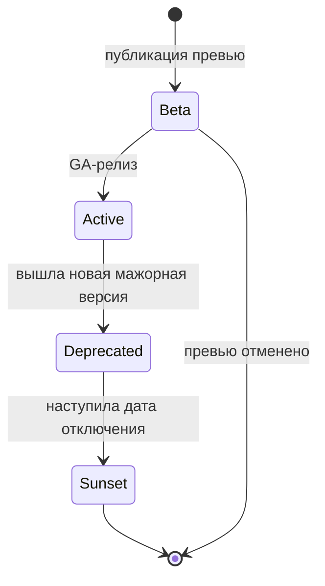

# Версионирование API

API живёт дольше, чем любая из его версий: появляются новые поля, меняются правила, уходят устаревшие операции. Версионирование — это набор правил, позволяющий **развивать API, не ломая существующих потребителей**, и честно предупреждать их, когда сломать всё-таки придётся.

Лучшая стратегия версионирования — как можно реже выпускать новую мажорную версию: большинство изменений можно сделать обратно совместимыми.

## Ломающие и неломающие изменения {#breaking-changes}

**Ломающее изменение (breaking change)** — изменение, после которого корректно написанный существующий клиент перестаёт работать или начинает работать неправильно. **Неломающее (non-breaking, backward compatible)** — изменение, которое существующие клиенты переживают без доработок.

Совместимость оценивают с двух сторон: что сервер **принимает** (запрос) и что сервер **отдаёт** (ответ). Правило простое: в запросе можно **ослаблять** требования, в ответе — **добавлять**, но не убирать.

### Таблица изменений {#changes-table}

| Изменение | Где | Ломающее? | Комментарий |
|---|---|---|---|
| Новый эндпоинт / новая операция | — | Нет | |
| Новое **необязательное** поле в запросе | Запрос | Нет | Должно иметь значение по умолчанию, сохраняющее старое поведение |
| Новое **обязательное** поле в запросе | Запрос | **Да** | Старые клиенты его не передают → `400` |
| Новый необязательный query-параметр | Запрос | Нет | |
| Новое поле в ответе | Ответ | Нет\* | \*Если клиенты — толерантные читатели. Строгая десериализация (запрет неизвестных полей) упадёт |
| Удаление поля из ответа | Ответ | **Да** | Даже если «им никто не пользуется» — проверьте |
| Переименование поля | Оба | **Да** | Это удаление + добавление. Совместимый путь: добавить новое, старое пометить `deprecated`, удалить в следующей мажорной версии |
| Смена типа поля (`number` → `string`, объект → массив) | Оба | **Да** | В т. ч. `"id": 123` → `"id": "123"` |
| Смена формата (дата `DD.MM.YYYY` → ISO 8601) | Оба | **Да** | |
| Изменение семантики поля без изменения имени | Оба | **Да** | Самый опасный случай: компилируется, но работает неверно (например, сумма стала с НДС) |
| Поле в ответе стало `nullable` / может отсутствовать | Ответ | **Да** | Клиент не ожидает `null` → NPE |
| Поле в запросе стало необязательным | Запрос | Нет | |
| Поле в ответе, ранее необязательное, стало всегда заполняться | Ответ | Нет | |
| Новое значение **enum в запросе** | Запрос | Нет | Сервер стал принимать больше |
| Новое значение **enum в ответе** | Ответ | **Потенциально да** | Клиент с `switch` без ветки `default` или строгой десериализацией enum упадёт. См. ниже |
| Удаление значения enum в запросе | Запрос | **Да** | Клиенты, отправляющие его, получат `400` |
| Ужесточение валидации (длина 255 → 100, новый regex) | Запрос | **Да** | Ранее валидные запросы отклоняются |
| Ослабление валидации (100 → 255) | Запрос | Нет\* | \*Но в ответе длинные значения могут не влезть в БД клиента — это изменение ответа |
| Увеличение максимальной длины поля в ответе | Ответ | **Потенциально да** | Колонка `VARCHAR(100)` у потребителя переполнится |
| Изменение кода успешного ответа (`200` → `201`, `200` → `202`) | Ответ | **Да** | Клиенты часто проверяют конкретный код |
| Новый код ошибки / новый бизнес-код ошибки | Ответ | **Потенциально да** | Клиент должен уметь обрабатывать неизвестные коды по классу (`4xx`/`5xx`) |
| Изменение URI ресурса | — | **Да** | Если нужно — оставьте редирект (`301`/`308`) на переходный период |
| Изменение значения по умолчанию | Запрос | **Да** | Поведение старых клиентов меняется молча |
| Изменение размера страницы по умолчанию, порядка сортировки по умолчанию | Ответ | **Да** | Клиенты, полагающиеся на порядок, сломаются |
| Новые обязательные требования к аутентификации (скоупы, mTLS) | — | **Да** | |
| Снижение лимитов запросов | — | **Да** | См. [Rate limiting](/design/rate-limiting) |
| Изменение порядка полей в JSON | Ответ | Нет | Порядок полей объекта JSON не значим. Исключение — клиенты, парсящие ответ как строку |
| Синхронная операция стала асинхронной | Ответ | **Да** | Новая модель взаимодействия, см. [Асинхронные операции](/design/async-operations) |

::: warning Новое значение enum в ответе
Формально добавление значения — расширение, но на практике оно часто ломает клиентов: строго типизированные генераторы кода (Java enum, C# enum) бросают исключение при десериализации неизвестного значения, а бизнес-логика с исчерпывающим `switch` попадает в непредусмотренную ветку. Решения:

- в контракте **явно объявить** перечисление расширяемым и требовать от клиентов обработку неизвестных значений (например, маппинг в `UNKNOWN`);
- заранее предупреждать о новых значениях через changelog;
- для критичных перечислений (статусы платежа) — считать добавление значения ломающим и согласовывать с потребителями.

Подробнее о проектировании перечислений — в [Соглашениях о данных](/design/data-conventions).
:::

::: info Закон Хайрама (Hyrum's Law)
«При достаточном количестве пользователей API любое наблюдаемое поведение системы станет кому-то нужно, независимо от того, что обещано в контракте». Порядок элементов в массиве, формат текста ошибки, время ответа — всё это рано или поздно становится неявной частью контракта.
:::

## Толерантный читатель и закон Постела {#tolerant-reader}

**Закон Постела (принцип устойчивости)**: «будь консервативен в том, что отправляешь, и либерален в том, что принимаешь». Сформулирован в спецификациях TCP/IP (RFC 761, RFC 1122).

**Толерантный читатель (Tolerant Reader)** — применение этого принципа к потребителю API (термин Мартина Фаулера):

- читай только те поля, которые тебе нужны;
- **игнорируй неизвестные поля**, не падай на них;
- не завязывайся на порядок полей и на полную структуру ответа;
- обрабатывай неизвестные значения enum и неизвестные коды ошибок «по умолчанию».

```json
// Клиент v1 ожидает:
{ "id": "42", "status": "PAID" }

// Сервер после доработки отдаёт — толерантный клиент продолжает работать:
{ "id": "42", "status": "PAID", "paidAt": "2026-10-03T10:15:00Z", "channel": "SBP" }
```

Настройки десериализаторов, которые стоит прописать в требованиях к клиенту:

| Библиотека | Что включить/выключить |
|---|---|
| Jackson (Java) | `FAIL_ON_UNKNOWN_PROPERTIES = false`; `READ_UNKNOWN_ENUM_VALUES_USING_DEFAULT_VALUE` + `@JsonEnumDefaultValue` |
| System.Text.Json (.NET) | По умолчанию неизвестные поля игнорируются; не включать `JsonUnmappedMemberHandling.Disallow` |
| Pydantic (Python) | `extra = "ignore"` (не `forbid`) для моделей ответов |
| JSON Schema для ответов | Не ставить `additionalProperties: false` на схемы, по которым валидируются ответы |

### Границы принципа {#tolerant-reader-limits}

Либеральность на стороне **сервера** опасна. RFC 9413 «Maintaining Robust Protocols» (2023) разбирает, как чрезмерная терпимость к некорректному вводу консервирует ошибки реализаций и создаёт уязвимости.

- Сервер должен **строго валидировать** запрос: неверный тип, формат даты, выход за диапазон → `400`. Тихо «исправлять» ввод нельзя.
- Неизвестные поля в **запросе**: либо игнорировать (документированно), либо отклонять. Отклонение помогает ловить опечатки (`emial` вместо `email`), игнорирование — совместимость при откатах. Решите и зафиксируйте.
- Толерантность не распространяется на **семантику**: если поле изменило смысл, никакой толерантный читатель не спасёт.

## Способы версионирования {#strategies}

::: code-group

```http [В URI]
GET /api/v2/orders/42 HTTP/1.1
Host: api.example.com
```

```http [В заголовке]
GET /api/orders/42 HTTP/1.1
Host: api.example.com
API-Version: 2
```

```http [В медиатипе]
GET /api/orders/42 HTTP/1.1
Host: api.example.com
Accept: application/vnd.example.order.v2+json
```

```http [В query]
GET /api/orders/42?api-version=2024-05-01 HTTP/1.1
Host: api.example.com
```

```http [По дате (Stripe-стиль)]
GET /v1/charges/ch_123 HTTP/1.1
Host: api.example.com
Example-Version: 2026-09-15
```

:::

| Способ | Пример | Плюсы | Минусы | Кто использует |
|---|---|---|---|---|
| **URI** | `/v1/orders` | Наглядно, просто маршрутизировать на шлюзе, видно в логах, легко тестировать браузером/curl, кэшируется без `Vary` | Версия — не часть ресурса (с точки зрения REST тот же заказ получает разные URI); вся API-версия меняется целиком | Google (AIP-185), большинство публичных API |
| **Заголовок** | `API-Version: 2` | URI стабильны; можно версионировать точечно | Не видно в URL и логах доступа; нужен `Vary: API-Version` для кэшей; сложнее отлаживать | GitHub (`X-GitHub-Api-Version`) |
| **Медиатип** | `Accept: application/vnd.example.v2+json` | «Правильно» с точки зрения REST: версионируется представление, а не ресурс; версия на уровне отдельного ресурса | Сложно для потребителей, плохая поддержка в инструментах, нужен `Vary: Accept` | Zalando (рекомендует этот способ), GitHub (исторически) |
| **Query-параметр** | `?api-version=2024-05-01` | Просто передать, видно в логах | Смешивается с параметрами фильтрации; легко забыть; кэш-ключ включает параметр | Microsoft Azure |
| **По дате** | `Stripe-Version: 2024-06-20` | Мелкие частые изменения без «больших» версий; аккаунт закрепляется на версии; сервер преобразует ответ «назад» через цепочку миграций | Сложная реализация на сервере (слой трансформаций); требует зрелой инженерии | Stripe |

::: tip Практическая рекомендация
Для интеграций между системами в большинстве случаев достаточно **мажорной версии в URI** (`/v1/`, `/v2/`) плюс обратно совместимого развития внутри версии. Минорные изменения в URI не отражаются. Если у вас API-шлюз и десятки потребителей — это самый понятный для всех вариант.
:::

### Что делать, если версия не указана

- **Версия в URI** — вопрос не возникает.
- **Заголовок/медиатип** — нужно правило по умолчанию: самая старая поддерживаемая версия (безопасно для старых клиентов) или ошибка `400` с требованием указать версию (явно). Вариант «последняя версия» опасен: выпуск новой версии молча ломает всех, кто не указал версию.
- **По дате** — версия по умолчанию закрепляется за клиентом в момент первой интеграции.

## Семантическое версионирование для API {#semver}

SemVer (`MAJOR.MINOR.PATCH`) применим к **документу контракта** (OpenAPI `info.version`), но не к адресу API:

| Часть | Когда увеличивается | Отражается в URI? |
|---|---|---|
| `MAJOR` | Ломающее изменение | Да: `/v2/` |
| `MINOR` | Обратно совместимое расширение (новые поля, эндпоинты) | Нет |
| `PATCH` | Исправления документации и ошибок без изменения контракта | Нет |

```yaml
openapi: 3.1.0
info:
  title: Orders API
  version: 2.4.1   # версия контракта; в URI — только /v2
servers:
  - url: https://api.example.com/api/v2
```

Changelog с перечнем изменений каждой минорной версии — обязательный артефакт: потребители должны узнавать о новых полях и значениях enum из него, а не из продакшна.

## Жизненный цикл версии {#lifecycle}



| Стадия | Что значит | Что делает провайдер |
|---|---|---|
| Beta / Preview | Контракт может меняться без предупреждения | Явно помечает (`/v2beta1/`), не даёт SLA |
| Active (GA) | Стабильная версия | Только совместимые изменения |
| Deprecated | Версия работает, но не развивается; назначена дата отключения | Шлёт заголовки `Deprecation`/`Sunset`, уведомляет потребителей, мониторит, кто ещё вызывает |
| Sunset | Версия отключена | Отвечает `410 Gone` (или `404`) с Problem Details и ссылкой на руководство по миграции |

### Заголовки Deprecation и Sunset {#deprecation-sunset}

- **`Deprecation`** (RFC 9745, 2025) — сообщает, что ресурс устарел (или устареет). Значение — дата в формате Structured Fields: `@` + Unix-время в секундах. Дата может быть в прошлом (уже устарел) или в будущем.
- **`Sunset`** (RFC 8594) — дата, после которой ресурс, вероятно, перестанет отвечать. Формат — HTTP-date.
- **`Link`** с отношениями `rel="deprecation"` и `rel="sunset"` — ссылки на документацию о выводе из эксплуатации и миграции.

```http
HTTP/1.1 200 OK
Content-Type: application/json
Deprecation: @1767225599
Sunset: Wed, 30 Jun 2027 23:59:59 GMT
Link: <https://developer.example.com/migrations/orders-v2>; rel="deprecation"; type="text/html"
Link: <https://developer.example.com/sunset/orders-v1>; rel="sunset"; type="text/html"

{ "id": "42", "status": "PAID" }
```

Здесь `@1767225599` — 31.12.2025 23:59:59 UTC (дата объявления устаревшим), `Sunset` — 30.06.2027.

::: warning Дата Sunset не может быть раньше даты Deprecation
RFC 9745 указывает, что дата в `Sunset` не должна (SHOULD NOT) быть раньше даты в `Deprecation`. И помните: заголовки читают только те клиенты, которые специально их логируют. Это **дополнение** к прямому уведомлению, а не замена.
:::

После отключения:

```http
HTTP/1.1 410 Gone
Content-Type: application/problem+json

{
  "type": "https://api.example.com/problems/api-version-sunset",
  "title": "Версия API отключена",
  "status": 410,
  "detail": "Версия v1 отключена 30.06.2027. Используйте /api/v2, руководство по миграции: https://developer.example.com/migrations/orders-v2"
}
```

### Политика поддержки и уведомления

Типовая политика, которую стоит согласовать и записать:

- **Срок параллельной поддержки** старой мажорной версии после выхода новой — обычно от 6 до 12 месяцев для внешних партнёров, для внутренних систем может быть короче.
- **Каналы уведомления**: рассылка контактам интеграции, changelog, портал разработчика, заголовки `Deprecation`/`Sunset`, тикеты конкретным потребителям.
- **Мониторинг использования**: кто (по `client_id`) и как часто вызывает устаревшую версию — без этих данных дату отключения не назначить.
- **Brownout-тесты**: перед окончательным отключением — кратковременные запланированные отключения, чтобы «проявить» забытых потребителей.
- **Одновременно поддерживается не более двух мажорных версий** — иначе стоимость сопровождения растёт кратно.

## Версионирование событий и схем {#events}

В асинхронном обмене ([брокеры сообщений](/protocols/messaging), [вебхуки](/protocols/webhooks)) версионирование сложнее: производитель и потребители обновляются независимо, а сообщения **хранятся** в топике и могут быть прочитаны спустя дни новой версией потребителя.

Подходы:

- **Версия в самом событии**: поле `schemaVersion` или атрибут `dataschema` в CloudEvents.
- **Версия в имени типа**: `order.created.v2`; для ломающих изменений — новый тип или новый топик (`orders.v2`), публикация в оба на переходный период.
- **Реестр схем (schema registry)** — Confluent Schema Registry, Apicurio и аналоги: схемы Avro / Protobuf / JSON Schema хранятся централизованно, каждое сообщение содержит ID схемы, а реестр **проверяет совместимость** новой версии при регистрации.

### Режимы совместимости {#compatibility-modes}

| Режим | Гарантия | Порядок обновления | Разрешено (Avro) |
|---|---|---|---|
| `BACKWARD` | Потребитель на **новой** схеме читает данные, записанные **старой** | Сначала потребители, потом производители | Удалить поле; добавить поле **со значением по умолчанию** |
| `FORWARD` | Потребитель на **старой** схеме читает данные, записанные **новой** | Сначала производители, потом потребители | Добавить поле; удалить поле, у которого было значение по умолчанию |
| `FULL` | И то, и другое | В любом порядке | Добавлять и удалять только поля со значениями по умолчанию |
| `NONE` | Проверки нет | Синхронно | Всё (опасно) |
| `*_TRANSITIVE` | Совместимость со **всеми** прежними версиями, а не только с предыдущей | — | — |

::: tip
Для событий, которые читают многие команды, выбирайте `FULL_TRANSITIVE` или хотя бы `BACKWARD_TRANSITIVE`. В Protobuf никогда не переиспользуйте номера удалённых полей — помечайте их `reserved`.
:::

## Контрактное тестирование {#contract-testing}

Совместимость лучше проверять автоматически, а не на ревью:

- **Сравнение спецификаций** (diff OpenAPI, например `oasdiff`, `openapi-diff`) в CI — пайплайн падает при ломающем изменении без повышения мажорной версии.
- **Consumer-Driven Contracts** (Pact, Spring Cloud Contract): каждый потребитель публикует, какие поля и ответы ему нужны; провайдер проверяет, что изменение не ломает ни одного потребителя.
- **Проверка совместимости схем** в schema registry при регистрации новой версии.

Подробнее — в разделе [Тестирование API](/tools/testing).

## Типичные ошибки {#mistakes}

- Новая мажорная версия на каждое изменение — потребители не успевают мигрировать, провайдер поддерживает пять версий.
- «Тихие» ломающие изменения внутри версии: переименовали поле, «никто же не пользовался».
- Изменение смысла поля без смены имени и версии.
- Строгая десериализация у клиента (`FAIL_ON_UNKNOWN_PROPERTIES = true`, `additionalProperties: false` в схеме ответа) — любое добавление поля ломает интеграцию.
- Версия по умолчанию = «последняя».
- Отключение старой версии без мониторинга, кто её ещё вызывает.
- Минорная версия в URI (`/v1.3/`) — каждый минорный релиз превращается в миграцию.
- Версионирование событий «как REST»: новое обязательное поле в событии, которое старые потребители не могут обработать, а в топике уже лежат старые сообщения.

## На что обратить внимание аналитику {#checklist}

- [ ] Выбран способ указания версии (URI / заголовок / медиатип / дата) и зафиксировано поведение при отсутствии версии.
- [ ] В спецификации есть раздел «Политика совместимости»: какие изменения провайдер считает неломающими и вносит без уведомления.
- [ ] Клиент обязан быть толерантным читателем: игнорировать неизвестные поля, обрабатывать неизвестные значения enum и коды ошибок.
- [ ] Перечисления в ответах помечены как расширяемые или закрытые.
- [ ] Ведётся changelog; у контракта есть `info.version` по SemVer.
- [ ] Описан жизненный цикл: срок поддержки старой версии, каналы уведомления, заголовки `Deprecation`/`Sunset`, ответ после отключения.
- [ ] Указаны контакты для уведомлений с обеих сторон.
- [ ] Для событий: где хранится версия схемы, режим совместимости в реестре, порядок обновления производителей и потребителей.
- [ ] В CI есть автоматическая проверка совместимости контракта.
- [ ] Для каждого ломающего изменения есть план миграции: параллельная работа версий, сроки, ответственные.

## Стандарты и ссылки {#links}

- [RFC 9745 — The Deprecation HTTP Response Header Field](https://www.rfc-editor.org/rfc/rfc9745)
- [RFC 8594 — The Sunset HTTP Header Field](https://www.rfc-editor.org/rfc/rfc8594)
- [RFC 9413 — Maintaining Robust Protocols](https://www.rfc-editor.org/rfc/rfc9413)
- [Semantic Versioning 2.0.0](https://semver.org/)
- [Martin Fowler — Tolerant Reader](https://martinfowler.com/bliki/TolerantReader.html)
- [Google AIP-180 — Backwards compatibility](https://google.aip.dev/180)
- [Google AIP-185 — API Versioning](https://google.aip.dev/185)
- [Microsoft REST API Guidelines](https://github.com/microsoft/api-guidelines)
- [Zalando RESTful API Guidelines — Compatibility](https://opensource.zalando.com/restful-api-guidelines/#compatibility)
- [Stripe — API versioning](https://docs.stripe.com/api/versioning)
- [Confluent Schema Registry — Schema Evolution and Compatibility](https://docs.confluent.io/platform/current/schema-registry/fundamentals/schema-evolution.html)
- [Pact — Consumer-Driven Contract Testing](https://docs.pact.io/)
