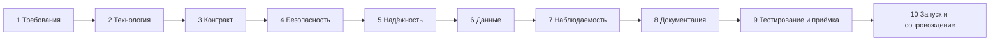

# Чек-лист интеграции

Сквозной чек-лист системного аналитика: от первой встречи с заказчиком до запуска интеграции и её вывода из эксплуатации. Идите по этапам сверху вниз и отмечайте пункты; каждый пункт ведёт на страницу справочника, где тема разобрана подробно. В конце — большой список вопросов к смежной команде или партнёру.

::: tip Как пользоваться
Не все пункты нужны для каждой интеграции: внутренний вызов между двумя микросервисами одной команды и обмен с банком-партнёром отличаются по глубине проработки на порядок. Но пробежать глазами весь список стоит всегда — пропущенный пункт обычно всплывает в самый неудобный момент, на приёмке или в первую ночь после запуска.
:::

## 1. Выявление требований {#requirements}

- [ ] **Бизнес-цель.** Зачем нужна интеграция, какую проблему решает, как поймём, что она работает (метрика успеха). Без этого невозможно расставлять приоритеты в спорных вопросах.
- [ ] **Участники.** Какие системы участвуют, кто владелец каждой (команда, подрядчик, внешний партнёр), кто принимает решения, кто отвечает за сопровождение.
- [ ] **Направление и инициатор.** Кто кого вызывает, кто источник истины (master) для каждой сущности, нужен ли обмен в обе стороны.
- [ ] **Сценарии.** Перечень бизнес-сценариев с основным и альтернативными потоками, включая ошибки и отмены. Хорошо описывать диаграммами последовательности.
- [ ] **Объёмы.** Сколько объектов/сообщений в сутки, размер одного сообщения, размер начальной загрузки (миграции исторических данных).
- [ ] **Частота и профиль нагрузки.** Равномерно или пиками (конец месяца, утро понедельника, распродажи), ожидаемый пиковый RPS, рост на горизонте 1–3 лет.
- [ ] **Требования к актуальности данных.** Нужна ли реакция в реальном времени, допустима ли задержка в минуты или достаточно раз в сутки. Это главный вход для выбора синхронного или асинхронного взаимодействия.
- [ ] **SLA.** Доступность, время ответа (в перцентилях), допустимая доля ошибок, время восстановления, окна обслуживания у каждой стороны. См. [Наблюдаемость](/reliability/observability).
- [ ] **Ограничения.** Технологии, которые умеет партнёр; сетевые ограничения (DMZ, VPN, белые списки); требования регуляторов и ИБ; бюджет; сроки; legacy-системы, которые нельзя менять.
- [ ] **Нефункциональные требования.** Безопасность, аудит, хранение истории, локализация данных, требования к журналированию.
- [ ] **Что вне рамок.** Явно зафиксировать, что интеграция **не** делает, чтобы избежать расползания требований.

## 2. Выбор технологии {#technology}

- [ ] **Стиль взаимодействия**: синхронный запрос-ответ (REST, gRPC, GraphQL, SOAP) или асинхронный (брокер сообщений, вебхуки), или файловый обмен. См. [Обзор и выбор технологии](/protocols/).
- [ ] **Протокол** выбран с учётом возможностей **обеих** сторон: [REST](/protocols/rest), [SOAP](/protocols/soap), [gRPC](/protocols/grpc), [GraphQL](/protocols/graphql), [JSON-RPC](/protocols/json-rpc), [OData](/protocols/odata).
- [ ] **Push-уведомления**, если потребителю нужно узнавать об изменениях: [Webhooks](/protocols/webhooks), [WebSocket](/protocols/websocket), [SSE и Long Polling](/protocols/sse) — или [брокер сообщений](/protocols/messaging) вместо опроса (polling).
- [ ] **Пакетные и большие объёмы**: [файловый обмен](/protocols/file-exchange) или [пакетные операции](/design/bulk) вместо миллиона одиночных вызовов.
- [ ] **Формат данных**: JSON, XML, Protobuf, Avro, CSV. См. [Форматы данных](/protocols/data-formats).
- [ ] **Интеграционный паттерн**: точка-точка, через шину или API Gateway, оркестрация или хореография. См. [Интеграционные паттерны](/reliability/integration-patterns).
- [ ] **Решение зафиксировано** с обоснованием и отброшенными альтернативами (например, в виде ADR — Architecture Decision Record).

## 3. Проектирование контракта {#contract}

- [ ] **Ресурсы и URI**: существительные во множественном числе, иерархия, идентификаторы. См. [Ресурсы и URI](/design/).
- [ ] **Методы** соответствуют семантике HTTP: `GET` — без побочных эффектов, `PUT` — полная замена, `PATCH` — частичное изменение. См. [Методы](/http/methods).
- [ ] **Коды ответов** для каждой операции: успешные и все ожидаемые ошибки. См. [Коды состояния](/http/status-codes).
- [ ] **Форматы и медиатипы**: `Content-Type`, `Accept`, кодировка (UTF-8), сжатие. См. [Медиатипы и согласование](/http/content-negotiation).
- [ ] **Модель данных**: поля, типы, обязательность, допустимость `null`, ограничения (длины, диапазоны, регулярные выражения), enum и правила их расширения.
- [ ] **Формат ошибок** единый для всех операций (Problem Details, RFC 9457), перечень бизнес-кодов ошибок. См. [Ошибки](/design/errors).
- [ ] **Пагинация** для всех списков: offset или cursor, размер страницы по умолчанию и максимальный. См. [Пагинация](/design/pagination).
- [ ] **Фильтрация и сортировка**: какие поля, какие операторы. См. [Фильтрация и сортировка](/design/filtering).
- [ ] **Версионирование**: где указывается версия, что считается ломающим изменением, политика поддержки старых версий и уведомления о выводе (`Deprecation`, `Sunset`). См. [Версионирование](/design/versioning).
- [ ] **Идемпотентность** создающих и платёжных операций: `Idempotency-Key`, срок хранения ключей, поведение при повторе с другим телом. См. [Идемпотентность](/design/idempotency).
- [ ] **Конкурентный доступ**: optimistic locking через `ETag` / `If-Match`. См. [Конкурентный доступ](/design/concurrency).
- [ ] **Длительные операции**: `202 Accepted` + ресурс статуса или callback. См. [Асинхронные операции](/design/async-operations).
- [ ] **Пакетные операции** и частичный успех. См. [Пакетные операции](/design/bulk).
- [ ] **Кэширование**: что можно кэшировать, `Cache-Control`, `ETag`. См. [Кэширование](/design/caching).
- [ ] **Лимиты**: rate limit, максимальный размер тела, максимальный размер пакета. См. [Rate limiting](/design/rate-limiting).
- [ ] **Обратная совместимость**: потребитель игнорирует неизвестные поля (tolerant reader), поставщик не удаляет и не переименовывает поля без новой версии.

## 4. Безопасность {#security}

- [ ] **Аутентификация** выбрана и согласована: OAuth 2.0 Client Credentials, mTLS, API-ключ, подпись запросов. См. [Аутентификация](/security/authentication) и [OAuth 2.0 и OpenID Connect](/security/oauth2).
- [ ] **Авторизация**: scope и роли, доступ только к «своим» объектам (защита от BOLA) — проверяется на каждом запросе. См. [OWASP API Top 10](/security/owasp-api).
- [ ] **Транспорт**: только TLS 1.2+, проверка сертификатов, при необходимости mTLS; кто выпускает сертификаты, срок действия, процедура ротации. См. [TLS и mTLS](/security/tls).
- [ ] **Токены**: срок жизни, обновление, проверка подписи (JWKS), хранение секретов (vault, а не конфиг в git). См. [JWT](/security/jwt).
- [ ] **Вебхуки и входящие вызовы от партнёра**: подпись (HMAC), защита от повторного воспроизведения (timestamp), белые списки IP.
- [ ] **CORS**, если API вызывается из браузера. См. [CORS](/security/cors).
- [ ] **Минимизация данных**: передаём только то, что нужно потребителю; персональные данные — только с правовым основанием.
- [ ] **Что не пишем в логи**: токены, пароли, номера карт, персональные данные — маскирование.
- [ ] **Согласование с ИБ** пройдено, интеграция внесена в реестр (если такой есть). Пройдён [чек-лист безопасности](/security/best-practices).

## 5. Надёжность {#reliability}

- [ ] **Таймауты** заданы на каждом вызове (соединение и общий), согласованы по цепочке: таймаут вызывающего больше таймаута вызываемого с учётом повторов. См. [Таймауты и повторы](/reliability/timeouts-retries).
- [ ] **Повторы**: какие ошибки повторяем (сетевые, [429](/http/status-codes#429), [503](/http/status-codes#503)), сколько раз, с экспоненциальной задержкой и jitter, учёт `Retry-After`. Повторяем только идемпотентные операции.
- [ ] **Дубли**: как получатель распознаёт повторно пришедший запрос или сообщение (ключ идемпотентности, уникальный ID сообщения, дедупликация).
- [ ] **Порядок**: важен ли порядок обработки событий; если да — как он гарантируется (партиционирование по ключу, номер версии объекта) и что делать с событием «из прошлого».
- [ ] **Гарантия доставки**: at-most-once, at-least-once, effectively-once; как избегаем потери сообщения при сбое между записью в БД и отправкой (паттерн Outbox). См. [Интеграционные паттерны](/reliability/integration-patterns).
- [ ] **Недоступность партнёра**: что делает наша система — очередь на повтор, деградация функциональности, ручная обработка. Сколько времени можем копить данные.
- [ ] **Недоступность нашей системы**: что делает партнёр, как догоняем пропущенное (повторная отправка, сверка, запрос изменений за период).
- [ ] **Паттерны устойчивости**: circuit breaker, bulkhead, fallback, ограничение конкурентности. См. [Паттерны устойчивости](/reliability/resilience-patterns).
- [ ] **«Ядовитые» сообщения**: что делаем с сообщением, которое не удаётся обработать (DLQ, алерт, ручной разбор).
- [ ] **Распределённые транзакции**: если бизнес-операция затрагивает несколько систем — сага с компенсирующими действиями, а не попытка двухфазного коммита.
- [ ] **Сверка (reconciliation)**: регулярная проверка, что данные в системах совпадают, и процедура исправления расхождений.

## 6. Данные {#data}

- [ ] **Маппинг полей** между системами: таблица «поле источника — преобразование — поле получателя», включая значения по умолчанию и поведение при отсутствии значения.
- [ ] **Справочники (НСИ)**: чьи коды используются, как синхронизируются справочники, что делать с неизвестным кодом.
- [ ] **Идентификаторы**: чей ID главный, храним ли внешний ID у себя, формат (UUID, строка, число).
- [ ] **Даты и время**: ISO 8601, всегда с часовым поясом или в UTC; даты без времени — отдельный тип. См. [Соглашения о данных](/design/data-conventions).
- [ ] **Деньги**: сумма строкой или в минимальных единицах (копейках), а не float; валюта ISO 4217; правила округления.
- [ ] **Null, пустая строка и отсутствие поля** — различаются ли и что означают (особенно в `PATCH`).
- [ ] **Enum**: полный перечень значений, что делает потребитель с новым, неизвестным значением.
- [ ] **Кодировки и спецсимволы**: UTF-8, кириллица, эмодзи, ограничения длины в символах или байтах.
- [ ] **Персональные данные**: какие ПДн передаются, правовое основание, срок хранения, обезличивание на тестовых стендах, требования к локализации.
- [ ] **Начальная загрузка и миграция**: как переносим существующие данные, в каком порядке, как сверяем.
- [ ] **Хранение и удаление**: сколько храним переданные данные, как обрабатываем запрос на удаление.

## 7. Наблюдаемость {#observability}

- [ ] **Сквозной идентификатор** запроса (correlation ID, `X-Request-ID` или W3C `traceparent`) передаётся между системами и пишется в логи обеих сторон.
- [ ] **Логи**: что логируем на входе и выходе (метод, путь, статус, время, ID), без секретов и лишних ПДн; где искать и кто имеет доступ.
- [ ] **Метрики**: количество запросов, доля ошибок, латентность в перцентилях, длина очередей и отставание потребителей (lag).
- [ ] **Трассировка** распределённых вызовов, если есть цепочка из нескольких систем.
- [ ] **Алерты**: пороги, кому приходят, что делать при срабатывании (ссылка на инструкцию).
- [ ] **Бизнес-мониторинг**: не только «API отвечает 200», но и «заказы доходят до склада» — количество обработанных объектов, зависшие статусы, расхождения сверки.
- [ ] **Health check** эндпоинты для мониторинга и балансировщиков.

Подробнее — [Наблюдаемость](/reliability/observability).

## 8. Документирование {#documentation}

- [ ] **Спецификация API** в машиночитаемом виде: [OpenAPI](/specs/openapi) для REST, [AsyncAPI](/specs/asyncapi) для событий и брокеров, WSDL/XSD для SOAP, `.proto` для gRPC.
- [ ] **Примеры** запросов и ответов для каждого сценария, включая ошибки.
- [ ] **Описание интеграции** по [шаблону](/specs/integration-template): цель, участники, схема взаимодействия, сценарии, маппинг, нефункциональные требования, контакты.
- [ ] **Диаграммы**: контекст (какие системы), последовательности для основных и аварийных сценариев, состояния объектов.
- [ ] **Коллекция запросов** (Postman, Bruno, `.http`) для ручной проверки — желательно в git рядом со спецификацией. См. [Обзор инструментов](/tools/).
- [ ] **Спецификация проверена линтером** (Spectral) и прошла ревью у обеих сторон.
- [ ] **Версия спецификации** согласована и зафиксирована; есть журнал изменений (changelog).
- [ ] **Документация для эксплуатации**: инструкция по разбору типовых инцидентов (runbook).

## 9. Тестирование и приёмка {#testing}

- [ ] **Тестовые контуры** обеих сторон определены, связность и доступы настроены.
- [ ] **Тестовые данные** подготовлены, ПДн обезличены.
- [ ] **Заглушки** внешних систем для ранней разработки и автотестов (Prism, WireMock).
- [ ] **Тест-кейсы** покрывают позитивные, негативные и граничные сценарии, права доступа, идемпотентность, таймауты и недоступность. См. [Тестирование API](/tools/testing).
- [ ] **Контрактные тесты** или валидация по OpenAPI включены в CI.
- [ ] **Нагрузочное тестирование** проведено на согласованном профиле, если есть требования к производительности.
- [ ] **Тестирование безопасности**: доступ к чужим объектам, работа с истёкшими и поддельными токенами.
- [ ] **Приёмо-сдаточные испытания** с партнёром: программа и методика, протокол, акт.

## 10. Запуск и сопровождение {#launch}

- [ ] **Боевые доступы**: учётные данные, сертификаты, белые списки IP, сетевые доступы на production — заказаны заранее (это может занимать недели).
- [ ] **План запуска**: дата и окно, порядок включения, feature flag или постепенное включение (сначала часть трафика или клиентов), критерии успеха.
- [ ] **План отката**: что делаем, если пошло не так; можно ли откатить данные; кто принимает решение.
- [ ] **Мониторинг и алерты** включены до запуска, а не после первого инцидента.
- [ ] **Контакты**: ответственные и дежурные обеих сторон (имя, телефон, почта, канал в мессенджере), время работы поддержки, эскалация.
- [ ] **Регламент инцидентов**: как сообщаем о проблеме, в какие сроки реагируем, что передаём для разбора (время, correlation ID, запрос и ответ без секретов), кто уведомляет бизнес.
- [ ] **Регламент изменений**: как и за сколько времени уведомляем друг друга о новых версиях, плановых работах, смене сертификатов и ключей.
- [ ] **Ротация секретов и сертификатов**: сроки истечения занесены в календарь или мониторинг, процедура замены без простоя проверена.
- [ ] **Сопровождение передано**: команда эксплуатации знает, что интеграция существует, есть runbook и доступы к логам.
- [ ] **Пост-запусковая проверка**: через день, неделю, месяц — сверка объёмов и ошибок с ожиданиями.
- [ ] **Вывод из эксплуатации** (когда придёт время): уведомление потребителей заранее, заголовки `Deprecation` и `Sunset`, мониторинг оставшихся вызовов старой версии, отключение доступов и удаление учётных записей, архивирование документации. См. [Версионирование](/design/versioning).

## Вопросы смежной команде или партнёру {#questions}

Список для первых встреч и переписки. Ответы фиксируйте письменно — в протоколе встречи или прямо в описании интеграции.

### Общие и организационные

1. Кто владелец системы с вашей стороны, кто принимает решения по интеграции, кто технический контакт?
2. Есть ли у вас готовый API для этой задачи, или его нужно разрабатывать? Если разрабатывать — когда будет готов?
3. Есть ли документация: OpenAPI / WSDL / AsyncAPI, примеры, коллекция Postman? Насколько она актуальна?
4. Есть ли другие клиенты этого API? Можно ли посмотреть, как они интегрировались?
5. Какие у вас релизный цикл и окна обслуживания? Как вы уведомляете клиентов об изменениях и плановых работах?
6. Каковы сроки: когда будет тестовый контур, когда планируется приёмка, когда запуск?
7. Нужны ли договорные документы: соглашение об обмене данными, NDA, поручение на обработку ПДн?

### Функциональность

8. Какие операции поддерживаются? Что из нужного нам не поддерживается и есть ли это в планах?
9. Кто источник истины для каждой сущности? Что делать, если данные разошлись?
10. Какой жизненный цикл у объекта, какие статусы и переходы возможны?
11. Как узнать об изменениях на вашей стороне: вебхуки, события в брокере, опрос, выгрузка изменений за период?
12. Есть ли пакетные операции? Какой максимальный размер пакета? Как сообщается о частичном успехе?
13. Есть ли длительные операции? Как узнать их результат?
14. Как работают пагинация, фильтрация и сортировка? Какой максимальный размер страницы?
15. Есть ли тестовый режим (sandbox) с предсказуемыми ответами?

### Контракт и данные

16. Какие поля обязательные? Различаете ли вы `null`, пустую строку и отсутствие поля?
17. Какие форматы дат и в каком часовом поясе? Как передаются суммы и валюта?
18. Какие справочники используются, чьи коды? Как получить актуальный справочник и узнать о его изменениях?
19. Что вы делаете с неизвестными полями во входящем запросе — игнорируете или отклоняете?
20. Как вы будете добавлять новые значения в enum и новые поля? Это считается ломающим изменением?
21. Какие ограничения на длину строк, размер тела, количество элементов в массивах?
22. Какая кодировка? Поддерживается ли кириллица во всех полях?
23. Какой формат ошибок? Есть ли перечень бизнес-кодов ошибок с описанием, что делать клиенту в каждом случае?
24. Какие персональные данные будут передаваться? Где они хранятся (локализация)?

### Версионирование и изменения

25. Как версионируется API? Сколько времени поддерживается старая версия после выхода новой?
26. Как и за сколько времени вы уведомляете о ломающих изменениях?
27. Есть ли changelog?

### Безопасность

28. Какой способ аутентификации: OAuth 2.0 (какой grant type), mTLS, API-ключ, подпись?
29. Как получить учётные данные для теста и для прода? Сколько это занимает времени и какие нужны документы?
30. Какой срок жизни токена? Есть ли refresh token? Как получить ключи для проверки подписи (JWKS)?
31. Кто выпускает сертификаты для mTLS, на какой срок, как проходит ротация?
32. Нужно ли добавлять наши IP в белый список? Какие IP у вас, если вы вызываете нас (вебхуки)?
33. Как подписываются вебхуки и как проверить подпись?
34. Какие scope и роли нужны для наших операций? Как ограничивается доступ к данным только «наших» клиентов?

### Надёжность и производительность

35. Какой SLA по доступности и времени ответа? Как он измеряется?
36. Какие rate limit? Как сообщается о превышении (`429`, `Retry-After`, заголовки лимитов)?
37. Какой таймаут вы рекомендуете на вызов? Сколько в худшем случае может выполняться операция?
38. Какие операции идемпотентны? Поддерживается ли `Idempotency-Key`? Сколько хранятся ключи?
39. Какие ошибки можно повторять, а какие нет? Какую политику повторов вы ожидаете от клиента?
40. Какие гарантии доставки у ваших событий и вебхуков: могут ли прийти дубли, нарушен порядок? Сколько раз и как долго вы повторяете доставку вебхука?
41. Что происходит, если наша система недоступна, когда вы отправляете нам данные? И наоборот?
42. Какую нагрузку вы готовы принять? Можно ли проводить у вас нагрузочное тестирование и на каком контуре?
43. Есть ли способ сверки данных или выгрузки за период для восстановления после сбоя?

### Тестирование и запуск

44. Какие контуры у вас есть (test, preprod)? Насколько они стабильны и близки к продовому?
45. Есть ли тестовые данные или их нужно создавать? Как их сбрасывать?
46. Кто и как проводит приёмку? Нужна ли формальная программа испытаний и акт?
47. Можно ли запустить постепенно: на части клиентов или с ограниченным трафиком?

### Эксплуатация

48. Как сообщать об инциденте: канал, время реакции, режим работы поддержки (24/7 или рабочие часы)?
49. Какие данные нужны вам для разбора проблемы: correlation ID, время, тело запроса?
50. Передаёте ли вы и логируете ли correlation ID / `X-Request-ID`? Можете ли найти запрос по нашему ID?
51. Есть ли у вас статус-страница или рассылка о сбоях?
52. Кто дежурный контакт на время запуска?
53. Как будет происходить вывод интеграции или версии API из эксплуатации?

::: tip Протокол — ваш лучший друг
Каждая устная договорённость («да, поле всегда заполнено», «дубли не придут») через полгода превращается в спор. Отправляйте короткий протокол после встречи и вносите договорённости в описание интеграции по [шаблону](/specs/integration-template).
:::
