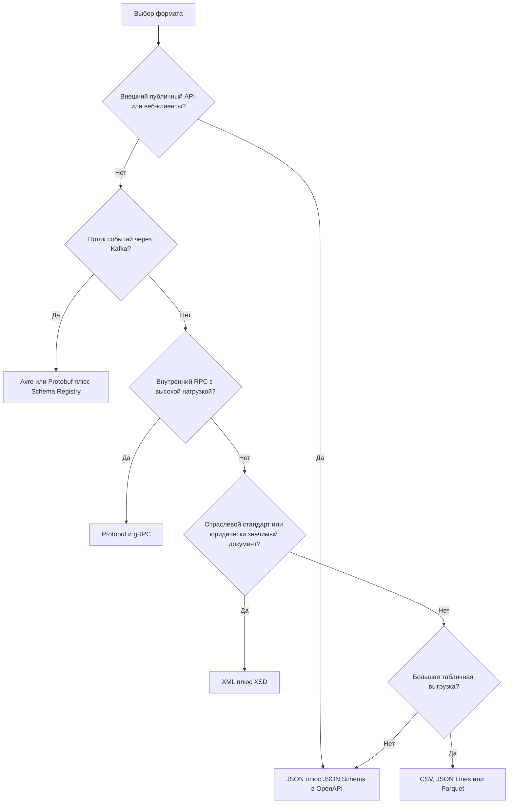

# Форматы данных

Формат сериализации определяет, как данные превращаются в байты для передачи между системами: JSON, XML, Protobuf, Avro и другие. От выбора зависят размер сообщений, скорость, строгость контракта и то, насколько безболезненно можно менять структуру. На странице — практическая справка по основным форматам, их подводным камням, схемам, кодировкам, Base64 и `multipart/form-data`. Правила представления конкретных значений (даты, деньги, идентификаторы, null, enum) — в [Соглашениях о данных](/design/data-conventions), согласование формата в HTTP — в [Медиатипах и согласовании](/http/content-negotiation).

## Сравнение форматов {#comparison}

| Формат | Тип | Человеко­читаемость | Размер | Схема | Скорость | Эволюция схемы | Типичное применение |
|---|---|---|---|---|---|---|---|
| JSON | Текст | Высокая | Средний | Опционально (JSON Schema) | Средняя | Гибкая, но без контроля | REST API, webhooks, конфиги |
| XML | Текст | Средняя | Большой | Опционально (XSD), часто обязательна | Низкая | Через версии XSD и namespaces | SOAP, банки, госорганы, документы |
| YAML | Текст | Очень высокая | Средний | Опционально | Низкая | — | Конфигурации, OpenAPI, CI/CD |
| CSV | Текст | Высокая (табличная) | Малый | Нет (только договорённость) | Высокая | Хрупкая | Табличные выгрузки, файловый обмен |
| JSON Lines | Текст | Высокая | Средний | Опционально | Высокая (потоково) | Как JSON | Большие выгрузки, логи, стриминг |
| Protocol Buffers | Бинарный | Нет | Малый | **Обязательна** (`.proto`) | Очень высокая | Хорошая (номера полей) | gRPC, внутренние сервисы |
| Avro | Бинарный | Нет | Очень малый | **Обязательна** (JSON-схема) | Высокая | Отличная (разрешение схем) | Kafka, Hadoop, data lake |
| MessagePack | Бинарный | Нет | Малый | Нет | Высокая | Как JSON | Кэши, RPC, игры, замена JSON |
| CBOR | Бинарный | Нет | Малый | Опционально (CDDL) | Высокая | Как JSON | IoT, CoAP, WebAuthn, COSE |
| Parquet | Бинарный колоночный | Нет | Очень малый (сжатие) | Встроена | Высокая для аналитики | Добавление колонок | DWH, data lake, аналитика |



## JSON {#json}

JSON (JavaScript Object Notation) — текстовый формат, стандартизованный в RFC 8259 и ECMA-404. Де-факто стандарт для REST API. Медиатип — `application/json`.

| Тип JSON | Пример | Комментарий |
|---|---|---|
| object | `{"id": 42}` | Неупорядоченный набор пар «имя — значение». Порядок ключей не гарантируется и не должен иметь значения |
| array | `[1, 2, 3]` | Упорядоченный список |
| string | `"Привет\n"` | Unicode, экранирование `\"`, `\\`, `\n`, `\uXXXX` |
| number | `1500.5`, `-1e10` | Один тип для целых и дробных. Нет `NaN`, `Infinity`, ведущих нулей |
| boolean | `true`, `false` | |
| null | `null` | Отсутствие значения. Отличать от отсутствия поля — см. [Соглашения о данных](/design/data-conventions) |

Чего в JSON **нет**: дат, денег/десятичных чисел, бинарных данных, комментариев, ссылок, целых чисел отдельно от дробных. Всё это решается соглашениями.

### Проблема больших чисел и точности {#json-numbers}

Стандарт не ограничивает размер и точность чисел, но большинство парсеров (JavaScript — всегда) читают число как IEEE 754 double: целые точны только до 2^53 − 1 = `9007199254740991`.

```json
{
  "id": 1234567890123456789,
  "amount": 0.1
}
```

- В JavaScript `id` превратится в `1234567890123456800` — идентификатор испорчен **молча**. Так бывает с id из Twitter/X, Snowflake-подобными id, номерами счетов.
- `0.1 + 0.2 = 0.30000000000000004` — деньги в double теряют копейки при арифметике.

Решение (так же рекомендует I-JSON, RFC 7493):

```json
{
  "id": "1234567890123456789",
  "amount": "1500.10",
  "currency": "RUB",
  "amountMinor": 150010
}
```

- 64-битные идентификаторы — **строкой**.
- Деньги — строкой с десятичной записью или целым числом в минимальных единицах (копейках) + код валюты. Подробнее — [Соглашения о данных](/design/data-conventions).

### Даты не стандартизованы {#json-dates}

В JSON нет типа даты, и одна и та же дата может прийти в десятке форматов: `"2026-10-03T09:15:27Z"`, `"03.10.2026"`, `1759482927` (секунды Unix), `1759482927000` (миллисекунды), `"/Date(1759482927000)/"` (старый .NET). Правило: **RFC 3339** (профиль ISO 8601) с часовым поясом для момента времени и `YYYY-MM-DD` для календарной даты — и явно в контракте.

### Другие подводные камни JSON

- **Дублирующиеся ключи** допустимы синтаксически, но поведение не определено: один парсер возьмёт первое значение, другой — последнее. Это используется в атаках на расхождение парсеров. Отправитель не должен их порождать, получатель лучше отвергать.
- **Кодировка**: для обмена между системами JSON обязан быть в **UTF-8** (RFC 8259); отправитель не должен добавлять BOM.
- **Символы вне BMP** (эмодзи) в экранированном виде записываются суррогатной парой: `"😀"`.
- **Отсутствующее поле vs `null` vs пустая строка** — три разных состояния; для `PATCH` это критично.
- **Глубина вложенности и размер** — ограничивайте на входе (защита от DoS).
- **Неизвестные поля** — получатель должен их игнорировать (tolerant reader), иначе любое добавление поля ломает интеграцию. См. [Версионирование](/design/versioning).

## JSON Schema {#json-schema}

JSON Schema — словарь для описания и валидации структуры JSON-документов. Актуальная версия — **2020-12**; на ней основаны схемы в OpenAPI 3.1 (в OpenAPI 3.0 — расширенное подмножество более старой версии). См. [OpenAPI](/specs/openapi).

```json
{
  "$schema": "https://json-schema.org/draft/2020-12/schema",
  "$id": "https://api.example.com/schemas/order.json",
  "title": "Order",
  "type": "object",
  "required": ["id", "status", "total", "createdAt"],
  "additionalProperties": false,
  "properties": {
    "id": { "type": "string", "pattern": "^ORD-[0-9]+$" },
    "status": { "type": "string", "enum": ["new", "paid", "shipped", "cancelled"] },
    "total": { "$ref": "#/$defs/money" },
    "comment": { "type": ["string", "null"], "maxLength": 500 },
    "items": {
      "type": "array",
      "minItems": 1,
      "items": {
        "type": "object",
        "required": ["sku", "qty"],
        "properties": {
          "sku": { "type": "string" },
          "qty": { "type": "integer", "minimum": 1 }
        }
      }
    },
    "createdAt": { "type": "string", "format": "date-time" }
  },
  "$defs": {
    "money": {
      "type": "object",
      "required": ["amount", "currency"],
      "properties": {
        "amount": { "type": "string", "pattern": "^-?[0-9]+(\\.[0-9]{1,2})?$" },
        "currency": { "type": "string", "pattern": "^[A-Z]{3}$" }
      }
    }
  }
}
```

| Ключевое слово | Назначение |
|---|---|
| `type` | Тип: `object`, `array`, `string`, `number`, `integer`, `boolean`, `null` (можно список) |
| `properties`, `required` | Поля объекта и обязательные из них |
| `additionalProperties` | Разрешены ли поля, не описанные в `properties` |
| `enum`, `const` | Допустимые значения |
| `minLength`, `maxLength`, `pattern` | Ограничения строк |
| `minimum`, `maximum`, `multipleOf` | Ограничения чисел |
| `minItems`, `maxItems`, `uniqueItems`, `items` | Ограничения массивов |
| `format` | Семантический формат: `date-time`, `date`, `email`, `uuid`, `uri` |
| `$ref`, `$defs` | Ссылки и переиспользуемые определения |
| `oneOf`, `anyOf`, `allOf`, `not` | Композиция схем, полиморфизм |

::: warning Подводные камни валидации
- **`format` по умолчанию не проверяется.** В 2019-09 и 2020-12 `format` — аннотация; валидатор проверяет его, только если это явно включено в настройках. Если формат важен — включите проверку или продублируйте `pattern`.
- **`additionalProperties: false` во входящих данных получателя** делает его хрупким: новое поле у отправителя — и валидация падает. Для ответов, которые вы получаете от чужой системы, обычно лучше разрешать дополнительные поля. Для запросов к вашему API строгая схема наоборот полезна.
- `oneOf` требует, чтобы подошла **ровно одна** ветка — при пересекающихся схемах валидация неожиданно падает; часто нужен `anyOf` или дискриминатор.
:::

Валидировать имеет смысл на границе системы: входящие запросы, ответы внешних систем в тестах (контрактное тестирование), сообщения из брокера. См. [Тестирование API](/tools/testing).

## XML, XSD и namespaces {#xml}

XML (W3C XML 1.0) — текстовый язык разметки: элементы, атрибуты, иерархия. Основа SOAP, многих банковских, государственных и отраслевых стандартов (ISO 20022, ФНС, ЕГАИС, UBL). Медиатипы — `application/xml`, `text/xml`, суффикс `+xml`.

```xml
<?xml version="1.0" encoding="UTF-8"?>
<ord:Order xmlns:ord="urn:example:orders:v2"
           xmlns:cmn="urn:example:common:v1"
           id="ORD-42">
  <ord:Status>paid</ord:Status>
  <ord:Total currency="RUB">1500.00</ord:Total>
  <ord:Customer>
    <cmn:Inn>7707083893</cmn:Inn>
    <cmn:Name>ООО &quot;Ромашка&quot;</cmn:Name>
  </ord:Customer>
  <ord:CreatedAt>2026-10-03T09:15:27Z</ord:CreatedAt>
</ord:Order>
```

**Пространства имён (namespaces)** различают элементы с одинаковыми именами из разных словарей. Важно: значим **URI пространства**, а не префикс. `ord:Order` и `x:Order` с тем же URI — один и тот же элемент. Частая ошибка интеграторов — парсинг по префиксу или вообще без учёта namespace. Смена URI namespace (например, `v1` → `v2`) — ломающее изменение.

**XSD (XML Schema Definition)** — строгая схема: типы, обязательность, кратность, ограничения, перечисления:

```xml
<xs:schema xmlns:xs="http://www.w3.org/2001/XMLSchema"
           targetNamespace="urn:example:orders:v2"
           xmlns:ord="urn:example:orders:v2"
           elementFormDefault="qualified">
  <xs:element name="Order">
    <xs:complexType>
      <xs:sequence>
        <xs:element name="Status" type="ord:StatusType"/>
        <xs:element name="Total" type="ord:MoneyType"/>
        <xs:element name="Comment" type="xs:string" minOccurs="0"/>
        <xs:element name="CreatedAt" type="xs:dateTime"/>
      </xs:sequence>
      <xs:attribute name="id" type="xs:string" use="required"/>
    </xs:complexType>
  </xs:element>
  <xs:simpleType name="StatusType">
    <xs:restriction base="xs:string">
      <xs:enumeration value="new"/>
      <xs:enumeration value="paid"/>
      <xs:enumeration value="shipped"/>
    </xs:restriction>
  </xs:simpleType>
  <xs:complexType name="MoneyType">
    <xs:simpleContent>
      <xs:extension base="xs:decimal">
        <xs:attribute name="currency" type="xs:string" use="required"/>
      </xs:extension>
    </xs:simpleContent>
  </xs:complexType>
</xs:schema>
```

Особенности XML для аналитика:

- Есть `xs:decimal`, `xs:date`, `xs:dateTime` — типы чисел и дат строже, чем в JSON.
- `xs:sequence` задаёт **порядок элементов** — в отличие от JSON, порядок важен.
- Атрибут или элемент — проектное решение; атрибуты не могут быть повторяющимися и вложенными.
- Пустое значение: пустой элемент, отсутствие элемента или `xsi:nil="true"` — три разных состояния.
- Кодировка указывается в декларации (`encoding="windows-1251"` встречается в легаси) и должна совпадать с фактической.
- **Безопасность**: XXE (XML External Entity) и «billion laughs» — парсер должен работать с отключёнными внешними сущностями и DTD. См. [OWASP API Top 10](/security/owasp-api).
- Подпись XML (XMLDSig) чувствительна к любым изменениям форматирования — используется канонизация (C14N).
- Подробнее про XML в веб-сервисах — [SOAP](/protocols/soap).

## Protocol Buffers {#protobuf}

Protocol Buffers (Protobuf) — бинарный формат Google со строгой схемой в файле `.proto`. Основа [gRPC](/protocols/grpc). Из схемы генерируется код на большинстве языков.

```protobuf
syntax = "proto3";

package example.orders.v1;

import "google/protobuf/timestamp.proto";

message Order {
  string id = 1;
  OrderStatus status = 2;
  Money total = 3;
  optional string comment = 4;
  repeated OrderItem items = 5;
  google.protobuf.Timestamp created_at = 6;

  reserved 7;              // поле удалено, номер нельзя переиспользовать
  reserved "discount";
}

message Money {
  string currency_code = 1; // ISO 4217
  int64 units = 2;
  int32 nanos = 3;
}

message OrderItem {
  string sku = 1;
  int32 qty = 2;
}

enum OrderStatus {
  ORDER_STATUS_UNSPECIFIED = 0;
  ORDER_STATUS_NEW = 1;
  ORDER_STATUS_PAID = 2;
  ORDER_STATUS_SHIPPED = 3;
}
```

Как это работает: в бинарном виде передаются не имена полей, а их **номера** и значения. Отсюда компактность и правила эволюции:

| Изменение | Безопасно? |
|---|---|
| Добавить новое поле с новым номером | Да — старые клиенты пропустят неизвестное поле |
| Удалить поле, пометив номер и имя `reserved` | Да |
| Переименовать поле | Да для бинарного формата (имя не передаётся), **нет** для JSON-представления |
| Изменить номер поля | **Нет** — данные перепутаются |
| Переиспользовать номер удалённого поля | **Нет** — старые данные прочитаются как новое поле |
| Изменить тип поля | Как правило, нет (кроме ограниченного набора совместимых типов) |

Особенности proto3:

- У скалярных полей нет «отсутствия»: `0`, `""`, `false` — значения по умолчанию, которые не передаются, и получатель не отличит «0» от «не задано». Для различения — `optional` или обёртки (`google.protobuf.Int32Value`).
- У enum первое значение должно быть `0` — принято делать его `..._UNSPECIFIED`.
- Есть каноническое JSON-представление (имена полей в lowerCamelCase, `int64` — строкой).
- Медиатипы на практике: `application/x-protobuf` или `application/protobuf`.
- Новый механизм «editions» (начиная с Edition 2023) постепенно заменяет `syntax = "proto2"`/`"proto3"`.

## Apache Avro {#avro}

Avro — бинарный формат из экосистемы Hadoop, стандарт де-факто для Kafka вместе со Schema Registry. Схема описывается в JSON:

```json
{
  "type": "record",
  "name": "OrderCreated",
  "namespace": "com.example.orders",
  "fields": [
    { "name": "orderId", "type": "string" },
    { "name": "customerId", "type": "string" },
    { "name": "amount", "type": { "type": "bytes", "logicalType": "decimal", "precision": 18, "scale": 2 } },
    { "name": "currency", "type": "string", "default": "RUB" },
    { "name": "comment", "type": ["null", "string"], "default": null },
    { "name": "createdAt", "type": { "type": "long", "logicalType": "timestamp-millis" } }
  ]
}
```

Чем Avro отличается от Protobuf:

- В данных **нет ни имён, ни номеров полей** — только значения подряд. Поэтому сообщения очень компактны, но **прочитать их без схемы записи невозможно**. Схема передаётся вместе с файлом (Object Container File) или по идентификатору через Schema Registry (см. [Брокеры сообщений](/protocols/messaging)).
- **Разрешение схем (schema resolution)**: получатель читает данные, имея схему писателя (writer schema) и свою (reader schema); поля сопоставляются по имени, отсутствующие заполняются значениями `default`. Отсюда правило: **новые поля — только со значением по умолчанию**.
- Необязательное поле — union с `null`: `["null", "string"]` и `"default": null`.
- Логические типы: `decimal`, `date`, `timestamp-millis`, `timestamp-micros`, `uuid` — точные деньги и даты без договорённостей «на словах».

## MessagePack и CBOR {#msgpack-cbor}

Оба — **бинарные аналоги JSON**: та же модель данных (объекты, массивы, строки, числа, булевы, null), но компактнее и быстрее разбор, плюс бинарные строки без Base64. Схема не нужна.

| | MessagePack | CBOR |
|---|---|---|
| Стандарт | Спецификация msgpack.org | RFC 8949 (IETF) |
| Расширения | Extension types (в том числе timestamp) | Tags: даты, большие числа, decimal, URI и др. |
| Схема | Нет | Опционально — язык CDDL (RFC 8610) |
| Где применяется | Redis-клиенты, RPC, игры, Fluentd | IoT (CoAP), WebAuthn/FIDO2, COSE, мобильные удостоверения |
| Медиатип | Часто `application/msgpack` или `application/x-msgpack` | `application/cbor` |

Выбирать их стоит, когда JSON-модель устраивает, но нужно меньше байт и CPU, а заводить схемы (Protobuf/Avro) не хочется. Для публичных API почти не используются.

## YAML {#yaml}

YAML — человекочитаемый формат на отступах, надмножество JSON (в версии 1.2). Медиатип — `application/yaml` (RFC 9512). Основное применение — **конфигурации и спецификации**: OpenAPI, AsyncAPI, Kubernetes, CI/CD. Для обмена данными между системами используется редко.

```yaml
order:
  id: ORD-42
  status: paid
  postalCode: "01234"   # без кавычек станет числом 1234 или восьмеричным
  country: "NO"         # в YAML 1.1 NO без кавычек — это false
  version: "1.10"       # без кавычек — число 1.1
```

Подводные камни: неявная типизация (знаменитая «проблема Норвегии» — `NO` превращается в `false` в парсерах YAML 1.1), значимость отступов, табуляция запрещена в отступах, небезопасная загрузка (`yaml.load` в Python без `SafeLoader` может создавать произвольные объекты). Правило: строковые значения, похожие на числа, даты или булевы, — в кавычках.

## CSV {#csv}

CSV (comma-separated values) — табличный текстовый формат; базовые правила и медиатип `text/csv` описаны в RFC 4180: записи разделены CRLF, поля — запятыми, поле с запятой, кавычкой или переводом строки заключается в двойные кавычки, кавычка внутри удваивается.

```text
order_id,customer,amount,comment
ORD-41,"ООО ""Ромашка""",1500.00,"Доставка, без звонка"
ORD-42,ИП Иванов,250.50,
```

Типов, схемы, кодировки и единого разделителя стандарт не задаёт — всё это фиксируется в контракте. Подробный список параметров CSV для постановки — на странице [Файловый обмен](/protocols/file-exchange).

## JSON Lines / NDJSON {#json-lines}

JSON Lines (он же NDJSON — newline-delimited JSON) — по одному JSON-объекту на строку, разделитель — `\n`:

```text
{"eventId":"e-1","type":"order.created","orderId":"ORD-41"}
{"eventId":"e-2","type":"order.paid","orderId":"ORD-41"}
{"eventId":"e-3","type":"order.created","orderId":"ORD-42"}
```

- **Потоковая обработка**: строку за строкой, без загрузки всего файла в память; ошибка в одной строке не ломает остальные.
- Легко дописывать, делить на части, сжимать; поддерживается DWH (BigQuery, ClickHouse, Snowflake), Elasticsearch Bulk API, OpenAI Batch API, логирующими системами.
- Внутри объекта переводы строк должны быть экранированы (`\n`).
- Медиатип официально не зарегистрирован; на практике — `application/x-ndjson` или `application/jsonl`. Близкий стандарт — JSON Text Sequences (RFC 7464, `application/json-seq`), где записи разделяются символом RS.
- Подходит и для HTTP-стриминга: сервер отдаёт строки по мере готовности (альтернатива [SSE](/protocols/sse)).

## Кодировки символов {#encodings}

| Кодировка | Где встречается | Особенности |
|---|---|---|
| **UTF-8** | Стандарт для всего нового: JSON (обязательно), веб, Linux | Кириллица — 2 байта на символ, эмодзи — 4. Совместима с ASCII |
| UTF-8 с BOM | Файлы из Windows-приложений, Excel | В начале байты `EF BB BF`. Для JSON запрещено отправлять, в CSV — договорённость |
| UTF-16 (LE/BE) | Внутреннее представление в Java, .NET, Windows API; иногда файлы выгрузок | BOM `FF FE` или `FE FF`; 2 или 4 байта на символ |
| **Windows-1251** (CP1251) | Легаси-системы, старые версии 1С, банковские форматы, выгрузки из Windows | Однобайтовая кириллица. Нет символов вне её набора (эмодзи, многие диакритики) |
| CP866 | DOS, старые банковские и кассовые системы | Однобайтовая |
| KOI8-R | Старые Unix-системы, почта | Однобайтовая |

Типичная поломка («кракозябры», mojibake) — текст в одной кодировке прочитан как в другой:

| Что было | Как прочитали | Что увидели |
|---|---|---|
| «Привет» в UTF-8 | Как Windows-1251 | `Привет` |
| «Привет» в Windows-1251 | Как Latin-1 | `Ïðèâåò` |
| «Привет» в Windows-1251 | Как UTF-8 | `������` (символы замены) |

Что ещё учесть:

- **Кодировку указывать явно**: `Content-Type: application/json; charset=utf-8` (для JSON параметр формально не нужен, но встречается), `text/csv; charset=windows-1251`, декларация XML, описание файла в постановке.
- **Длина строк**: «50 символов» и «50 байт» — разное. В UTF-8 кириллическая строка из 50 символов занимает 100 байт; поля БД, объявленные в байтах, обрежут её. В спецификации указывайте единицы.
- **Конвертация в Windows-1251 с потерями**: эмодзи, `№` в некоторых однобайтовых кодировках, лигатуры, «ё» — договоритесь о замене недопустимых символов.
- **Нормализация Unicode**: «й» может быть одним символом (NFC) или «и» + комбинирующий знак (NFD). Строки выглядят одинаково, но не равны при сравнении — нормализуйте к NFC при сравнении и поиске.
- В MySQL кодировка `utf8` исторически не поддерживает 4-байтовые символы — нужна `utf8mb4`.

## Base64 для бинарных данных {#base64}

Текстовые форматы (JSON, XML, YAML) не умеют хранить байты. Для вложения файла, изображения, подписи их кодируют в **Base64** (RFC 4648): каждые 3 байта → 4 ASCII-символа.

```json
{
  "fileName": "contract.pdf",
  "contentType": "application/pdf",
  "sizeBytes": 23,
  "sha256": "c1f1e7c3...",
  "content": "JVBERi0xLjcKJcfsj6IKNSAwIG9iago="
}
```

| Вариант | Алфавит | Где используется |
|---|---|---|
| Base64 (стандартный) | `A–Z`, `a–z`, `0–9`, `+`, `/`, дополнение `=` | Вложения в JSON/XML, MIME, `Authorization: Basic` |
| Base64url | `+` → `-`, `/` → `_`, часто без `=` | URL, имена файлов, JWT |

Компромиссы:

- **Размер растёт на ~33%** (плюс JSON-экранирование, если разбивать по строкам), а весь файл приходится держать в памяти при разборе.
- Для файлов больше нескольких мегабайт Base64 в JSON — плохая идея. Лучше: `multipart/form-data`, отдельная загрузка бинарного тела (`PUT` с `Content-Type: application/pdf`) или presigned URL в объектное хранилище (см. [Файловый обмен](/protocols/file-exchange)).
- Указывайте в контракте вариант (стандартный или url-safe), наличие дополнения `=`, допускаются ли переносы строк.

## multipart/form-data {#multipart}

Формат из HTML-форм (RFC 7578), стандартный способ загрузить файл вместе с полями через HTTP. Тело состоит из частей, разделённых границей (`boundary`); у каждой части свои заголовки.

```http
POST /api/v1/documents HTTP/1.1
Host: api.example.com
Authorization: Bearer eyJhbGciOi...
Content-Type: multipart/form-data; boundary=----b7f3c9a1

------b7f3c9a1
Content-Disposition: form-data; name="metadata"
Content-Type: application/json

{"orderId":"ORD-42","documentType":"invoice"}
------b7f3c9a1
Content-Disposition: form-data; name="file"; filename="invoice_42.pdf"
Content-Type: application/pdf

%PDF-1.7 ...бинарные байты файла...
------b7f3c9a1--
```

- Бинарные данные передаются **как есть**, без Base64 — экономия трафика и памяти, возможна потоковая обработка.
- В одном запросе — несколько файлов и метаданные (часть `metadata` в JSON).
- Граница не должна встречаться в содержимом — её генерирует HTTP-клиент; вручную формировать multipart не нужно.
- Имя файла с кириллицей: по RFC 7578 его передают в UTF-8 прямо в параметре `filename` (параметр `filename*` в multipart/form-data использовать не следует, хотя некоторые клиенты так делают). Надёжнее не полагаться на имя файла и передавать его отдельным полем метаданных.
- В спецификации укажите: имена частей, обязательность, допустимые `Content-Type` файлов, максимальный размер файла и запроса (ответ при превышении — [`413 Content Too Large`](/http/status-codes#413)), количество файлов.

Родственные форматы: `application/x-www-form-urlencoded` (поля формы без файлов, `a=1&b=2`), `multipart/mixed` и `multipart/related` (пакеты разнотипных частей, вложения в SOAP — MTOM).

## Типичные ошибки {#pitfalls}

- 64-битные id и деньги числом в JSON — тихая потеря точности на стороне JavaScript-клиентов.
- Даты без часового пояса или в «локальном» формате (`03.10.2026`).
- Схема не зафиксирована: «JSON как у нас в примере» вместо JSON Schema/XSD/.proto.
- Получатель падает на неизвестных полях — каждое расширение API превращается в ломающее изменение.
- Переиспользование номеров полей в Protobuf или поля без `default` в Avro — порча данных при эволюции.
- Не указана кодировка файла — «кракозябры» у получателя.
- Длина поля в символах у одной стороны и в байтах у другой — обрезанные строки.
- Большие файлы в Base64 внутри JSON — таймауты и нехватка памяти.
- XML-парсер с включёнными внешними сущностями — XXE.
- YAML без кавычек для строк, похожих на числа и булевы.

## На что обратить внимание аналитику {#analyst-checklist}

- Выбран формат обмена и обоснован (публичность API, объём, требования к схеме и эволюции, возможности контрагента).
- Схема зафиксирована формально: JSON Schema (в OpenAPI/AsyncAPI), XSD, `.proto`, Avro-схема; указана версия и место хранения (репозиторий, Schema Registry).
- Медиатип и кодировка (`Content-Type`, `charset`), правила согласования формата — см. [Медиатипы и согласование](/http/content-negotiation).
- Представление особых значений: даты и время (RFC 3339, часовой пояс), деньги, большие целые, идентификаторы, enum, null vs отсутствие поля — см. [Соглашения о данных](/design/data-conventions).
- Для каждого поля: тип, обязательность, ограничения (длина — в символах или байтах, диапазон, шаблон), пример.
- Политика совместимости: игнорирование неизвестных полей, правила добавления и удаления полей, режим совместимости в Schema Registry, версионирование ([Версионирование](/design/versioning)).
- Для XML: namespaces и их версии, порядок элементов, `xsi:nil`, требования к парсеру (без DTD и внешних сущностей).
- Для Protobuf: резервирование удалённых номеров, `optional` там, где важно отличать «не задано».
- Для бинарных данных: Base64 (вариант, лимит размера) или multipart, или ссылка на объектное хранилище.
- Для файлов и легаси: кодировка, BOM, разделители — см. [Файловый обмен](/protocols/file-exchange).
- Лимиты размеров сообщений и глубины вложенности.

## Стандарты и ссылки {#references}

- [RFC 8259 — The JavaScript Object Notation (JSON) Data Interchange Format](https://www.rfc-editor.org/rfc/rfc8259)
- [ECMA-404 — The JSON Data Interchange Syntax](https://ecma-international.org/publications-and-standards/standards/ecma-404/)
- [RFC 7493 — The I-JSON Message Format](https://www.rfc-editor.org/rfc/rfc7493)
- [RFC 3339 — Date and Time on the Internet: Timestamps](https://www.rfc-editor.org/rfc/rfc3339)
- [JSON Schema — спецификация 2020-12](https://json-schema.org/specification)
- [W3C — Extensible Markup Language (XML) 1.0](https://www.w3.org/TR/xml/)
- [W3C — Namespaces in XML 1.0](https://www.w3.org/TR/xml-names/)
- [W3C — XML Schema 1.1 Part 1: Structures](https://www.w3.org/TR/xmlschema11-1/)
- [Protocol Buffers — Language Guide (proto3)](https://protobuf.dev/programming-guides/proto3/)
- [Protocol Buffers — Best Practices](https://protobuf.dev/best-practices/dos-donts/)
- [Apache Avro — Specification](https://avro.apache.org/docs/current/specification/)
- [MessagePack — Specification](https://github.com/msgpack/msgpack/blob/master/spec.md)
- [RFC 8949 — Concise Binary Object Representation (CBOR)](https://www.rfc-editor.org/rfc/rfc8949)
- [YAML 1.2.2 Specification](https://yaml.org/spec/1.2.2/)
- [RFC 9512 — YAML Media Type](https://www.rfc-editor.org/rfc/rfc9512)
- [RFC 4180 — Common Format and MIME Type for CSV Files](https://www.rfc-editor.org/rfc/rfc4180)
- [JSON Lines](https://jsonlines.org/)
- [RFC 7464 — JavaScript Object Notation (JSON) Text Sequences](https://www.rfc-editor.org/rfc/rfc7464)
- [RFC 4648 — The Base16, Base32, and Base64 Data Encodings](https://www.rfc-editor.org/rfc/rfc4648)
- [RFC 7578 — Returning Values from Forms: multipart/form-data](https://www.rfc-editor.org/rfc/rfc7578)
- [OWASP — XML External Entity Prevention Cheat Sheet](https://cheatsheetseries.owasp.org/cheatsheets/XML_External_Entity_Prevention_Cheat_Sheet.html)
