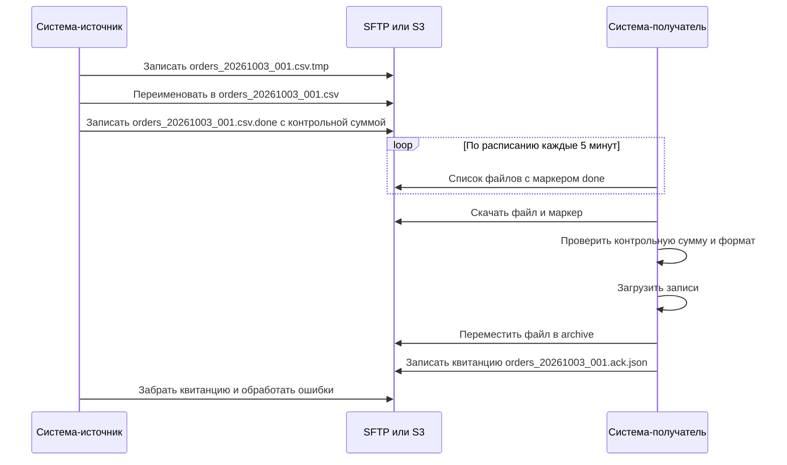
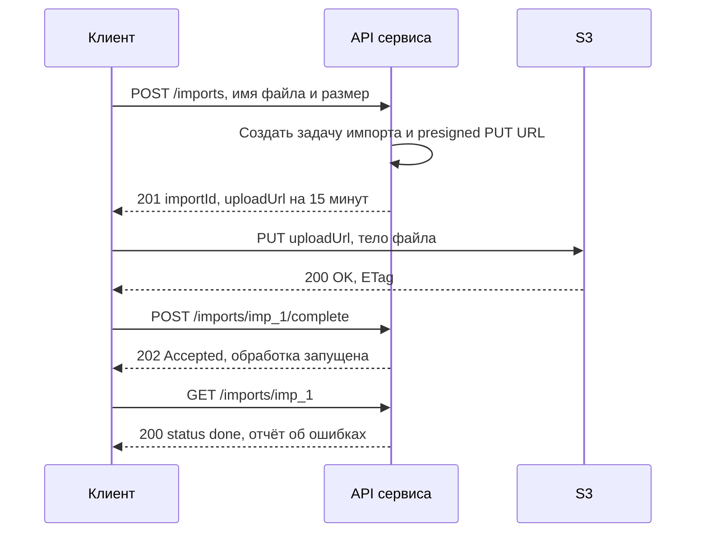

# Файловый обмен

Файловый обмен — интеграция, при которой одна система выгружает данные в файл, а другая забирает и загружает его: через SFTP-сервер, объектное хранилище (S3), сетевую папку. Несмотря на репутацию «легаси», это по-прежнему основной способ для больших пакетных объёмов (реестры платежей, выгрузки в хранилище данных, обмен с банками, госорганами, партнёрами), и его надо уметь грамотно специфицировать: дьявол — в соглашениях об именовании, кодировках, маркерах готовности и квитанциях.

## Когда файловый обмен оправдан {#when-to-use}

**Подходит:**

- большие пакетные объёмы (миллионы записей) раз в сутки/час — передать один файл дешевле, чем миллион API-вызовов;
- обмен с контрагентами, у которых нет API или для которых файлы — отраслевой стандарт (банковские реестры, EDI, отчётность, выгрузки 1С);
- загрузка в хранилища данных и озёра данных (DWH, data lake) — ETL/ELT;
- первичная миграция и начальная загрузка данных перед переходом на онлайн-интеграцию;
- архивные и юридически значимые выгрузки, которые надо хранить «как есть»;
- закрытые контуры, где разрешена только передача файлов.

**Не подходит:**

- нужна реакция в секундах — [REST](/protocols/rest), [Webhooks](/protocols/webhooks), [брокер](/protocols/messaging);
- нужен немедленный ответ на каждую запись (проверка, резервирование);
- частые мелкие изменения — лучше события или CDC.



## Протоколы передачи {#protocols}

### FTP, FTPS и SFTP — в чём разница {#ftp-ftps-sftp}

Три аббревиатуры похожи, но это **разные протоколы**. Путаница между ними — частая причина сорванных сроков: «мы дали вам FTP» и «нам нужен SFTP» — это разные серверы, порты и правила firewall.

| | FTP | FTPS | SFTP |
|---|---|---|---|
| Что это | File Transfer Protocol (RFC 959) | FTP поверх TLS (RFC 4217) | SSH File Transfer Protocol — подсистема SSH, **не связана с FTP** |
| Шифрование | **Нет**: логин, пароль и данные открытым текстом | TLS | SSH |
| Порты | 21 (управление) + отдельные порты данных | Explicit: 21 с командой `AUTH TLS`. Implicit: 990 | 22 (одно соединение) |
| Соединения | Два канала: управление и данные; активный и пассивный режимы | Как FTP, плюс TLS — сложно для firewall и NAT (не видно команд в зашифрованном канале) | Одно TCP-соединение — просто для firewall |
| Аутентификация | Логин и пароль | Логин и пароль, клиентский сертификат | Пароль, **SSH-ключи** (рекомендуется), сертификаты SSH |
| Проверка сервера | Нет | Сертификат X.509 (как HTTPS) | Отпечаток host key (fingerprint) — нужно зафиксировать и проверять |
| Стандарт | RFC 959 | RFC 4217 | Черновики IETF (draft-ietf-secsh-filexfer), де-факто — реализация OpenSSH |
| Когда применять | Только внутри доверенного сегмента и для неконфиденциальных данных, а лучше никогда | Когда контрагент требует FTP-совместимость и TLS-сертификаты | **Выбор по умолчанию** для файлового обмена |

::: warning Активный и пассивный режим FTP
В активном режиме сервер сам подключается к клиенту для передачи данных — через NAT и firewall это почти никогда не работает. В пассивном режиме клиент подключается к серверу на диапазон портов, который надо открыть на firewall. Если в постановке встречается FTP/FTPS — зафиксируйте режим и диапазон портов.
:::

Что ещё встречается:

- **SCP** — копирование по SSH; устаревший протокол, современный OpenSSH использует под капотом SFTP. Для интеграций берите SFTP.
- **AS2** (RFC 4130) — передача бизнес-документов (EDI) поверх HTTP с подписью, шифрованием и квитанциями MDN (Message Disposition Notification); популярен в ритейле и логистике.
- **MFT** (Managed File Transfer) — корпоративные платформы (IBM Sterling, GoAnywhere, Axway и др.): централизованный обмен файлами с маршрутизацией, шифрованием, аудитом, повторами и уведомлениями.
- **HTTP(S)** — загрузка файла через REST API (`multipart/form-data` или `PUT` бинарного тела). См. [Форматы данных](/protocols/data-formats).

### Объектное хранилище S3 {#s3}

Объектные хранилища с API Amazon S3 (AWS S3, Yandex Object Storage, VK Cloud, MinIO, Ceph и др.) — современная замена SFTP-серверу:

- HTTP API, аутентификация подписью запросов (AWS Signature V4), роли и политики доступа к бакетам и префиксам;
- **запись объекта атомарна**: объект появляется целиком после успешного `PUT` — получатель не увидит «недописанный» файл;
- сильная согласованность чтения после записи (в AWS S3 — с 2020 года; у других реализаций уточняйте);
- уведомления о новых объектах (S3 Event Notifications → SQS/SNS/Lambda, аналоги у других провайдеров) — можно реагировать сразу, а не опрашивать;
- версии объектов, правила жизненного цикла (автоудаление и перенос в «холодный» класс через N дней), Object Lock для неизменяемых архивов;
- для файлов больше нескольких ГБ — **multipart upload** (части по 5 МБ – 5 ГБ, до 10 000 частей; обязательно для объектов больше 5 ГБ).

**Presigned URL** — временная ссылка, подписанная ключом владельца бакета. Даёт право на одну операцию (`GET` или `PUT`) с одним объектом до истечения срока, без выдачи учётных данных. Типовой сценарий передачи большого файла через API:



```http
PUT /incoming/imp_1/orders.csv?X-Amz-Algorithm=AWS4-HMAC-SHA256&X-Amz-Credential=...&X-Amz-Date=20261003T091500Z&X-Amz-Expires=900&X-Amz-SignedHeaders=host&X-Amz-Signature=... HTTP/1.1
Host: exchange-bucket.s3.example.com
Content-Type: text/csv
Content-Length: 104857600

order_id;customer_id;amount;currency
...
```

Особенности presigned URL: срок действия при подписи SigV4 — до 7 суток (на практике — минуты); ссылка — это секрет, её нельзя логировать; можно жёстко задать `Content-Type` и ограничения размера (через presigned POST с политикой). Паттерн «файл в хранилище + ссылка в API/сообщении» называется **claim check** — его используют, чтобы не гонять большие файлы через API и брокеры. См. также [Асинхронные операции](/design/async-operations).

::: info В S3 нет переименования
«Папки» в S3 — лишь префиксы ключей, а rename — это копирование и удаление. Атомарность обеспечивает сам `PUT`, поэтому трюк с временным именем не нужен; маркер готовности нужен, только если «пакет» состоит из нескольких файлов.
:::

### Сетевые папки {#network-shares}

SMB/CIFS (Windows-шары), NFS — простой, но самый проблемный вариант: нет нормального разграничения доступа по контрагентам, сложно мониторить, блокировки файлов, проблемы с правами и кодировками имён, обычно доступен только внутри сети. Допустим для обмена внутри одного ЦОД между легаси-системами; для межорганизационного обмена — SFTP или S3.

## Форматы файлов {#formats}

| Формат | Плюсы | Минусы | Когда |
|---|---|---|---|
| CSV / TSV | Простой, компактный, открывается в Excel | Нет стандарта на типы, кодировку, разделитель; проблемы экранирования | Табличные выгрузки, реестры |
| XML | Схема XSD, строгая валидация, иерархия, подпись XMLDSig | Многословный, тяжёлый парсинг | Госорганы, банки, отраслевые стандарты |
| JSON (один документ) | Иерархия, привычен разработчикам | Большой файл надо целиком читать в память (если не потоковый парсер) | Небольшие выгрузки со сложной структурой |
| JSON Lines / NDJSON | Одна запись = одна строка, потоковая обработка, легко делить | Нет общей схемы | Большие выгрузки, логи, загрузка в DWH |
| Fixed-width | Компактный, традиционный для мейнфреймов и банков | Хрупкий: длины полей, выравнивание, многобайтовые символы | Легаси, банковские форматы |
| Excel (XLSX) | Удобен людям | Неявные преобразования типов, ограничение строк (1 048 576), сложно парсить надёжно | Только если файл готовит или читает человек |
| Parquet / ORC / Avro | Колоночное или бинарное хранение со схемой, сжатие, быстрые аналитические запросы | Не человекочитаемы, нужны библиотеки | Обмен с DWH, data lake, большие объёмы |

Подробно о самих форматах — [Форматы данных](/protocols/data-formats).

### CSV: что обязательно зафиксировать {#csv}

У CSV есть RFC 4180, но он описывает лишь базовые правила, и реальные файлы часто им не следуют. В спецификации нужно явно указать:

| Параметр | Варианты и рекомендации |
|---|---|
| Кодировка | **UTF-8** (рекомендуется); Windows-1251 — в легаси и выгрузках из старых систем. Указать явно — иначе получите «кракозябры» |
| BOM | UTF-8 с BOM (`EF BB BF`) нужен, чтобы Excel правильно открыл файл двойным кликом; но многие парсеры воспринимают BOM как часть имени первой колонки. Договориться явно |
| Разделитель полей | `,` по RFC 4180; `;` — стандарт де-факто в русской локали Excel (запятая там — десятичный разделитель); `\t` (TSV) — меньше всего конфликтов |
| Разделитель строк | CRLF (по RFC 4180) или LF. Парсер получателя должен принимать оба |
| Экранирование | Поле с разделителем, кавычкой или переводом строки заключается в двойные кавычки; кавычка внутри удваивается: `"ООО ""Ромашка"""` |
| Заголовок | Есть ли строка заголовка, точные имена колонок, важен ли порядок |
| Десятичный разделитель | Точка (рекомендуется) или запятая. Без разделителей тысяч |
| Даты и время | Формат ISO 8601 / RFC 3339 (`2026-10-03`, `2026-10-03T09:15:27Z`), часовой пояс. См. [Соглашения о данных](/design/data-conventions) |
| Пустое значение и null | Различаются ли пустая строка и отсутствие значения (`""` vs пусто) |
| Ведущие нули, длинные числа | ИНН, счета, коды — строки. Excel превращает `0012345` в `12345`, а 20-значный номер счёта — в `4,08E+19` |
| Трейлер | Итоговая строка с количеством записей и контрольной суммой (суммой по полю) — полезно для сверки |

```text
order_id;order_date;customer_inn;amount;currency;comment
ORD-41;2026-10-03;0274062111;1500.00;RUB;"Доставка до 18:00; без звонка"
ORD-42;2026-10-03;7707083893;250.50;RUB;"Клиент ""VIP"""
```

::: danger Excel как звено интеграции
Если CSV по дороге открывают и сохраняют в Excel, он молча меняет данные: удаляет ведущие нули, превращает коды в даты (`1-2` → `01.фев`), длинные числа — в экспоненту, меняет кодировку и разделитель. Для машинного обмена Excel не должен быть в цепочке.
:::

## Соглашения об обмене {#conventions}

### Именование файлов {#naming}

Имя файла — часть протокола. Хороший шаблон:

```text
{система}_{тип}_{дата-время}_{номер}.{расширение}
orders_export_20261003T090000Z_000001.csv
orders_export_20261003T090000Z_000001.csv.sha256
orders_export_20261003T090000Z_000001.done
```

- дата и время в формате с сортировкой (`YYYYMMDD` или `YYYYMMDDThhmmssZ`), с указанием часового пояса;
- порядковый номер или уникальный id — для нескольких файлов в день и для контроля пропусков;
- только латиница, цифры, `_`, `-`, `.` — без пробелов и кириллицы (кодировки имён на разных ОС отличаются);
- тип файла / версия формата в имени, если форматов несколько (`_v2`);
- признак полной или инкрементальной выгрузки (`_full`, `_delta`).

### Структура каталогов {#directories}

```text
/outbound/orders/           <- источник кладёт готовые файлы
/inbound/receipts/          <- квитанции от получателя
/archive/orders/2026/10/03/ <- успешно обработанные
/error/orders/              <- файлы, которые не удалось обработать
```

Права: каждый контрагент видит только свои каталоги; источник пишет в `outbound`, получатель читает и перемещает. Ни один участник не должен удалять чужие файлы без договорённости.

### Маркер готовности и атомарная запись {#atomic-write}

Главная проблема файлового обмена — получатель начинает читать файл, который ещё пишется. Решения:

| Способ | Как работает | Комментарий |
|---|---|---|
| **Временное имя + rename** | Пишем `orders.csv.tmp` (или в каталог `tmp/`), после завершения — переименовываем в `orders.csv`. Получатель игнорирует `*.tmp` | Rename атомарен в пределах одной файловой системы. Основной способ для SFTP |
| **Маркер-файл** (`.done`, `.ok`, `.ready`, `.flag`) | После записи файла (или всего пакета из нескольких файлов) создаётся пустой маркер или маркер с метаданными | Получатель обрабатывает только файлы, для которых есть маркер. Удобно для пакетов |
| Манифест | Файл-маркер со списком файлов пакета, их размерами, числом записей и контрольными суммами | Самый надёжный вариант для многофайловых пакетов |
| Проверка «размер не меняется N секунд» | Получатель ждёт, пока файл перестанет расти | Ненадёжно — использовать только если другого не дано |

Пример манифеста:

```json
{
  "batchId": "orders_20261003_000001",
  "createdAt": "2026-10-03T09:00:12Z",
  "formatVersion": "2",
  "files": [
    {
      "name": "orders_export_20261003T090000Z_000001.csv",
      "sizeBytes": 104857600,
      "records": 412337,
      "sha256": "9f86d081884c7d659a2feaa0c55ad015a3bf4f1b2b0b822cd15d6c15b0f00a08"
    }
  ]
}
```

### Контрольные суммы и целостность {#checksums}

- **SHA-256** файла — в манифесте или в соседнем файле `.sha256`. MD5 допустим для обнаружения случайных повреждений, но не для защиты от подмены.
- **Число записей и контрольные суммы по полям** (сумма платежей) в трейлере или манифесте — защищают от потери строк при парсинге.
- **Электронная подпись** (CMS/PKCS#7, PGP, XMLDSig, ГОСТ-подпись) — когда нужна юридическая значимость и защита от подмены.
- **Шифрование файла** (PGP, CMS) — если данные чувствительные и хранятся на промежуточном сервере, а не только передаются по защищённому каналу.

### Сжатие и архивирование {#compression}

- Сжатие (`.gz`, `.zip`, `.zst`) уменьшает трафик в 5–10 раз для текстовых форматов. Указать алгоритм и правило: одно содержимое — один архив, без вложенных каталогов.
- **Архивирование после обработки** — перенос в `archive/` с датой, срок хранения (например, 90 дней на сервере, далее — в холодное хранилище), правила удаления.
- Нельзя удалять файл до подтверждения успешной обработки.

### Квитанции и протоколы обработки {#receipts}

Без обратной связи источник не знает, загружен ли файл. Получатель формирует **квитанцию** (acknowledgement):

```json
{
  "batchId": "orders_20261003_000001",
  "file": "orders_export_20261003T090000Z_000001.csv",
  "status": "partially_processed",
  "receivedAt": "2026-10-03T09:05:00Z",
  "processedAt": "2026-10-03T09:07:41Z",
  "totalRecords": 412337,
  "accepted": 412330,
  "rejected": 7,
  "errors": [
    { "line": 1045, "field": "customer_inn", "code": "INVALID_INN", "message": "Неверная контрольная сумма ИНН" },
    { "line": 88310, "field": "amount", "code": "INVALID_NUMBER", "message": "Значение '1 500,00' не является числом" }
  ]
}
```

Уровни квитанций, которые стоит различать:

1. **Технический приём** — файл получен, контрольная сумма и формат верны.
2. **Результат обработки** — сколько записей принято, сколько отклонено и почему (с номерами строк).
3. Решение по файлу целиком: «всё или ничего» (файл отклоняется при любой ошибке) или «частичная загрузка» (принимаются валидные строки). Это **бизнес-решение**, его фиксирует аналитик.

### Повторная обработка и идемпотентность {#reprocessing}

- Получатель хранит журнал обработанных файлов (имя, `batchId`, контрольная сумма) и **не загружает один и тот же файл дважды** — даже если он появился повторно.
- Повторная отправка исправленного файла — с новым номером или явным признаком замены (`_v2`, `replaces: batchId`) — правило фиксируется.
- Загрузка строк — upsert по бизнес-ключу, а не слепая вставка, чтобы повтор не порождал дубли. См. [Идемпотентность](/design/idempotency).
- Контроль пропусков: если номера файлов последовательны, получатель видит, что `000003` пришёл, а `000002` — нет, и поднимает алерт.
- Порядок обработки: инкрементальные выгрузки обрабатываются строго по порядку; полная выгрузка сбрасывает состояние.

### Расписание, объёмы, SLA {#schedule}

- Расписание выгрузки и забора (cron, часовой пояс!), окна обслуживания, поведение в выходные и праздники.
- Крайний срок появления файла (cut-off) и действия при его отсутствии: алерт, повторная проверка, эскалация. **Отсутствие файла — тоже событие**, его надо мониторить.
- Пустой день: присылается пустой файл с заголовком (рекомендуется — подтверждает, что выгрузка отработала) или ничего.
- Объёмы: размер файла, число записей сейчас и с прогнозом роста; лимиты диска на сервере обмена.
- Полная (full) или инкрементальная (delta) выгрузка; периодическая полная выгрузка для сверки.

## ETL, ELT и CDC {#etl}

| Подход | Суть | Где применяется |
|---|---|---|
| **ETL** (Extract, Transform, Load) | Данные извлекаются, преобразуются на промежуточном слое (ETL-инструмент), загружаются в целевую систему | Классические DWH, интеграции с жёсткой целевой моделью. Инструменты: Informatica, Talend, SSIS, Apache NiFi, Airflow + скрипты |
| **ELT** (Extract, Load, Transform) | Данные загружаются «как есть» в хранилище, преобразуются уже там (SQL) | Облачные DWH и lakehouse (Snowflake, BigQuery, ClickHouse, Greenplum), dbt |
| **CDC** (Change Data Capture) | Захват изменений из журнала транзакций БД (WAL, binlog, redo) и публикация как событий | Онлайн-репликация данных без нагрузки на источник и без изменения его кода. Инструменты: Debezium (в Kafka), Oracle GoldenGate, облачные DMS |

CDC часто приходит на смену ночным файловым выгрузкам: вместо «полной выгрузки раз в сутки» — поток изменений почти в реальном времени через [брокер сообщений](/protocols/messaging). Но CDC публикует **технические** изменения таблиц, а не бизнес-события: модель БД источника «протекает» к получателям. Для межсистемных контрактов предпочтительнее явные события (outbox).

## Типичные ошибки {#pitfalls}

- Не зафиксированы кодировка, разделитель, формат дат и чисел — первый же файл не грузится.
- Получатель читает недописанный файл — нет временного имени или маркера.
- Нет квитанций — источник неделями не знает, что файлы отклоняются.
- Повторная загрузка того же файла создаёт дубли.
- Никто не мониторит отсутствие файла — проблема всплывает в отчётности через месяц.
- FTP без шифрования для персональных данных.
- Не проверяется отпечаток host key SFTP — возможна атака «человек посередине».
- Сервер обмена переполнен, потому что никто не настроил архивирование и удаление.
- Время в имени файла без часового пояса — путаница на границе суток.
- Файл проходит через Excel и теряет ведущие нули.

## На что обратить внимание аналитику {#analyst-checklist}

- Обоснован файловый обмен (объёмы, периодичность, возможности контрагента) вместо API или событий.
- Протокол: SFTP / FTPS / S3 / сетевая папка; адрес, порт, режим (для FTP — пассивный и диапазон портов).
- Аутентификация: SSH-ключи, сертификаты, IAM-политики; отпечаток host key; порядок обмена ключами и их ротации.
- Сетевой доступ: правила firewall, IP-адреса обеих сторон, тестовый и продуктивный контуры.
- Структура каталогов и права доступа каждой стороны.
- Шаблон имени файла: система, тип, дата-время с часовым поясом, номер, версия формата, full/delta.
- Формат файла: описание полей (имя, тип, длина, обязательность, формат, пример), заголовок, трейлер; для XML — XSD.
- Для CSV: кодировка, BOM, разделитель полей и строк, кавычки, десятичный разделитель, формат дат, представление null.
- Механизм готовности: временное имя + rename, маркер `.done`, манифест.
- Целостность: контрольная сумма, число записей, контрольные суммы по полям; подпись и шифрование.
- Сжатие: алгоритм и правила упаковки.
- Квитанции: формат, место, сроки, уровни (приём / обработка), коды ошибок.
- Правило «всё или ничего» или частичная загрузка; процедура исправления и повторной отправки.
- Идемпотентность: журнал обработанных файлов, upsert по бизнес-ключу, контроль пропусков по номерам.
- Расписание, cut-off, поведение при отсутствии файла и для пустого дня; праздники.
- Объёмы и прогноз роста; хранение и архивирование, сроки удаления.
- Мониторинг и алерты: файл не пришёл, файл не обработан, ошибки выше порога, переполнение диска.
- Ответственные и порядок эскалации с обеих сторон.

## Стандарты и ссылки {#references}

- [RFC 959 — File Transfer Protocol (FTP)](https://www.rfc-editor.org/rfc/rfc959)
- [RFC 4217 — Securing FTP with TLS](https://www.rfc-editor.org/rfc/rfc4217)
- [RFC 4251 — The Secure Shell (SSH) Protocol Architecture](https://www.rfc-editor.org/rfc/rfc4251)
- [IETF draft — SSH File Transfer Protocol](https://datatracker.ietf.org/doc/html/draft-ietf-secsh-filexfer-13)
- [RFC 4130 — AS2: MIME-Based Secure Peer-to-Peer Business Data Interchange over HTTP](https://www.rfc-editor.org/rfc/rfc4130)
- [RFC 4180 — Common Format and MIME Type for CSV Files](https://www.rfc-editor.org/rfc/rfc4180)
- [AWS S3 — Sharing objects with presigned URLs](https://docs.aws.amazon.com/AmazonS3/latest/userguide/ShareObjectPreSignedURL.html)
- [AWS S3 — Uploading and copying objects using multipart upload](https://docs.aws.amazon.com/AmazonS3/latest/userguide/mpuoverview.html)
- [Apache Parquet — документация](https://parquet.apache.org/docs/)
- [JSON Lines](https://jsonlines.org/)
- [Debezium — документация](https://debezium.io/documentation/)
- [Enterprise Integration Patterns — File Transfer](https://www.enterpriseintegrationpatterns.com/patterns/messaging/FileTransferIntegration.html)
