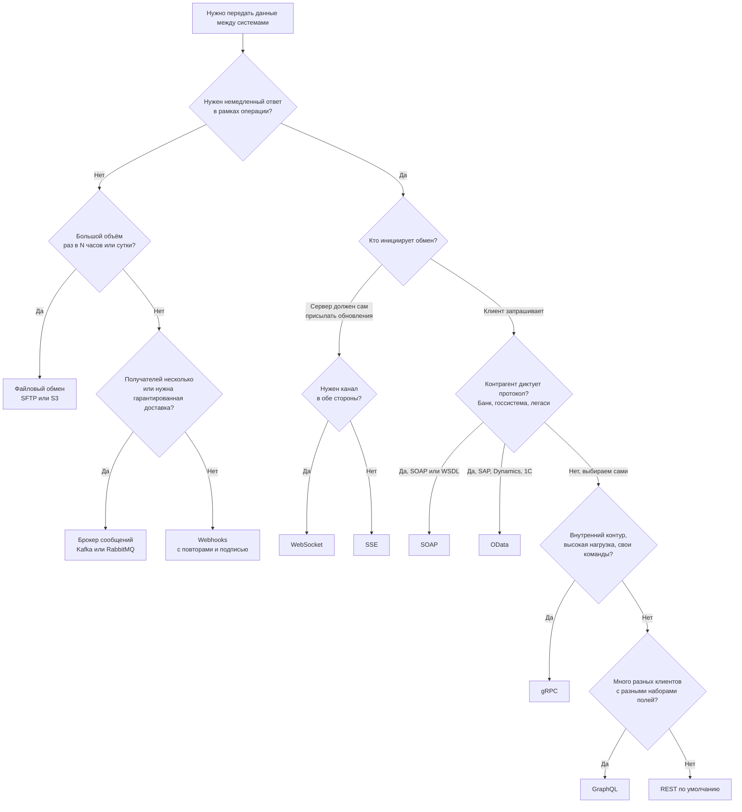
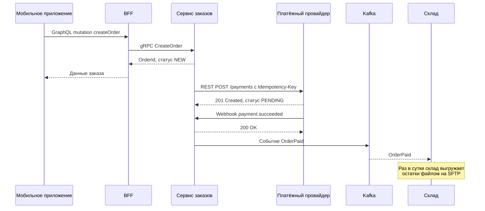

# Обзор и выбор технологии интеграции

Интеграцию можно построить на десятке технологий: REST, SOAP, GraphQL, gRPC, вебхуки, брокеры сообщений, обмен файлами и т. д. У каждой своя модель взаимодействия, свои гарантии и своя цена. На этой странице собраны классификация, большая сравнительная таблица, дерево решений и типовые сценарии с рекомендациями. Подробности о каждой технологии — на отдельных страницах раздела.

## Классификация способов интеграции {#classification}

Технологии удобно раскладывать по трём независимым осям. Одна и та же задача часто решается комбинацией: например, синхронный REST для команд и асинхронные события через брокер для уведомлений.

### Синхронные и асинхронные

| Ось | Синхронная интеграция | Асинхронная интеграция |
|---|---|---|
| Суть | Клиент отправляет запрос и **ждёт** ответа в рамках того же соединения | Отправитель передаёт сообщение и **не ждёт** результата обработки; ответ (если нужен) придёт отдельно |
| Примеры | REST, SOAP, GraphQL, gRPC unary, JSON-RPC, OData | Брокеры сообщений (Kafka, RabbitMQ), вебхуки, файловый обмен, СМЭВ-очереди |
| Связанность по времени | Высокая: обе системы должны быть доступны одновременно | Низкая: получатель может быть временно недоступен |
| Согласованность | Результат известен сразу | Итоговая согласованность (eventual consistency) |
| Сложность | Проще проектировать, отлаживать и тестировать | Нужны очереди, повторы, дедупликация, мониторинг «застрявших» сообщений |
| Риски | Каскадные отказы, таймауты, рост задержки по цепочке вызовов | Дубли, нарушение порядка, потерянные сообщения, сложная трассировка |

::: tip Синхронный транспорт — не всегда синхронная операция
Длительную операцию можно запустить синхронным запросом, а результат получить позже: сервер отвечает `202 Accepted` и ссылкой на статус. Подробно — в разделе [Асинхронные операции](/design/async-operations).
:::

### Модели обмена сообщениями

| Модель | Как работает | Технологии |
|---|---|---|
| Запрос — ответ (request-response) | Один запрос — один ответ, инициатор всегда клиент | REST, SOAP, GraphQL query/mutation, gRPC unary, JSON-RPC, OData |
| Односторонняя отправка (fire-and-forget) | Сообщение без ожидания ответа | JSON-RPC notification, отправка в очередь, вебхук без обработки ответа |
| Публикация — подписка (pub/sub) | Издатель публикует событие в топик, все подписчики получают копию | Kafka, RabbitMQ (exchange типа fanout/topic), NATS, Redis Pub/Sub, GraphQL subscription |
| Точка — точка (point-to-point, очередь) | Сообщение из очереди получает ровно один из потребителей | RabbitMQ, ActiveMQ, IBM MQ, Amazon SQS |
| Обратный вызов (callback) | Сервер сам вызывает URL клиента при наступлении события | [Webhooks](/protocols/webhooks) |
| Потоковая передача (streaming) | Длительное соединение, по которому идёт поток сообщений в одну или обе стороны | [WebSocket](/protocols/websocket), [SSE](/protocols/sse), gRPC streaming, Kafka |
| Пакетный обмен (batch) | Данные накапливаются и передаются блоком по расписанию | [Файловый обмен](/protocols/file-exchange), выгрузки в S3/SFTP, ETL |

### Онлайн и пакетная интеграция

- **Онлайн (real-time, near real-time)** — данные передаются в момент возникновения или по запросу. Задержка — от миллисекунд до секунд. Подходит для операционных процессов: оформление заказа, проверка остатков, авторизация платежа.
- **Пакетная (batch)** — данные копятся и передаются раз в N минут, часов или сутки. Подходит для отчётности, сверок, загрузки в хранилище данных, обмена большими справочниками. Проще и дешевле при больших объёмах, но данные у получателя всегда «вчерашние».

Промежуточный вариант — **микропакеты (micro-batch)**: передача небольшими порциями каждые несколько секунд или минут, например через брокер или CDC (Change Data Capture).

## Сравнительная таблица технологий {#comparison}

### Технические характеристики

| Технология | Транспорт | Формат данных | Контракт / схема | Направление |
|---|---|---|---|---|
| [REST](/protocols/rest) | HTTP/1.1, HTTP/2, HTTP/3 | Обычно JSON, также XML, бинарные | [OpenAPI](/specs/openapi) (необязателен, но де-факто стандарт) | Клиент → сервер |
| [SOAP](/protocols/soap) | Чаще HTTP, реже JMS, SMTP | XML (SOAP-конверт) | WSDL + XSD (строгий, обязателен на практике) | Клиент → сервер |
| [GraphQL](/protocols/graphql) | HTTP (POST/GET), WebSocket или SSE для подписок | JSON | SDL-схема (обязательна, доступна через интроспекцию) | Клиент → сервер; подписки сервер → клиент |
| [gRPC](/protocols/grpc) | HTTP/2 | Protocol Buffers (бинарный) | `.proto` (строгий, обязателен) | Обе стороны, 4 типа вызовов включая двунаправленный поток |
| [JSON-RPC](/protocols/json-rpc) | Любой: HTTP, WebSocket, stdio, TCP | JSON | Нет стандартного; иногда OpenRPC | Клиент → сервер (на WebSocket — в обе стороны) |
| [OData](/protocols/odata) | HTTP | JSON (v4), Atom/XML (v2, v3) | CSDL (`$metadata`), обязателен | Клиент → сервер |
| [WebSocket](/protocols/websocket) | TCP, установка через HTTP Upgrade | Любой: текст (JSON) или бинарный | Нет; описывается [AsyncAPI](/specs/asyncapi) | Полный дуплекс |
| [SSE](/protocols/sse) | HTTP (долгий ответ `text/event-stream`) | Текст (обычно JSON в поле `data`) | Нет; AsyncAPI | Сервер → клиент |
| [Webhooks](/protocols/webhooks) | HTTP (POST от сервера к клиенту) | Обычно JSON | OpenAPI (раздел `webhooks` в 3.1), AsyncAPI | Сервер → клиент (обратный вызов) |
| [Брокеры сообщений](/protocols/messaging) | Собственные протоколы: Kafka, AMQP 0-9-1, AMQP 1.0, MQTT, STOMP | Любой: JSON, Avro, Protobuf | AsyncAPI, Schema Registry | Асинхронно, pub/sub или очередь |
| [Файловый обмен](/protocols/file-exchange) | SFTP, FTPS, S3, сетевые папки | CSV, XML, JSON, XLSX, фиксированная ширина | Описание формата файла, XSD, JSON Schema | Односторонняя передача пакетом |

### Свойства и применимость

| Технология | Связанность | Производительность | Браузер | Кэширование | Инструменты | Типичные кейсы |
|---|---|---|---|---|---|---|
| REST | Низкая–средняя | Хорошая; накладные расходы JSON и HTTP-заголовков | Нативно (`fetch`) | Отличное: HTTP-кэш, CDN, ETag | Postman, curl, Swagger UI, Insomnia | Публичные и партнёрские API, CRUD, бэкенд для фронтенда |
| SOAP | Высокая (жёсткий контракт, кодогенерация) | Низкая: тяжёлый XML, разбор, подписи | Практически нет | Нет (всё через POST) | SoapUI, ReadyAPI, Postman, генераторы по WSDL | Банки, госсистемы (СМЭВ), легаси ESB, корпоративные B2B |
| GraphQL | Средняя: клиент зависит от схемы, но выбирает поля сам | Хорошая для клиента (один запрос), риск тяжёлых запросов на сервере | Нативно | Сложное: HTTP-кэш почти не работает, кэш на клиенте | GraphiQL, Apollo Sandbox, Postman, Altair | Фронтенд и мобильные приложения с разными экранами, агрегация данных |
| gRPC | Высокая (общий `.proto`, кодогенерация) | Очень высокая: бинарный формат, HTTP/2, мультиплексирование | Только через gRPC-Web и прокси | Нет стандартного | grpcurl, Postman, Kreya, Insomnia, buf | Микросервисы внутри контура, высоконагруженные внутренние API, стриминг |
| JSON-RPC | Средняя (общий список методов) | Хорошая, лёгкий протокол | Нативно | Нет (POST) | curl, Postman, OpenRPC-инструменты | Блокчейн-ноды, LSP, MCP, внутренние API, Zabbix |
| OData | Средняя: универсальный протокол, но клиент знает модель | Средняя; риск тяжёлых `$expand` и `$filter` | Нативно | Ограниченное (GET-запросы можно кэшировать) | Браузер, Postman, SAP/Microsoft SDK, Excel, Power BI | SAP, Microsoft Dynamics, 1С, отчётность и BI |
| WebSocket | Средняя | Очень низкая задержка, постоянное соединение | Нативно | Нет | Postman, wscat, websocat, DevTools | Чаты, торговые терминалы, совместное редактирование, онлайн-игры |
| SSE | Низкая | Хорошая для односторонних потоков | Нативно (`EventSource`) | Нет | curl, DevTools | Ленты событий, прогресс операций, стриминг ответов LLM, уведомления |
| Webhooks | Низкая | Хорошая; зависит от доступности получателя | Не применимо (сервер — сервер) | Не применимо | webhook.site, ngrok, RequestBin | Уведомления о событиях партнёрам: оплата прошла, статус изменился |
| Брокеры сообщений | Очень низкая (развязка во времени и по адресатам) | Очень высокая пропускная способность | Нет (кроме MQTT/STOMP поверх WebSocket) | Не применимо | Kafka UI, RabbitMQ Management, kcat, Offset Explorer | Событийная архитектура, обмен между доменами, гарантированная доставка |
| Файловый обмен | Очень низкая | Максимальная для больших объёмов, но высокая задержка | Нет | Не применимо | WinSCP, FileZilla, `aws s3`, `sftp` | Ежесуточные выгрузки, сверки, загрузка в DWH, обмен с банками и легаси |

::: info Связанность (coupling)
Под связанностью понимается, насколько сильно изменения одной системы затрагивают другую: общий контракт и кодогенерация, требование одновременной доступности, знание адресов и внутренней модели. Чем ниже связанность, тем независимее команды могут развивать свои системы.
:::

### Краткие характеристики

- **REST** — архитектурный стиль поверх HTTP: ресурсы, стандартные методы, коды состояния, кэширование. Универсальный выбор по умолчанию для внешних API. См. [REST](/protocols/rest).
- **SOAP** — XML-протокол обмена сообщениями со строгим контрактом WSDL и стеком стандартов WS-* (подпись, шифрование, надёжная доставка). См. [SOAP](/protocols/soap).
- **GraphQL** — язык запросов: клиент сам описывает, какие поля нужны, и получает их одним запросом. См. [GraphQL](/protocols/graphql).
- **gRPC** — RPC-фреймворк от Google на HTTP/2 и Protocol Buffers: быстрый, строго типизированный, со стримингом. См. [gRPC](/protocols/grpc).
- **JSON-RPC** — минималистичный протокол удалённого вызова процедур в JSON. См. [JSON-RPC](/protocols/json-rpc).
- **OData** — стандарт OASIS для REST-подобных API с унифицированным языком запросов (`$filter`, `$expand`) и метаданными. См. [OData](/protocols/odata).
- **WebSocket** — постоянный двунаправленный канал между браузером (или сервером) и сервером. См. [WebSocket](/protocols/websocket).
- **SSE** — однонаправленный поток событий от сервера к клиенту поверх обычного HTTP. См. [SSE и Long Polling](/protocols/sse).
- **Webhooks** — сервер сам вызывает HTTP-эндпоинт клиента при наступлении события. См. [Webhooks](/protocols/webhooks).
- **Брокеры сообщений** — промежуточное звено, которое принимает, хранит и доставляет сообщения. См. [Брокеры сообщений](/protocols/messaging).
- **Файловый обмен** — передача файлов определённого формата по расписанию через общее хранилище. См. [Файловый обмен](/protocols/file-exchange).

## Дерево решений {#decision-tree}

Схема ниже не заменяет анализ, но помогает быстро сузить выбор. Пройдите её от верхнего вопроса, затем проверьте выбранный вариант по сценариям ниже и по нефункциональным требованиям.

::: tip REST — выбор по умолчанию
Если нет явной причины выбрать другое, для синхронного API выбирайте REST + OpenAPI. Его понимают все команды и партнёры, для него больше всего инструментов, он хорошо кэшируется и легко проходит через прокси, шлюзы и WAF. Отклоняйтесь от него, только если можете сформулировать, какую конкретную проблему решает альтернатива.
:::

## Критерии выбора {#criteria}

При выборе технологии проверьте требования по каждому пункту. Ответы обычно однозначно отсекают часть вариантов.

| Критерий | Вопросы к заказчику и смежникам | На что влияет |
|---|---|---|
| Инициатор и направление | Кто начинает обмен? Нужно ли серверу самому сообщать о событиях? | Запрос — ответ, вебхуки, SSE, WebSocket, брокер |
| Требуемая задержка | Сколько секунд или часов допустимо между событием и его отражением у получателя? | Онлайн или пакетная интеграция |
| Объём и частота | Сколько записей за раз, сколько запросов в секунду в пике? | REST, gRPC, брокер, файлы, [пакетные операции](/design/bulk) |
| Гарантии доставки | Допустима ли потеря сообщения? Допустимы ли дубли? Важен ли порядок? | Брокер, outbox, [идемпотентность](/design/idempotency) |
| Количество потребителей | Один получатель или несколько? Будут ли новые? | Точка — точка или pub/sub |
| Доступность сторон | Может ли получатель быть недоступен часами? | Синхронный вызов или очередь |
| Кто клиент | Браузер, мобильное приложение, сервер партнёра, внутренний сервис? | Поддержка в браузере, [CORS](/security/cors), gRPC-Web |
| Требования контрагента | Есть ли у партнёра готовый API и протокол, который нельзя менять? | Часто решает всё: адаптируемся под SOAP, OData, файлы |
| Безопасность и регуляторика | Нужна ли электронная подпись сообщений, ГОСТ-криптография, mTLS? | SOAP с WS-Security или XMLDSig, [mTLS](/security/tls) |
| Компетенции и инфраструктура | Что умеют команды? Есть ли брокер, API-шлюз, service mesh? | Стоимость внедрения и сопровождения |
| Эволюция контракта | Как часто будет меняться модель данных? Сколько внешних потребителей? | [Версионирование](/design/versioning), строгая схема или гибкая |

## Типовые сценарии {#scenarios}

### Отдать справочник внешнему партнёру

**Рекомендация:** REST API с пагинацией, фильтром по дате изменения и кэшированием; для больших справочников (сотни тысяч записей) — дополнительно ежесуточная полная выгрузка файлом.

**Обоснование:**
- REST понятен любому партнёру, легко документируется в OpenAPI, не требует специфичных библиотек.
- Справочники меняются редко — работают `ETag`, `Cache-Control`, условные запросы с `If-None-Match` (см. [Кэширование](/design/caching)).
- Для синхронизации добавьте параметр вида `updatedSince` и курсорную [пагинацию](/design/pagination), чтобы партнёр забирал только изменения (дельту), а не весь справочник.
- Если партнёру нужны уведомления об изменениях без опроса — добавьте [вебхуки](/protocols/webhooks) с минимальной полезной нагрузкой (идентификатор и тип изменения).

### Уведомлять о событиях

**Рекомендация:**
- внешним партнёрам — **вебхуки** с подписью (HMAC), повторами с экспоненциальной задержкой и идентификатором события для дедупликации;
- внутри компании между доменами — **брокер сообщений** (Kafka для потоков событий с хранением и повторным чтением, RabbitMQ для очередей задач и маршрутизации);
- в браузер пользователя — **SSE** (только от сервера) или **WebSocket** (если нужен обратный канал).

**Обоснование:** опрос по расписанию (polling) создаёт лишнюю нагрузку и задержку. Вебхук — простейший push-механизм через интернет, который не требует от партнёра поднимать брокер. Брокер даёт гарантированную доставку, несколько независимых подписчиков и развязку по времени.

::: warning Вебхук — не гарантированная доставка
Получатель может быть недоступен, а отправитель — исчерпать попытки. Всегда предусматривайте способ «догнать» пропущенное: эндпоинт получения событий за период или повторную отправку по запросу.
:::

### Микросервисы внутри контура

**Рекомендация:** gRPC для синхронных вызовов между сервисами, брокер сообщений для доменных событий; REST — если в компании нет опыта с gRPC или сервисы вызываются также из браузера.

**Обоснование:**
- gRPC даёт строгий контракт в `.proto`, кодогенерацию клиентов, бинарный формат и HTTP/2 — ниже задержки и нагрузка на сеть.
- Встроенные дедлайны, стриминг и единая модель ошибок упрощают построение цепочек вызовов.
- Асинхронные события через брокер снижают связанность: сервис-источник не знает своих потребителей.
- Ограничения gRPC: нужен L7-балансировщик или клиентская балансировка, сложнее отлаживать «руками», браузер напрямую не поддерживается.

### Мобильное приложение с разными экранами

**Рекомендация:** GraphQL или BFF (Backend for Frontend) — отдельный REST API под каждый тип клиента.

**Обоснование:**
- Экраны требуют разных наборов полей из нескольких сущностей. В классическом REST это приводит к избыточной выборке (over-fetching) или множеству запросов (under-fetching), что критично на мобильной сети.
- GraphQL позволяет клиенту одним запросом получить ровно нужные поля, а схема служит контрактом между фронтендом и бэкендом.
- BFF — более простая альтернатива: команда фронтенда сама агрегирует данные под свои экраны, сохраняя REST и HTTP-кэширование.

### Интеграция с легаси, банком или госсистемой

**Рекомендация:** использовать протокол, который диктует контрагент. Чаще всего это SOAP (WSDL + XSD), обмен XML-файлами или собственный протокол поверх HTTP.

**Обоснование:**
- Классический пример — **СМЭВ** (система межведомственного электронного взаимодействия): обмен построен на SOAP-сообщениях с XML-схемами видов сведений и электронной подписью по ГОСТ в формате XMLDSig. Протокол фиксирован, его нельзя заменить на REST.
- Банки и процессинговые центры часто предоставляют SOAP-сервисы с WS-Security или обмен подписанными XML-файлами. Платёжные сообщения строятся на XML-форматах (например, ISO 20022).
- Старые ESB (IBM, Oracle, SAP PI/PO) исторически ориентированы на SOAP.

::: tip Изолируйте легаси-протокол
Не протаскивайте SOAP и легаси-модель данных во все свои системы. Сделайте адаптер (anti-corruption layer): он говорит с внешней системой на её протоколе, а внутрь отдаёт REST или события в брокер в вашей модели. Подробнее — в разделе [Интеграционные паттерны](/reliability/integration-patterns).
:::

### Большие объёмы данных раз в сутки

**Рекомендация:** файловый обмен (SFTP или объектное хранилище S3) с выгрузкой в CSV, JSON Lines, Parquet или XML; при необходимости онлайн-досылки — дополнительный REST API или поток через брокер.

**Обоснование:**
- Передать миллионы записей постранично через REST — это тысячи запросов, риск таймаутов и рассогласования данных между страницами.
- Файл — атомарный снимок на момент выгрузки: его легко сверить (количество строк, контрольная сумма), перезалить, хранить для разбора инцидентов.
- Альтернатива для онлайна — CDC (Change Data Capture) в Kafka: изменения в базе превращаются в поток событий.

### Интеграция с ERP: SAP, Microsoft Dynamics, 1С

**Рекомендация:** использовать штатный интерфейс платформы: OData (SAP Gateway, Dynamics 365 / Dataverse Web API, стандартный OData-интерфейс 1С), либо HTTP-сервисы или веб-сервисы, опубликованные на стороне ERP.

**Обоснование:** штатные интерфейсы поддерживаются вендором, учитывают права доступа и бизнес-логику платформы. Прямое чтение и запись в базу данных ERP в обход приложения почти всегда запрещено лицензионно и опасно для целостности данных.

### Длительная операция: формирование отчёта, проверка, расчёт

**Рекомендация:** REST по шаблону асинхронной операции: `POST` создаёт задачу и возвращает `202 Accepted` с адресом статуса, клиент опрашивает статус или получает вебхук по завершении.

**Обоснование:** держать HTTP-соединение минутами нельзя — его разорвут прокси, балансировщики и таймауты клиента. Подробно — в разделе [Асинхронные операции](/design/async-operations).

### Real-time в интерфейсе: чат, биржевые котировки, статус курьера

**Рекомендация:** WebSocket, если клиент тоже активно отправляет данные (чат, совместное редактирование); SSE, если поток только от сервера (котировки, статусы, уведомления). Long polling — запасной вариант для сред, где оба недоступны.

### Интеграция IoT-устройств

**Рекомендация:** MQTT-брокер. Протокол рассчитан на слабые устройства и нестабильную связь, поддерживает уровни гарантии доставки (QoS 0, 1, 2) и сохранение последнего сообщения (retained message). Подробнее — в разделе [Брокеры сообщений](/protocols/messaging).

## Комбинирование технологий {#combining}

В реальных системах технологии почти всегда комбинируются. Типовая схема для заказа в интернет-магазине:

Здесь каждая технология решает свою задачу: GraphQL — гибкость для клиента, gRPC — быстрые внутренние вызовы, REST и вебхуки — стандартный обмен с внешним провайдером, Kafka — развязка доменов, файлы — тяжёлая пакетная выгрузка.

## Типичные ошибки выбора {#mistakes}

- **Выбор по моде.** GraphQL или gRPC «потому что современно», без проблемы, которую они решают. Итог — дорогая поддержка и непонимание у партнёров.
- **Синхронная цепочка из множества сервисов.** Доступность цепочки равна произведению доступностей звеньев: пять сервисов с доступностью 99,9 % дают около 99,5 %. Разрывайте цепочки асинхронностью.
- **Брокер там, где нужен ответ.** Если пользователь ждёт результата на экране, запрос через очередь с ожиданием ответа (request-reply) усложняет систему без выгоды.
- **Опрос (polling) вместо событий.** Частый опрос «есть ли изменения» создаёт нагрузку, а редкий — задержку.
- **REST для гигабайтных выгрузок.** Постраничная выкачка миллионов записей медленнее и менее надёжна, чем один файл.
- **Игнорирование требований контрагента.** Проектирование «идеального REST» для госсистемы, которая работает только через СМЭВ.
- **Нет плана на сбои.** Для любого варианта нужно описать: что будет, если другая сторона недоступна, ответила ошибкой или прислала дубль. См. [Таймауты и повторы](/reliability/timeouts-retries) и [Паттерны устойчивости](/reliability/resilience-patterns).

## На что обратить внимание аналитику {#analyst-checklist}

- Зафиксирован инициатор обмена и направление потока данных для каждого взаимодействия.
- Определено, нужен ли результат сразу (синхронно) или достаточно итоговой согласованности.
- Указаны объёмы: количество записей, размер сообщения, запросов в секунду в пике, рост на горизонте 1–3 лет.
- Указана допустимая задержка доставки данных (SLA на свежесть).
- Описаны гарантии доставки: допустима ли потеря, как обрабатываются дубли, важен ли порядок.
- Выяснено, какие протоколы поддерживает контрагент и есть ли у него готовый API, который нельзя менять.
- Учтены требования безопасности: аутентификация, подпись, шифрование, сетевая связность (интернет, VPN, закрытый контур).
- Выбранная технология обоснована в постановке одной-двумя фразами: какую проблему решает и почему не подходит вариант по умолчанию.
- Описано поведение при недоступности другой стороны: повторы, очередь, ручной разбор.
- Выбран формат описания контракта: OpenAPI, WSDL, `.proto`, SDL, AsyncAPI, описание формата файла.
- Для каждой интеграции заполнен [шаблон описания интеграции](/specs/integration-template) и пройден [чек-лист интеграции](/guide/integration-checklist).

## Стандарты и ссылки {#references}

- [RFC 9110 — HTTP Semantics](https://www.rfc-editor.org/rfc/rfc9110)
- [Roy Fielding — Architectural Styles and the Design of Network-based Software Architectures (2000)](https://ics.uci.edu/~fielding/pubs/dissertation/top.htm)
- [SOAP Version 1.2 (W3C)](https://www.w3.org/TR/soap12/)
- [GraphQL Specification](https://spec.graphql.org/)
- [gRPC Documentation](https://grpc.io/docs/)
- [JSON-RPC 2.0 Specification](https://www.jsonrpc.org/specification)
- [OData Version 4.01 (OASIS)](https://www.oasis-open.org/standard/odata-v4-01/)
- [RFC 6455 — The WebSocket Protocol](https://www.rfc-editor.org/rfc/rfc6455)
- [HTML Living Standard — Server-sent events](https://html.spec.whatwg.org/multipage/server-sent-events.html)
- [AsyncAPI Specification](https://www.asyncapi.com/docs/reference/specification/latest)
- [OpenAPI Specification](https://spec.openapis.org/oas/latest.html)
- [Enterprise Integration Patterns](https://www.enterpriseintegrationpatterns.com/)
