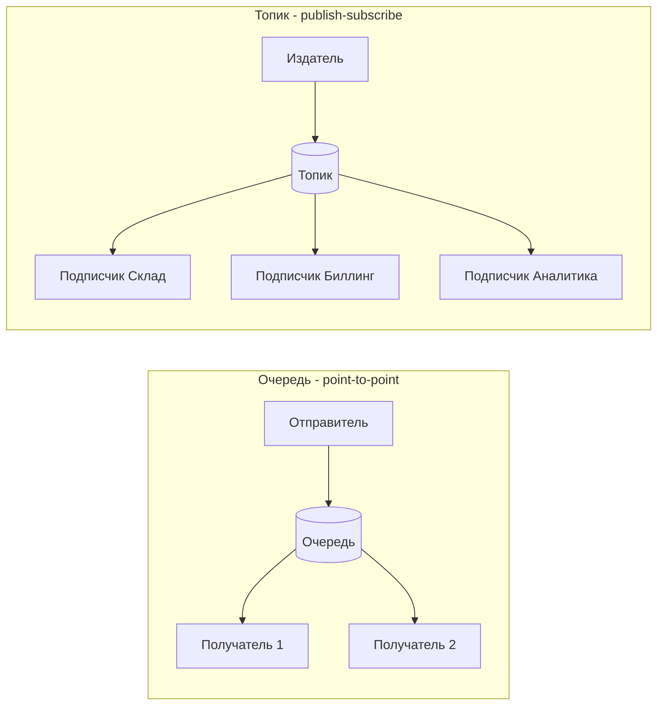
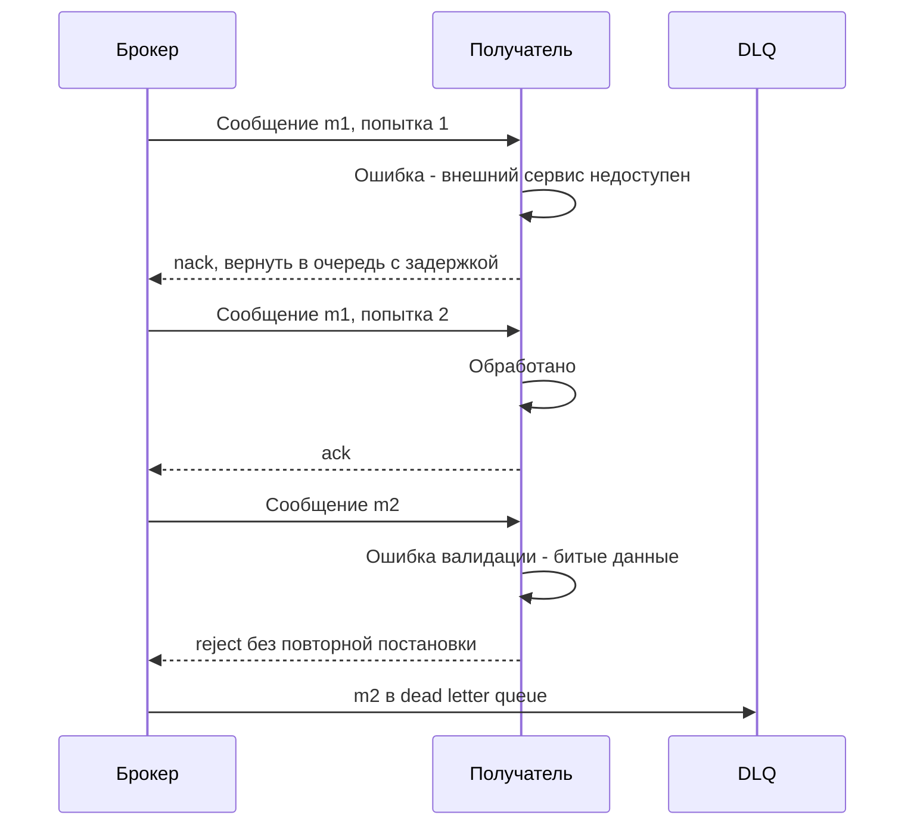
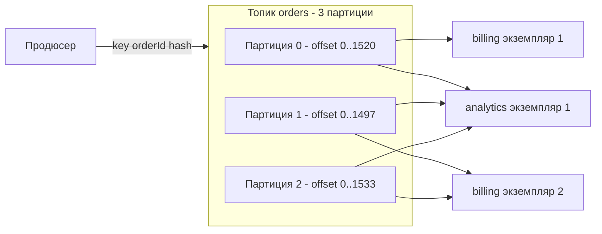
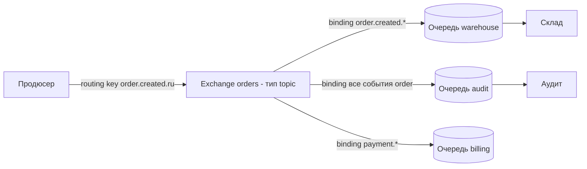

# Брокеры сообщений

Брокер сообщений (message broker) — промежуточное звено, через которое системы обмениваются сообщениями асинхронно: отправитель кладёт сообщение и идёт дальше, получатель забирает его, когда готов. Системы не обязаны быть доступны одновременно и не знают адресов друг друга. Это основа событийной архитектуры (event-driven architecture), интеграций с высокими требованиями к надёжности и сглаживания пиковой нагрузки. На странице — базовые понятия и гарантии, обзор Kafka, RabbitMQ, MQTT и других, а также правила выбора.

## Зачем брокер, если есть REST {#why}

| Синхронный вызов (REST, gRPC) | Асинхронный обмен через брокер |
|---|---|
| Вызывающий ждёт ответа | Отправитель не ждёт обработки |
| Получатель должен быть доступен прямо сейчас | Получатель может быть недоступен — сообщения дождутся его в брокере |
| Отправитель знает адрес и API получателя | Отправитель знает только топик/очередь — слабая связанность (loose coupling) |
| Пик нагрузки сразу бьёт по получателю | Брокер буферизует пик, получатель обрабатывает в своём темпе |
| Один вызов — один получатель | Одно событие могут получить многие подписчики |
| Простая отладка и трассировка | Сложнее трассировка, «где застряло сообщение» |
| Сразу известен результат | Результат — отдельным сообщением или никак (eventual consistency) |

Брокер оправдан, когда:

- событие интересно **нескольким** системам (заказ создан → склад, биллинг, аналитика, уведомления);
- получатель **может быть недоступен** или медленный, а терять данные нельзя;
- нужна **буферизация пиков** (распродажи, пакетные загрузки);
- нужна **история событий** и возможность перечитать её (Kafka);
- процессы длительные и естественно асинхронные;
- огромные потоки данных: телеметрия, логи, кликстрим, IoT.

REST лучше, когда нужен немедленный ответ (проверка, расчёт, чтение данных), пользователь ждёт результата в UI, или интеграция с внешним контрагентом через интернет (брокер обычно — внутренняя инфраструктура; для внешних — [Webhooks](/protocols/webhooks)).

## Очередь и топик {#queue-vs-topic}



| | Очередь (point-to-point) | Топик (publish/subscribe) |
|---|---|---|
| Кто получает сообщение | **Ровно один** из конкурирующих получателей (competing consumers) | **Каждый** подписчик получает свою копию |
| Назначение | Распределение работы: задачи, команды | Распространение событий |
| Масштабирование | Добавили получателей — быстрее разбираем очередь | Каждый подписчик масштабируется отдельно (группа получателей) |
| Типичные сообщения | Команды: `ProcessPayment`, `SendEmail` | События: `OrderCreated`, `PaymentSucceeded` |

На практике модели комбинируются: в Kafka каждая **consumer group** получает все сообщения топика (pub/sub), а внутри группы партиции распределены между экземплярами (очередь). В RabbitMQ fanout-exchange копирует сообщение в несколько очередей, каждую из которых разбирают конкурирующие получатели.

### Команда, событие, документ {#message-types}

| Тип | Смысл | Именование | Получатели |
|---|---|---|---|
| Команда (command) | «Сделай это» — ожидается действие | Повелительное: `ReserveStock` | Обычно один, конкретный |
| Событие (event) | «Это произошло» — факт в прошлом, отменить нельзя | Прошедшее время: `StockReserved`, `order.created` | Ноль или много, отправитель их не знает |
| Документ (document) | Передача данных (справочник, снимок) | Существительное: `ProductCatalog` | Один или много |
| Запрос–ответ (request-reply) | Асинхронный RPC: запрос с `replyTo` и `correlationId` | `GetPriceRequest` / `GetPriceReply` | Один |

## Гарантии доставки {#delivery-guarantees}

| Гарантия | Что значит | Как достигается | Риск |
|---|---|---|---|
| **At-most-once** (не более одного раза) | Сообщение доставят 0 или 1 раз | Подтверждение до обработки (auto-ack), отправка без подтверждения брокера | Потеря сообщений |
| **At-least-once** (хотя бы один раз) | Доставят 1 или более раз | Подтверждение **после** обработки, повторы при сбоях | Дубликаты |
| **Exactly-once** (ровно один раз) | Эффект обработки — ровно один | Дедупликация + транзакции в пределах одной системы | Сложно, дорого, ограниченная область действия |

::: warning Exactly-once на практике = at-least-once + идемпотентность
В распределённой системе нельзя гарантировать, что сообщение будет **доставлено** ровно один раз: получатель может обработать сообщение и упасть до отправки подтверждения — брокер обязан доставить его снова. Поэтому «exactly-once» в продуктах означает **ровно один эффект обработки** при определённых условиях:

- в Kafka — внутри Kafka: идемпотентный продюсер + транзакции для цепочки «прочитал из топика → записал в топик → закоммитил offset». Как только в цепочке появляется внешняя система (БД, REST-вызов, email), гарантия заканчивается;
- в SQS FIFO и Azure Service Bus — дедупликация повторных **отправок** в окне времени (5 минут в SQS FIFO), а не повторных обработок.

Поэтому в постановке пишем: **доставка at-least-once, получатель обрабатывает идемпотентно** по уникальному идентификатору сообщения (таблица обработанных id, upsert, проверка версии). См. [Идемпотентность](/design/idempotency).
:::

Гарантии складываются из трёх участков, и каждый надо обеспечить:

1. **Отправитель → брокер**: подтверждения публикации (Kafka `acks=all`, RabbitMQ publisher confirms, MQTT QoS 1+). И главное — атомарность «изменил БД + отправил сообщение»: паттерн **transactional outbox** (запись события в таблицу outbox в той же транзакции, отдельный процесс публикует). Без него при сбое между коммитом и отправкой событие теряется или отправляется для откатившейся транзакции.
2. **Хранение в брокере**: персистентность на диск, репликация (Kafka `replication.factor=3`, `min.insync.replicas=2`; RabbitMQ quorum queues).
3. **Брокер → получатель**: ручное подтверждение после обработки, идемпотентный обработчик (паттерн **inbox**).

Паттерны подробно — в [Интеграционных паттернах](/reliability/integration-patterns).

## Подтверждения, повторы и DLQ {#ack-retry-dlq}



| Понятие | Смысл |
|---|---|
| `ack` | Получатель подтверждает успешную обработку — брокер удаляет сообщение (или сдвигает offset) |
| `nack` / `reject` с requeue | Обработать не удалось, вернуть для повтора |
| `reject` без requeue | Отказ, сообщение уходит в DLQ (если настроена) или удаляется |
| Visibility timeout / ack timeout | Если получатель не подтвердил за отведённое время — сообщение снова становится доступным (SQS, Pub/Sub, RabbitMQ consumer timeout) |
| Prefetch / max in-flight | Сколько неподтверждённых сообщений получатель держит одновременно |
| Redelivery count | Счётчик попыток — для решения «хватит повторять» |
| **DLQ** (dead letter queue) | Очередь для сообщений, которые не удалось обработать после N попыток или которые невалидны. Требует мониторинга и процедуры разбора |

Правила обработки ошибок:

- **Временные ошибки** (таймаут, недоступность БД, `503` внешнего сервиса) — повтор с экспоненциальной задержкой. Мгновенный requeue создаёт «горячий цикл» и забивает брокер.
- **Постоянные ошибки** (невалидный формат, нарушение бизнес-правила) — сразу в DLQ, повторять бессмысленно.
- **Ядовитое сообщение (poison message)** — сообщение, на котором обработчик падает каждый раз. Без лимита попыток оно блокирует очередь (а в Kafka — всю партицию).
- В Kafka нет per-message ack и встроенной DLQ: повторы реализуются через отдельные retry-топики (`orders.retry.1m`, `orders.retry.10m`) и DLT (dead letter topic) — например, средствами Spring Kafka или Kafka Connect.
- У DLQ должен быть **владелец**, алерт на появление сообщений и инструмент переотправки (replay).

## Порядок сообщений {#ordering}

Строгий глобальный порядок и горизонтальное масштабирование несовместимы. Брокеры гарантируют порядок только в определённой области:

| Брокер | Где сохраняется порядок |
|---|---|
| Kafka | Внутри **партиции**. Сообщения с одинаковым ключом попадают в одну партицию |
| RabbitMQ | Внутри одной очереди при одном получателе. С несколькими получателями и повторами порядок нарушается |
| SQS Standard | Не гарантируется (best-effort) |
| SQS FIFO | Внутри `MessageGroupId` |
| Google Pub/Sub | Внутри ordering key (если включено) |
| Azure Service Bus | Внутри сессии (`SessionId`) |
| MQTT | Для одного топика и одного уровня QoS от одного клиента |

Практическое правило: **ключ упорядочивания = идентификатор сущности** (`orderId`, `accountId`). Тогда все события одного заказа идут по порядку, а разные заказы обрабатываются параллельно. Повторы с задержкой (retry-топики) нарушают порядок — если он критичен, защищайтесь версией сущности в сообщении.

## Apache Kafka {#kafka}

Kafka — распределённый **журнал событий** (distributed commit log). Сообщения не удаляются после прочтения, а хранятся заданное время; каждый получатель сам помнит, до какого места дочитал. Это даёт высокую пропускную способность (миллионы сообщений в секунду на кластер), возможность перечитать историю и подключать новых подписчиков к уже накопленным данным.



| Понятие | Объяснение |
|---|---|
| **Топик (topic)** | Именованный поток событий, например `orders.events.v1` |
| **Партиция (partition)** | Топик делится на партиции — упорядоченные журналы, единица параллелизма и порядка. Число партиций = максимум параллельных получателей в группе. Увеличить можно, уменьшить нельзя; при увеличении меняется распределение ключей |
| **Ключ (key)** | Определяет партицию (хэш ключа). Одинаковый ключ — одна партиция — сохранённый порядок. Без ключа сообщения распределяются по партициям без гарантии порядка |
| **Offset** | Порядковый номер сообщения в партиции. Получатель коммитит offset — «дочитал до сюда». После рестарта продолжает с закоммиченного |
| **Consumer group** | Группа экземпляров одного сервиса. Каждая партиция читается ровно одним экземпляром группы. Разные группы читают независимо |
| **Rebalance** | Перераспределение партиций при добавлении/падении экземпляров — во время него обработка приостанавливается |
| **Retention** | Срок или объём хранения (`retention.ms`, по умолчанию 7 дней; бывает «бесконечно»). Удаление — по времени, независимо от того, прочитали ли |
| **Compaction** | `cleanup.policy=compact`: Kafka хранит только **последнее** сообщение для каждого ключа. Топик становится «таблицей текущих состояний» (справочники, снимки). Сообщение с ключом и пустым значением (tombstone) удаляет ключ |
| **Репликация** | Каждая партиция копируется на несколько брокеров (`replication.factor`), `acks=all` + `min.insync.replicas` — защита от потери |
| **Заголовки (headers)** | Метаданные сообщения: `correlation-id`, тип события, версия схемы, trace context |
| **KRaft** | Встроенный механизм метаданных вместо ZooKeeper; в Kafka 4.0 ZooKeeper удалён полностью |

### Schema Registry {#schema-registry}

В Kafka сообщения — просто байты. Чтобы продюсеры и получатели договорились о формате и безопасно его меняли, используют **реестр схем** (Confluent Schema Registry, Apicurio Registry, AWS Glue Schema Registry):

- схемы в форматах [Avro, Protobuf или JSON Schema](/protocols/data-formats) регистрируются под «субъектом» (обычно `имя-топика-value`);
- в начало сообщения записывается идентификатор схемы (у Confluent — «magic byte» и 4-байтовый id), получатель по нему достаёт схему;
- реестр проверяет **совместимость** новой версии со старыми и отклоняет ломающие изменения.

| Режим совместимости | Что гарантирует | Порядок обновления |
|---|---|---|
| `BACKWARD` (по умолчанию в Confluent) | Новая схема читает данные, записанные старой | Сначала получатели, потом продюсеры |
| `FORWARD` | Старая схема читает данные, записанные новой | Сначала продюсеры, потом получатели |
| `FULL` | Оба направления | Любой порядок |
| `NONE` | Никаких проверок | Только при полной координации |
| `*_TRANSITIVE` | То же, но относительно **всех** прошлых версий, а не только последней | — |

Безопасные изменения в большинстве режимов: добавление необязательного поля со значением по умолчанию. Опасные: удаление обязательного поля, смена типа, переименование.

### Когда Kafka

- потоки событий большого объёма, event sourcing, CDC (захват изменений из БД через Debezium);
- много независимых подписчиков, в том числе появляющихся позже и читающих историю;
- обработка потоков (Kafka Streams, Flink), аналитика, озёра данных;
- нужен replay — перечитать события после исправления бага.

Не лучший выбор для: сложной маршрутизации по содержимому, очередей задач с приоритетами и отложенной доставкой, небольших систем без команды эксплуатации (кластер Kafka требует компетенций — или managed-сервиса). В Kafka 4.x развивается семантика очередей — share groups (KIP-932), но на момент написания это относительно новая функциональность.

## RabbitMQ и AMQP 0-9-1 {#rabbitmq}

RabbitMQ — классический брокер «умная маршрутизация, удаление после подтверждения». Основной протокол — **AMQP 0-9-1** (с версии 4.0 RabbitMQ также нативно поддерживает AMQP 1.0, плюс MQTT и STOMP через плагины). Сообщения публикуются не в очередь напрямую, а в **exchange**, который по правилам (bindings) раскладывает их по очередям.



| Понятие | Объяснение |
|---|---|
| **Exchange** | Точка публикации. Получает сообщение с routing key и маршрутизирует его в очереди по bindings |
| **Queue** | Очередь, где сообщения ждут получателя. Durable (переживает рестарт) или нет |
| **Binding** | Правило связи exchange → очередь (с ключом-шаблоном или условиями по заголовкам) |
| **Routing key** | Строка-адрес сообщения, например `order.created.ru` |
| **Default exchange** | Безымянный direct-exchange: routing key = имя очереди — публикация «прямо в очередь» |

Типы exchange:

| Тип | Маршрутизация | Пример |
|---|---|---|
| `direct` | Точное совпадение routing key и ключа binding | `payment.failed` → очередь `payment-alerts` |
| `topic` | Шаблон по словам, разделённым точками: `*` — ровно одно слово, `#` — ноль или более слов | `order.*.ru` ловит `order.created.ru`; `order.#` ловит все события заказов |
| `fanout` | Всем привязанным очередям, ключ игнорируется | Широковещательная рассылка события всем подписчикам |
| `headers` | По значениям заголовков сообщения (`x-match: all` или `any`) | Маршрут по `region=ru` и `priority=high` |

Ключевые механизмы RabbitMQ:

- **Publisher confirms** — брокер подтверждает продюсеру, что принял и сохранил сообщение.
- **Consumer ack** (manual ack) и **prefetch** (`basic.qos`) — сколько неподтверждённых сообщений у получателя.
- **Типы очередей:** classic, **quorum** (реплицированные на основе Raft — рекомендуются для надёжности), **streams** (журнал наподобие Kafka, с повторным чтением).
- **Dead letter exchange (DLX)** — куда уходят отклонённые, просроченные (TTL) сообщения и сообщения, превысившие лимит длины очереди; в quorum-очередях есть лимит доставок (`delivery-limit`).
- **TTL** сообщений и очередей, **приоритеты**, отложенная доставка (плагин или через TTL + DLX).
- Сообщение после `ack` **удаляется** — перечитать историю нельзя (кроме streams).

### Когда RabbitMQ

- очереди задач и команд с конкурирующими получателями;
- сложная маршрутизация по ключам и заголовкам;
- request-reply поверх брокера (`reply_to`, `correlation_id`);
- умеренные объёмы (десятки тысяч сообщений в секунду), низкая задержка;
- нужны приоритеты, TTL, отложенные сообщения.

## MQTT {#mqtt}

MQTT — лёгкий pub/sub-протокол для **IoT** и устройств с нестабильной связью: минимальный заголовок (от 2 байт), работа на слабом железе и узких каналах. Стандарт OASIS; используются версии 3.1.1 и 5.0. Брокеры: Eclipse Mosquitto, EMQX, HiveMQ, VerneMQ, а также облачные (AWS IoT Core, Azure IoT Hub — частичная поддержка). Порты: 1883 (TCP), 8883 (TLS); есть MQTT поверх [WebSocket](/protocols/websocket).

Топики — иерархические строки: `factory/line1/press7/temperature`. Подписка с шаблонами: `+` — один уровень (`factory/+/press7/temperature`), `#` — все уровни ниже (`factory/line1/#`).

| QoS | Гарантия | Механизм | Применение |
|---|---|---|---|
| **0** | At most once — «отправил и забыл» | Один пакет `PUBLISH` без подтверждения | Частая телеметрия, где потеря одного значения не важна |
| **1** | At least once — возможны дубликаты | `PUBLISH` → `PUBACK`, повтор при отсутствии подтверждения | Большинство событий; получатель дедуплицирует |
| **2** | Exactly once между двумя участниками | Четырёхшаговое рукопожатие: `PUBLISH` → `PUBREC` → `PUBREL` → `PUBCOMP` | Команды, биллинговые данные; дороже по трафику и задержке |

QoS действует на каждом участке отдельно (издатель → брокер, брокер → подписчик); итоговый уровень — минимальный из двух.

Особенности MQTT:

- **Retained message** — брокер хранит последнее сообщение топика с флагом retain и сразу отдаёт его новому подписчику («последнее известное значение» — текущее состояние датчика).
- **Last Will and Testament (LWT)** — сообщение, которое брокер опубликует от имени клиента, если тот отключится некорректно (`devices/42/status = offline`).
- **Persistent session** — брокер сохраняет подписки и сообщения QoS 1/2 для отключившегося клиента (clean session = false в 3.1.1, session expiry в 5.0).
- **MQTT 5.0** добавил: свойства пользователя (аналог заголовков), коды причин, expiry сообщений, shared subscriptions (конкурирующие получатели), request-response (`Response Topic`, `Correlation Data`), topic aliases.
- MQTT не хранит историю (кроме retained и сессий) — для аналитики сообщения перекладывают в Kafka или БД.

## Другие брокеры и облачные сервисы {#others}

**JMS, IBM MQ, ActiveMQ.** JMS (Java Message Service, теперь Jakarta Messaging) — это **API для Java**, а не сетевой протокол: два JMS-брокера разных вендоров не обязательно совместимы «по проводу». Модели — `Queue` и `Topic`, режимы подтверждения, транзакционные сессии, селекторы сообщений. **IBM MQ** — промышленный брокер, традиционный для банков и крупных предприятий: гарантированная доставка, транзакции (в том числе XA), каналы между менеджерами очередей, клиенты для Java (JMS), .NET, C, а также REST API и AMQP. **Apache ActiveMQ** (Classic и Artemis) — открытый брокер с поддержкой JMS, AMQP 1.0, STOMP, MQTT, OpenWire. При интеграции с такими системами уточняйте: менеджер очередей, канал, имена очередей, формат сообщения (часто XML или фиксированная длина), кодировку (CCSID), заголовки (MQMD: `MsgId`, `CorrelId`, `ReplyToQ`).

**AMQP 1.0** — стандарт OASIS и ISO/IEC 19464. Несмотря на название, это **другой протокол**, несовместимый с AMQP 0-9-1: в нём нет exchange и bindings, это протокол передачи сообщений между узлами. Его используют Azure Service Bus, ActiveMQ Artemis, Solace, RabbitMQ 4.x.

**NATS** — лёгкий высокопроизводительный брокер (CNCF). Core NATS — at-most-once pub/sub без хранения, subjects с шаблонами (`orders.*`, `orders.>`), встроенный request-reply. **JetStream** — слой персистентности: потоки (streams), получатели с подтверждениями, at-least-once, дедупликация по id сообщения, key-value и object store. Популярен для микросервисов и edge.

**Облачные сервисы:**

| Сервис | Модель | Особенности |
|---|---|---|
| AWS SQS | Очередь | Standard: at-least-once, порядок не гарантирован. FIFO: порядок в `MessageGroupId`, дедупликация отправок в окне 5 минут. Visibility timeout, DLQ через redrive policy, сообщение до 256 КБ |
| AWS SNS | Pub/sub | Рассылка в SQS, Lambda, HTTP, email, SMS. Связка SNS → несколько SQS — классический fan-out. Фильтры подписок |
| AWS EventBridge | Шина событий | Маршрутизация по правилам на содержимое события, интеграции с SaaS |
| Amazon MSK, Confluent Cloud | Managed Kafka | Kafka без эксплуатации кластера |
| Google Cloud Pub/Sub | Pub/sub | Push- и pull-подписки, ordering keys, режим exactly-once delivery для pull-подписок, DLQ (dead-letter topic) |
| Azure Service Bus | Очереди и топики | AMQP 1.0, сессии (порядок), транзакции, дедупликация, отложенные сообщения |
| Yandex Message Queue, Yandex Data Streams | Очереди / потоки | Совместимы с API SQS / Kinesis и Kafka соответственно |

## Сравнение Kafka, RabbitMQ и MQTT {#comparison}

| Критерий | Apache Kafka | RabbitMQ | MQTT-брокер |
|---|---|---|---|
| Модель | Распределённый журнал событий | Брокер с очередями и маршрутизацией | Лёгкий pub/sub |
| Протокол | Собственный бинарный поверх TCP | AMQP 0-9-1, AMQP 1.0, MQTT, STOMP | MQTT 3.1.1 / 5.0 |
| Хранение после чтения | Да, по retention (дни, бесконечно) | Нет, удаляется после ack (кроме streams) | Нет (кроме retained и сессий) |
| Повторное чтение (replay) | Да, сдвиг offset | Нет (кроме streams) | Нет |
| Порядок | В партиции | В очереди при одном получателе | В топике для одного клиента и QoS |
| Маршрутизация | По топику и ключу, фильтрация на стороне получателя | Гибкая: direct, topic, fanout, headers | Иерархия топиков с шаблонами |
| Гарантии | At-least-once; exactly-once внутри Kafka (транзакции) | At-least-once (confirms + ack) | QoS 0, 1, 2 |
| Подтверждение | Коммит offset (позиция, не отдельное сообщение) | Ack/nack каждого сообщения | `PUBACK` / `PUBCOMP` |
| DLQ | Нет встроенной, retry/DLT-топики | Dead letter exchange | Нет (на уровне брокера-реализации) |
| Пропускная способность | Очень высокая (сотни тысяч — миллионы сообщений/с) | Высокая (десятки тысяч сообщений/с на узел) | Зависит от брокера, рассчитан на миллионы соединений |
| Задержка | Миллисекунды–десятки мс (батчинг) | Низкая, ниже миллисекунды–миллисекунды | Низкая |
| Клиенты | Серверы, сервисы | Серверы, сервисы | Устройства, датчики, мобильные, браузеры |
| Приоритеты, TTL, отложенная доставка | Нет | Да | Message expiry (5.0) |
| Сложность эксплуатации | Высокая | Средняя | Низкая–средняя |
| Типичные сценарии | Event streaming, CDC, аналитика, event sourcing, интеграционная шина данных | Очереди задач, команды, микросервисы, request-reply | IoT, телеметрия, умные устройства, мобильные пуши |

## Формат сообщения {#message-format}

Сообщение состоит из **заголовков (метаданных)** и **тела**. Единые правила для всех сообщений компании экономят массу времени на интеграциях.

```json
{
  "headers": {
    "messageId": "0f8e2c64-5b1a-4c4e-9a53-2f4b1d7c9e10",
    "correlationId": "req-7d41c2",
    "causationId": "6a1f0c2e-1111-4d2f-8b8e-0c4f5a6b7c8d",
    "type": "order.created",
    "schemaVersion": "2",
    "source": "order-service",
    "occurredAt": "2026-10-03T09:15:27.412Z",
    "contentType": "application/json",
    "traceparent": "00-4bf92f3577b34da6a3ce929d0e0e4736-00f067aa0ba902b7-01"
  },
  "body": {
    "orderId": "ORD-42",
    "customerId": "CUST-1001",
    "total": { "amount": "1500.00", "currency": "RUB" },
    "items": [{ "sku": "SKU-1", "qty": 2 }]
  }
}
```

| Метаданные | Зачем |
|---|---|
| `messageId` | Уникальный id сообщения — ключ идемпотентности у получателя |
| `correlationId` | Связывает все сообщения и вызовы одного бизнес-процесса или запроса; для request-reply — сопоставление ответа с запросом |
| `causationId` | Id сообщения, которое вызвало это (цепочка причин) |
| `type` | Тип сообщения — по нему получатель выбирает обработчик |
| `schemaVersion` | Версия схемы тела; для Kafka часто заменяется id схемы из Schema Registry |
| `source` | Система-источник |
| `occurredAt` | Время события ([соглашения о датах](/design/data-conventions)) |
| `traceparent` | Контекст распределённой трассировки W3C Trace Context — см. [Наблюдаемость](/reliability/observability) |
| `replyTo` | Куда отправить ответ (для request-reply) |
| `expiresAt` / TTL | После какого момента сообщение не имеет смысла обрабатывать |

Метаданные лучше передавать в **нативных заголовках** брокера (Kafka headers, AMQP properties и headers, MQTT 5 user properties) — тогда маршрутизация и фильтрация не требуют разбора тела.

### CloudEvents {#cloudevents}

CloudEvents (CNCF) — стандарт конверта события, не зависящий от транспорта. Обязательные атрибуты: `specversion`, `id`, `source`, `type`; опциональные: `subject`, `time`, `datacontenttype`, `dataschema`, а также расширения. Для каждого транспорта описаны привязки (protocol bindings): HTTP, Kafka, AMQP, MQTT, NATS. В Kafka в бинарном режиме атрибуты кладутся в заголовки с префиксом `ce_`, а в теле — только данные:

```text
Kafka-сообщение (binary mode)
  key:     ORD-42
  headers: ce_specversion=1.0
           ce_id=0f8e2c64-5b1a-4c4e-9a53-2f4b1d7c9e10
           ce_source=/order-service
           ce_type=com.example.order.created
           ce_time=2026-10-03T09:15:27.412Z
           content-type=application/json
  value:   {"orderId":"ORD-42","customerId":"CUST-1001", ...}
```

CloudEvents удобен, когда одно и то же событие идёт через разные транспорты (Kafka внутри, [webhook](/protocols/webhooks) наружу) — формат метаданных остаётся единым.

## Документирование {#documentation}

Асинхронные интерфейсы описываются в [AsyncAPI](/specs/asyncapi): серверы (брокеры), каналы (топики, очереди, routing keys), операции (`send`/`receive`), сообщения со схемами и заголовками, привязки к конкретному брокеру (Kafka: ключ, партиции, consumer group; AMQP: exchange, очередь, binding). Схемы сообщений — в Schema Registry и/или JSON Schema/Avro/Protobuf. Общий шаблон постановки — [Шаблон описания интеграции](/specs/integration-template).

## Типичные ошибки {#pitfalls}

- «Двойная запись» без outbox: сохранили в БД, а публикация упала (или наоборот) — рассинхронизация систем.
- Auto-ack до обработки — тихая потеря сообщений при падении получателя.
- Неидемпотентный получатель при at-least-once — дубли платежей, писем, заказов.
- Отсутствие ключа сообщения в Kafka — события одного заказа обрабатываются не по порядку.
- Слишком мало партиций — нельзя масштабировать получателей; слишком много — нагрузка на кластер.
- Бесконечные мгновенные повторы ядовитого сообщения — очередь или партиция стоит.
- DLQ, которую никто не смотрит.
- Изменение формата сообщения без версии и проверки совместимости — получатели падают на десериализации.
- Брокер используется как база данных (запросы «найди сообщение по полю»).
- Синхронный запрос-ответ через брокер там, где пользователь ждёт результата — сложность без выгоды.
- Огромные сообщения (файлы в теле) — лучше передавать ссылку на объект в хранилище (паттерн claim check).

## На что обратить внимание аналитику {#analyst-checklist}

- Обоснован выбор асинхронного обмена и конкретного брокера (Kafka / RabbitMQ / MQTT / корпоративный MQ / облачный сервис).
- Тип взаимодействия: событие, команда, документ, request-reply; модель — очередь или pub/sub.
- Имена топиков/очередей/exchange и routing keys по соглашению об именовании; окружения.
- Схема каждого сообщения, пример, формат (JSON/Avro/Protobuf), Schema Registry и режим совместимости.
- Обязательные заголовки: `messageId`, `correlationId`, `type`, `schemaVersion`, `occurredAt`, `traceparent`.
- Гарантия доставки (обычно at-least-once) и способ идемпотентной обработки у получателя.
- Как отправитель гарантирует публикацию (outbox) и подтверждения брокера.
- Требования к порядку: ключ партиционирования / группа сообщений; что делать при нарушении порядка.
- Политика повторов: число попыток, задержки, какие ошибки временные, какие постоянные; DLQ, её владелец и процедура разбора.
- Для Kafka: число партиций, ключ, retention, compaction, consumer group, стратегия коммита offset, поведение при старте новой группы (`auto.offset.reset`).
- Для RabbitMQ: тип exchange, bindings, durable/quorum-очереди, prefetch, TTL, DLX.
- Для MQTT: QoS, retain, LWT, persistent session, структура топиков.
- Объёмы: сообщений в секунду (средне и в пике), размер сообщения, допустимая задержка (end-to-end latency).
- Безопасность: аутентификация клиентов (SASL, mTLS), ACL на топики/очереди, шифрование, ПДн в сообщениях.
- Мониторинг: лаг получателей (consumer lag), глубина очередей, размер DLQ, ошибки обработки.
- Описание в [AsyncAPI](/specs/asyncapi).

## Стандарты и ссылки {#references}

- [Apache Kafka — документация](https://kafka.apache.org/documentation/)
- [Confluent — Schema Evolution and Compatibility](https://docs.confluent.io/platform/current/schema-registry/fundamentals/schema-evolution.html)
- [RabbitMQ — AMQP 0-9-1 Model Explained](https://www.rabbitmq.com/tutorials/amqp-concepts)
- [RabbitMQ — Reliability Guide](https://www.rabbitmq.com/docs/reliability)
- [RabbitMQ — Dead Letter Exchanges](https://www.rabbitmq.com/docs/dlx)
- [MQTT Version 5.0 — OASIS Standard](https://docs.oasis-open.org/mqtt/mqtt/v5.0/mqtt-v5.0.html)
- [MQTT Version 3.1.1 — OASIS Standard](https://docs.oasis-open.org/mqtt/mqtt/v3.1.1/mqtt-v3.1.1.html)
- [OASIS AMQP 1.0](https://docs.oasis-open.org/amqp/core/v1.0/amqp-core-overview-v1.0.html)
- [Jakarta Messaging (JMS)](https://jakarta.ee/specifications/messaging/)
- [NATS — документация](https://docs.nats.io/)
- [AWS SQS — Developer Guide](https://docs.aws.amazon.com/AWSSimpleQueueService/latest/SQSDeveloperGuide/welcome.html)
- [Google Cloud Pub/Sub — документация](https://cloud.google.com/pubsub/docs/overview)
- [CloudEvents — спецификация](https://github.com/cloudevents/spec)
- [CloudEvents — Kafka Protocol Binding](https://github.com/cloudevents/spec/blob/main/cloudevents/bindings/kafka-protocol-binding.md)
- [W3C Trace Context](https://www.w3.org/TR/trace-context/)
- [Enterprise Integration Patterns — Messaging](https://www.enterpriseintegrationpatterns.com/patterns/messaging/)
- [AsyncAPI — спецификация](https://www.asyncapi.com/docs/reference/specification/latest)
