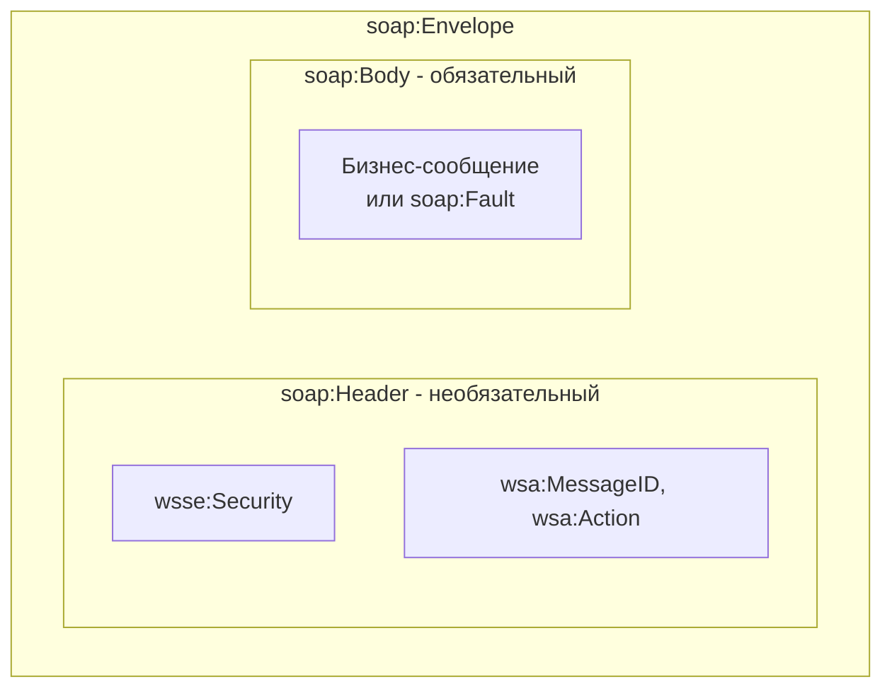
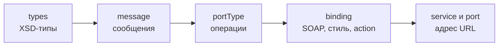
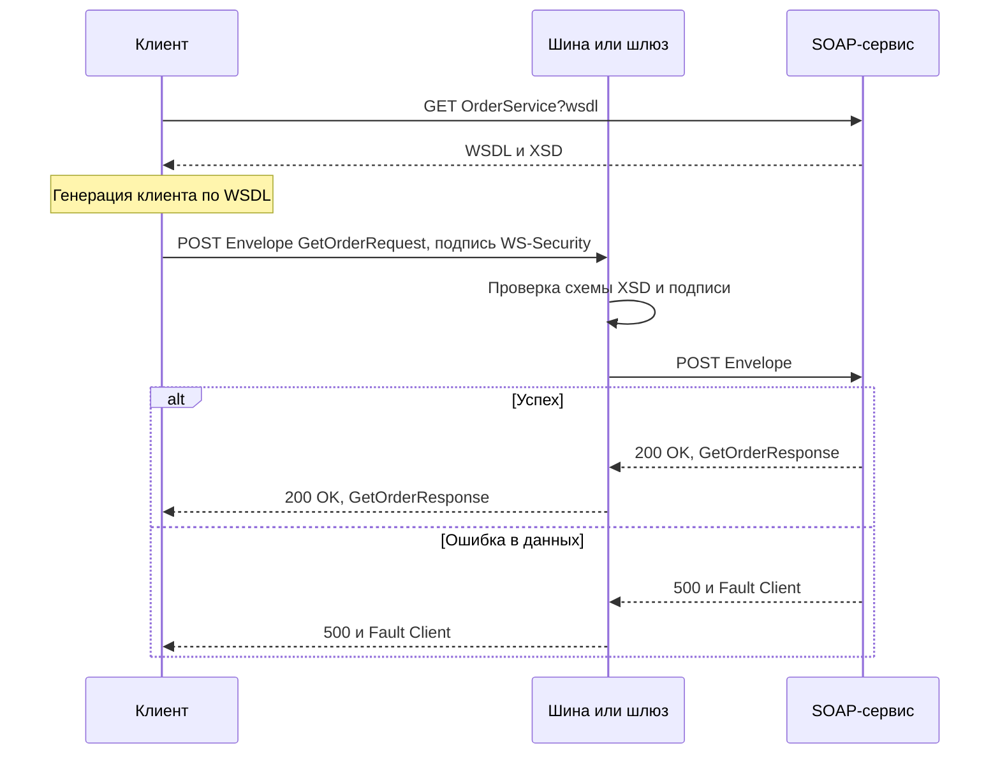

# SOAP

SOAP — протокол обмена структурированными XML-сообщениями между системами. Контракт сервиса описывается на WSDL, структура данных — на XML Schema (XSD), а стек стандартов WS-* добавляет подпись, шифрование, адресацию и надёжную доставку. SOAP считается тяжеловесным, но остаётся стандартом в банках, госсистемах (включая СМЭВ) и корпоративных шинах, поэтому аналитику интеграций нужно уверенно читать WSDL и SOAP-сообщения.

## Коротко о SOAP {#overview}

| Характеристика | Значение |
|---|---|
| Расшифровка | Изначально Simple Object Access Protocol; в SOAP 1.2 аббревиатура официально не расшифровывается |
| Стандарт | SOAP 1.1 — W3C Note (2000); SOAP 1.2 — W3C Recommendation (2003, вторая редакция 2007) |
| Формат | XML |
| Транспорт | Обычно HTTP(S); также JMS, SMTP, TCP, очереди MQ |
| Контракт | WSDL 1.1 (на практике) или WSDL 2.0 + XSD |
| Модель | Обмен сообщениями: запрос — ответ или односторонние сообщения |
| HTTP-метод | Практически всегда `POST` на один URL сервиса |
| Место в модели Ричардсона | Уровень 0: один URI, один метод, операция определяется содержимым сообщения |

## Структура SOAP-сообщения {#envelope}

SOAP-сообщение — XML-документ с корневым элементом `Envelope`.

| Элемент | Обязательность | Назначение |
|---|---|---|
| `Envelope` | Обязателен | Корневой элемент. Его пространство имён определяет версию SOAP |
| `Header` | Необязателен | Служебные данные, не относящиеся к бизнес-содержимому: безопасность (WS-Security), адресация (WS-Addressing), идентификаторы транзакций, трассировка. Состоит из блоков (header blocks) |
| `Body` | Обязателен | Полезная нагрузка: запрос, ответ или ошибка |
| `Fault` | Внутри `Body`, только при ошибке | Описание ошибки обработки |



### Пример запроса

```xml
<?xml version="1.0" encoding="UTF-8"?>
<soap:Envelope
    xmlns:soap="http://schemas.xmlsoap.org/soap/envelope/"
    xmlns:ord="http://example.com/orders/v1">
  <soap:Header>
    <ord:RequestInfo>
      <ord:RequestId>8d2f6a1e-3c4b-4f7a-9e21-5b6c7d8e9f00</ord:RequestId>
      <ord:SystemCode>CRM</ord:SystemCode>
    </ord:RequestInfo>
  </soap:Header>
  <soap:Body>
    <ord:GetOrderRequest>
      <ord:OrderId>42</ord:OrderId>
    </ord:GetOrderRequest>
  </soap:Body>
</soap:Envelope>
```

### Пример ответа

```xml
<?xml version="1.0" encoding="UTF-8"?>
<soap:Envelope
    xmlns:soap="http://schemas.xmlsoap.org/soap/envelope/"
    xmlns:ord="http://example.com/orders/v1">
  <soap:Body>
    <ord:GetOrderResponse>
      <ord:Order>
        <ord:Id>42</ord:Id>
        <ord:Status>PAID</ord:Status>
        <ord:Total currency="RUB">1500.00</ord:Total>
        <ord:CreatedAt>2026-10-01T10:15:00Z</ord:CreatedAt>
      </ord:Order>
    </ord:GetOrderResponse>
  </soap:Body>
</soap:Envelope>
```

### Атрибуты блоков заголовка

Блоки внутри `Header` могут иметь атрибуты, управляющие обработкой на промежуточных узлах:

| Атрибут | SOAP 1.1 | SOAP 1.2 | Назначение |
|---|---|---|---|
| `mustUnderstand` | `"1"` / `"0"` | `"true"` / `"false"` (также `1`/`0`) | Если получатель не понимает блок, он обязан вернуть ошибку `MustUnderstand`, а не игнорировать его |
| `actor` / `role` | `actor` | `role` | Кому адресован блок: конечному получателю или промежуточному узлу |
| `relay` | — | Есть | Передавать ли необработанный блок дальше по цепочке посредников |

## SOAP 1.1 и SOAP 1.2 {#versions}

Обе версии используются; в российских госсистемах и банках встречаются обе. Версию легко определить по пространству имён `Envelope` и по `Content-Type`.

| Признак | SOAP 1.1 | SOAP 1.2 |
|---|---|---|
| Пространство имён `Envelope` | `http://schemas.xmlsoap.org/soap/envelope/` | `http://www.w3.org/2003/05/soap-envelope` |
| `Content-Type` | `text/xml; charset=utf-8` | `application/soap+xml; charset=utf-8` |
| Действие (action) | Отдельный HTTP-заголовок `SOAPAction` (обязателен, значение в кавычках, может быть пустым `""`) | Необязательный параметр `action` в `Content-Type` |
| Коды ошибок | `VersionMismatch`, `MustUnderstand`, `Client`, `Server` | `VersionMismatch`, `MustUnderstand`, `DataEncodingUnknown`, `Sender`, `Receiver` |
| Структура `Fault` | `faultcode`, `faultstring`, `faultactor`, `detail` | `Code` (`Value`, `Subcode`), `Reason` (`Text` с `xml:lang`), `Node`, `Role`, `Detail` |
| HTTP-код для `Fault` | `500 Internal Server Error` | `400 Bad Request` для `Sender`, `500 Internal Server Error` для остальных |
| Привязка к `GET` | Нет | Есть (SOAP Response Message Exchange Pattern), используется редко |
| Статус | W3C Note (не рекомендация) | W3C Recommendation |

::: code-group

```http [SOAP 1.1]
POST /OrderService HTTP/1.1
Host: soap.example.com
Content-Type: text/xml; charset=utf-8
SOAPAction: "http://example.com/orders/v1/GetOrder"
Content-Length: 412

<?xml version="1.0" encoding="UTF-8"?>
<soap:Envelope xmlns:soap="http://schemas.xmlsoap.org/soap/envelope/"
               xmlns:ord="http://example.com/orders/v1">
  <soap:Body>
    <ord:GetOrderRequest><ord:OrderId>42</ord:OrderId></ord:GetOrderRequest>
  </soap:Body>
</soap:Envelope>
```

```http [SOAP 1.2]
POST /OrderService HTTP/1.1
Host: soap.example.com
Content-Type: application/soap+xml; charset=utf-8; action="http://example.com/orders/v1/GetOrder"
Content-Length: 410

<?xml version="1.0" encoding="UTF-8"?>
<env:Envelope xmlns:env="http://www.w3.org/2003/05/soap-envelope"
              xmlns:ord="http://example.com/orders/v1">
  <env:Body>
    <ord:GetOrderRequest><ord:OrderId>42</ord:OrderId></ord:GetOrderRequest>
  </env:Body>
</env:Envelope>
```

:::

::: warning Частая причина ошибки «не работает»
Отправка SOAP 1.2-конверта с `Content-Type: text/xml` (или наоборот) либо отсутствие `SOAPAction` в SOAP 1.1. Сервер отвечает ошибкой `VersionMismatch`, `415 Unsupported Media Type` или общим `500`. При постановке укажите версию SOAP и точное значение `SOAPAction` для каждой операции.
:::

## SOAP Fault — ошибки {#fault}

Ошибка возвращается в `Body` как элемент `Fault`. Бизнес-детали (код ошибки системы, поле, в котором ошибка) кладутся в `detail` / `Detail` по схеме, описанной в WSDL.

### Коды ошибок

| SOAP 1.1 | SOAP 1.2 | Значение | Повторять запрос? |
|---|---|---|---|
| `VersionMismatch` | `VersionMismatch` | Неверное пространство имён `Envelope` | Нет, исправить клиента |
| `MustUnderstand` | `MustUnderstand` | Получатель не понимает обязательный блок заголовка | Нет |
| — | `DataEncodingUnknown` | Неизвестная схема кодирования данных | Нет |
| `Client` | `Sender` | Ошибка в запросе: неверные данные, нет прав, нарушение схемы | Нет, исправить данные |
| `Server` | `Receiver` | Ошибка на стороне сервера, запрос корректный | Можно, с задержкой, если операция идемпотентна |

### Пример SOAP 1.1 Fault

```xml
<soap:Envelope xmlns:soap="http://schemas.xmlsoap.org/soap/envelope/">
  <soap:Body>
    <soap:Fault>
      <faultcode>soap:Client</faultcode>
      <faultstring xml:lang="ru">Заказ не найден</faultstring>
      <faultactor>http://soap.example.com/OrderService</faultactor>
      <detail>
        <ord:OrderFault xmlns:ord="http://example.com/orders/v1">
          <ord:ErrorCode>ORDER_NOT_FOUND</ord:ErrorCode>
          <ord:OrderId>42</ord:OrderId>
        </ord:OrderFault>
      </detail>
    </soap:Fault>
  </soap:Body>
</soap:Envelope>
```

### Пример SOAP 1.2 Fault

```xml
<env:Envelope xmlns:env="http://www.w3.org/2003/05/soap-envelope"
              xmlns:ord="http://example.com/orders/v1">
  <env:Body>
    <env:Fault>
      <env:Code>
        <env:Value>env:Sender</env:Value>
        <env:Subcode>
          <env:Value>ord:ValidationError</env:Value>
        </env:Subcode>
      </env:Code>
      <env:Reason>
        <env:Text xml:lang="ru">Некорректный ИНН</env:Text>
        <env:Text xml:lang="en">Invalid INN</env:Text>
      </env:Reason>
      <env:Detail>
        <ord:ValidationFault>
          <ord:Field>Customer/Inn</ord:Field>
          <ord:ErrorCode>INN_CHECKSUM</ord:ErrorCode>
        </ord:ValidationFault>
      </env:Detail>
    </env:Fault>
  </env:Body>
</env:Envelope>
```

::: tip Бизнес-ошибка: Fault или статус в ответе?
Встречаются два подхода: каждая бизнес-ошибка — отдельный типизированный Fault, описанный в WSDL; или успешный ответ с полями `ResultCode` / `ErrorMessage`. Второй подход распространён в банковских и госсервисах. Зафиксируйте в постановке, какие ситуации возвращаются как Fault, а какие — как статус в ответе, и перечислите все коды.
:::

## WSDL — контракт сервиса {#wsdl}

WSDL (Web Services Description Language) — XML-документ, описывающий, **что** умеет сервис (операции и сообщения), **как** к нему обращаться (протокол и формат) и **где** он находится (адрес). По WSDL генерируются клиентские и серверные заглушки практически на любом языке.

### Структура WSDL 1.1

| Элемент | Вопрос | Содержимое |
|---|---|---|
| `definitions` | — | Корневой элемент, объявления пространств имён, `targetNamespace` |
| `types` | Какие данные? | XML Schema (XSD) с типами и элементами запросов и ответов. Часто импортирует внешние `.xsd` |
| `message` | Из чего состоят сообщения? | Абстрактные сообщения, состоящие из частей (`part`), ссылающихся на элементы или типы из `types` |
| `portType` | Какие операции? | Абстрактный интерфейс: набор `operation` с `input`, `output`, `fault` |
| `binding` | Как передавать? | Привязка `portType` к протоколу (SOAP 1.1 или 1.2 поверх HTTP), стиль (`document`/`rpc`), кодирование (`literal`/`encoded`), `soapAction` |
| `service` | Где находится? | Набор `port`, каждый связывает `binding` с конкретным адресом (`soap:address location`) |



::: details Пример WSDL 1.1 целиком

```xml
<?xml version="1.0" encoding="UTF-8"?>
<wsdl:definitions
    name="OrderService"
    targetNamespace="http://example.com/orders/v1"
    xmlns:wsdl="http://schemas.xmlsoap.org/wsdl/"
    xmlns:soap="http://schemas.xmlsoap.org/wsdl/soap/"
    xmlns:xsd="http://www.w3.org/2001/XMLSchema"
    xmlns:tns="http://example.com/orders/v1">

  <!-- 1. Типы данных -->
  <wsdl:types>
    <xsd:schema targetNamespace="http://example.com/orders/v1"
                elementFormDefault="qualified">
      <xsd:element name="GetOrderRequest">
        <xsd:complexType>
          <xsd:sequence>
            <xsd:element name="OrderId" type="xsd:long"/>
          </xsd:sequence>
        </xsd:complexType>
      </xsd:element>
      <xsd:element name="GetOrderResponse">
        <xsd:complexType>
          <xsd:sequence>
            <xsd:element name="Order" type="tns:Order"/>
          </xsd:sequence>
        </xsd:complexType>
      </xsd:element>
      <xsd:complexType name="Order">
        <xsd:sequence>
          <xsd:element name="Id" type="xsd:long"/>
          <xsd:element name="Status" type="tns:OrderStatus"/>
          <xsd:element name="Total" type="xsd:decimal"/>
          <xsd:element name="Comment" type="xsd:string" minOccurs="0"/>
        </xsd:sequence>
      </xsd:complexType>
      <xsd:simpleType name="OrderStatus">
        <xsd:restriction base="xsd:string">
          <xsd:enumeration value="NEW"/>
          <xsd:enumeration value="PAID"/>
          <xsd:enumeration value="SHIPPED"/>
        </xsd:restriction>
      </xsd:simpleType>
      <xsd:element name="OrderFault">
        <xsd:complexType>
          <xsd:sequence>
            <xsd:element name="ErrorCode" type="xsd:string"/>
          </xsd:sequence>
        </xsd:complexType>
      </xsd:element>
    </xsd:schema>
  </wsdl:types>

  <!-- 2. Сообщения -->
  <wsdl:message name="GetOrderInput">
    <wsdl:part name="parameters" element="tns:GetOrderRequest"/>
  </wsdl:message>
  <wsdl:message name="GetOrderOutput">
    <wsdl:part name="parameters" element="tns:GetOrderResponse"/>
  </wsdl:message>
  <wsdl:message name="OrderFaultMessage">
    <wsdl:part name="fault" element="tns:OrderFault"/>
  </wsdl:message>

  <!-- 3. Абстрактный интерфейс -->
  <wsdl:portType name="OrderPortType">
    <wsdl:operation name="GetOrder">
      <wsdl:input message="tns:GetOrderInput"/>
      <wsdl:output message="tns:GetOrderOutput"/>
      <wsdl:fault name="OrderFault" message="tns:OrderFaultMessage"/>
    </wsdl:operation>
  </wsdl:portType>

  <!-- 4. Привязка к SOAP 1.1 over HTTP, document/literal -->
  <wsdl:binding name="OrderSoapBinding" type="tns:OrderPortType">
    <soap:binding style="document"
                  transport="http://schemas.xmlsoap.org/soap/http"/>
    <wsdl:operation name="GetOrder">
      <soap:operation soapAction="http://example.com/orders/v1/GetOrder"/>
      <wsdl:input><soap:body use="literal"/></wsdl:input>
      <wsdl:output><soap:body use="literal"/></wsdl:output>
      <wsdl:fault name="OrderFault"><soap:fault name="OrderFault" use="literal"/></wsdl:fault>
    </wsdl:operation>
  </wsdl:binding>

  <!-- 5. Адрес сервиса -->
  <wsdl:service name="OrderService">
    <wsdl:port name="OrderPort" binding="tns:OrderSoapBinding">
      <soap:address location="https://soap.example.com/OrderService"/>
    </wsdl:port>
  </wsdl:service>
</wsdl:definitions>
```

:::

Для SOAP 1.2 в `binding` используется пространство имён `http://schemas.xmlsoap.org/wsdl/soap12/` (префикс обычно `soap12`).

### WSDL 1.1 и WSDL 2.0

| Признак | WSDL 1.1 | WSDL 2.0 |
|---|---|---|
| Статус | W3C Note (2001) | W3C Recommendation (2007) |
| Корневой элемент | `definitions` | `description` |
| Интерфейс | `portType` | `interface` (поддерживает наследование) |
| Сообщения | Отдельный элемент `message` с `part` | Нет `message`: операции ссылаются на элементы XSD напрямую |
| Точка доступа | `port` | `endpoint` |
| Шаблоны обмена | Фиксированные: request-response, one-way и др. | Message Exchange Patterns (MEP), задаются URI |
| Привязка к HTTP без SOAP | Ограниченная | Полноценная (можно описывать REST-подобные сервисы) |
| Распространённость | **Подавляющее большинство сервисов** | Редко; многие инструменты поддерживают слабо |

На практике вы почти всегда будете работать с WSDL 1.1.

## Стили привязки: document/literal и rpc/encoded {#styles}

Атрибуты `style` (в `soap:binding` и `soap:operation`) и `use` (в `soap:body`) определяют, как формируется содержимое `Body`.

| Комбинация | Как выглядит Body | Валидация по XSD | Статус |
|---|---|---|---|
| `rpc/encoded` | Элемент с именем операции, параметры с атрибутами `xsi:type`, кодирование по правилам SOAP Encoding | Невозможна | Устарел, запрещён WS-I Basic Profile |
| `rpc/literal` | Элемент с именем операции, параметры как элементы, типы по XSD | Частично (обёртка не описана в схеме) | Допустим, встречается |
| `document/encoded` | — | — | На практике не используется |
| `document/literal` | Тело — XML-документ, полностью описанный XSD | Полная | Рекомендуемый |
| `document/literal wrapped` | Как `document/literal`, но корневой элемент тела называется как операция и содержит параметры | Полная | **Де-факто стандарт** (по умолчанию в JAX-WS, .NET WCF) |

::: code-group

```xml [rpc/encoded]
<soap:Body>
  <ns:GetOrder xmlns:ns="http://example.com/orders"
      soap:encodingStyle="http://schemas.xmlsoap.org/soap/encoding/">
    <orderId xsi:type="xsd:long">42</orderId>
  </ns:GetOrder>
</soap:Body>
```

```xml [document/literal wrapped]
<soap:Body>
  <ord:GetOrder xmlns:ord="http://example.com/orders/v1">
    <ord:OrderId>42</ord:OrderId>
  </ord:GetOrder>
</soap:Body>
```

:::

::: info WS-I Basic Profile
WS-I Basic Profile — набор правил совместимости SOAP-сервисов разных платформ (Java, .NET и др.). Ключевое требование — использовать `literal`, а не `encoded`. Если сервис соответствует Basic Profile, клиенты на разных платформах генерируются из WSDL без ручных правок.
:::

## Стек стандартов WS-* {#ws-standards}

Сила SOAP — в стандартизированных расширениях, которые передаются в заголовке сообщения и не зависят от транспорта.

| Стандарт | Организация | Назначение |
|---|---|---|
| WS-Security (WSS) | OASIS | Безопасность на уровне сообщения: токены (UsernameToken, X.509, SAML), подпись (XML Signature), шифрование (XML Encryption), метка времени |
| WS-Addressing | W3C | Адресация в заголовке: `MessageID`, `To`, `Action`, `ReplyTo`, `FaultTo`, `RelatesTo`. Позволяет асинхронный ответ на другой адрес и маршрутизацию через посредников |
| WS-ReliableMessaging | OASIS | Гарантированная доставка: последовательности сообщений, подтверждения, повторы, доставка ровно один раз и по порядку |
| MTOM / XOP | W3C | Эффективная передача бинарных вложений: файл передаётся отдельной MIME-частью, а не base64 внутри XML (экономия около 33 % объёма) |
| SwA (SOAP with Attachments) | W3C Note | Устаревший способ вложений через MIME; вытеснен MTOM |
| WS-Policy, WS-SecurityPolicy | W3C, OASIS | Декларация требований сервиса (какие токены, алгоритмы подписи) прямо в WSDL |
| WS-Trust, WS-SecureConversation | OASIS | Выпуск токенов безопасности, установка защищённого контекста для серии сообщений |
| WS-AtomicTransaction | OASIS | Распределённые транзакции (двухфазная фиксация) между сервисами; применяется редко |

### WS-Security — пример заголовка

```xml
<soap:Header>
  <wsse:Security soap:mustUnderstand="1"
      xmlns:wsse="http://docs.oasis-open.org/wss/2004/01/oasis-200401-wss-wssecurity-secext-1.0.xsd"
      xmlns:wsu="http://docs.oasis-open.org/wss/2004/01/oasis-200401-wss-wssecurity-utility-1.0.xsd">
    <wsu:Timestamp wsu:Id="TS-1">
      <wsu:Created>2026-10-03T09:00:00Z</wsu:Created>
      <wsu:Expires>2026-10-03T09:05:00Z</wsu:Expires>
    </wsu:Timestamp>
    <wsse:BinarySecurityToken
        EncodingType="http://docs.oasis-open.org/wss/2004/01/oasis-200401-wss-soap-message-security-1.0#Base64Binary"
        ValueType="http://docs.oasis-open.org/wss/2004/01/oasis-200401-wss-x509-token-profile-1.0#X509v3"
        wsu:Id="X509-1">MIIC...base64-сертификат...</wsse:BinarySecurityToken>
    <ds:Signature xmlns:ds="http://www.w3.org/2000/09/xmldsig#">
      <ds:SignedInfo>
        <!-- алгоритмы канонизации и подписи, ссылки на подписанные части: Body, Timestamp -->
      </ds:SignedInfo>
      <ds:SignatureValue>...</ds:SignatureValue>
      <ds:KeyInfo>
        <wsse:SecurityTokenReference>
          <wsse:Reference URI="#X509-1"/>
        </wsse:SecurityTokenReference>
      </ds:KeyInfo>
    </ds:Signature>
  </wsse:Security>
</soap:Header>
```

::: warning Подпись XML чувствительна к любым изменениям
XML-подпись проверяется по канонизированному XML. Переформатирование сообщения, смена префиксов пространств имён, добавление пробелов посредником (шиной, прокси, логирующим фильтром) ломают проверку подписи. Это одна из самых частых проблем на интеграционных тестах с банками и госсистемами.
:::

### WS-Addressing — асинхронный ответ

```xml
<soap:Header xmlns:wsa="http://www.w3.org/2005/08/addressing">
  <wsa:MessageID>urn:uuid:8d2f6a1e-3c4b-4f7a-9e21-5b6c7d8e9f00</wsa:MessageID>
  <wsa:To>https://soap.example.com/OrderService</wsa:To>
  <wsa:Action>http://example.com/orders/v1/GetOrder</wsa:Action>
  <wsa:ReplyTo>
    <wsa:Address>https://client.example.com/callbacks/orders</wsa:Address>
  </wsa:ReplyTo>
</soap:Header>
```

Ответ придёт на адрес из `ReplyTo` отдельным запросом и будет содержать `wsa:RelatesTo` с исходным `MessageID`.

### MTOM — передача файла

```http
POST /DocumentService HTTP/1.1
Content-Type: multipart/related; type="application/xop+xml"; boundary="uuid:b1c2"; start="<root@example.com>"; start-info="text/xml"
SOAPAction: "http://example.com/docs/Upload"

--uuid:b1c2
Content-Type: application/xop+xml; charset=UTF-8; type="text/xml"
Content-ID: <root@example.com>

<soap:Envelope xmlns:soap="http://schemas.xmlsoap.org/soap/envelope/">
  <soap:Body>
    <doc:Upload xmlns:doc="http://example.com/docs">
      <doc:FileName>contract.pdf</doc:FileName>
      <doc:Content>
        <xop:Include xmlns:xop="http://www.w3.org/2004/08/xop/include" href="cid:file1@example.com"/>
      </doc:Content>
    </doc:Upload>
  </soap:Body>
</soap:Envelope>
--uuid:b1c2
Content-Type: application/pdf
Content-Transfer-Encoding: binary
Content-ID: <file1@example.com>

...бинарное содержимое PDF...
--uuid:b1c2--
```

## Типичный обмен {#flow}



## SOAP в 2020-х: где уместен {#when}

SOAP почти не выбирают для новых публичных API, но он остаётся массовым там, где важны строгий контракт, подпись сообщений и долгий жизненный цикл систем.

| Область | Почему SOAP |
|---|---|
| **Госсистемы, СМЭВ** | СМЭВ 3 — SOAP-сервис с XML-схемами видов сведений и обязательной электронной подписью по ГОСТ (XMLDSig). Обмен асинхронный, через очереди: отправка запроса (`SendRequest`), периодическое получение ответа (`GetResponse`) и подтверждение получения (`Ack`). Протокол и схемы утверждены, изменить их нельзя |
| **Банки и финансы** | Юридически значимый обмен, подпись сообщений, жёсткий аудит; многолетние АБС и процессинговые системы |
| **Легаси ESB** | IBM Integration Bus, Oracle Service Bus, SAP PI/PO, BizTalk исторически работают с SOAP и WSDL |
| **Корпоративный B2B** | Страхование, логистика, телеком, авиация — отраслевые стандарты обмена на XML и SOAP |
| **Платформы 1С и SAP** | Публикация веб-сервисов из 1С и SAP — штатный механизм, клиенты генерируются по WSDL |

**SOAP оправдан, если:**
- контрагент предоставляет только SOAP-сервис (наиболее частый случай);
- нужна подпись и шифрование отдельных частей сообщения, сохраняющиеся при прохождении через посредников (WS-Security), а не только защита канала (TLS);
- нужен строгий машинно-проверяемый контракт с валидацией XSD на шине;
- в организации уже есть инфраструктура и компетенции SOAP.

**SOAP не стоит выбирать, если:**
- проектируется новое API для веба, мобильных приложений или широкого круга партнёров — выбирайте [REST](/protocols/rest);
- важны производительность и малый размер сообщений — выбирайте [gRPC](/protocols/grpc);
- клиент — браузер.

::: tip Адаптер к SOAP
Если ваша система работает на REST, а контрагент — на SOAP, выделите адаптер (интеграционный сервис или маршрут на шине), который транслирует внутреннюю модель в SOAP-сообщения. Так SOAP-специфика (подпись, конверт, WSDL) не распространяется по всем системам. См. [Интеграционные паттерны](/reliability/integration-patterns).
:::

## Плюсы и минусы {#pros-cons}

| Плюсы | Минусы |
|---|---|
| Строгий контракт WSDL + XSD, кодогенерация клиентов | Многословный XML: сообщения в разы больше JSON |
| Валидация сообщений по схеме на любом узле | Медленнее разбор, выше нагрузка на CPU, особенно с подписью |
| Независимость от транспорта (HTTP, JMS, SMTP) | Не использует возможности HTTP: кэширование, коды состояния, методы |
| Стандартизированные безопасность и надёжность (WS-*) | Сложность стека WS-*, несовместимости реализаций |
| Встроенная модель ошибок (Fault) | Плохо подходит для браузеров и мобильных клиентов |
| Зрелые инструменты и долгий жизненный цикл | Сложнее отлаживать вручную, меньше специалистов |

## Инструменты {#tools}

| Инструмент | Назначение |
|---|---|
| SoapUI (open source) / ReadyAPI | Импорт WSDL, генерация запросов-шаблонов, тестовые наборы, моки сервисов, WS-Security |
| Postman | Отправка SOAP-запросов как raw XML, импорт WSDL |
| `curl` | Быстрая проверка: `curl -X POST -H "Content-Type: text/xml" -H "SOAPAction: ..." --data @request.xml` |
| JAX-WS `wsimport`, Apache CXF `wsdl2java` | Генерация Java-клиента по WSDL |
| `dotnet-svcutil`, WCF | Генерация .NET-клиента |
| `zeep` (Python) | SOAP-клиент для Python, позволяет посмотреть операции WSDL: `python -m zeep URL_WSDL` |
| XML-редакторы (Oxygen, VS Code с XML-расширениями) | Просмотр и валидация XSD и WSDL |

## Как аналитику читать WSDL {#reading-wsdl}

Читайте WSDL **снизу вверх** — от адреса к типам данных.

1. **`service` → `port`:** найдите адрес сервиса (`soap:address location`). Часто в WSDL указан тестовый или внутренний адрес — уточните реальные адреса стендов.
2. **`binding`:** определите версию SOAP по пространству имён (`wsdl/soap/` — 1.1, `wsdl/soap12/` — 1.2), стиль (`document`/`rpc`), `use` (`literal`/`encoded`) и значение `soapAction` для каждой операции.
3. **`portType`:** перечень операций — это и есть список методов сервиса. Для каждой посмотрите `input`, `output` и `fault`. Операция без `output` — односторонняя (one-way).
4. **`message`:** найдите, на какие элементы XSD ссылаются сообщения.
5. **`types` и внешние XSD:** изучите структуру запросов и ответов. Обращайте внимание на:
   - `minOccurs="0"` — поле необязательное; по умолчанию `minOccurs="1"` (обязательное);
   - `maxOccurs="unbounded"` — список;
   - `nillable="true"` — допускается `xsi:nil="true"` (явный null), это не то же самое, что отсутствие элемента;
   - `xsd:enumeration` — перечень допустимых значений;
   - `xsd:pattern`, `maxLength`, `totalDigits`, `fractionDigits` — ограничения форматов;
   - `xsd:choice` — один из вариантов;
   - типы дат: `xsd:date`, `xsd:dateTime` (с часовым поясом или без).
6. **`xsd:import` / `xsd:include`:** проверьте, что все внешние схемы доступны. Отсутствующая схема — частая причина ошибок генерации клиента.
7. **Политики (`wsp:Policy`):** если есть, в них описаны требования безопасности (подпись, шифрование, токены).

::: tip Быстрый способ разобраться
Импортируйте WSDL в SoapUI: он покажет список операций и сгенерирует пример запроса для каждой с заполнителями `?` на месте значений. Это быстрее, чем читать XSD вручную, и удобно для приложения к постановке.
:::

## Типичные ошибки и антипаттерны {#antipatterns}

- Перепутаны версии SOAP: конверт 1.2 с `Content-Type: text/xml` и наоборот.
- Отсутствует или неверен `SOAPAction` (SOAP 1.1): многие серверы маршрутизируют операции именно по нему.
- Ручное формирование XML конкатенацией строк: ошибки экранирования (`&`, `<`), кодировки и пространств имён. Используйте генерацию по WSDL.
- Посредник переформатирует подписанное сообщение — подпись перестаёт проходить проверку.
- Неучтённое различие между отсутствием элемента и `xsi:nil="true"`.
- Таймауты по умолчанию слишком малы для тяжёлых операций с подписью и проверкой сертификатов.
- Огромные вложения в base64 внутри XML вместо MTOM: рост объёма и потребления памяти.
- Нет контроля версий WSDL: изменения схемы «тихо» ломают сгенерированных клиентов.

## На что обратить внимание аналитику {#analyst-checklist}

- Получен актуальный WSDL и все импортируемые XSD; зафиксированы их версии.
- Указана версия SOAP (1.1 или 1.2), значение `SOAPAction` / `action` для каждой операции, стиль привязки.
- Указаны адреса сервиса для всех стендов (тест, предпрод, прод) и способ сетевого доступа (интернет, VPN, закрытый контур).
- Для каждой операции описано соответствие полей XSD полям вашей системы, обязательность, форматы, справочники значений.
- Описаны все Fault и бизнес-коды ошибок, поведение системы на каждый (повтор, ручной разбор, уведомление).
- Описаны требования безопасности: TLS или mTLS, WS-Security (какие токены, что подписывается, алгоритмы, ГОСТ), сертификаты и порядок их обновления.
- Определено, синхронный это обмен или асинхронный (WS-Addressing, очереди, как в СМЭВ: отправка, опрос, подтверждение).
- Определены таймауты, политика повторов и идемпотентность операций.
- Описан способ передачи файлов (MTOM или base64) и ограничения на размер.
- Предусмотрено логирование сообщений с маскированием персональных данных и сохранением подписанных оригиналов для разбора споров.
- Для СМЭВ: указаны вид сведений, версия схемы, тестовая среда и порядок регистрации информационной системы.

## Стандарты и ссылки {#references}

- [SOAP Version 1.2 Part 1: Messaging Framework (W3C)](https://www.w3.org/TR/soap12-part1/)
- [SOAP Version 1.2 Part 2: Adjuncts (W3C)](https://www.w3.org/TR/soap12-part2/)
- [Simple Object Access Protocol (SOAP) 1.1 (W3C Note)](https://www.w3.org/TR/2000/NOTE-SOAP-20000508/)
- [Web Services Description Language (WSDL) 1.1 (W3C Note)](https://www.w3.org/TR/wsdl.html)
- [Web Services Description Language (WSDL) Version 2.0 (W3C)](https://www.w3.org/TR/wsdl20/)
- [XML Schema Part 1: Structures (W3C)](https://www.w3.org/TR/xmlschema-1/)
- [OASIS Web Services Security (WSS)](https://www.oasis-open.org/committees/wss/)
- [Web Services Addressing 1.0 — Core (W3C)](https://www.w3.org/TR/ws-addr-core/)
- [SOAP Message Transmission Optimization Mechanism (MTOM)](https://www.w3.org/TR/soap12-mtom/)
- [XML Signature Syntax and Processing (W3C)](https://www.w3.org/TR/xmldsig-core1/)
- [WS-I Basic Profile 1.1](https://www.ws-i.org/Profiles/BasicProfile-1.1.html)
- [SoapUI Documentation](https://www.soapui.org/docs/)
- [Технологический портал СМЭВ](https://info.gosuslugi.ru/)
