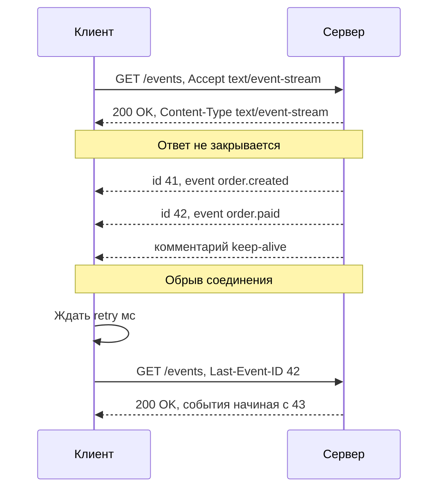
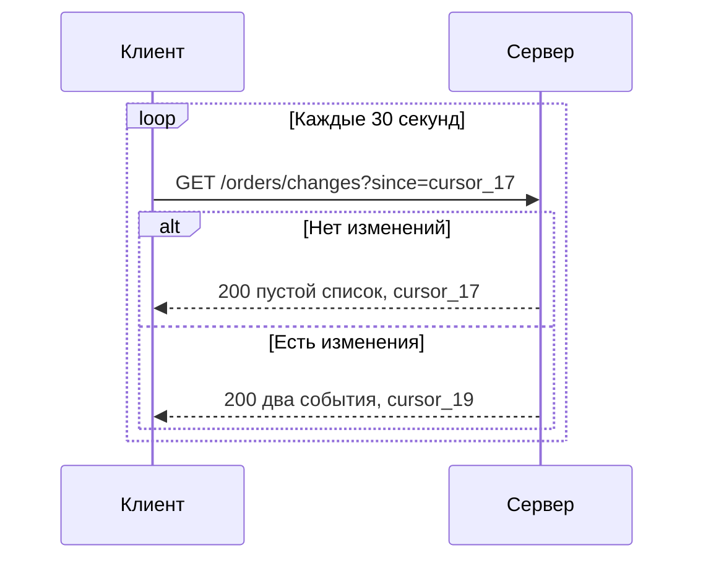
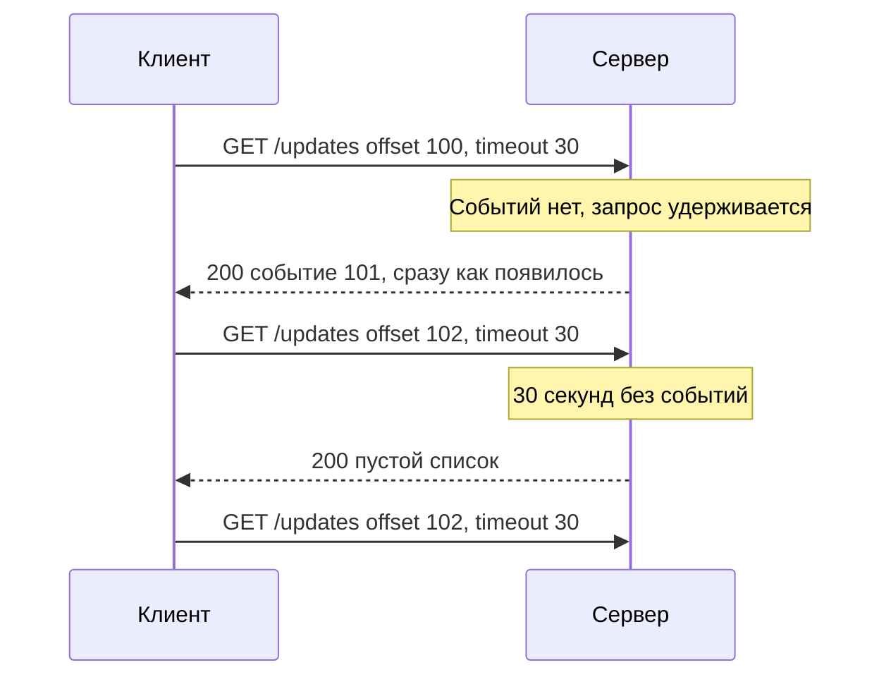
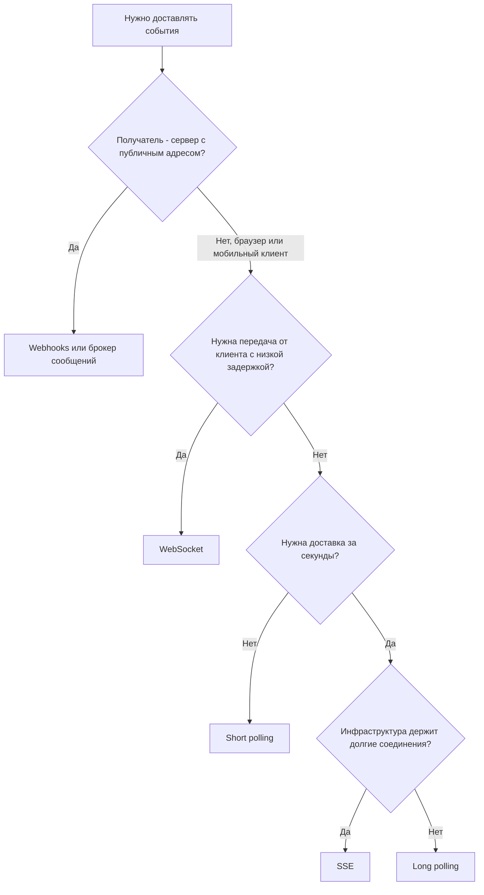

# SSE и Long Polling

Как сервер может сообщить клиенту о событии, если HTTP устроен по схеме «запрос клиента → ответ сервера»? На этой странице — три классических способа «push поверх HTTP»: **Server-Sent Events (SSE)** — однонаправленный поток событий от сервера, **short polling** — периодический опрос и **long polling** — опрос с удержанием запроса. В конце — сравнение со всеми альтернативами ([WebSocket](/protocols/websocket), [Webhooks](/protocols/webhooks)) и правила выбора.

## Server-Sent Events {#sse}

SSE — стандарт из спецификации HTML (WHATWG HTML Living Standard, раздел «Server-sent events»). Клиент открывает обычный HTTP-запрос `GET`, сервер отвечает с `Content-Type: text/event-stream` и **не закрывает ответ**: по мере появления событий дописывает их в тело. В браузере для этого есть готовый API `EventSource` со встроенным переподключением.



### Пример обмена

::: code-group

```http [Запрос]
GET /api/v1/orders/events HTTP/1.1
Host: api.example.com
Accept: text/event-stream
Cache-Control: no-cache
Authorization: Bearer eyJhbGciOi...
```

```http [Ответ (поток)]
HTTP/1.1 200 OK
Content-Type: text/event-stream; charset=utf-8
Cache-Control: no-cache
Connection: keep-alive
X-Accel-Buffering: no

retry: 5000

: соединение установлено

id: 41
event: order.created
data: {"orderId":"ORD-41","status":"NEW"}

id: 42
event: order.paid
data: {"orderId":"ORD-42","amount":"1500.00","currency":"RUB"}

: keep-alive

id: 43
data: первая строка многострочного сообщения
data: вторая строка

```

:::

### Формат потока {#format}

Поток — текст в **UTF-8** (другие кодировки не допускаются), разбитый на строки. Событие — группа строк `поле: значение`, завершается **пустой строкой**. Только после пустой строки клиент «отдаёт» событие приложению.

| Поле | Назначение | Детали |
|---|---|---|
| `data` | Полезная нагрузка | Можно повторять: несколько строк `data` склеиваются через перевод строки. Обычно одна строка JSON |
| `event` | Тип события | В `EventSource` подписка через `addEventListener('order.paid', ...)`. Без поля тип = `message` |
| `id` | Идентификатор события | Браузер запоминает последний `id` и при переподключении отправляет его в заголовке `Last-Event-ID` |
| `retry` | Задержка переподключения, мс | Целое число. Задаёт, через сколько клиент переподключится после обрыва |
| `:` в начале строки | Комментарий | Игнорируется клиентом. Используется как heartbeat, чтобы прокси не закрыли «молчащее» соединение |

Тонкости формата:

- Один пробел после двоеточия отбрасывается: `data: x` и `data:x` дают одно и то же.
- Строки, не являющиеся известными полями, игнорируются — формат расширяем.
- Переводы строк внутри JSON недопустимы в одной строке `data` — сериализуйте JSON в одну строку или используйте несколько `data`.
- Бинарные данные напрямую не передаются — только Base64 или ссылкой.

### Восстановление после обрыва: Last-Event-ID {#last-event-id}

Встроенный механизм догрузки пропущенных событий:

1. Сервер присваивает каждому событию `id` — монотонный номер, позицию в журнале или offset.
2. При обрыве `EventSource` ждёт `retry` миллисекунд (по умолчанию — значение браузера, порядка нескольких секунд) и повторяет запрос с заголовком `Last-Event-ID: 42`.
3. Сервер досылает события после 42 из буфера/журнала.

Сервер должен уметь отдать события «с позиции» — это требование к хранилищу (кольцевой буфер, таблица событий, топик Kafka). Если позиция слишком старая и событий уже нет, сервер должен сообщить об этом отдельным событием (например, `event: resync`), а клиент — перечитать состояние через REST.

### EventSource API {#eventsource}

```js
const es = new EventSource('/api/v1/orders/events', { withCredentials: true });

es.addEventListener('order.paid', (e) => {
  const payload = JSON.parse(e.data);
  console.log('Оплачен', payload.orderId, 'lastEventId =', e.lastEventId);
});

es.onmessage = (e) => { /* события без поля event */ };
es.onerror = () => { /* браузер сам переподключится, если readyState = CONNECTING */ };

// es.close() — окончательно закрыть, без переподключения
```

Как сервер может управлять клиентом `EventSource`:

| Ответ сервера | Поведение браузера |
|---|---|
| `200` + `text/event-stream` | Поток открыт |
| Обрыв соединения, сеть | Автоматическое переподключение через `retry` |
| `204 No Content` | Переподключения **не будет** — способ корректно «выключить» клиента |
| Любой другой статус (`401`, `403`, `500`, `503`) или иной `Content-Type` | Ошибка, соединение закрывается, автоматического переподключения нет |

### Ограничения SSE {#limitations}

- **Только сервер → клиент.** Команды от клиента отправляются отдельными HTTP-запросами (обычно это нормально: «действия по REST, уведомления по SSE»).
- **Только текст UTF-8.**
- **`EventSource` не умеет задавать заголовки**, в том числе `Authorization`, и не умеет `POST`. Варианты: cookie (`withCredentials`), короткоживущий токен в query, либо вместо `EventSource` читать поток через `fetch()` и `ReadableStream` (тогда переподключение и `Last-Event-ID` реализуются вручную или библиотекой).
- **Лимит соединений в HTTP/1.1.** Браузеры держат не более 6 соединений на один хост (origin). Шесть вкладок с SSE исчерпают лимит, и обычные запросы к API начнут ждать. В HTTP/2 все потоки мультиплексируются в одном соединении (лимит одновременных потоков согласуется сторонами, обычно 100 и больше) — для SSE в браузере HTTP/2 практически обязателен.
- **Буферизация на прокси.** nginx, CDN, API-шлюзы и сжатие могут накапливать ответ и отдавать его кусками или целиком в конце. Нужно отключать: `X-Accel-Buffering: no` (nginx), `proxy_buffering off`, не сжимать поток или сбрасывать буфер после каждого события.
- **Таймауты простоя** на балансировщиках — отправляйте комментарий-heartbeat каждые 15–30 секунд.
- **Каждое соединение занимает ресурсы сервера** — как и WebSocket, SSE требует асинхронного (неблокирующего) сервера и планирования ёмкости.

### SSE и стриминг ответов LLM {#llm-streaming}

SSE пережил второе рождение благодаря API больших языковых моделей. OpenAI, Anthropic, Google и большинство совместимых с ними API при `"stream": true` отдают ответ модели как поток SSE — токен за токеном, чтобы пользователь видел текст сразу.

```http
POST /v1/messages HTTP/1.1
Host: api.anthropic.com
Content-Type: application/json
Accept: text/event-stream

{"model": "...", "max_tokens": 1024, "stream": true, "messages": [{"role": "user", "content": "Привет"}]}
```

```text
event: message_start
data: {"type":"message_start","message":{"id":"msg_01...","role":"assistant"}}

event: content_block_delta
data: {"type":"content_block_delta","index":0,"delta":{"type":"text_delta","text":"Здрав"}}

event: content_block_delta
data: {"type":"content_block_delta","index":0,"delta":{"type":"text_delta","text":"ствуйте!"}}

event: message_stop
data: {"type":"message_stop"}
```

Особенности такого применения:

- запрос — `POST` с телом, поэтому `EventSource` не подходит: клиенты читают поток через `fetch`/HTTP-клиент и парсят формат SSE сами (или через SDK);
- поток конечен: заканчивается событием-терминатором (`message_stop` у Anthropic, `data: [DONE]` у OpenAI Chat Completions);
- `Last-Event-ID` обычно не поддерживается — при обрыве запрос повторяют целиком;
- ошибки посреди потока приходят отдельным событием (например, `event: error`), потому что статус `200` уже отправлен.

::: tip Тот же приём для своих API
Отдача длинного результата частями через SSE в ответ на `POST` — удобный паттерн для генерации отчётов, прогресса длительных операций, построчной выгрузки. Альтернативы — [асинхронные операции](/design/async-operations) с опросом статуса.
:::

## Short polling {#short-polling}

Клиент с фиксированным интервалом спрашивает сервер «есть ли что-то новое?». Самый простой и самый надёжный способ, но с компромиссом между задержкой и нагрузкой.



```http
GET /api/v1/orders/changes?since=c_000017&limit=100 HTTP/1.1
Host: api.example.com
If-None-Match: "c_000017"
```

```json
{
  "items": [
    { "eventId": "e-18", "type": "order.paid", "orderId": "ORD-42", "occurredAt": "2026-10-03T09:15:27Z" },
    { "eventId": "e-19", "type": "order.shipped", "orderId": "ORD-40", "occurredAt": "2026-10-03T09:15:31Z" }
  ],
  "nextCursor": "c_000019",
  "hasMore": false
}
```

Правила хорошего polling:

- **Курсор, а не время.** `since=<курсор>` (монотонный id, позиция журнала) надёжнее, чем `updatedAfter=<время>`: время может совпадать у нескольких записей, а часы — расходиться. Если по времени — то с перекрытием окна и дедупликацией. См. [Пагинация](/design/pagination).
- **Условные запросы.** `ETag` + `If-None-Match` → `304 Not Modified` экономит трафик и ресурсы. См. [Кэширование](/design/caching).
- **Интервал из требований к свежести данных**, а не «на всякий случай раз в секунду». Сервер может подсказывать интервал заголовком `Retry-After` или полем в ответе.
- **Jitter** — тысячи клиентов не должны стучаться в одну и ту же секунду.
- **Rate limit** — учитывайте polling в лимитах, см. [Rate limiting](/design/rate-limiting).

## Long polling {#long-polling}

Клиент отправляет запрос, а сервер **не отвечает сразу**, если новых данных нет: держит запрос открытым до появления события или до таймаута (обычно 20–60 секунд). Получив ответ, клиент тут же отправляет следующий запрос. Так получается почти мгновенная доставка поверх обычного HTTP. Проблемы и практики описаны в RFC 6202.



Известный пример — Telegram Bot API, метод `getUpdates` с параметрами `offset` и `timeout` (альтернатива — режим webhook).

Особенности long polling:

| Аспект | Что учесть |
|---|---|
| Таймаут сервера | Должен быть меньше таймаутов клиента, прокси и балансировщика (часто 60 с). Сервер отвечает пустым `200` (или `204`) по истечении своего таймаута |
| Подтверждение получения | Курсор/offset в следующем запросе = подтверждение обработки предыдущих событий. Если клиент упал после получения — он запросит с прежнего offset и получит события повторно |
| Окно между запросами | События между ответом и следующим запросом не теряются, если сервер хранит журнал и работает по offset |
| Ресурсы сервера | Каждый удерживаемый запрос занимает соединение; нужен асинхронный сервер |
| Несколько клиентов одного пользователя | Решите, получает ли каждый свою копию событий (свой offset) или они конкурируют |
| Ошибки | При `5xx` или сетевой ошибке — пауза с экспоненциальной задержкой, иначе клиент «заспамит» сервер циклом мгновенных ошибок |

::: info Long polling как fallback
Socket.IO, SignalR, SockJS используют long polling как запасной транспорт там, где WebSocket заблокирован корпоративным прокси. Для этого режима нужны sticky sessions на балансировщике.
:::

## Сравнение всех способов {#comparison}

| Критерий | Short polling | Long polling | SSE | WebSocket | Webhooks |
|---|---|---|---|---|---|
| Кто инициирует соединение | Клиент | Клиент | Клиент | Клиент | **Сервер-источник** вызывает получателя |
| Направление данных | Сервер → клиент (ответом) | Сервер → клиент (ответом) | Сервер → клиент | Двунаправленное | Источник → получатель |
| Задержка доставки | До интервала опроса | Почти мгновенно | Мгновенно | Мгновенно | Почти мгновенно (+ ретраи) |
| Нагрузка при отсутствии событий | Высокая (пустые запросы) | Средняя (удерживаемые запросы) | Низкая (открытое соединение + heartbeat) | Низкая | Нулевая |
| Соединение | Короткие запросы | Удерживаемые запросы | Долгоживущее HTTP | Долгоживущее, отдельный протокол | Короткие запросы |
| Формат | Любой | Любой | Текст UTF-8 | Текст и бинарные | Любой (обычно JSON) |
| Восстановление пропущенного | Курсор | Offset/курсор | Встроено (`Last-Event-ID`) | Вручную | Повторная доставка отправителем |
| Работа через прокси и firewall | Отлично | Хорошо | Хорошо (если нет буферизации) | Иногда проблемы | Получателю нужен публичный входящий эндпоинт |
| Работа в браузере | Да | Да | Да (`EventSource`) | Да | Нет (браузер не может принять вызов) |
| Масштабирование сервера | Просто (stateless) | Средне | Средне (stateful) | Сложно (stateful, бэкплейн) | Просто у получателя, очереди и ретраи у отправителя |
| Сложность реализации | Минимальная | Низкая | Низкая | Высокая | Средняя (подписи, ретраи, идемпотентность) |
| Типичное применение | Редкие изменения, простые интеграции | Боты, чаты без WS, fallback | Уведомления, ленты, прогресс, стриминг LLM | Чаты, котировки, совместная работа, игры | Интеграция сервер–сервер, SaaS-уведомления |

## Как выбрать {#how-to-choose}



Практические правила:

- **Межсистемная интеграция сервер–сервер:** [Webhooks](/protocols/webhooks) — если источник внешний и готов вызывать вас; [брокер сообщений](/protocols/messaging) — внутри компании и при высоких требованиях к гарантиям; polling по курсору — если получатель не может принимать входящие запросы (закрытый контур, нет публичного адреса).
- **Уведомления в UI** (статусы, ленты, счётчики): SSE. Действия пользователя — обычным REST.
- **Интерактив в обе стороны** (чат, совместное редактирование): [WebSocket](/protocols/websocket).
- **Стриминг длинного результата** (LLM, прогресс отчёта): SSE в ответ на `POST`.
- **Сомневаетесь и нагрузка небольшая** — начните с polling: он самый простой в эксплуатации и отладке.

::: warning Push — это уведомление, а не источник истины
Для всех push-механизмов (SSE, WebSocket, long polling) действует правило: потерянное или задублированное событие не должно ломать данные. Клиент обрабатывает события идемпотентно и умеет перечитать актуальное состояние через REST.
:::

## Типичные ошибки {#pitfalls}

- SSE за nginx или API-шлюзом без отключения буферизации — события приходят пачками раз в минуту или в конце.
- SSE в браузере по HTTP/1.1 при нескольких вкладках — исчерпан лимит 6 соединений, приложение «зависает».
- Отсутствие `id` у событий — `Last-Event-ID` не работает, после обрыва события теряются.
- Ответ `401` на SSE-запрос при истекшем токене — `EventSource` не переподключится, клиент должен сам обновить токен и открыть поток заново.
- Long polling с серверным таймаутом больше, чем у балансировщика, — клиенты получают `504` вместо пустого ответа.
- Polling по `updatedAfter` со строгим сравнением времени — теряются записи с одинаковой меткой времени.
- Polling каждую секунду «для надёжности» тысячами клиентов без jitter и условных запросов.

## На что обратить внимание аналитику {#analyst-checklist}

- Выбран механизм доставки и записано обоснование (задержка, направление, кто получатель, инфраструктура).
- Для SSE: URL потока, способ аутентификации (cookie, токен в query, `fetch` с заголовком), каталог типов событий (`event`) и схемы `data`.
- Формат `id` событий и глубина хранения для `Last-Event-ID`; поведение, если позиция устарела (`resync`).
- Значение `retry`, интервал heartbeat-комментариев, таймауты на прокси и балансировщиках, отключение буферизации.
- HTTP/2 для браузерных клиентов SSE.
- Поведение при истечении токена и коды ответа (`204` — остановить клиента).
- Для polling: курсор вместо времени, размер страницы, рекомендуемый интервал, `ETag`/`304`, лимиты запросов.
- Для long polling: серверный таймаут, параметр `timeout`, семантика offset (подтверждение обработки), задержка при ошибках.
- Идемпотентная обработка событий на клиенте и способ получить полный снимок состояния.
- Описание событийного канала в [AsyncAPI](/specs/asyncapi), REST-эндпоинтов — в [OpenAPI](/specs/openapi).

## Стандарты и ссылки {#references}

- [WHATWG HTML Living Standard — Server-sent events](https://html.spec.whatwg.org/multipage/server-sent-events.html)
- [MDN — Using server-sent events](https://developer.mozilla.org/en-US/docs/Web/API/Server-sent_events/Using_server-sent_events)
- [MDN — EventSource](https://developer.mozilla.org/en-US/docs/Web/API/EventSource)
- [RFC 6202 — Known Issues and Best Practices for the Use of Long Polling and Streaming in Bidirectional HTTP](https://www.rfc-editor.org/rfc/rfc6202)
- [RFC 9113 — HTTP/2](https://www.rfc-editor.org/rfc/rfc9113)
- [Anthropic — Streaming Messages](https://docs.anthropic.com/en/docs/build-with-claude/streaming)
- [OpenAI — Streaming API responses](https://platform.openai.com/docs/guides/streaming-responses)
- [Telegram Bot API — getUpdates](https://core.telegram.org/bots/api#getupdates)
