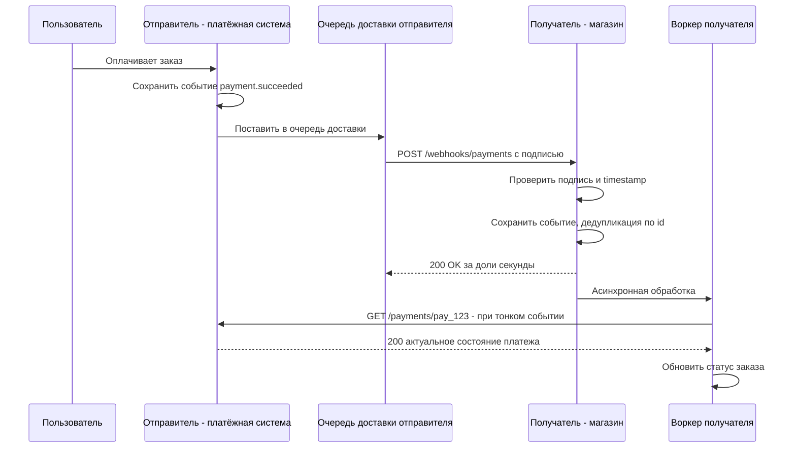
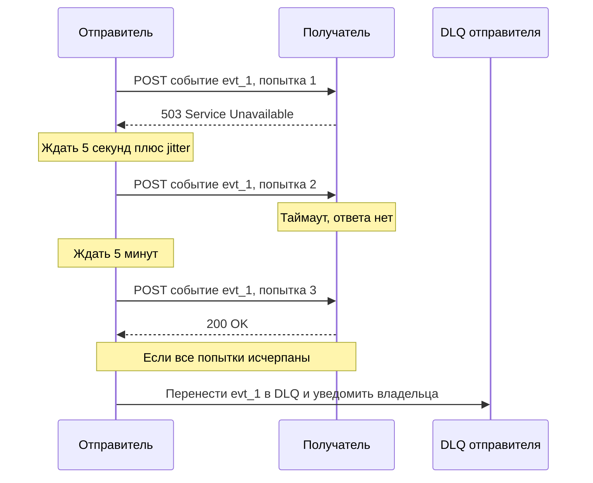

# Webhooks

Webhook — это HTTP-обратный вызов (HTTP callback): когда в системе-источнике происходит событие, она сама отправляет HTTP-запрос (обычно `POST` с JSON) на URL, который заранее зарегистрировал получатель. Вместо того чтобы постоянно опрашивать «что нового?», получатель узнаёт о событии сразу. Это стандартный способ уведомлений в SaaS-платформах (Stripe, GitHub, платёжные шлюзы, CRM, мессенджеры) и частый элемент межсистемных интеграций.

## Суть {#how-it-works}

| Роль | Кто это | Что делает |
|---|---|---|
| Отправитель (provider, producer) | Система, где происходит событие | Хранит подписки, формирует события, подписывает и доставляет их, повторяет при неудаче |
| Получатель (consumer, subscriber) | Система, которой интересно событие | Предоставляет публичный HTTPS-эндпоинт, проверяет подпись, быстро отвечает `2xx`, обрабатывает событие |

Webhook «переворачивает» привычные роли: сервером, принимающим запрос, становится тот, кто обычно является клиентом API. Поэтому у получателя должен быть **публично доступный входящий эндпоинт** — это часто главный организационный вопрос (firewall, DMZ, API-шлюз, сертификаты).



## Регистрация подписки {#subscription}

Способы регистрации:

- **Вручную в личном кабинете** отправителя (Stripe Dashboard, настройки репозитория GitHub).
- **Через API подписок** — удобно для автоматизации и мультиарендных систем.
- **Конфигурацией** при подключении партнёра (для B2B-интеграций — фиксируется в регламенте).

Пример API управления подписками:

::: code-group

```http [Создание подписки]
POST /api/v1/webhook-endpoints HTTP/1.1
Host: api.provider.example
Authorization: Bearer eyJhbGciOi...
Content-Type: application/json

{
  "url": "https://shop.example.com/webhooks/payments",
  "events": ["payment.succeeded", "payment.failed", "refund.created"],
  "description": "Интернет-магазин, прод",
  "apiVersion": "2026-09-01"
}
```

```http [Ответ]
HTTP/1.1 201 Created
Location: /api/v1/webhook-endpoints/we_8Hd2
Content-Type: application/json

{
  "id": "we_8Hd2",
  "url": "https://shop.example.com/webhooks/payments",
  "events": ["payment.succeeded", "payment.failed", "refund.created"],
  "status": "active",
  "secret": "whsec_MfKQ9r8GKYqrTwjUPD8ILPZIo2LaLaSw",
  "createdAt": "2026-10-03T09:00:00Z"
}
```

:::

Что должно быть в API подписок:

- CRUD подписок (`POST`, `GET`, `PATCH`, `DELETE`), фильтр по типам событий;
- выдача секрета подписи **только один раз** при создании и отдельный метод ротации;
- **проверка владения URL** (verification): отправитель шлёт на URL тестовый запрос с challenge, получатель должен вернуть его (так делают Slack, Meta, Zoom). Это защищает от подписки на чужой адрес;
- отправка тестового события (ping) — GitHub шлёт событие `ping` при создании хука;
- журнал доставок с запросами, ответами, кодами и возможностью ручной повторной отправки (redelivery);
- статус подписки: `active`, `disabled` (автоматически после долгой серии неудач) — с уведомлением владельца.

## Формат события {#event-format}

Хорошая практика — единый конверт (envelope) для всех типов событий:

```json
{
  "id": "evt_01J9ZK3Q7V8X2N4M6P0R5T1W3Y",
  "type": "payment.succeeded",
  "apiVersion": "2026-09-01",
  "occurredAt": "2026-10-03T09:15:27.412Z",
  "source": "payments-service",
  "subject": "pay_123",
  "attempt": 1,
  "data": {
    "id": "pay_123",
    "orderId": "ORD-42",
    "status": "succeeded",
    "amount": "1500.00",
    "currency": "RUB"
  }
}
```

| Поле | Назначение |
|---|---|
| `id` | Уникальный идентификатор **события**, одинаковый для всех повторных доставок. Ключ дедупликации у получателя |
| `type` | Тип события, обычно `сущность.действие` в прошедшем времени: `order.created`, `payment.refunded` |
| `occurredAt` | Когда событие произошло (не когда отправлено). [Формат даты](/design/data-conventions) — RFC 3339 в UTC |
| `apiVersion` / `schemaVersion` | Версия схемы данных — чтобы получатель знал, как разбирать `data` |
| `source`, `subject` | Источник и идентификатор объекта, к которому относится событие |
| `data` | Полезная нагрузка: снимок объекта или только ссылки на него |
| `attempt` (опционально) | Номер попытки доставки — удобно для диагностики, но не должен влиять на дедупликацию |

### «Тонкие» и «толстые» события {#thin-vs-fat}

| | Толстое событие (fat, snapshot) | Тонкое событие (thin, notification) |
|---|---|---|
| Содержимое | Полный снимок объекта на момент события | Только `id` и тип, иногда минимальный набор полей |
| Обработка | Можно обработать сразу, без обращений к API | Получатель делает `GET` к API отправителя за актуальным состоянием |
| Порядок и устаревание | Риск: обработать устаревший снимок, если события пришли не по порядку | Всегда получаем актуальное состояние — порядок событий менее важен |
| Безопасность данных | Персональные данные «летят» в каждом событии, оседают в журналах доставки | Чувствительные данные отдаются только по аутентифицированному запросу |
| Нагрузка | Меньше запросов к API | Каждое событие порождает запрос к API (нужны лимиты) |
| Версионирование | Схема `data` версионируется вместе с API | Минимальная схема, почти не меняется |
| Примеры | Классические события Stripe (snapshot), GitHub | Thin events в Stripe API v2, многие банковские API |

::: tip Как выбрать
Если важны порядок и актуальность (статусы, остатки) или данные чувствительные — тонкие события + `GET` за состоянием. Если получателю нужна история изменений «как было в момент события» или отправитель не может выдержать дополнительную нагрузку — толстые. Компромисс: толстое событие + поле версии объекта (`version`, `updatedAt`), чтобы получатель отбрасывал устаревшие.
:::

## Подпись HMAC и защита от подделки {#signature}

Эндпоинт получателя публичный — любой может отправить на него запрос «платёж прошёл». Поэтому каждое событие подписывается, а получатель проверяет подпись **до** любой обработки.

Типовая схема (HMAC-SHA256 с общим секретом):

1. Отправитель формирует строку для подписи: `{webhook-id}.{timestamp}.{raw_body}`.
2. Вычисляет `HMAC-SHA256(secret, строка)` и кодирует в Base64 или hex.
3. Передаёт идентификатор, время и подпись в заголовках.
4. Получатель повторяет вычисление над **сырым телом запроса** (байты как пришли, до парсинга JSON) и сравнивает подписи **сравнением за постоянное время** (constant-time compare).
5. Получатель проверяет, что `timestamp` отличается от текущего времени не более чем на допуск (обычно 5 минут) — **защита от повторного воспроизведения (replay)**: перехваченный запрос нельзя «проиграть» через час.

::: code-group

```http [Standard Webhooks]
POST /webhooks/payments HTTP/1.1
Host: shop.example.com
Content-Type: application/json
webhook-id: msg_2KWPBgLlAfxdpx2AI54pPJ85f4W
webhook-timestamp: 1759482927
webhook-signature: v1,K5oZfzN95Z9UVu1EsfQmfVNQhnkZ2pj9o9NDN/H/pI4=

{"id":"evt_01J9ZK3Q7V8X2N4M6P0R5T1W3Y","type":"payment.succeeded", ...}
```

```http [Stripe]
POST /webhooks/stripe HTTP/1.1
Content-Type: application/json
Stripe-Signature: t=1759482927,v1=5257a869e7ecebeda32affa62cdca3fa51cad7e77a0e56ff536d0ce8e108d8bd

{"id":"evt_1Q...","type":"payment_intent.succeeded", ...}
```

```http [GitHub]
POST /webhooks/github HTTP/1.1
Content-Type: application/json
X-GitHub-Event: push
X-GitHub-Delivery: 72d3162e-cc78-11e3-81ab-4c9367dc0958
X-Hub-Signature-256: sha256=757107ea0eb2509fc211221cce984b8a37570b6d7586c22c46f4379c8b043e17

{"ref":"refs/heads/main", ...}
```

:::

| Платформа | Заголовок подписи | Что подписывается | Кодировка |
|---|---|---|---|
| Standard Webhooks | `webhook-signature: v1,...` (+ `webhook-id`, `webhook-timestamp`) | `id.timestamp.body` | Base64 |
| Stripe | `Stripe-Signature: t=...,v1=...` | `timestamp.body` | hex |
| GitHub | `X-Hub-Signature-256: sha256=...` | Только тело (без timestamp) | hex |

Пример проверки (Standard Webhooks):

```python
import base64, hashlib, hmac, time

TOLERANCE_SEC = 300

def verify(secret: str, headers: dict, raw_body: bytes) -> bool:
    msg_id = headers["webhook-id"]
    ts = headers["webhook-timestamp"]
    if abs(time.time() - int(ts)) > TOLERANCE_SEC:
        return False  # слишком старое или из будущего: возможен replay

    key = base64.b64decode(secret.removeprefix("whsec_"))
    signed = f"{msg_id}.{ts}.".encode() + raw_body
    expected = base64.b64encode(hmac.new(key, signed, hashlib.sha256).digest()).decode()

    # заголовок может содержать несколько подписей через пробел (ротация секрета)
    for item in headers["webhook-signature"].split(" "):
        version, _, sig = item.partition(",")
        if version == "v1" and hmac.compare_digest(sig, expected):
            return True
    return False
```

::: danger Типичные ошибки проверки подписи
- Подпись считается от JSON, **перечитанного и пересериализованного** фреймворком, — порядок ключей и пробелы меняются, подпись не сходится. Нужно сырое тело.
- Сравнение строк через `==` — уязвимо к атаке по времени. Нужно `hmac.compare_digest` / `MessageDigest.isEqual` / `crypto.timingSafeEqual`.
- Проверка подписи без проверки timestamp — возможен replay.
- Отключение проверки «на тесте» и забыли включить на проде.
:::

Дополнительные меры защиты:

- **Только HTTPS** для URL получателя; отправитель проверяет сертификат. Для повышенных требований — [mTLS](/security/tls).
- **Асимметричная подпись** (Ed25519, в Standard Webhooks — `v1a`): у получателя только публичный ключ, утечка с его стороны не позволяет подделать события.
- **IP allowlist**: отправитель публикует список адресов (GitHub — через `GET /meta`, Stripe — в документации), получатель разрешает входящие только с них. Это дополнение к подписи, а не замена: адреса меняются, облачные IP разделяются.
- **Защита отправителя от SSRF**: если URL вводит пользователь, отправитель не должен слать запросы на внутренние адреса (`127.0.0.1`, `10.0.0.0/8`, `169.254.169.254` и т. п.), должен ограничить редиректы и проверять адрес после DNS-резолва. См. [OWASP API Top 10](/security/owasp-api).
- **Не доверять содержимому**: даже с валидной подписью для критичных операций (зачисление денег) получатель может перепроверить состояние через API отправителя.

### Ротация секретов {#secret-rotation}

Секрет нужно менять планово и при подозрении на утечку — без потери событий:

1. Отправитель генерирует новый секрет; некоторое время (например, 24 часа) **подписывает обоими** — в заголовке несколько подписей (`v1,old v1,new`).
2. Получатель добавляет новый секрет и принимает подпись, валидную по **любому** из действующих секретов.
3. По истечении переходного периода старый секрет отзывается.

## Доставка и повторы {#delivery}

Получатель считается успешно принявшим событие, если ответил кодом `2xx` в пределах таймаута отправителя. Всё остальное — неудача и повод повторить.

| Ответ получателя | Действие отправителя |
|---|---|
| `2xx` (обычно `200` или `204`) | Доставлено, повторов нет |
| `3xx` | Обычно считается неудачей: редиректы не выполняются (защита от SSRF) |
| `4xx` (`400`, `401`, `404`, `410`) | Чаще повторяется как неудача. `410 Gone` у некоторых платформ — сигнал отключить подписку |
| [`429 Too Many Requests`](/http/status-codes#429) | Повтор с учётом `Retry-After` |
| `5xx`, таймаут, ошибка TLS/DNS/соединения | Повтор по расписанию |

Типовое расписание повторов — экспоненциальная задержка с jitter, суммарно на 1–3 суток. Например, у Svix (одного из авторов Standard Webhooks): сразу, 5 с, 5 мин, 30 мин, 2 ч, 5 ч, 10 ч, 10 ч. Stripe в рабочем режиме повторяет доставку до 3 суток. GitHub, напротив, **автоматически не повторяет** неудачные доставки — только ручная повторная отправка через UI или API. Это важно учитывать при проектировании получателя.



### Dead letter queue и отключение эндпоинта {#dlq}

- После исчерпания попыток событие попадает в **DLQ** (dead letter queue) отправителя: его можно посмотреть и переотправить вручную или через API (`POST /webhook-deliveries/{id}/retry`).
- Если эндпоинт стабильно не отвечает (например, несколько суток), подписка автоматически **отключается**, владелец получает письмо. После восстановления — повторное включение и переотправка накопившегося.
- Полезно API «дайте события за период» (`GET /events?createdAfter=...`) — получатель может сам догрузить пропущенное (reconciliation).

## Обработка на стороне получателя {#receiver}

### Быстрый ответ и асинхронная обработка

Отправитель ждёт ответ ограниченное время: GitHub — 10 секунд, у других платформ — от нескольких до 30 секунд. Если обработка дольше, отправитель зафиксирует таймаут и пришлёт событие повторно — хотя вы его, возможно, уже обработали.

Правильный порядок в обработчике:

1. Проверить подпись и timestamp → при ошибке `401`/`400`.
2. Сохранить событие (сырое тело + заголовки) в хранилище или очередь — в одной транзакции с отметкой `event_id`.
3. Ответить `200`/`202` — за десятки–сотни миллисекунд.
4. Обработать асинхронно воркером с собственными повторами (паттерн inbox, см. [Интеграционные паттерны](/reliability/integration-patterns)).

### Идемпотентность {#idempotency}

Доставка — **at-least-once**: одно и то же событие может прийти несколько раз (ретраи после таймаута, ручная переотправка, сбой отправителя). Получатель обязан дедуплицировать по `id` события:

```sql
-- Таблица входящих событий (inbox) с уникальностью по id события
CREATE TABLE webhook_inbox (
    event_id     VARCHAR(64) PRIMARY KEY,
    event_type   VARCHAR(100) NOT NULL,
    received_at  TIMESTAMPTZ NOT NULL DEFAULT now(),
    payload      JSONB NOT NULL,
    status       VARCHAR(20) NOT NULL DEFAULT 'received'
);

-- Повторная доставка не создаёт дубль
INSERT INTO webhook_inbox (event_id, event_type, payload)
VALUES ($1, $2, $3)
ON CONFLICT (event_id) DO NOTHING;
```

Если событие уже есть — ответить `200` (не ошибку!), иначе отправитель будет повторять. Подробнее — [Идемпотентность](/design/idempotency).

### Порядок доставки не гарантируется {#ordering}

Из-за параллельной отправки и повторов `order.shipped` может прийти раньше `order.paid`. Стратегии:

- **Тонкие события** + чтение актуального состояния через API — порядок становится не важен.
- **Версия или время изменения объекта** в событии (`data.version`, `data.updatedAt`): применять событие, только если версия больше сохранённой.
- **Машина состояний**: не позволять переход назад (`shipped` → `paid` игнорируется как устаревший).
- Буферизация и переупорядочивание по `sequence` — сложно, применять, только если отправитель гарантирует монотонную нумерацию.

## Стандарты: Standard Webhooks и CloudEvents {#standards}

**Standard Webhooks** (standardwebhooks.com) — открытая спецификация, сформированная группой компаний (инициатор — Svix, в числе участников — Zapier, Twilio, ngrok, Supabase и др.). Определяет:

- заголовки `webhook-id`, `webhook-timestamp`, `webhook-signature`;
- алгоритм подписи (`v1` — HMAC-SHA256, `v1a` — Ed25519), формат секрета `whsec_...`;
- рекомендации по повторам, таймаутам, идемпотентности, размерам и формату полезной нагрузки (`type`, `timestamp`, `data`);
- готовые библиотеки проверки подписи для многих языков.

Если вы проектируете webhooks для своей системы — разумно следовать Standard Webhooks, а не изобретать формат.

**CloudEvents** (CNCF) — спецификация **формата описания события**, независимая от транспорта (HTTP, Kafka, AMQP, MQTT). Обязательные атрибуты: `specversion`, `id`, `source`, `type`; опциональные: `subject`, `time`, `datacontenttype`, `dataschema`. В HTTP возможны два режима:

::: code-group

```http [Structured mode]
POST /webhooks HTTP/1.1
Content-Type: application/cloudevents+json

{
  "specversion": "1.0",
  "id": "evt_01J9ZK3Q7V8X",
  "source": "/payments-service",
  "type": "com.example.payment.succeeded",
  "subject": "pay_123",
  "time": "2026-10-03T09:15:27Z",
  "datacontenttype": "application/json",
  "data": { "id": "pay_123", "amount": "1500.00", "currency": "RUB" }
}
```

```http [Binary mode]
POST /webhooks HTTP/1.1
Content-Type: application/json
ce-specversion: 1.0
ce-id: evt_01J9ZK3Q7V8X
ce-source: /payments-service
ce-type: com.example.payment.succeeded
ce-time: 2026-10-03T09:15:27Z

{ "id": "pay_123", "amount": "1500.00", "currency": "RUB" }
```

:::

Standard Webhooks и CloudEvents не конкурируют: первый описывает **доставку и безопасность** webhooks, второй — **конверт события**. Их можно совмещать. Подробнее о CloudEvents в брокерах — на странице [Брокеры сообщений](/protocols/messaging).

## Примеры из практики {#examples}

| | Stripe | GitHub |
|---|---|---|
| Регистрация | Dashboard или API `webhook_endpoints`, выбор типов событий | Настройки репозитория/организации/GitHub App |
| Конверт | `id`, `type`, `created`, `api_version`, `data.object` | Тип в заголовке `X-GitHub-Event`, тело — объект события |
| Идентификатор доставки | `id` события (`evt_...`) | `X-GitHub-Delivery` (GUID) |
| Подпись | `Stripe-Signature`, HMAC-SHA256 от `t.body`, допуск по времени 5 минут в SDK | `X-Hub-Signature-256`, HMAC-SHA256 от тела |
| Повторы | Автоматически, экспоненциально, до 3 суток | Автоматически нет, ручная переотправка |
| Порядок | Не гарантируется (явно указано в документации) | Не гарантируется |
| Особенности | Версия API фиксируется на эндпоинте; есть thin events в API v2; CLI для локального тестирования `stripe listen` | Таймаут 10 секунд; событие `ping` при создании |

## Тестирование и отладка {#testing}

- Локальная разработка: туннели (ngrok, Cloudflare Tunnel), CLI платформ (`stripe listen --forward-to localhost:8080/webhooks`), сервисы-приёмники (webhook.site) — **только с тестовыми данными**.
- Набор тестов получателя: валидная подпись, неверная подпись, просроченный timestamp, повторная доставка того же `id`, события не по порядку, неизвестный `type` (должен игнорироваться с `200`), большой payload.
- Журнал доставок отправителя — первое место при разборе инцидентов: что отправлено, что ответили, сколько длилось.

См. также [Тестирование API](/tools/testing).

## Чек-лист для отправителя {#sender-checklist}

- Единый конверт события: `id`, `type`, `occurredAt`, версия схемы, `data`. Рассмотреть Standard Webhooks / CloudEvents.
- Каталог типов событий со схемами и примерами (лучше — в [AsyncAPI](/specs/asyncapi); OpenAPI 3.1 тоже поддерживает раздел `webhooks`).
- Подпись HMAC-SHA256 (или Ed25519) с timestamp; секрет на каждую подписку; процедура ротации.
- Надёжная генерация событий: событие не теряется, если доставка упала (transactional outbox).
- Доставка из очереди, а не синхронно из бизнес-транзакции.
- Таймаут запроса (5–30 с), расписание повторов с jitter, обработка `429` и `Retry-After`.
- DLQ, ручная и программная переотправка, журнал доставок для клиента.
- Автоотключение «мёртвых» эндпоинтов с уведомлением.
- Защита от SSRF, запрет редиректов, только HTTPS.
- Публикация IP-адресов отправки.
- Проверка владения URL при регистрации.
- Версионирование схем событий и политика изменений (добавление полей — без предупреждения, удаление — через новую версию). См. [Версионирование](/design/versioning).
- API для догрузки событий за период (reconciliation).

## Чек-лист для получателя {#receiver-checklist}

- Публичный HTTPS-эндпоинт: сетевой доступ, сертификат, маршрут через API-шлюз.
- Проверка подписи по сырому телу, сравнение за постоянное время, проверка timestamp.
- Быстрый ответ `2xx` после сохранения, асинхронная обработка.
- Дедупликация по `id` события (inbox), ответ `200` на дубликат.
- Устойчивость к нарушению порядка (версии, машина состояний, тонкие события).
- Игнорирование неизвестных типов событий и неизвестных полей (с `200`).
- Хранение секретов в хранилище секретов, поддержка двух секретов на время ротации.
- Мониторинг: доля ошибок подписи, задержка обработки, размер очереди необработанных событий.
- Периодическая сверка (reconciliation) через API отправителя на случай потерянных событий.

## На что обратить внимание аналитику {#analyst-checklist}

- Кто отправитель и кто получатель; есть ли у получателя публичный входящий адрес и кто согласует сетевой доступ.
- Список типов событий, условия их возникновения, схема и пример каждого.
- Тонкие или толстые события — и обоснование.
- Механизм подписи, формат заголовков, допуск по времени, порядок ротации секретов, IP allowlist.
- Таймаут ответа, ожидаемые коды ответа, расписание повторов, длительность хранения в DLQ, порядок ручной переотправки.
- Гарантия доставки (at-least-once) и требование идемпотентной обработки по `id`.
- Отсутствие гарантии порядка и способ с этим жить.
- Как получатель догружает пропущенные события (API событий, сверка).
- Процедура регистрации, тестирования и перевода подписки в прод; тестовый контур.
- Ожидаемый объём событий (в час, в пике) — для планирования ёмкости обеих сторон.
- Мониторинг и алерты, контакты ответственных при инцидентах.

## Стандарты и ссылки {#references}

- [Standard Webhooks — спецификация](https://www.standardwebhooks.com/)
- [Standard Webhooks — репозиторий и спецификация на GitHub](https://github.com/standard-webhooks/standard-webhooks/blob/main/spec/standard-webhooks.md)
- [CloudEvents — спецификация (CNCF)](https://cloudevents.io/)
- [CloudEvents — HTTP Protocol Binding](https://github.com/cloudevents/spec/blob/main/cloudevents/bindings/http-protocol-binding.md)
- [CloudEvents — HTTP 1.1 Web Hooks for Event Delivery](https://github.com/cloudevents/spec/blob/main/cloudevents/http-webhook.md)
- [RFC 2104 — HMAC: Keyed-Hashing for Message Authentication](https://www.rfc-editor.org/rfc/rfc2104)
- [Stripe — Webhooks](https://docs.stripe.com/webhooks)
- [GitHub — Webhooks documentation](https://docs.github.com/en/webhooks)
- [GitHub — Validating webhook deliveries](https://docs.github.com/en/webhooks/using-webhooks/validating-webhook-deliveries)
- [OpenAPI 3.1 — Webhooks Object](https://spec.openapis.org/oas/v3.1.0#oas-webhooks)
- [OWASP — Server Side Request Forgery Prevention Cheat Sheet](https://cheatsheetseries.owasp.org/cheatsheets/Server_Side_Request_Forgery_Prevention_Cheat_Sheet.html)
