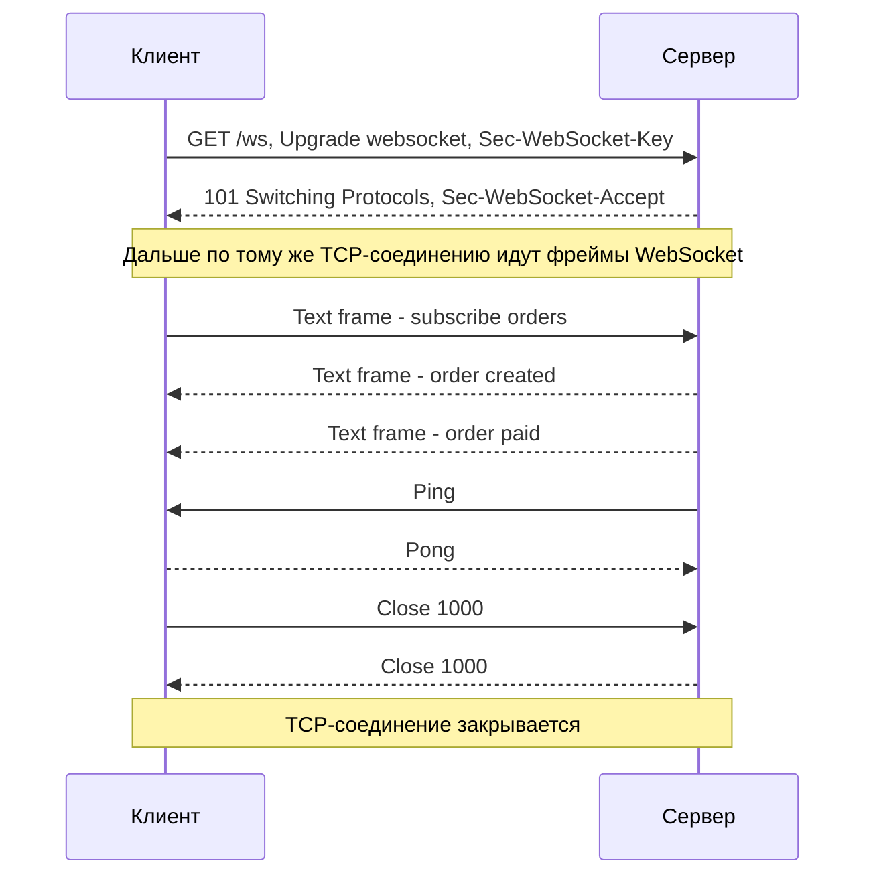
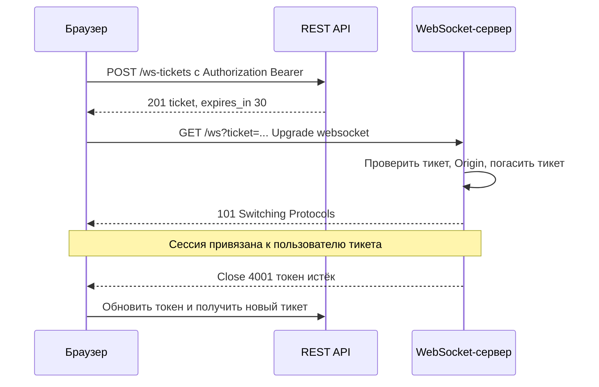
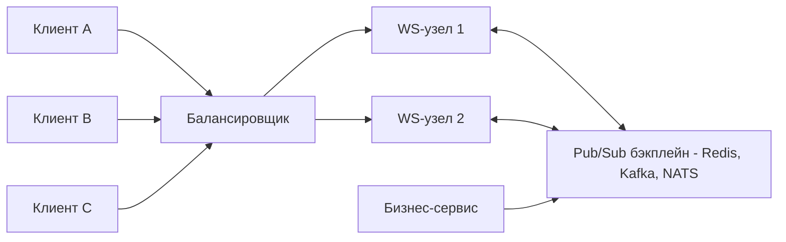
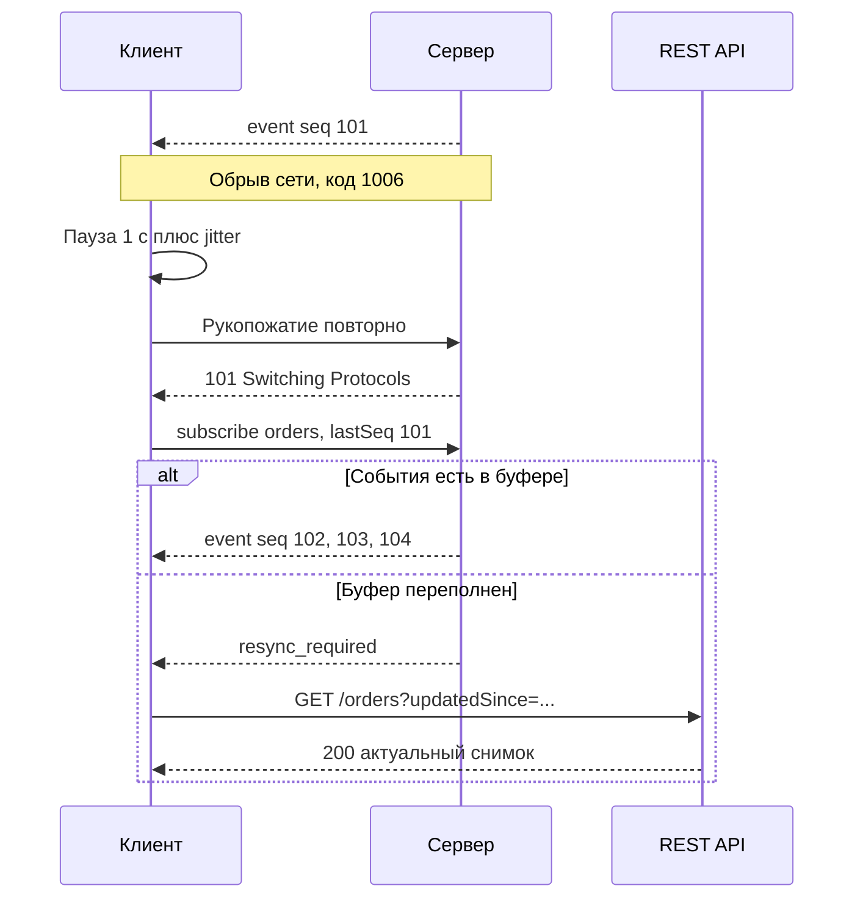

# WebSocket

WebSocket (RFC 6455) — протокол постоянного двунаправленного канала между клиентом и сервером поверх одного TCP-соединения. Соединение открывается обычным HTTP-запросом с переключением протокола (upgrade), после чего обе стороны в любой момент могут отправлять друг другу сообщения без накладных расходов на заголовки HTTP. Это основной инструмент, когда нужна низкая задержка в обе стороны: чаты, котировки, совместное редактирование, онлайн-игры.

## Суть и принцип работы {#how-it-works}

| Свойство | WebSocket | Обычный HTTP (REST) |
|---|---|---|
| Направление | Полнодуплексный: клиент и сервер пишут независимо | Запрос клиента → ответ сервера |
| Соединение | Одно долгоживущее | Запрос-ответ (с keep-alive, но без push) |
| Инициатор сообщений | Любая сторона | Только клиент |
| Накладные расходы на сообщение | 2–14 байт заголовка фрейма | Сотни байт заголовков HTTP |
| Адресация | Одна точка входа (`wss://host/ws`), маршрутизация внутри сообщений | URI ресурса + метод |
| Кэширование, коды состояния, семантика методов | Нет — всё нужно придумать самим | Есть из коробки |
| Схемы URI | `ws://` (порт 80), `wss://` (TLS, порт 443) | `http://`, `https://` |

Жизненный цикл соединения:

1. **Рукопожатие (opening handshake)** — HTTP-запрос `GET` с заголовком `Upgrade: websocket`, ответ `101 Switching Protocols`.
2. **Обмен данными** — фреймы (frames) в обе стороны: текстовые, бинарные, служебные (ping/pong).
3. **Закрытие (closing handshake)** — одна сторона отправляет фрейм `Close` с кодом и причиной, другая отвечает своим `Close`, затем закрывается TCP-соединение.



## Рукопожатие (handshake) {#handshake}

Рукопожатие — это обычный HTTP/1.1-запрос, поэтому он проходит через прокси, балансировщики и несёт cookie, `Origin` и другие заголовки.

::: code-group

```http [Запрос клиента]
GET /ws/v1/notifications HTTP/1.1
Host: api.example.com
Upgrade: websocket
Connection: Upgrade
Sec-WebSocket-Key: dGhlIHNhbXBsZSBub25jZQ==
Sec-WebSocket-Version: 13
Sec-WebSocket-Protocol: v12.stomp, v11.stomp
Sec-WebSocket-Extensions: permessage-deflate; client_max_window_bits
Origin: https://app.example.com
Cookie: session=8f3a...
```

```http [Ответ сервера]
HTTP/1.1 101 Switching Protocols
Upgrade: websocket
Connection: Upgrade
Sec-WebSocket-Accept: s3pPLMBiTxaQ9kYGzzhZRbK+xOo=
Sec-WebSocket-Protocol: v12.stomp
Sec-WebSocket-Extensions: permessage-deflate
```

:::

| Заголовок | Кто отправляет | Назначение |
|---|---|---|
| `Upgrade: websocket`, `Connection: Upgrade` | Клиент и сервер | Просьба переключить протокол и подтверждение |
| `Sec-WebSocket-Key` | Клиент | Случайные 16 байт в Base64. Не для безопасности — чтобы убедиться, что сервер действительно понимает WebSocket, а не кэширующий прокси вернул старый ответ |
| `Sec-WebSocket-Accept` | Сервер | `Base64(SHA-1(Key + "258EAFA5-E914-47DA-95CA-C5AB0DC85B11"))` — доказательство, что сервер обработал именно этот запрос |
| `Sec-WebSocket-Version` | Клиент | Всегда `13`. При несовпадении сервер отвечает `426 Upgrade Required` и указывает поддерживаемые версии |
| `Sec-WebSocket-Protocol` | Клиент → список, сервер → один выбранный | Субпротокол прикладного уровня (STOMP, graphql-transport-ws и т. п.) |
| `Sec-WebSocket-Extensions` | Клиент → список, сервер → принятые | Расширения, чаще всего `permessage-deflate` (сжатие, RFC 7692) |
| `Origin` | Браузер | Источник страницы. Сервер **обязан** проверять его — защита от CSWSH (см. ниже) |

Если сервер не хочет принимать соединение, он отвечает обычным HTTP-кодом: `401`, `403`, `404`, `429`, `503` и т. д. — и соединение не переходит в режим WebSocket. Успешный ответ — только [`101 Switching Protocols`](/http/status-codes#101).

::: info WebSocket поверх HTTP/2 и HTTP/3
RFC 6455 описывает рукопожатие для HTTP/1.1. Для HTTP/2 есть RFC 8441 (расширенный метод `CONNECT` с псевдозаголовком `:protocol = websocket`), для HTTP/3 — RFC 9220. В этом случае WebSocket работает как отдельный поток внутри мультиплексированного соединения, а ответ — `200`, а не `101`. На практике большинство интеграций по-прежнему используют HTTP/1.1-рукопожатие.
:::

## Фреймы {#frames}

После рукопожатия данные передаются фреймами. Сообщение (message) может состоять из одного или нескольких фреймов (фрагментация).

| Opcode | Тип фрейма | Назначение |
|---|---|---|
| `0x0` | Continuation | Продолжение фрагментированного сообщения |
| `0x1` | Text | Текст в UTF-8 (обычно JSON) |
| `0x2` | Binary | Произвольные байты (Protobuf, MessagePack, файлы) |
| `0x8` | Close | Закрытие соединения, содержит код и причину |
| `0x9` | Ping | Проверка живости |
| `0xA` | Pong | Ответ на Ping (или односторонний heartbeat) |

Что важно знать о фреймах:

- **Маскирование.** Все фреймы от клиента к серверу обязаны быть замаскированы (XOR со случайным 4-байтовым ключом). Это защита от отравления кэша промежуточных прокси, а не шифрование. Шифрование даёт только `wss://` (TLS).
- **Управляющие фреймы** (Close, Ping, Pong) — не длиннее 125 байт полезной нагрузки и не фрагментируются; могут вклиниваться между фрагментами обычного сообщения.
- **Текстовые фреймы** обязаны содержать валидный UTF-8, иначе соединение закрывается с кодом `1007`.
- **Размер сообщения** протоколом не ограничен, но серверы и библиотеки задают свои лимиты (часто 64 КБ – 1 МБ). Превышение — закрытие с кодом `1009`. Лимит нужно явно зафиксировать в спецификации.
- **Нет встроенной корреляции.** В протоколе нет понятия «запрос–ответ», id сообщения, подтверждения доставки. Если они нужны — их вводит прикладной протокол (поле `id`/`correlationId` в сообщении) или субпротокол.

## Ping/Pong и heartbeat {#ping-pong}

TCP-соединение может «умереть» молча: мобильный клиент ушёл в туннель, NAT забыл трансляцию, балансировщик закрыл простаивающее соединение. Без heartbeat обе стороны узнают об этом только при попытке записи — иногда через минуты.

- **Ping/Pong на уровне протокола.** Получатель Ping обязан как можно скорее ответить Pong с той же нагрузкой. Обычно Ping шлёт сервер (каждые 20–30 секунд), и если Pong не пришёл за N секунд — соединение считается мёртвым.
- **Браузерный JavaScript не может отправить Ping** — API `WebSocket` этого не умеет (браузер сам отвечает на Ping сервера). Поэтому для проверки со стороны клиента используют прикладной heartbeat: сообщение вида `{"type":"ping"}` и ответ `{"type":"pong"}`.
- **Таймауты простоя на инфраструктуре.** Балансировщики и прокси закрывают «молчащие» соединения: у AWS ALB idle timeout по умолчанию 60 секунд, у nginx `proxy_read_timeout` тоже 60 секунд. Интервал heartbeat должен быть заметно меньше минимального таймаута на всём пути.

```nginx
# Проксирование WebSocket в nginx
location /ws/ {
    proxy_pass http://backend;
    proxy_http_version 1.1;
    proxy_set_header Upgrade $http_upgrade;
    proxy_set_header Connection "upgrade";
    proxy_set_header Host $host;
    proxy_read_timeout 3600s;   # дольше heartbeat-интервала
    proxy_send_timeout 3600s;
}
```

## Коды закрытия {#close-codes}

Фрейм `Close` содержит двухбайтовый код и необязательную причину (UTF-8, до 123 байт). Коды регистрируются в реестре IANA «WebSocket Close Code Number Registry».

| Код | Название | Значение | Можно отправлять? |
|---|---|---|---|
| `1000` | Normal Closure | Штатное закрытие, задача выполнена | Да |
| `1001` | Going Away | Сервер выключается или пользователь ушёл со страницы | Да |
| `1002` | Protocol Error | Нарушение протокола WebSocket | Да |
| `1003` | Unsupported Data | Тип данных не поддерживается (например, пришёл бинарный фрейм, а ждали текст) | Да |
| `1004` | — | Зарезервирован | Нет |
| `1005` | No Status Received | Close пришёл без кода. Используется только в API/логах | Нет |
| `1006` | Abnormal Closure | Соединение оборвалось без фрейма Close (обрыв сети, падение процесса). Только в API/логах | Нет |
| `1007` | Invalid Frame Payload Data | Данные не соответствуют типу (невалидный UTF-8 в текстовом фрейме) | Да |
| `1008` | Policy Violation | Нарушение политики — общий код, когда другие не подходят (часто: истёк токен, нет прав) | Да |
| `1009` | Message Too Big | Сообщение больше допустимого | Да |
| `1010` | Mandatory Extension | Клиент закрывает: сервер не согласовал обязательное расширение | Да (клиент) |
| `1011` | Internal Error | Непредвиденная ошибка сервера | Да |
| `1012` | Service Restart | Сервер перезапускается — переподключитесь | Да |
| `1013` | Try Again Later | Временная перегрузка — переподключитесь позже | Да |
| `1014` | Bad Gateway | Шлюз/прокси получил некорректный ответ от вышестоящего сервера | Да |
| `1015` | TLS Handshake | Не удалось установить TLS. Только в API/логах | Нет |

Коды `1012`–`1014` не входят в текст RFC 6455, они добавлены позже в реестр IANA.

| Диапазон | Назначение |
|---|---|
| `0`–`999` | Не используются |
| `1000`–`2999` | Зарезервированы за протоколом и расширениями (регистрация через RFC) |
| `3000`–`3999` | Для библиотек, фреймворков и приложений — регистрируются в IANA |
| `4000`–`4999` | Частное использование — свободны для своего протокола, не регистрируются |

::: tip Свои коды в диапазоне 4000–4999
Удобно завести прикладные коды и описать их в спецификации, например: `4001` — токен истёк (обновите токен и переподключитесь), `4003` — нет доступа к каналу (не переподключаться), `4008` — превышен лимит подписок, `4409` — сессия открыта на другом устройстве. Главное — для каждого кода указать, **должен ли клиент переподключаться**.
:::

## Субпротоколы {#subprotocols}

WebSocket передаёт только «сырые» сообщения. Всё остальное — типы сообщений, подписки, подтверждения, ошибки — определяет прикладной протокол. Его можно придумать самому (JSON с полем `type`) или взять готовый субпротокол, согласуемый через `Sec-WebSocket-Protocol`.

| Субпротокол | Идентификатор | Где используется | Что даёт |
|---|---|---|---|
| STOMP | `v12.stomp`, `v11.stomp`, `v10.stomp` | Spring (Java), брокеры RabbitMQ и ActiveMQ | Команды `CONNECT`, `SUBSCRIBE`, `SEND`, `ACK`, адресация по destination, заголовки, receipts |
| GraphQL over WebSocket | `graphql-transport-ws` | Библиотека `graphql-ws`, Apollo, Hasura | Подписки GraphQL: `connection_init`, `subscribe`, `next`, `complete` |
| Устаревший GraphQL-протокол | `graphql-ws` | Библиотека `subscriptions-transport-ws` (заброшена) | Старый протокол подписок Apollo. Несовместим с предыдущим, хотя имена путают |
| MQTT over WebSocket | `mqtt` | IoT, веб-клиенты MQTT-брокеров | Полноценный MQTT в браузере |
| WAMP | `wamp.2.json` и др. | Crossbar и др. | RPC + pub/sub |

Пример кадра STOMP поверх WebSocket (текстовый фрейм, `^@` — нулевой байт-терминатор):

```text
SUBSCRIBE
id:sub-0
destination:/topic/orders.42

^@
```

Пример собственного прикладного протокола на JSON:

::: code-group

```json [Клиент → сервер]
{
  "type": "subscribe",
  "id": "c7f1d2a0-1",
  "channel": "orders",
  "filter": { "customerId": "CUST-1001" }
}
```

```json [Сервер → клиент: подтверждение]
{
  "type": "subscribed",
  "replyTo": "c7f1d2a0-1",
  "channel": "orders"
}
```

```json [Сервер → клиент: событие]
{
  "type": "event",
  "channel": "orders",
  "seq": 18452,
  "event": "order.paid",
  "data": { "orderId": "ORD-42", "amount": "1500.00", "currency": "RUB" },
  "ts": "2026-10-03T09:15:27.123Z"
}
```

```json [Сервер → клиент: ошибка]
{
  "type": "error",
  "replyTo": "c7f1d2a0-1",
  "code": "CHANNEL_FORBIDDEN",
  "message": "Нет доступа к каналу orders"
}
```

:::

::: tip Конверт сообщения
В каждом сообщении стоит иметь: `type` (тип), `id` (для запросов — чтобы сопоставить ответ через `replyTo`), `seq` (монотонный номер для восстановления после разрыва), `ts` (время). Версию протокола удобно указывать в URI (`/ws/v1`) или в имени субпротокола.
:::

## Аутентификация {#authentication}

Главная сложность: **браузерный API `WebSocket` не позволяет задать произвольные заголовки**, в том числе `Authorization`. Конструктор принимает только URL и список субпротоколов. Серверные клиенты (Java, Go, Python, Node.js) заголовки ставить умеют — для интеграции «сервер–сервер» используйте обычный `Authorization: Bearer`.

| Способ | Как работает | Плюсы | Минусы и риски |
|---|---|---|---|
| Cookie сессии | Браузер сам отправляет cookie при рукопожатии | Ничего не нужно делать на клиенте | Уязвимость CSWSH: обязательна проверка `Origin`; cookie с `SameSite` помогает частично |
| Токен в query-параметре | `wss://api.example.com/ws?access_token=...` | Просто, работает везде | Токен попадает в логи прокси, балансировщиков, историю. Использовать только короткоживущий одноразовый тикет |
| Одноразовый тикет | Клиент по REST с `Authorization` получает тикет (TTL 30–60 с, одно использование), передаёт его в query | Долгоживущий токен не светится в URL | Нужен дополнительный эндпоинт и хранилище тикетов |
| Токен в первом сообщении | Соединение открыто без аутентификации, первым сообщением клиент шлёт `{"type":"auth","token":"..."}` | Токен не в URL; легко обновлять токен внутри сессии | Неаутентифицированные соединения занимают ресурсы — нужен короткий таймаут (5–10 с) на получение auth |
| Токен в `Sec-WebSocket-Protocol` | Токен передаётся как «имя субпротокола» | Работает в браузере, не в URL | Хак: сервер обязан вернуть один из протоколов; токен может попасть в логи заголовков |
| mTLS | Клиентский сертификат на уровне TLS | Сильная аутентификация для сервер–сервер | Не для браузеров |



::: danger CSWSH — Cross-Site WebSocket Hijacking
Политика CORS к WebSocket **не применяется**: страница со злоумышленного сайта может открыть соединение к вашему серверу, и браузер приложит cookie пользователя. Если сервер аутентифицирует по cookie и не проверяет заголовок `Origin` по списку разрешённых — атакующий получит канал от имени пользователя. Требование: сервер проверяет `Origin` при рукопожатии и отвечает `403` для неизвестных источников.
:::

Ещё про безопасность:

- Только `wss://` — иначе токены и данные идут открытым текстом, а прокси провайдеров ломают соединения.
- **Срок жизни токена меньше срока жизни соединения.** Соединение может жить часами, а access token — 5–15 минут. Варианты: сервер закрывает соединение с прикладным кодом (`4001`) при истечении токена; клиент присылает новый токен сообщением `{"type":"reauth"}`; сервер периодически перепроверяет права. Решение нужно зафиксировать.
- **Авторизация на каждую подписку**, а не только на соединение: пользователь не должен подписаться на чужой канал, подменив `channel` в сообщении.
- Лимиты: число соединений на пользователя, число подписок, частота сообщений, максимальный размер сообщения. См. [Rate limiting](/design/rate-limiting) и [OWASP API Top 10](/security/owasp-api).

## Масштабирование {#scaling}

WebSocket — протокол с состоянием (stateful): соединение живёт на конкретном экземпляре сервера. Это ломает привычную модель stateless REST.



| Проблема | Решение |
|---|---|
| Событие для пользователя возникло на узле 2, а его соединение на узле 1 | **Pub/sub-бэкплейн**: все узлы подписаны на общую шину (Redis Pub/Sub, Kafka, NATS, RabbitMQ), каждый доставляет сообщения «своим» соединениям |
| Балансировщик распределяет запросы рукопожатия | Поддержка Upgrade на балансировщике; для HTTP-fallback (Socket.IO, SockJS) нужны **sticky sessions** — все запросы клиента на один узел |
| Неравномерная нагрузка: долгие соединения «прилипают» к старым узлам | Периодическая ребалансировка: сервер закрывает часть соединений с кодом `1012`/`1001`, клиенты переподключаются |
| Деплой рвёт все соединения разом | Graceful shutdown: перестать принимать новые соединения, разослать `1001`/`1012`, клиенты переподключаются с jitter, чтобы не получить «громоподобное стадо» (thundering herd) |
| Лимиты ОС и памяти | Каждое соединение — файловый дескриптор и буферы. Планируйте ёмкость: число одновременных соединений на узел, память на соединение |
| Наблюдаемость | Метрики: активные соединения, рукопожатия/с, ошибки рукопожатий по кодам, сообщения/с, коды закрытия, задержка доставки. См. [Наблюдаемость](/reliability/observability) |

::: tip Управляемые сервисы
Вместо собственного кластера можно взять managed-решение: AWS API Gateway WebSocket API, Azure Web PubSub / SignalR Service, Ably, Pusher, Centrifugo (self-hosted). Они берут на себя соединения и бэкплейн, а ваш бэкенд публикует события через REST/SDK.
:::

## Переподключение и восстановление состояния {#reconnect}

Разрыв соединения — штатная ситуация, а не исключение. Спецификация интеграции должна описывать, что происходит после разрыва.

1. **Экспоненциальная задержка с jitter**: 1 с, 2 с, 4 с, 8 с … до максимума 30–60 с, со случайным разбросом. Без jitter после перезапуска сервера все клиенты переподключатся одновременно. См. [Таймауты и повторы](/reliability/timeouts-retries).
2. **Решение по коду закрытия**: `1000` — не переподключаться; `1001`, `1006`, `1011`, `1012`, `1013` — переподключаться; `1008`/`4003` — не переподключаться без вмешательства; `4001` — обновить токен, потом переподключиться.
3. **Восстановление подписок**: после переподключения клиент заново отправляет все `subscribe` — сервер о них ничего не помнит (если явно не реализована сессия).
4. **Догрузка пропущенного (gap recovery)** — сообщения, отправленные во время разрыва, потеряны. Варианты:
   - каждое событие имеет монотонный `seq` в рамках канала; клиент при подписке передаёт `lastSeq`, сервер досылает пропущенное из буфера (как `Last-Event-ID` в [SSE](/protocols/sse));
   - клиент после переподключения запрашивает актуальный снимок состояния через REST (`GET /orders?updatedSince=...`), а WebSocket использует только для «дельт»;
   - если буфер на сервере переполнен — сервер сообщает `resync_required`, клиент перечитывает всё.
5. **Дубликаты**: при догрузке клиент может получить событие повторно — обработка должна быть идемпотентной по `seq`/`eventId`. См. [Идемпотентность](/design/idempotency).



::: warning WebSocket — не гарантированная доставка
Протокол не подтверждает обработку сообщений. Отправка в сокет не означает, что клиент сообщение получил и обработал. Если потеря события критична (платёж, смена статуса заказа), то WebSocket — только канал уведомления, а источником истины должен быть REST API или брокер сообщений с подтверждениями.
:::

## Socket.IO — это не WebSocket {#socket-io}

Socket.IO — популярная библиотека (Node.js и клиенты для других языков) со **своим протоколом** поверх Engine.IO, который использует WebSocket как один из транспортов.

| | Чистый WebSocket | Socket.IO |
|---|---|---|
| Протокол | RFC 6455 | Собственный протокол Socket.IO поверх Engine.IO |
| Совместимость | Любой WS-клиент на любом языке | Только клиент Socket.IO совместимой версии. Обычный WS-клиент к серверу Socket.IO **не подключится** (и наоборот) |
| Транспорт | Только WebSocket | Начинает с HTTP long polling, затем апгрейд на WebSocket (или WebTransport) |
| Возможности | Только сообщения | События с именами, подтверждения (acks), комнаты (rooms), пространства имён (namespaces), автопереподключение, буферизация |
| Масштабирование | Своё | Адаптеры (Redis, Postgres и др.) + sticky sessions для polling |

Если контрагент говорит «у нас WebSocket», уточните: чистый RFC 6455, Socket.IO (какая версия протокола), SignalR (у ASP.NET SignalR тоже свой протокол и fallback-транспорты), SockJS? От этого зависит выбор клиентской библиотеки.

## Когда применять {#when-to-use}

**Подходит:**

- чаты, мессенджеры, поддержка в реальном времени;
- биржевые котировки, ставки, курсы, торговые терминалы (частые мелкие обновления);
- совместное редактирование документов, онлайн-доски, курсоры других пользователей;
- онлайн-игры, интерактивные приложения с частыми действиями клиента;
- дашборды мониторинга с высокой частотой обновлений;
- IoT и телеметрия в браузере (часто MQTT over WebSocket);
- голосовые и мультимодальные AI-ассистенты реального времени, где клиент и сервер одновременно передают поток.

**Не подходит или избыточно:**

- уведомления только «сервер → клиент» с низкой частотой — проще [SSE](/protocols/sse);
- интеграция «сервер–сервер», где система-источник должна сообщить о событии другой системе, — [Webhooks](/protocols/webhooks) или [брокер сообщений](/protocols/messaging);
- обычные CRUD-операции — [REST](/protocols/rest): кэширование, коды состояния, идемпотентность, инструменты — всё из коробки;
- доставка критичных событий с гарантией — брокер с подтверждениями;
- редкие обновления (раз в минуты) — достаточно polling.

## Сравнение с SSE и long polling {#comparison}

| Критерий | WebSocket | SSE | Long polling |
|---|---|---|---|
| Направление | Двунаправленное | Сервер → клиент | Сервер → клиент (ответом на запрос) |
| Формат данных | Текст и бинарные | Только текст UTF-8 | Любой (HTTP-ответ) |
| Протокол | Отдельный, после Upgrade | Обычный HTTP | Обычный HTTP |
| Автопереподключение | Нет, пишется вручную | Встроено в `EventSource` | Каждый запрос — новое «подключение» |
| Восстановление пропущенного | Вручную (`seq`) | Встроено: `Last-Event-ID` | Вручную (курсор в запросе) |
| Заголовки аутентификации в браузере | Нельзя | Нельзя через `EventSource`, можно через `fetch` | Можно |
| Прокси, корпоративные сети | Иногда блокируется или рвётся | Обычно проходит (но буферизация) | Проходит всегда |
| Задержка | Минимальная | Минимальная | Небольшая + накладные расходы на запрос |
| Сложность сервера | Высокая (stateful) | Средняя | Низкая |

Подробное сравнение всех вариантов, включая webhooks, — на странице [SSE и Long Polling](/protocols/sse).

## Документирование {#documentation}

OpenAPI не описывает WebSocket-сообщения. Для спецификации канала используйте [AsyncAPI](/specs/asyncapi): в нём описываются каналы, сообщения в обе стороны, их схемы и привязки (bindings) к протоколу `ws`. В [OpenAPI](/specs/openapi) можно описать только эндпоинт выдачи тикета и REST-методы для догрузки состояния.

## Типичные ошибки {#pitfalls}

- Нет heartbeat → соединения молча умирают, балансировщик рвёт их через 60 секунд простоя.
- Переподключение без задержки и jitter → после рестарта сервер «кладут» тысячи одновременных рукопожатий.
- Нет проверки `Origin` при cookie-аутентификации → CSWSH.
- Долгоживущий токен в query-параметре → токен в логах всех прокси.
- Проверка прав только при подключении → пользователь подписывается на чужие каналы.
- Нет `seq`/`id` в сообщениях → невозможно ни дедуплицировать, ни догрузить пропущенное.
- WebSocket используется как единственный канал для критичных событий без источника истины.
- Нет лимита размера сообщения и частоты → один клиент может перегрузить сервер.
- Путаница Socket.IO и чистого WebSocket → клиент не может подключиться.

## На что обратить внимание аналитику {#analyst-checklist}

- Обосновано, зачем нужен WebSocket, а не SSE, webhooks, брокер или polling.
- URL эндпоинта (`wss://`), версия прикладного протокола, используемый субпротокол (STOMP, graphql-transport-ws, свой JSON).
- Протокол на чистом RFC 6455 или Socket.IO/SignalR — и какие версии.
- Способ аутентификации (тикет, первое сообщение, cookie + проверка `Origin`), поведение при истечении токена.
- Авторизация подписок: кто на какие каналы может подписаться.
- Каталог сообщений в обе стороны: тип, схема, пример, обязательные поля (`type`, `id`, `seq`, `ts`). Желательно — в [AsyncAPI](/specs/asyncapi).
- Формат ошибок внутри канала и прикладные коды закрытия `4000–4999` с указанием, переподключаться ли клиенту.
- Heartbeat: кто шлёт, интервал, таймаут признания соединения мёртвым; согласованность с таймаутами балансировщиков.
- Политика переподключения: задержки, jitter, максимум; восстановление подписок; догрузка пропущенного (`lastSeq`, REST-снимок).
- Гарантии доставки: что будет с событиями, пока клиент офлайн; источник истины.
- Лимиты: максимальный размер сообщения, число соединений на пользователя, подписок, сообщений в секунду.
- Нагрузка: ожидаемое число одновременных соединений, частота событий; архитектура масштабирования (бэкплейн, sticky sessions).
- Поведение при деплое (graceful shutdown, код `1012`).
- Метрики и логирование: соединения, коды закрытия, задержки доставки.

## Стандарты и ссылки {#references}

- [RFC 6455 — The WebSocket Protocol](https://www.rfc-editor.org/rfc/rfc6455)
- [RFC 7692 — Compression Extensions for WebSocket (permessage-deflate)](https://www.rfc-editor.org/rfc/rfc7692)
- [RFC 8441 — Bootstrapping WebSockets with HTTP/2](https://www.rfc-editor.org/rfc/rfc8441)
- [RFC 9220 — Bootstrapping WebSockets with HTTP/3](https://www.rfc-editor.org/rfc/rfc9220)
- [IANA — WebSocket Protocol Registries (коды закрытия, субпротоколы)](https://www.iana.org/assignments/websocket/websocket.xhtml)
- [WHATWG WebSockets Standard (браузерный API)](https://websockets.spec.whatwg.org/)
- [MDN — WebSocket API](https://developer.mozilla.org/en-US/docs/Web/API/WebSockets_API)
- [STOMP Protocol Specification 1.2](https://stomp.github.io/stomp-specification-1.2.html)
- [GraphQL over WebSocket Protocol (graphql-ws)](https://github.com/enisdenjo/graphql-ws/blob/master/PROTOCOL.md)
- [Socket.IO — документация](https://socket.io/docs/v4/)
- [OWASP — WebSocket Security Cheat Sheet](https://cheatsheetseries.owasp.org/cheatsheets/WebSocket_Security_Cheat_Sheet.html)
- [AsyncAPI — WebSockets bindings](https://github.com/asyncapi/bindings/tree/master/websockets)
