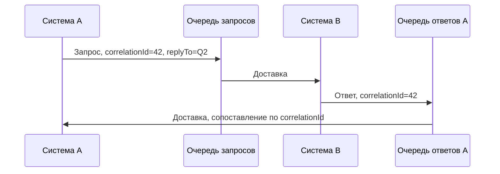
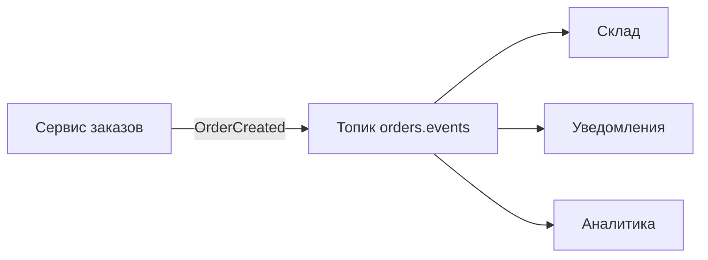
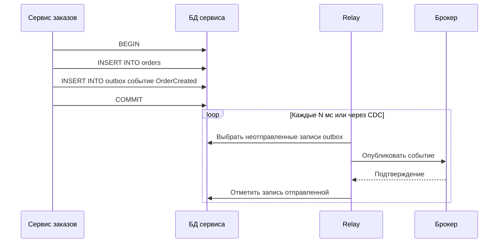
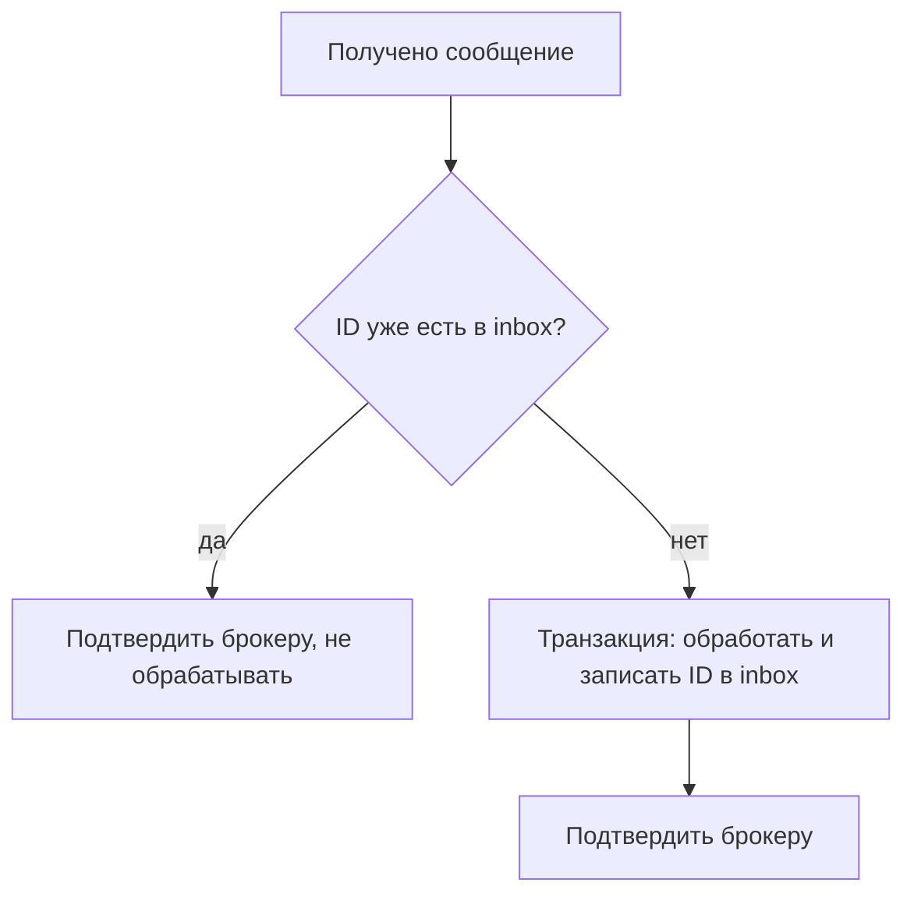
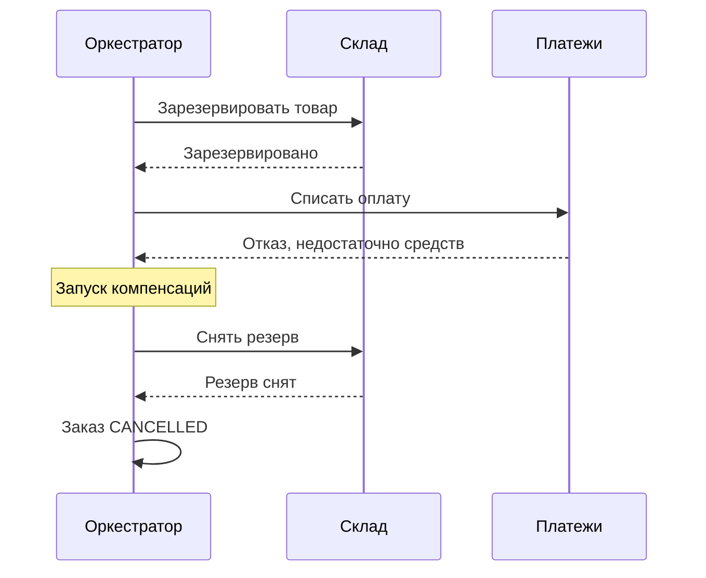
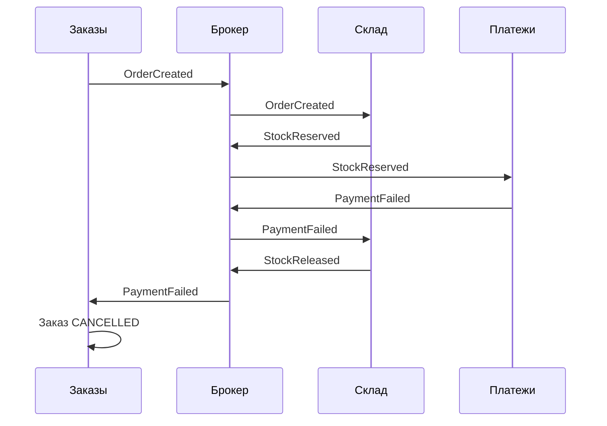
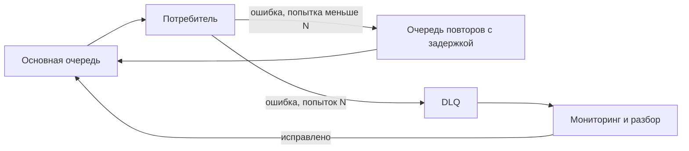
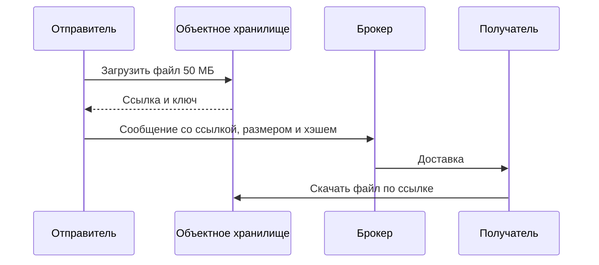
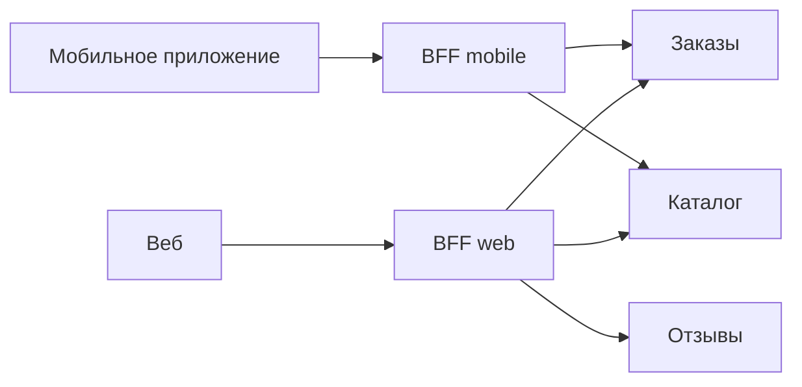
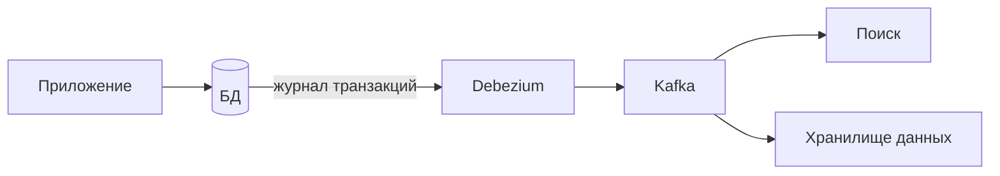

# Интеграционные паттерны

Интеграционные паттерны — проверенные решения типовых задач обмена данными между системами: как доставить сообщение, как не потерять и не задвоить данные, как согласовать распределённую транзакцию, как изолировать свою модель от чужой. Основа терминологии — книга Gregor Hohpe и Bobby Woolf «Enterprise Integration Patterns» (2003) и паттерны микросервисной архитектуры Chris Richardson.

## Стили интеграции {#integration-styles}

Hohpe и Woolf выделяют четыре базовых стиля:

| Стиль | Суть | Плюсы | Минусы | Когда применять |
|---|---|---|---|---|
| **Файловый обмен** (File Transfer) | Система выгружает файл, другая забирает его по расписанию | Просто, слабая связанность, большие объёмы | Задержка, нет подтверждения обработки, сложно с ошибками в отдельных записях | Пакетные выгрузки, реестры, обмен с банками и госорганами. См. [Файловый обмен](/protocols/file-exchange) |
| **Общая база данных** (Shared Database) | Системы читают и пишут в одни таблицы | Данные сразу согласованы | Жёсткая связанность по схеме, нельзя менять структуру, конфликт блокировок, неясно, кто владелец данных | **Антипаттерн** для новых интеграций. Допустимо как временная мера при миграции legacy |
| **Удалённый вызов** (Remote Procedure Invocation) | Система вызывает функцию другой: REST, gRPC, SOAP | Понятно, синхронный ответ, инкапсуляция | Временная связанность: обе системы должны работать одновременно | Запросы с немедленным ответом: проверить, рассчитать, получить. См. [REST](/protocols/rest), [gRPC](/protocols/grpc) |
| **Обмен сообщениями** (Messaging) | Системы обмениваются сообщениями через брокер | Слабая связанность, буферизация, масштабирование | Сложнее отладка, eventual consistency, дубли и порядок | События, фоновые процессы, интеграция многих систем. См. [Брокеры сообщений](/protocols/messaging) |

::: danger Общая БД как интеграция
Интеграция через чужую базу данных — «прямо в таблицы» — превращает внутреннюю схему системы в публичный контракт без версионирования и валидации. Любое изменение схемы ломает соседей, бизнес-правила обходятся. Если иначе нельзя, ограничьте доступ представлениями (views) только для чтения и зафиксируйте их как контракт.
:::

## Синхронная и асинхронная интеграция {#sync-vs-async}

| Критерий | Синхронная (запрос-ответ по HTTP, gRPC) | Асинхронная (сообщения, события, callback) |
|---|---|---|
| Ответ | Сразу, в том же соединении | Позже или никогда, отдельным сообщением |
| Связанность по времени | Обе системы должны быть доступны | Получатель может быть недоступен, сообщение подождёт |
| Задержка | Минимальная для одного вызова | Выше, зависит от очереди |
| Пиковые нагрузки | Передаются на получателя напрямую | Сглаживаются очередью |
| Обработка ошибок | Проще: ошибка видна вызывающему | Сложнее: DLQ, повторы, компенсации |
| Согласованность | Проще получить строгую | Обычно eventual consistency |
| Отладка и трассировка | Проще | Нужны correlation id и трассировка через брокер |
| Типичное применение | Проверки, расчёты, чтение данных для UI | Уведомления, синхронизация справочников, длительные процессы |

Правило выбора: если пользователь **ждёт результата** и он нужен для следующего шага — синхронно. Если важен **факт доставки**, а результат может прийти позже — асинхронно.

## Модели обмена сообщениями {#messaging-models}

### Request-reply {#request-reply}

Запрос-ответ поверх асинхронного канала: отправитель указывает, куда ответить (`replyTo`), и идентификатор корреляции (`correlationId`). Ответ приходит в отдельную очередь.



Применяйте, когда нужен ответ, но получатель может быть временно недоступен или обработка долгая. Обязательно: таймаут ожидания ответа и обработка «опоздавших» ответов.

### Fire-and-forget {#fire-and-forget}

Отправить и забыть: отправитель не ждёт ответа и не узнаёт о результате обработки. Гарантия ограничивается тем, что брокер принял сообщение. Подходит для уведомлений, логов, метрик. Не подходит, если отправителю нужно знать, что получатель обработал данные, — тогда нужен ответ, квитанция или статус.

### Publish-subscribe {#publish-subscribe}

Издатель публикует событие в топик, каждый подписчик получает свою копию. Издатель не знает подписчиков — новые добавляются без его изменения.



Отличие от point-to-point очереди: в очереди сообщение получает **один** из потребителей, в pub-sub — **каждый** подписчик (в Kafka — каждая consumer group).

## Виды событий {#event-types}

Мартин Фаулер различает несколько стилей «событийной» архитектуры, которые часто путают:

| Стиль | Что в событии | Что делает потребитель | Плюсы | Минусы |
|---|---|---|---|---|
| **Event Notification** | Минимум: тип события и ID. `{"type": "OrderCreated", "orderId": "42"}` | При необходимости запрашивает подробности по API источника | Маленькие сообщения, не утекают данные | Обратная нагрузка на источник, источник должен быть доступен |
| **Event-Carried State Transfer** | Полное состояние сущности или изменённые поля | Хранит локальную копию, источник не вызывает | Автономность потребителя | Большие сообщения, дублирование данных, eventual consistency |
| **Event Sourcing** | Событие — первичный источник истины. Состояние сущности = свёртка всех её событий | — (это способ хранения внутри системы, а не стиль интеграции) | Полная история, аудит, воспроизведение | Сложность, эволюция схем событий, нужны снапшоты |

::: tip Как выбрать
Для интеграции между командами чаще всего удобен **Event-Carried State Transfer** с версионированной схемой. Event Notification подходит, когда данные чувствительные или объёмные. Event Sourcing — решение для хранения внутри сервиса, не путайте его с публикацией событий наружу.
:::

## CQRS {#cqrs}

CQRS (Command Query Responsibility Segregation) — разделение модели записи (команды) и модели чтения (запросы). Модель чтения — отдельное хранилище, денормализованное под запросы и обновляемое по событиям из модели записи. Это даёт быстрое чтение и независимое масштабирование, но чтение отстаёт от записи (eventual consistency). Для аналитика важно: после команды данные в модели чтения появляются не мгновенно — это надо учитывать в UI и в API (например, возвращать результат команды в ответе, а не перечитывать список).

## Transactional Outbox {#outbox}

### Проблема двойной записи

Сервис должен сохранить заказ в своей БД **и** опубликовать событие в брокер. Это две разные системы, общей транзакции нет:

- сохранили в БД, упали до публикации — событие потеряно, остальные системы не узнают о заказе;
- опубликовали, а транзакция БД откатилась — событие о заказе, которого нет.

### Решение

Событие записывается в таблицу `outbox` **в той же локальной транзакции**, что и бизнес-данные. Отдельный процесс (relay) читает outbox и публикует в брокер.



```sql
CREATE TABLE outbox (
    id             UUID PRIMARY KEY,
    aggregate_type VARCHAR(100) NOT NULL,   -- Order
    aggregate_id   VARCHAR(100) NOT NULL,   -- ID заказа, ключ партиции
    event_type     VARCHAR(100) NOT NULL,   -- OrderCreated
    payload        JSONB        NOT NULL,
    created_at     TIMESTAMPTZ  NOT NULL DEFAULT now(),
    published_at   TIMESTAMPTZ
);
```

Свойства:

- Гарантия **at-least-once**: relay может упасть после публикации, но до отметки — событие уйдёт повторно. Потребители обязаны быть идемпотентными.
- Порядок событий одной сущности сохраняется, если relay публикует их по порядку и с ключом партиции = ID сущности.
- Relay реализуется опросом таблицы (polling publisher) или через CDC — чтение журнала транзакций БД (Debezium Outbox Event Router).
- Таблицу outbox нужно чистить: удалять отправленные записи старше N дней.

## Inbox и идемпотентный потребитель {#inbox}

Брокеры с гарантией at-least-once доставляют сообщения повторно. **Идемпотентный потребитель** (Idempotent Consumer) обрабатывает каждое сообщение ровно один раз по смыслу.

Паттерн **Inbox**: при получении сообщения его ID записывается в таблицу `inbox` в той же транзакции, что и результат обработки. Уникальный ключ не даст обработать сообщение повторно.



Что нужно для работы: **стабильный уникальный ID сообщения** от отправителя (не генерируется брокером при каждой доставке), срок хранения записей inbox больше максимального срока повторной доставки. Альтернатива — идемпотентная бизнес-операция (upsert по бизнес-ключу с проверкой версии). См. [Идемпотентность](/design/idempotency).

## Saga {#saga}

Сага (saga) — способ выполнить бизнес-транзакцию, затрагивающую несколько сервисов, без распределённой блокировки. Транзакция разбивается на последовательность **локальных** транзакций. Если шаг не удался, выполняются **компенсирующие транзакции** (compensating transactions) для уже выполненных шагов.

Пример: оформление заказа.

| Шаг | Сервис | Действие | Компенсация |
|---|---|---|---|
| 1 | Заказы | Создать заказ в статусе `PENDING` | Перевести заказ в `CANCELLED` |
| 2 | Склад | Зарезервировать товар | Снять резерв |
| 3 | Платежи | Списать оплату | Вернуть деньги (refund) |
| 4 | Заказы | Перевести заказ в `CONFIRMED` | — |

::: warning Компенсация — не откат
Компенсация — это новая бизнес-операция, а не возврат «как было». Деньги возвращаются отдельным возвратом, письмо клиенту уже ушло. Компенсации должны быть идемпотентными и практически всегда успешными. Шаги, которые невозможно компенсировать (отправка товара), ставят последними.
:::

### Оркестрация {#saga-orchestration}

Центральный оркестратор (сервис или workflow-движок — Camunda, Temporal) командует участниками и хранит состояние саги.



### Хореография {#saga-choreography}

Центра нет: каждый сервис реагирует на события других и публикует свои.



| Критерий | Оркестрация | Хореография |
|---|---|---|
| Где логика процесса | В одном месте | Распределена по сервисам |
| Понятность и отладка | Проще: видно состояние каждой саги | Сложнее, процесс «размазан» |
| Связанность | Оркестратор знает всех участников | Участники знают только события |
| Риск | Оркестратор — центр сложности | Циклические зависимости событий, трудно менять процесс |
| Когда | Много шагов, сложные ветвления, нужен мониторинг процесса | 2–4 шага, простой линейный процесс |

## 2PC и почему его избегают {#2pc}

Двухфазная фиксация (two-phase commit, 2PC; XA-транзакции): координатор спрашивает всех участников «готовы?» (prepare), затем командует commit или rollback.

Почему в интеграциях его избегают:

- **блокировки**: участники держат ресурсы до решения координатора;
- **падение координатора** между фазами оставляет участников в неопределённом состоянии;
- **доступность**: транзакция невозможна, если недоступен любой участник;
- **поддержка**: брокеры, REST API, облачные сервисы и большинство NoSQL-хранилищ в 2PC не участвуют.

Вместо 2PC используют Saga, Outbox, идемпотентность и сверку (reconciliation).

## Dead Letter Queue {#dlq}

Очередь «мёртвых» писем (Dead Letter Queue, DLQ) — куда попадают сообщения, которые не удалось обработать за N попыток, которые просрочены или не прошли валидацию. Без DLQ «ядовитое» сообщение (poison message) бесконечно повторяется и блокирует очередь.



Что определить: число попыток до DLQ, какие ошибки сразу в DLQ (ошибка валидации повторять бессмысленно), что сохраняется вместе с сообщением (причина, стек, число попыток, время), кто разбирает DLQ и в какой срок, как переотправить сообщение после исправления, алерт на размер DLQ.

## Competing Consumers {#competing-consumers}

Конкурирующие потребители: несколько экземпляров читают одну очередь, каждое сообщение обрабатывает один из них. Так масштабируется обработка. Побочный эффект — **нарушается порядок**. Если порядок важен для сущности, используйте партиционирование по ключу (в Kafka — ключ сообщения, в RabbitMQ — consistent hash exchange или single active consumer).

## Маршрутизация и преобразование {#routing-transformation}

| Паттерн | Суть | Пример |
|---|---|---|
| **Content-Based Router** | Направляет сообщение в канал по его содержимому | Заказы юрлиц — в B2B-систему, физлиц — в B2C |
| **Message Filter** | Отбрасывает ненужные получателю сообщения | Складу нужны только заказы с доставкой |
| **Message Translator** | Преобразует формат и модель данных | XML партнёра → внутренний JSON, коды статусов партнёра → свои |
| **Splitter** | Разбивает одно сообщение на несколько | Заказ из 5 позиций → 5 сообщений для резервирования |
| **Aggregator** | Собирает несколько связанных сообщений в одно | Ответы 3 складов → один ответ о наличии. Нужны: ключ корреляции, условие завершения, таймаут |
| **Content Enricher** | Дополняет сообщение данными из другого источника | Добавить в заказ адрес клиента из CRM |
| **Claim Check** | Большой объём кладётся в хранилище, в сообщении — только ссылка | Скан документа в S3, в сообщении — URL и хэш |
| **Normalizer** | Приводит разные форматы к одному | Прайсы от 10 поставщиков в разных форматах → единая модель |
| **Canonical Data Model** | Единая модель данных для обмена между многими системами | Общая модель «Клиент» в шине предприятия |

### Claim Check {#claim-check}



Применяйте, когда содержимое превышает лимит брокера (у Kafka по умолчанию около 1 МБ на сообщение) или когда большинству потребителей тело не нужно. Определите срок хранения объекта и права доступа к нему.

## Anti-Corruption Layer {#acl}

Предохранительный слой (Anti-Corruption Layer, термин Эрика Эванса из DDD) — слой-переводчик между вашей моделью и моделью внешней или legacy-системы. Внутри системы используются свои понятия, а все особенности чужой модели (странные коды, поля-«комбайны», другие статусы) переводятся на границе.

Когда нужен: интеграция с legacy, с внешним партнёром, чья модель не совпадает с вашей, с ERP-системами. Без ACL чужие понятия «протекают» в вашу систему, и смена партнёра требует переписывать всё.

## API Gateway {#api-gateway}

Единая точка входа для внешних клиентов. Типичные функции: маршрутизация, аутентификация и проверка токенов, rate limiting, TLS-терминация, логирование, преобразование протоколов, агрегация запросов, кэширование.

Риски: gateway становится узким местом и «бутылочным горлышком» для изменений, если в него переносят бизнес-логику. Бизнес-логика в gateway — антипаттерн.

## BFF — Backend for Frontend {#bff}

Отдельный бэкенд под каждый тип клиента: мобильное приложение, веб, партнёрский API. BFF агрегирует вызовы микросервисов и отдаёт данные в форме, удобной конкретному клиенту. Применяйте, когда разным клиентам нужны существенно разные данные и сценарии. Принадлежит обычно команде фронтенда.



## ESB и микросервисы {#esb}

| Критерий | ESB (сервисная шина предприятия) | Микросервисы: smart endpoints and dumb pipes |
|---|---|---|
| Где логика интеграции | В шине: маршрутизация, трансформация, оркестрация | В сервисах, брокер только доставляет |
| Владение | Централизованная интеграционная команда | Команды сервисов |
| Плюсы | Единый контроль, готовые адаптеры к legacy, каноническая модель | Независимость команд и релизов |
| Минусы | Шина — узкое место по изменениям и производительности | Дублирование логики интеграции, сложнее единые правила |
| Примеры | IBM App Connect, MuleSoft, SAP PI/PO, Apache Camel и Apache ServiceMix | Kafka, RabbitMQ, REST/gRPC напрямую, service mesh |

На практике в крупных компаниях встречаются оба подхода: шина для legacy и внешних контрагентов, прямые интеграции и брокер событий — для новых сервисов.

## CDC — Change Data Capture {#cdc}

Захват изменений данных (Change Data Capture): изменения в БД читаются из журнала транзакций (PostgreSQL WAL, MySQL binlog, Oracle redo log) и публикуются как события. Самый известный инструмент — **Debezium** (работает поверх Kafka Connect).



Применение: реализация outbox без опроса, репликация в хранилище данных и поиск, интеграция с legacy, который нельзя изменить. Риск: события CDC отражают **структуру таблиц**, а не бизнес-события, — внутренняя схема становится контрактом. Поэтому для интеграции между командами предпочтителен CDC по таблице outbox, а не по бизнес-таблицам.

## На что обратить внимание аналитику {#checklist}

- [ ] Выбран стиль интеграции и обоснован выбор синхронного или асинхронного взаимодействия.
- [ ] Нет интеграции через чужую базу данных.
- [ ] Для публикации событий из сервиса с БД предусмотрен Transactional Outbox или CDC.
- [ ] Все потребители идемпотентны, у сообщений есть стабильный уникальный ID.
- [ ] Определено, важен ли порядок, и как он обеспечивается (ключ партиции).
- [ ] Для распределённых бизнес-транзакций описана сага: шаги, компенсации, кто оркестрирует.
- [ ] Компенсации идемпотентны, некомпенсируемые шаги стоят последними.
- [ ] Определена DLQ: число попыток, кто разбирает, как переотправить, алерты.
- [ ] Выбран стиль событий: notification или state transfer, состав полей зафиксирован.
- [ ] Большие объекты передаются через Claim Check, а не в теле сообщения.
- [ ] Модель внешней системы изолирована через Anti-Corruption Layer / трансляцию.
- [ ] Учтена eventual consistency: что видит пользователь, пока данные не синхронизированы.

## Стандарты и ссылки {#links}

- [Enterprise Integration Patterns — каталог паттернов](https://www.enterpriseintegrationpatterns.com/patterns/messaging/)
- [Martin Fowler — What do you mean by Event-Driven?](https://martinfowler.com/articles/201701-event-driven.html)
- [Martin Fowler — CQRS](https://martinfowler.com/bliki/CQRS.html)
- [microservices.io — Transactional Outbox](https://microservices.io/patterns/data/transactional-outbox.html)
- [microservices.io — Saga](https://microservices.io/patterns/data/saga.html)
- [microservices.io — Idempotent Consumer](https://microservices.io/patterns/communication-style/idempotent-consumer.html)
- [Sam Newman — Backends For Frontends](https://samnewman.io/patterns/architectural/bff/)
- [Microsoft Azure Architecture Center — Cloud Design Patterns](https://learn.microsoft.com/en-us/azure/architecture/patterns/)
- [Debezium — документация](https://debezium.io/documentation/)
- [Debezium — Outbox Event Router](https://debezium.io/documentation/reference/stable/transformations/outbox-event-router.html)
