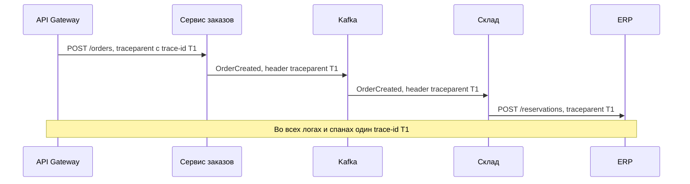

# Наблюдаемость интеграций

Наблюдаемость (observability) — способность по внешним сигналам системы понять, что с ней происходит, не подключаясь отладчиком. Для интеграций это особенно важно. Сбой обычно находится «между» системами: каждая команда видит у себя зелёные графики, а заказ всё равно потерялся. Требования к логам, метрикам и трассировке надо закладывать в постановку, а не дописывать после первого инцидента.

## Три столпа {#three-pillars}

| Сигнал | Что это | На какой вопрос отвечает | Пример |
|---|---|---|---|
| **Логи** (logs) | Записи о дискретных событиях с контекстом | «Что именно произошло с этим запросом?» | `POST /orders 201 за 340 мс, correlationId=…` |
| **Метрики** (metrics) | Числовые агрегаты во времени | «Сколько, как быстро, как часто? Есть ли проблема сейчас?» | 120 запросов в секунду, 0,5 процента ошибок, p99 = 800 мс |
| **Трассировки** (traces) | Путь одного запроса через все системы, разбитый на интервалы (spans) | «Где в цепочке теряется время и где ошибка?» | Шлюз 5 мс → заказы 30 мс → платежи 700 мс |

Метрики говорят, **что** проблема есть. Трассировки — **где** она. Логи — **почему**. Связывает их общий идентификатор: correlation id или trace id.

## Correlation ID и Request ID {#correlation-id}

| Идентификатор | Область | Назначение |
|---|---|---|
| **Request ID** | Один HTTP-запрос между двумя системами | Найти конкретный вызов в логах обеих сторон, сообщить партнёру при разборе |
| **Correlation ID** | Вся бизнес-операция через все системы и брокеры | Собрать все логи одной операции: от клика пользователя до записи в учётной системе |
| **Trace ID** (W3C Trace Context) | То же, что correlation id, в стандартном формате | Распределённая трассировка инструментами OpenTelemetry |

### Правила работы с correlation id

1. **Генерация**: на входе в периметр (API Gateway, первый сервис), если клиент не прислал свой. Формат — UUID или trace-id W3C.
2. **Приём**: если вызывающая система прислала идентификатор — использовать его, а не генерировать новый. Проверить формат и длину, чтобы не принять мусор или инъекцию в логи.
3. **Проброс**: во **все** исходящие вызовы — HTTP-заголовки, заголовки сообщений брокера (Kafka headers, AMQP properties), поля файлов обмена, вебхуки.
4. **Логирование**: в каждой записи лога — как отдельное поле, а не внутри текста.
5. **Возврат в ответе**: в заголовке ответа и в теле ошибки, чтобы клиент мог сообщить его в поддержку.

```http
POST /api/v1/orders HTTP/1.1
Host: api.example.com
X-Request-ID: 7f3c2a10-5b1e-4c7a-9d2e-1a2b3c4d5e6f
traceparent: 00-4bf92f3577b34da6a3ce929d0e0e4736-00f067aa0ba902b7-01
Content-Type: application/json
```

```http
HTTP/1.1 500 Internal Server Error
Content-Type: application/problem+json
X-Request-ID: 7f3c2a10-5b1e-4c7a-9d2e-1a2b3c4d5e6f

{
  "type": "https://api.example.com/problems/internal-error",
  "title": "Внутренняя ошибка",
  "status": 500,
  "instance": "/api/v1/orders",
  "traceId": "4bf92f3577b34da6a3ce929d0e0e4736"
}
```

Формат ошибок — см. [Ошибки (RFC 9457)](/design/errors).

### Проброс через брокер



::: warning Типичная потеря контекста
Correlation id теряется на асинхронных границах: при записи в очередь, в outbox, в планировщик заданий, при пакетной обработке. Явно укажите в постановке: в заголовке какого поля сообщения передаётся идентификатор и что делает потребитель, если его нет. Для пакетов из многих сообщений каждое сообщение несёт свой идентификатор.
:::

## W3C Trace Context {#trace-context}

Стандарт W3C Trace Context (W3C Recommendation с 2020 года, Level 1) определяет два HTTP-заголовка для передачи контекста трассировки между системами разных производителей.

### traceparent

```text
traceparent: 00-4bf92f3577b34da6a3ce929d0e0e4736-00f067aa0ba902b7-01
             │  │                                │                │
             │  │                                │                └ trace-flags, 2 hex
             │  │                                └ parent-id, 16 hex
             │  └ trace-id, 32 hex
             └ version, 2 hex
```

| Поле | Длина | Смысл |
|---|---|---|
| `version` | 2 hex-символа | Версия формата, сейчас `00` |
| `trace-id` | 32 hex-символа (16 байт) | ID всей трассировки. Одинаков во всех системах. Все нули — недопустимо |
| `parent-id` | 16 hex-символов (8 байт) | ID спана вызывающей стороны. Каждая система при исходящем вызове подставляет ID своего спана |
| `trace-flags` | 2 hex-символа | Битовые флаги. `01` — трассировка записывается (sampled), `00` — нет |

Hex-символы — только в нижнем регистре.

### tracestate

Дополнительный заголовок для данных конкретных систем трассировки: список пар `ключ=значение` через запятую, не более 32 элементов. Системы, которые его не понимают, должны передавать его дальше без изменений.

```http
tracestate: vendorA=t61rcWkgMzE,vendorB=00f067aa0ba902b7
```

### baggage

Отдельная спецификация W3C Baggage описывает заголовок `baggage` для передачи произвольных пар ключ-значение по всей цепочке, например `baggage: tenantId=acme,channel=mobile`. Не кладите туда ПДн и секреты — baggage уходит во все нижестоящие системы, включая внешние.

::: tip Что выбрать для correlation id
Если в компании используется OpenTelemetry, используйте `trace-id` из `traceparent` как correlation id — не нужно поддерживать два идентификатора. Для внешних партнёров, которые не поддерживают Trace Context, дополнительно передавайте `X-Request-ID` или `X-Correlation-ID`.
:::

## OpenTelemetry {#opentelemetry}

OpenTelemetry (OTel) — открытый стандарт и набор инструментов CNCF для сбора телеметрии. Появился в 2019 году объединением OpenTracing и OpenCensus.

- **Сигналы**: трассировки, метрики, логи (стабильны), профили — в развитии.
- **API и SDK** для основных языков, **автоинструментация** HTTP-клиентов, серверов, драйверов БД и брокеров без изменения кода.
- **OTLP** — протокол передачи телеметрии.
- **Collector** — агент и шлюз, который принимает, обрабатывает (фильтрует, маскирует) и отправляет данные в бэкенды: Jaeger, Grafana Tempo, Prometheus, Elastic, коммерческие APM.
- **Semantic conventions** — стандартные имена атрибутов: `http.request.method`, `http.response.status_code`, `url.full`, `server.address`, `messaging.system`, `messaging.destination.name` и т. д.
- **Propagators** — по умолчанию W3C Trace Context и W3C Baggage.

## Структурированное логирование {#structured-logging}

Логи пишутся в машиночитаемом формате (обычно JSON, одна запись — одна строка), чтобы искать и агрегировать по полям, а не по регулярным выражениям.

Пример записи о вызове внешней системы:

```json
{
  "timestamp": "2026-10-03T10:15:42.318Z",
  "level": "INFO",
  "service": "order-service",
  "event": "outbound_http_call",
  "traceId": "4bf92f3577b34da6a3ce929d0e0e4736",
  "spanId": "00f067aa0ba902b7",
  "requestId": "7f3c2a10-5b1e-4c7a-9d2e-1a2b3c4d5e6f",
  "peer": "payment-gateway",
  "http": {
    "method": "POST",
    "url": "https://pay.example.com/api/v2/payments",
    "statusCode": 201,
    "requestSize": 512,
    "responseSize": 230
  },
  "durationMs": 342,
  "attempt": 1,
  "idempotencyKey": "b6f1c0e2-8f7a-4f52-9a4d-0c3e5f9a1b22",
  "clientId": "mobile-app",
  "businessKey": { "orderId": "ORD-2026-000123" }
}
```

### Что логировать по каждому вызову

| Поле | Зачем |
|---|---|
| Время начала, UTC с миллисекундами | Сопоставление событий разных систем |
| Направление: входящий или исходящий | Понимать, чья сторона |
| Метод и URI (шаблон и фактический) | Шаблон `/orders/{id}` удобен для агрегации, фактический — для поиска |
| Код ответа | Классификация ошибок |
| Длительность | Анализ задержек и таймаутов |
| Размер запроса и ответа | Аномалии, лимиты |
| Клиент: client_id, система-источник | Кто вызывал |
| Correlation id, trace id, request id | Связь с другими логами |
| Номер попытки, ключ идемпотентности | Разбор повторов и дублей |
| Бизнес-ключ: номер заказа, договора | Поиск по обращению пользователя |
| Для ошибок: тип, код ошибки партнёра, текст | Разбор причины |

### Что НЕ логировать {#do-not-log}

::: danger Секреты и персональные данные в логах — инцидент безопасности
Логи хранятся долго, доступны многим и часто уходят во внешние системы. Утечка через логи — одна из самых частых.
:::

- Токены доступа, refresh-токены, API-ключи, заголовок `Authorization`, cookies, клиентские секреты.
- Пароли, одноразовые коды, ответы на секретные вопросы.
- Полные номера карт, CVV (требование PCI DSS), полные реквизиты счетов.
- Персональные данные сверх необходимого: паспорт, СНИЛС, ИНН физлица, адрес, телефон, email, диагнозы. В России — с учётом 152-ФЗ.
- Полные тела запросов и ответов с чувствительными данными. Если тело нужно для разбора — логировать с маскированием полей по списку (`"phone": "+7******4567"`) или хранить в защищённом журнале обмена с ограниченным доступом и сроком хранения.

Маскирование настраивайте централизованно: в библиотеке логирования или в OpenTelemetry Collector, а не в каждом месте кода.

### Уровни логирования

| Уровень | Когда |
|---|---|
| `ERROR` | Операция не выполнена, нужна реакция |
| `WARN` | Нештатная, но обработанная ситуация: повтор, fallback, открыт Circuit Breaker |
| `INFO` | Факт каждого вызова интеграции, смена статусов бизнес-объектов |
| `DEBUG` | Детали для отладки, на продуктиве выключен |

## Метрики {#metrics}

### RED — для сервисов и интеграций

| Метрика | Смысл | Пример |
|---|---|---|
| **Rate** | Число запросов в секунду | `http_client_requests_total` по партнёру и операции |
| **Errors** | Число или доля ошибок | Доля ответов `5xx` и таймаутов |
| **Duration** | Распределение времени ответа | Гистограмма, перцентили p50, p95, p99 |

### USE — для ресурсов

**Utilization** (загрузка), **Saturation** (насыщение, очередь ожидания), **Errors** (ошибки) — для пулов соединений, потоков, CPU, дисков. Для интеграций особенно важно насыщение пула HTTP-соединений к партнёру и очереди задач.

### Перцентили, а не среднее {#percentiles}

Среднее время ответа скрывает проблемы. Если 98 запросов выполнились за 100 мс, а 2 — за 10 с, среднее будет около 300 мс — «всё хорошо», хотя каждый пятидесятый пользователь ждёт 10 секунд.

| Перцентиль | Смысл |
|---|---|
| p50 (медиана) | Половина запросов быстрее этого значения — «типичный» опыт |
| p95 | 95 процентов запросов быстрее — опыт большинства |
| p99 | 99 процентов быстрее — «хвост», часто именно здесь таймауты |
| p99.9 | Важен при большом числе запросов и длинных цепочках |

В цепочке вызовов «хвосты» складываются: если страница делает 10 параллельных вызовов, вероятность, что хотя бы один попадёт в свой худший один процент, около 10 процентов. Поэтому таймауты рассчитывают по p99, а не по среднему. См. [Таймауты и повторы](/reliability/timeouts-retries).

### Метрики, которые нужны каждой интеграции

- RED по каждой операции каждого партнёра — исходящие и входящие вызовы.
- Число повторов и доля запросов, которые прошли только после повтора.
- Состояние Circuit Breaker и число срабатываний fallback.
- Число ответов `429` и остаток квоты, если партнёр её сообщает.
- Бизнес-метрики: число созданных заказов в минуту, доля заказов, не дошедших до ERP. Часто они ловят проблему раньше технических.

## SLI, SLO, SLA {#slo}

| Термин | Определение | Пример |
|---|---|---|
| **SLI** (Service Level Indicator) | Измеряемый показатель качества | Доля успешных ответов `POST /orders` с длительностью не более 1 с |
| **SLO** (Service Level Objective) | Целевое значение SLI за период — внутренняя цель | 99,5 процента за скользящие 30 дней |
| **SLA** (Service Level Agreement) | Договорное обязательство перед клиентом с последствиями | 99 процентов в месяц, иначе компенсация. SLA всегда мягче SLO |

### Пример SLO для интеграции

| SLI | Как измеряется | SLO |
|---|---|---|
| Доступность приёма заказов | Доля ответов `POST /api/v1/orders`, отличных от `5xx` и таймаута, на шлюзе | 99,9 процента за 30 дней |
| Время ответа | Доля запросов `POST /api/v1/orders` быстрее 800 мс | 99 процентов за 30 дней |
| Своевременность доставки событий | Доля событий `OrderCreated`, обработанных ERP в течение 5 мин после публикации | 99,5 процента за 30 дней |

### Бюджет ошибок {#error-budget}

Бюджет ошибок (error budget) = 1 − SLO. Это допустимый объём «плохих» событий за период.

| SLO за 30 дней | Бюджет ошибок | Допустимый простой |
|---|---|---|
| 99 процентов | 1 процент | 7 ч 12 мин |
| 99,5 процента | 0,5 процента | 3 ч 36 мин |
| 99,9 процента | 0,1 процента | 43 мин |
| 99,95 процента | 0,05 процента | 21,6 мин |
| 99,99 процента | 0,01 процента | 4,3 мин |

Если бюджет исчерпан — приоритет у надёжности, а не у новых функций. Доступность цепочки не выше произведения доступностей звеньев: три последовательные системы по 99,9 процента дают около 99,7 процента.

## Алерты {#alerts}

- Алертить по **симптомам** для пользователя (рост ошибок, задержек, отставание обработки), а не по каждой причине (CPU 80 процентов).
- Хорошая практика — алерты по скорости расходования бюджета ошибок (burn rate): быстрое сгорание — немедленный вызов дежурного, медленное — задача на день.
- У каждого алерта: порог, окно, получатель, приоритет, ссылка на инструкцию (runbook).
- Для партнёрских интеграций: кто уведомляет партнёра и по какому каналу.

| Алерт | Условие | Приоритет |
|---|---|---|
| Ошибки партнёра | Доля `5xx` и таймаутов к платёжному шлюзу выше 5 процентов за 5 мин | Высокий |
| Circuit Breaker открыт | Состояние Open дольше 2 мин | Высокий |
| Рост задержки | p99 выше 2 с в течение 10 мин | Средний |
| Отставание очереди | Consumer lag выше 10 000 сообщений или старейшее сообщение старше 5 мин | Высокий |
| DLQ | В DLQ появились новые сообщения | Средний |
| Тишина | Нет ни одного входящего события от партнёра за 30 мин в рабочее время | Высокий |

::: tip Алерт на тишину
Самые коварные сбои — когда ничего не приходит: партнёр перестал слать вебхуки, файл не выгрузился, потребитель отписался. Ошибок нет, графики «зелёные». Алерт на отсутствие ожидаемого трафика ловит такие случаи.
:::

## Мониторинг вебхуков и очередей {#async-monitoring}

| Объект | Что мониторить |
|---|---|
| **Очередь / топик** | Consumer lag (отставание в сообщениях и во времени), скорость публикации и потребления, возраст старейшего сообщения, число потребителей в группе |
| **DLQ** | Размер, скорость прироста, возраст старейшего сообщения |
| **Исходящие вебхуки** | Доля успешных доставок по подписчикам, число повторов, подписчики в статусе «отключён», время от события до успешной доставки |
| **Входящие вебхуки** | Число полученных, доля отклонённых по подписи, дубли |
| **Файловый обмен** | Факт получения файла в ожидаемое окно, число записей, доля ошибочных записей |

См. [Webhooks](/protocols/webhooks), [Брокеры сообщений](/protocols/messaging), [Интеграционные паттерны](/reliability/integration-patterns).

## Журнал обмена и аудит интеграции {#exchange-log}

Для интеграций с внешними партнёрами, юридически значимых обменов и разборов «мы отправляли — вы не получали» нужен **журнал обмена сообщениями**: отдельное хранилище, где фиксируется каждое сообщение с его статусом. Это не замена логам, а бизнес-уровень учёта.

| Поле | Описание | Пример |
|---|---|---|
| `message_id` | Уникальный ID сообщения | `b6f1c0e2-…` |
| `correlation_id` | ID бизнес-операции / trace-id | `4bf92f35…` |
| `direction` | Входящее / исходящее | `OUT` |
| `counterparty` | Система-партнёр | `ERP` |
| `operation` | Тип сообщения или операция API | `OrderCreated`, `POST /orders` |
| `business_key` | Ключ бизнес-объекта | `ORD-2026-000123` |
| `status` | Статус обработки | `SENT`, `DELIVERED`, `PROCESSED`, `ERROR`, `DLQ` |
| `attempts` | Число попыток | 3 |
| `created_at`, `sent_at`, `processed_at` | Временные метки UTC | |
| `http_status`, `error_code`, `error_text` | Результат | `503`, `PARTNER_UNAVAILABLE` |
| `payload_ref` | Ссылка на тело сообщения в защищённом хранилище, хэш | `s3://exchange-log/…`, `sha256:…` |

Требования к журналу:

- срок хранения (например, 90 дней для тел, 3 года для метаданных — по требованиям бизнеса и регуляторов);
- доступ по ролям, маскирование ПДн, аудит доступа к телам сообщений;
- поиск по бизнес-ключу и correlation id;
- возможность ручной переотправки сообщения из журнала с сохранением ключа идемпотентности;
- регулярная **сверка** (reconciliation) с партнёром: сколько отправлено и сколько обработано за сутки.

## Synthetic monitoring {#synthetic}

Синтетический мониторинг — регулярные тестовые запросы к API, имитирующие клиента: каждую минуту получить тестовый заказ, раз в 5 минут создать и отменить тестовый платёж в песочнице. Позволяет узнать о проблеме раньше пользователей и в периоды без реального трафика (ночью). Требования: тестовые данные отделены от боевых и не попадают в бизнес-отчёты, запросы помечены (например, заголовком), проверки идут из нескольких сетевых точек.

## Что прописать в требованиях {#requirements}

| Раздел | Что указать |
|---|---|
| Идентификаторы | Формат и заголовки: `traceparent`, `X-Request-ID`. Где генерируется, как передаётся через брокер и файлы, возвращается ли в ответе |
| Логи | Перечень полей по каждому вызову, уровень, формат JSON, маскирование, запрет секретов, срок хранения |
| Журнал обмена | Нужен ли, состав полей, хранение тел, срок, доступ, переотправка |
| Метрики | RED по операциям, бизнес-метрики, метрики очередей и DLQ |
| SLO | SLI, целевые значения, период, источник измерения |
| Алерты | Условие, окно, приоритет, получатель, runbook, уведомление партнёра |
| Трассировка | Стандарт (W3C Trace Context, OpenTelemetry), доля семплирования, куда отправляются данные |
| Дашборды | Для кого (дежурные, бизнес, партнёр), какие графики |

## На что обратить внимание аналитику {#checklist}

- [ ] Определён единый correlation id / trace id и его проброс через все синхронные и асинхронные границы.
- [ ] Идентификатор возвращается клиенту в ответе и в теле ошибки.
- [ ] Перечислены обязательные поля логов по каждому вызову.
- [ ] Явно перечислены данные, которые запрещено логировать, и правила маскирования.
- [ ] Метрики RED собираются по каждой операции и каждому партнёру, задержки — перцентилями.
- [ ] Сформулированы SLI и SLO для интеграции и согласованы с SLA партнёров.
- [ ] Есть алерты на ошибки, задержки, отставание очередей, DLQ и отсутствие трафика.
- [ ] Для партнёрских и юридически значимых обменов предусмотрен журнал обмена и сверка.
- [ ] Предусмотрен synthetic monitoring критичных сценариев.
- [ ] Определено, кто реагирует на алерты и как уведомляется партнёр.

## Стандарты и ссылки {#links}

- [W3C Trace Context](https://www.w3.org/TR/trace-context/)
- [W3C Baggage](https://www.w3.org/TR/baggage/)
- [OpenTelemetry — документация](https://opentelemetry.io/docs/)
- [OpenTelemetry — Semantic Conventions для HTTP](https://opentelemetry.io/docs/specs/semconv/http/)
- [OpenTelemetry — Semantic Conventions для messaging](https://opentelemetry.io/docs/specs/semconv/messaging/)
- [Google SRE Book — Service Level Objectives](https://sre.google/sre-book/service-level-objectives/)
- [Google SRE Workbook — Alerting on SLOs](https://sre.google/workbook/alerting-on-slos/)
- [Tom Wilkie — The RED Method](https://grafana.com/blog/2018/08/02/the-red-method-how-to-instrument-your-services/)
- [Brendan Gregg — The USE Method](https://www.brendangregg.com/usemethod.html)
- [OWASP Logging Cheat Sheet](https://cheatsheetseries.owasp.org/cheatsheets/Logging_Cheat_Sheet.html)
- [RFC 9457 — Problem Details for HTTP APIs](https://www.rfc-editor.org/rfc/rfc9457)
