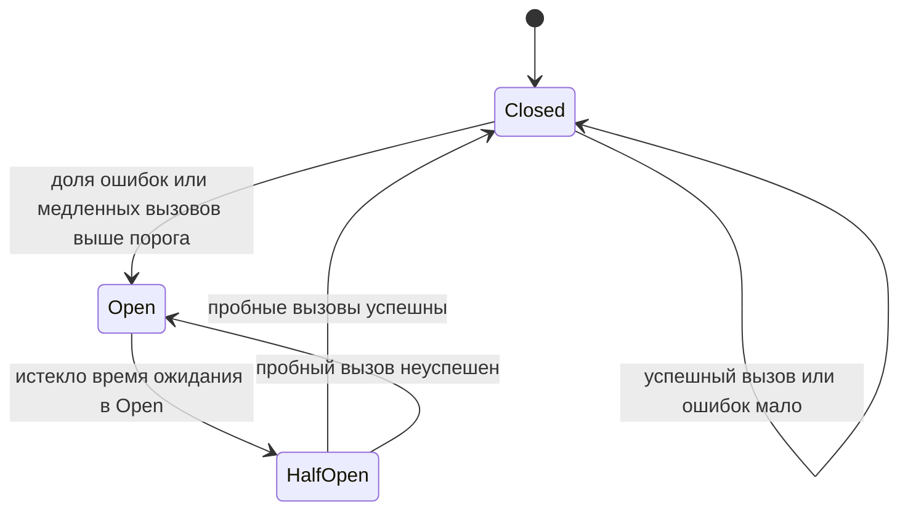
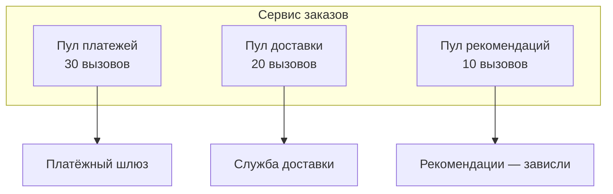
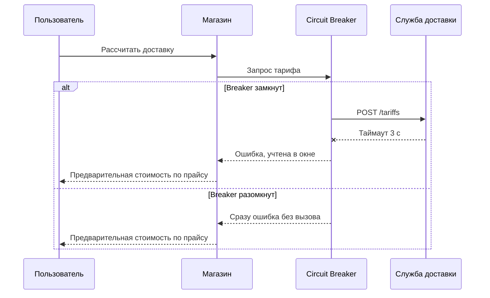

# Паттерны устойчивости

Паттерны устойчивости (resilience patterns) не дают сбою одной зависимости превратиться в отказ всей системы. Для аналитика это не «внутренняя кухня разработчиков». Именно аналитик решает, что видит пользователь, когда партнёр недоступен, какие функции можно отключить и какие данные можно показать из кэша.

## Сводная таблица {#summary}

| Паттерн | От чего защищает | Пример |
|---|---|---|
| **Timeout** | Зависание потоков и соединений на медленной зависимости | Не ждать ответа банка дольше 5 с |
| **Retry** | Кратковременные сбои сети и перезапуски | Повторить `GET` после `503` с backoff |
| **Circuit Breaker** | Лавинообразный отказ, бессмысленные вызовы упавшей системы | После 50 процентов ошибок 30 с не вызывать сервис доставки |
| **Bulkhead** | Исчерпание общего ресурса одной зависимостью | Отдельный пул из 20 соединений для сервиса рекомендаций |
| **Fallback** | Полный отказ функции для пользователя | Показать курс валют из кэша часовой давности |
| **Rate Limiter на клиенте** | Превышение квоты партнёра, блокировка, штрафы | Не более 50 запросов в секунду к API налоговой |
| **Load shedding** | Перегрузка собственного сервиса | При загрузке выше порога отвечать `503` фоновым клиентам |
| **Health checks** | Отправка трафика на неработающий экземпляр | Readiness-проба снимает под с балансировки |
| **Graceful degradation** | Потеря всего продукта из-за второстепенной функции | Каталог работает без персональных цен |
| **Backpressure** | Переполнение памяти и очередей у потребителя | Потребитель сам забирает сообщения из Kafka в своём темпе |

Паттерны комбинируются. Типичный порядок обёрток вокруг вызова (снаружи внутрь): Fallback → Circuit Breaker → Rate Limiter → Retry → Bulkhead → Timeout → вызов.


::: info Порядок зависит от библиотеки
В Resilience4j порядок по умолчанию: Retry снаружи CircuitBreaker. Тогда каждая попытка повтора учитывается Circuit Breaker отдельно. Это нормальный выбор. Главное — порядок должен быть осознанным и одинаковым во всех сервисах.
:::

## Timeout {#timeout}

Без таймаута медленная зависимость занимает потоки и соединения вызывающего, пока они не кончатся. Тогда «падает» и вызывающий. Таймаут — обязательный минимум для любого сетевого вызова. Виды таймаутов и расчёт бюджета — на странице [Таймауты и повторы](/reliability/timeouts-retries).

## Retry {#retry}

Повтор спасает от кратковременных сбоев, но опасен для неидемпотентных операций и при массовом отказе. Повторяйте только временные ошибки, с экспоненциальным backoff и джиттером, на одном уровне цепочки. Подробно — [Таймауты и повторы](/reliability/timeouts-retries) и [Идемпотентность](/design/idempotency).

## Circuit Breaker {#circuit-breaker}

Автоматический выключатель (circuit breaker) следит за ошибками вызовов зависимости. Если ошибок слишком много — «размыкает цепь»: вызовы сразу завершаются ошибкой (или уходят в fallback), не нагружая упавший сервис и не тратя время на таймауты. Через некоторое время пропускает несколько пробных вызовов и, если они успешны, восстанавливает нормальную работу.



| Состояние | Поведение |
|---|---|
| **Closed** (замкнут) | Вызовы проходят. Результаты записываются в скользящее окно |
| **Open** (разомкнут) | Вызовы **не выполняются**, сразу возвращается ошибка или fallback |
| **Half-open** (полуоткрыт) | Пропускается ограниченное число пробных вызовов. По их результату — в Closed или обратно в Open |

### Параметры

| Параметр | Смысл | Пример значения |
|---|---|---|
| Порог ошибок (failure rate threshold) | Доля неуспешных вызовов, при которой цепь размыкается | 50 процентов |
| Порог медленных вызовов | Доля вызовов дольше заданного времени, при которой цепь размыкается | 80 процентов вызовов дольше 3 с |
| Тип и размер окна | По количеству (последние N вызовов) или по времени (последние N секунд) | 20 вызовов или 60 с |
| Минимальное число вызовов | Сколько вызовов нужно в окне, прежде чем считать долю ошибок | 10 |
| Время в Open | Сколько ждать перед пробными вызовами | 30 с |
| Пробные вызовы в Half-open | Сколько вызовов пропустить для проверки | 3–5 |
| Что считается ошибкой | Какие исключения и коды учитываются | Таймауты, ошибки соединения, `5xx`, `429`. **Не** учитывать `4xx` клиента |

::: warning Ошибки клиента — не повод размыкать цепь
Если считать `400` и `404` ошибками, Circuit Breaker разомкнётся из-за некорректных запросов одного клиента и отключит сервис для всех. Учитывайте только сбои зависимости: таймауты, ошибки соединения, `5xx`, иногда `429`.
:::

### Гранулярность

Circuit Breaker заводится **на зависимость**, а иногда — на зависимость и операцию. Если у партнёра не работает только метод отчётов, нет смысла отключать вместе с ним метод создания заказа. Если система работает с несколькими экземплярами партнёра (например, разными регионами), — отдельный breaker на каждый.

## Bulkhead {#bulkhead}

Переборка (bulkhead) — как отсеки корабля: пробоина в одном не топит весь корабль. Каждой зависимости выделяется собственный ограниченный ресурс: пул потоков, пул соединений, семафор с лимитом одновременных вызовов.



Если сервис рекомендаций завис, заняты только 10 слотов его пула. Платежи и доставка продолжают работать. Без переборки зависшие вызовы рекомендаций заняли бы все потоки сервиса.

Разновидности:

- **Семафор** — ограничение числа одновременных вызовов, лишние сразу отклоняются или ждут ограниченное время.
- **Отдельный пул потоков** — изоляция сильнее, но дороже.
- **Изоляция на уровне инфраструктуры** — отдельные экземпляры сервиса или отдельные очереди для разных клиентов (например, крупный партнёр не съедает ресурсы мелких).

## Fallback {#fallback}

Запасной вариант (fallback) — что вернуть, если основной вызов не удался или Circuit Breaker разомкнут.

| Вариант fallback | Пример | Риск |
|---|---|---|
| **Данные из кэша** | Последний известный курс валют, остаток товара | Устаревшие данные — нужно указать допустимый возраст и показать пользователю |
| **Значение по умолчанию** | Стандартный срок доставки 3–5 дней вместо точного расчёта | Пользователь может принять его за точное |
| **Упрощённый расчёт** | Тариф доставки по таблице вместо API перевозчика | Расхождение с фактической ценой |
| **Пустой результат** | Блок «Рекомендуем» не показывается | Почти нет, если блок второстепенный |
| **Отложенная обработка** | Заказ принят, отправка в учётную систему — когда она поднимется, через очередь | Пользователь не получает моментального подтверждения |
| **Альтернативный поставщик** | Второй SMS-шлюз, второй платёжный провайдер | Стоимость, разные форматы и коды ошибок |
| **Понятная ошибка** | «Оплата картой временно недоступна, выберите другой способ» | Нет — это тоже валидный fallback |

::: danger Fallback не должен врать
Нельзя «успешно» завершать операцию, которая фактически не выполнена. Например, показывать «платёж прошёл», если платёжный шлюз недоступен. Fallback для операций записи — это обычно отложенная обработка с честным статусом или понятная ошибка.
:::

## Rate Limiter на клиенте {#client-rate-limiter}

Если у партнёра есть квота (например, 100 запросов в секунду или 10 000 в сутки), клиент должен **сам** ограничивать поток, а не ждать `429`. Обычно это token bucket или sliding window на стороне клиента. При нескольких экземплярах клиента лимит делится между ними или хранится централизованно (например, в Redis).

Что прописать: квоту партнёра, долю квоты для каждого потребителя, поведение при исчерпании (ждать, ставить в очередь, отклонять), приоритеты (онлайн-запросы важнее фоновой синхронизации). См. [Rate limiting](/design/rate-limiting) и [код 429](/http/status-codes#429).

## Load shedding {#load-shedding}

Сброс нагрузки (load shedding) — сервер отказывает **части** запросов, когда перегружен, чтобы успешно обслужить остальные. Лучше быстро ответить `503` десяти процентам клиентов, чем медленно и с таймаутами — всем.

- Признаки перегрузки: длина очереди запросов, загрузка CPU, число одновременных запросов, задержка выше порога.
- Ответ: [503 Service Unavailable](/http/status-codes#503) с `Retry-After`, или [429](/http/status-codes#429), если превышена квота конкретного клиента.
- **Приоритизация**: сначала отбрасываются фоновые и пакетные запросы, затем некритичные чтения, в последнюю очередь — оплата и оформление заказа. Приоритет передаётся заголовком или определяется по клиенту и эндпоинту.
- Запросы, которые клиент уже не дождётся (deadline истёк), отбрасываются без обработки.

## Health checks {#health-checks}

Проверки здоровья (health checks) позволяют оркестратору и балансировщику понимать, можно ли слать трафик на экземпляр.

| Проба | Вопрос | Что проверять | Что будет при провале |
|---|---|---|---|
| **Liveness** | Процесс жив и не завис? | Только сам процесс: отвечает ли он, нет ли deadlock | Перезапуск экземпляра |
| **Readiness** | Готов принимать трафик? | Завершена инициализация, доступны **критичные** собственные ресурсы: своя БД, кэш | Экземпляр исключается из балансировки, но не перезапускается |
| **Startup** | Завершился ли старт? | Прогрев, миграции | Liveness не проверяется, пока старт не завершён |

::: warning Не проверяйте внешних партнёров в liveness
Если liveness-проба проверяет доступность внешнего API, то при его сбое оркестратор перезапустит **все** экземпляры вашего сервиса. Они не помогут, а функции, не зависящие от партнёра, тоже перестанут работать. Внешние зависимости — это метрики и алерты, а не liveness.
:::

Пример ответа эндпоинта `/health` (по мотивам Spring Boot Actuator и IETF draft «Health Check Response Format for HTTP APIs»):

```http
GET /health/readiness HTTP/1.1
Host: orders.internal
```

```json
{
  "status": "UP",
  "components": {
    "db": { "status": "UP", "details": { "latencyMs": 3 } },
    "kafka": { "status": "UP" },
    "paymentGateway": { "status": "DEGRADED", "details": { "circuitBreaker": "OPEN" } }
  },
  "version": "2.4.1",
  "checkedAt": "2026-10-03T10:15:00Z"
}
```

Правила для эндпоинта здоровья:

- не требует тяжёлых операций и отвечает за десятки миллисекунд;
- код ответа `200` при готовности и `503` при неготовности — балансировщики смотрят на код, а не на тело;
- детальная информация (версии, состояние зависимостей) — только во внутренней сети или под аутентификацией;
- для внешних партнёров можно отдельно опубликовать «status page» или эндпоинт статуса API.

## Graceful degradation {#graceful-degradation}

Изящная деградация (graceful degradation) — система при частичном отказе продолжает выполнять главные функции, отключая второстепенные. Это не техника, а **требование к продукту**: какие функции критичны, какие можно отключить и как это выглядит для пользователя.

Типичные приёмы:

- скрыть второстепенный блок (рекомендации, отзывы, персональные предложения);
- переключиться в режим «только чтение»;
- принять операцию в очередь и выполнить позже;
- отключить функцию флагом (feature flag, kill switch) вручную или автоматически;
- показать данные из кэша с пометкой о времени актуальности.

## Backpressure {#backpressure}

Обратное давление (backpressure) — механизм, через который медленный потребитель сообщает быстрому производителю «притормози». Без него данные копятся в памяти или в неограниченных очередях, пока что-то не упадёт.

| Механизм | Где встречается |
|---|---|
| Ограниченная очередь: при заполнении производитель блокируется или получает отказ | Пулы потоков, внутренние буферы |
| Модель pull: потребитель сам забирает сообщения, когда готов | Kafka consumer, prefetch в RabbitMQ (`basic.qos`) |
| Управление потоком на уровне протокола | Окна TCP и HTTP/2 flow control, gRPC streaming, Reactive Streams `request(n)` |
| Явный отказ с указанием паузы | HTTP `429` или `503` с `Retry-After` |

Для интеграций через брокер backpressure почти бесплатен: сообщения ждут в очереди. Но нужно мониторить отставание (consumer lag) и задать срок хранения сообщений. См. [Брокеры сообщений](/protocols/messaging) и [Наблюдаемость](/reliability/observability).

## Hedging — параллельный запрос {#hedging}

Хеджирование (hedged requests): если ответ не пришёл за p95, отправить такой же запрос на другой экземпляр и взять первый ответ. Снижает «хвосты» задержек, но увеличивает нагрузку. Применимо **только для идемпотентных чтений**.

## Библиотеки и инфраструктура {#libraries}

| Инструмент | Платформа | Что умеет |
|---|---|---|
| **Resilience4j** | Java, Spring Boot | CircuitBreaker, Retry, Bulkhead, RateLimiter, TimeLimiter |
| **Spring Cloud Circuit Breaker** | Java, Spring | Абстракция над Resilience4j и другими |
| **Polly** и `Microsoft.Extensions.Http.Resilience` | .NET | Retry, Circuit Breaker, Timeout, Fallback, Hedging, Rate limiter |
| **Envoy** | Прокси, основа Istio | Таймауты, повторы, retry budget, лимиты соединений, outlier detection |
| **Istio / Linkerd** | Service mesh в Kubernetes | Те же политики декларативно, без изменения кода |
| **Hystrix** | Java | Исторически первая популярная библиотека, с 2018 года в режиме поддержки — для новых систем не используется |

::: tip Код или инфраструктура
Mesh хорош для единых политик (таймауты, ограничение соединений, ejection нездоровых экземпляров). Но **fallback** и решения, зависящие от бизнес-смысла (что показать пользователю, можно ли повторить `POST`), всё равно реализуются в коде.
:::

## Сценарий: внешний сервис упал — что видит пользователь {#degradation-scenario}

Интернет-магазин зависит от нескольких внешних систем. Требования к деградации удобно описывать таблицей:

| Зависимость | Функция | Критичность | Поведение при недоступности | Что видит пользователь | Восстановление |
|---|---|---|---|---|---|
| Платёжный шлюз | Оплата картой | Критичная | Circuit Breaker, после 3 неудачных попыток — fallback | «Оплата картой временно недоступна. Выберите оплату при получении или повторите позже» | Автоматически при закрытии breaker |
| Служба доставки | Расчёт стоимости | Высокая | Тариф по табличному прайсу | Стоимость с пометкой «Предварительно, уточнит оператор» | Пересчёт при сборке заказа |
| Учётная система | Передача заказа | Высокая, но не онлайн | Заказ в outbox, отправка при восстановлении | Обычное подтверждение заказа | Автоматическая досылка, алерт при задержке больше 30 мин |
| Сервис рекомендаций | Блок «Вам понравится» | Низкая | Блок скрывается | Блока нет | Автоматически |
| Курсы валют ЦБ | Цены в валюте | Средняя | Курс из кэша не старше 24 ч, иначе цены только в рублях | Цены по вчерашнему курсу | Автоматически |

Процесс принятия решения при вызове:



Что обязательно согласовать с бизнесом:

1. Список функций и их критичность.
2. Для каждой — допустимый fallback и формулировку для пользователя.
3. Допустимый возраст кэшированных данных.
4. Какие операции принимаются «в очередь» и в какой срок обязаны выполниться.
5. Кто и как узнаёт о деградации: алерт, баннер на сайте, рассылка партнёрам.
6. Ручные рубильники: кто может отключить функцию и как.

## На что обратить внимание аналитику {#checklist}

- [ ] Для каждой внешней зависимости определена критичность и поведение при недоступности.
- [ ] Описан fallback: кэш, значение по умолчанию, отложенная обработка или понятная ошибка — и текст для пользователя.
- [ ] Для кэша указан допустимый возраст данных и как это показывается пользователю.
- [ ] Заданы параметры Circuit Breaker: что считать ошибкой, порог, окно, время в Open.
- [ ] Ресурсы разных зависимостей изолированы, медленный партнёр не блокирует остальные функции.
- [ ] Учтены квоты партнёров и есть клиентский rate limiter.
- [ ] Определена приоритизация запросов при перегрузке: что отбрасывается первым.
- [ ] Liveness не зависит от внешних систем, readiness проверяет только собственные критичные ресурсы.
- [ ] Для операций записи нет «ложного успеха» — статус честный.
- [ ] Предусмотрены алерты на открытие Circuit Breaker и на срабатывание fallback.
- [ ] Описано, как система возвращается в норму и досылает отложенные операции.

## Стандарты и ссылки {#links}

- [Martin Fowler — CircuitBreaker](https://martinfowler.com/bliki/CircuitBreaker.html)
- [Microsoft Azure Architecture Center — Circuit Breaker pattern](https://learn.microsoft.com/en-us/azure/architecture/patterns/circuit-breaker)
- [Microsoft Azure Architecture Center — Bulkhead pattern](https://learn.microsoft.com/en-us/azure/architecture/patterns/bulkhead)
- [Resilience4j — документация](https://resilience4j.readme.io/)
- [Polly — документация](https://www.pollydocs.org/)
- [Kubernetes — Liveness, Readiness and Startup Probes](https://kubernetes.io/docs/tasks/configure-pod-container/configure-liveness-readiness-startup-probes/)
- [IETF draft — Health Check Response Format for HTTP APIs](https://datatracker.ietf.org/doc/html/draft-inadarei-api-health-check)
- [Google SRE Book — Addressing Cascading Failures](https://sre.google/sre-book/addressing-cascading-failures/)
- [AWS Builders Library — Using load shedding to avoid overload](https://aws.amazon.com/builders-library/using-load-shedding-to-avoid-overload/)
- [Istio — Traffic Management](https://istio.io/latest/docs/concepts/traffic-management/)
