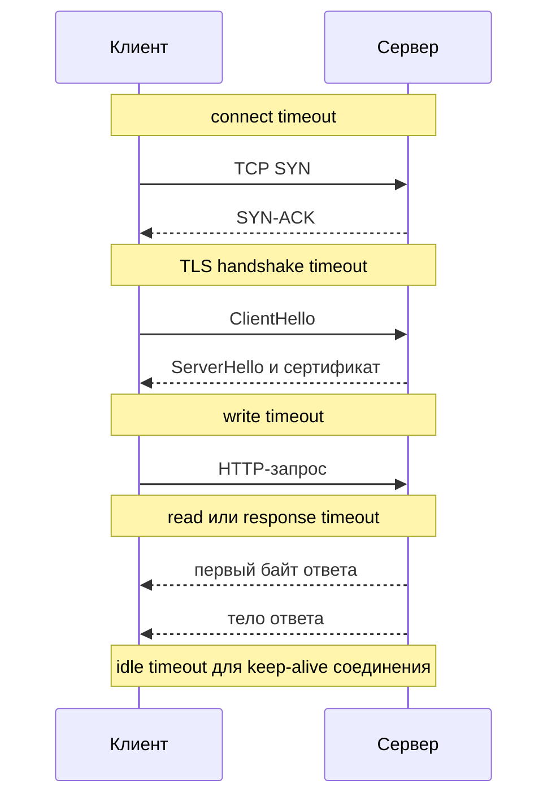
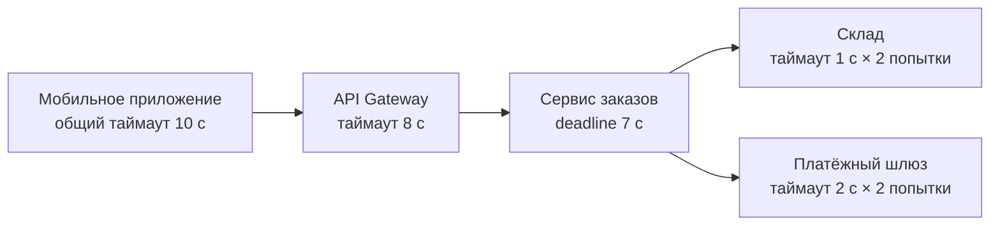
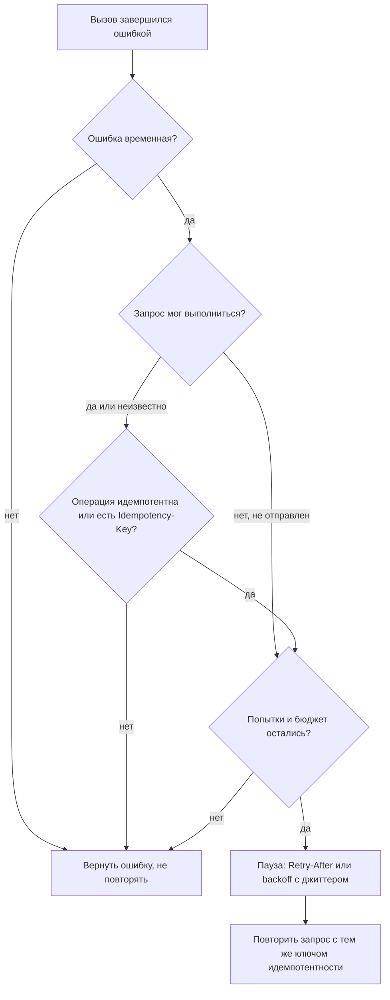

# Таймауты и повторы

Любой сетевой вызов может зависнуть или упасть. Таймаут (timeout) ограничивает, сколько клиент готов ждать, а повтор (retry) даёт второй шанс при временном сбое. Если не продумать то и другое, интеграция либо «висит» вместе с упавшим партнёром, либо добивает его лавиной повторов. На этой странице: виды таймаутов, бюджет времени в цепочке вызовов, что и как повторять, а также что прописать в постановке.

## Виды таймаутов {#timeout-types}

Один «таймаут» в постановке ничего не значит: у HTTP-клиента их несколько, и каждый срабатывает на своём этапе.



| Таймаут | Что ограничивает | Типичное значение | Что означает срабатывание |
|---|---|---|---|
| **Connect timeout** | Установку TCP-соединения | 0,5–1 с во внутренней сети, 2–5 с в интернете | Сервер недоступен, порт закрыт или сеть теряет пакеты. Запрос **точно не отправлен**, повтор безопасен |
| **TLS handshake timeout** | Согласование TLS после TCP | 1–5 с, часто входит в connect | Проблемы с TLS, перегрузка сервера. Запрос не отправлен |
| **Write timeout** | Отправку тела запроса | Зависит от размера тела | Медленный канал или сервер не читает. Запрос мог быть получен частично |
| **Read timeout** (socket timeout) | Паузу между пакетами при чтении ответа | 2–30 с | Сервер «замолчал». Важно: в некоторых клиентах это пауза **между байтами**, а не время всего ответа |
| **Response timeout** (time to first byte) | Время до начала ответа | По SLA партнёра | Сервер долго обрабатывает. Запрос **мог быть выполнен** |
| **Idle timeout** | Время жизни неиспользуемого соединения в пуле | 30–120 с | Соединение закрывается. Должен быть меньше idle timeout сервера и балансировщика, иначе клиент возьмёт из пула «мёртвое» соединение |
| **Общий deadline запроса** | Всё время операции, включая все повторы и паузы | По бизнес-требованию | Операция прервана, клиенту возвращается ошибка |

::: warning Read timeout не равен времени ответа
Если сервер отдаёт ответ по байту раз в 5 секунд, а read timeout равен 10 с, запрос может длиться минутами. Для защиты нужен **общий таймаут** (call timeout, request timeout, deadline), который ограничивает всю операцию целиком.
:::

### Таймаут на стороне сервера и балансировщика

Таймауты есть не только у клиента:

- **Балансировщик / API Gateway** обрывает запрос к бэкенду и возвращает [504 Gateway Timeout](/http/status-codes#504). Например, у многих облачных балансировщиков idle timeout по умолчанию 60 с.
- **Сервер приложения** может ограничивать время обработки и возвращать [503 Service Unavailable](/http/status-codes#503).
- **Сервер** может закрыть соединение, если клиент слишком медленно присылает запрос, — тогда клиент получит [408 Request Timeout](/http/status-codes#408).

::: danger Клиент ушёл — сервер продолжает работать
Срабатывание таймаута у клиента **не отменяет** операцию на сервере. Сервер может дообработать запрос и создать заказ, о котором клиент не узнает. Поэтому любая операция с побочным эффектом, которую повторяют после таймаута, должна быть [идемпотентной](/design/idempotency).
:::

## Бюджет таймаутов в цепочке вызовов {#timeout-budget}

Правило: **таймаут каждого следующего звена меньше таймаута вызывающего**, с учётом повторов и собственной работы. Иначе вызывающий уже сдался и вернул ошибку, а нижние звенья продолжают нагружать систему работой, результат которой никому не нужен.

Пример: пользователь оформляет заказ в мобильном приложении.



Проверим, что бюджет сходится. Сервис заказов вызывает склад и платёжный шлюз последовательно:

| Звено | Расчёт худшего случая | Итого |
|---|---|---|
| Склад | 1 с + пауза 0,2 с + 1 с | 2,2 с |
| Платёжный шлюз | 2 с + пауза 0,3 с + 2 с | 4,3 с |
| Собственная работа сервиса заказов | БД, сериализация | ~0,3 с |
| **Сервис заказов, всего** | 2,2 + 4,3 + 0,3 | **6,8 с ≤ 7 с** |
| API Gateway | 7 с + сетевые задержки | ≤ 8 с |
| Мобильное приложение | 8 с + мобильная сеть | ≤ 10 с |

Если бы у платёжного шлюза было три попытки по 3 с, худший случай для сервиса заказов вырос бы до 12+ с — шлюз ответил бы клиенту 504 гораздо раньше, а платёж мог бы пройти уже после этого.

### Проброс deadline {#deadline-propagation}

Статические таймауты на каждом звене не учитывают, сколько времени уже потрачено. Лучше передавать **оставшийся бюджет** вниз по цепочке:

- в [gRPC](/protocols/grpc) это встроено: deadline передаётся в заголовке `grpc-timeout` и автоматически уменьшается;
- в HTTP стандартного заголовка нет; используют собственные, например `X-Request-Deadline` с абсолютным временем в UTC или `X-Request-Timeout-Ms` с остатком в миллисекундах;
- получив запрос с почти исчерпанным бюджетом, сервис должен сразу вернуть ошибку, а не начинать работу.

::: tip Если цепочка длинная
Когда синхронная цепочка не укладывается в разумный бюджет (больше 3–4 звеньев или внешние системы с ответом в десятки секунд), переходите на [асинхронную операцию](/design/async-operations): `202 Accepted` + статус или callback.
:::

## Что можно повторять {#what-to-retry}

Повтор безопасен, если:

1. ошибка **временная** (transient) — есть шанс, что следующая попытка пройдёт;
2. повтор **не создаст дубль** — операция идемпотентна или защищена ключом идемпотентности.

### По методу HTTP

| Метод | Идемпотентен по RFC 9110 | Повторять автоматически |
|---|---|---|
| `GET`, `HEAD`, `OPTIONS` | Да, и безопасен | Да |
| `PUT`, `DELETE` | Да | Да, если сервер реализует идемпотентность честно |
| `POST` | Нет | **Только** с заголовком `Idempotency-Key` или с другим механизмом дедупликации (бизнес-ключ, клиентский ID ресурса) |
| `PATCH` | Не гарантируется | Только если операция идемпотентна по смыслу (установить значение, а не увеличить) или с `If-Match` |

Подробно — в разделе [Идемпотентность](/design/idempotency) и [Методы](/http/methods).

### По ответу

| Результат | Повторять? | Комментарий |
|---|---|---|
| Ошибка соединения: connection refused, DNS-ошибка, connect timeout | Да | Запрос не дошёл до сервера |
| HTTP/2 `REFUSED_STREAM`, `GOAWAY` для необработанных потоков | Да | Сервер явно сообщил, что не обрабатывал запрос |
| Connection reset, read timeout после отправки запроса | Только идемпотентные | Неизвестно, выполнен ли запрос |
| [408 Request Timeout](/http/status-codes#408) | Да | Сервер не дождался запроса |
| [429 Too Many Requests](/http/status-codes#429) | Да, после паузы из `Retry-After` | См. [Rate limiting](/design/rate-limiting) |
| [502 Bad Gateway](/http/status-codes#502) | Да | Прокси не получил корректный ответ от бэкенда |
| [503 Service Unavailable](/http/status-codes#503) | Да, учитывая `Retry-After` | Временная перегрузка или обслуживание |
| [504 Gateway Timeout](/http/status-codes#504) | Только идемпотентные | Бэкенд мог выполнить запрос |
| [500 Internal Server Error](/http/status-codes#500) | Осторожно: 0–1 повтор для идемпотентных | Часто это ошибка в коде, повтор даст тот же результат |
| `501 Not Implemented` | Нет | Постоянная ошибка |
| [400](/http/status-codes#400), [401](/http/status-codes#401), [403](/http/status-codes#403), [404](/http/status-codes#404), [409](/http/status-codes#409), [422](/http/status-codes#422) | **Нет** | Ошибка клиента: запрос надо исправить. Исключение — 401 с истёкшим токеном: обновить токен и повторить **один раз** |

::: warning 4xx не повторяем
Повтор `400 Bad Request` или `422` бессмысленен — тот же запрос даст тот же ответ. Единственные 4xx, которые повторяют, — `408` и `429`. Ещё `409` иногда повторяют после перечитывания ресурса при optimistic locking, но это уже не «слепой» повтор, а новая бизнес-операция — см. [Конкурентный доступ](/design/concurrency).
:::

### Алгоритм принятия решения



## Стратегии повторов {#retry-strategies}

| Стратегия | Задержка перед попыткой n | Когда применять |
|---|---|---|
| **Немедленный повтор** | 0 | Один раз, для заведомо случайных сбоев: обрыв соединения из пула, `REFUSED_STREAM`. Больше одного раза — нельзя |
| **Фиксированная задержка** | `d` | Простые фоновые задания с малой нагрузкой, ручные сценарии |
| **Линейная** | `d × n` | Редко; компромисс без экспоненты |
| **Экспоненциальный backoff** | `min(cap, base × 2^n)` | Стандарт по умолчанию |
| **Экспоненциальный backoff + джиттер** | см. формулы ниже | Стандарт для любой системы, где клиентов больше одного |

### Экспоненциальный backoff

Задержка удваивается с каждой попыткой и ограничивается сверху (cap):

```text
delay(n) = min(cap, base × 2^n)

base = 200 мс, cap = 5 с:
попытка 1 → 200 мс
попытка 2 → 400 мс
попытка 3 → 800 мс
попытка 4 → 1,6 с
попытка 5 → 3,2 с
попытка 6 → 5 с (cap)
```

### Джиттер {#jitter}

Без случайной составляющей все клиенты, получившие ошибку одновременно (например, при перезапуске сервера), повторят запрос тоже одновременно — синхронными волнами. Джиттер (jitter) размазывает повторы во времени. Формулы из статьи AWS Architecture Blog «Exponential Backoff And Jitter»:

| Вариант | Формула | Свойства |
|---|---|---|
| **Full jitter** | `sleep = random(0, min(cap, base × 2^n))` | Лучше всего размазывает нагрузку, минимум суммарной работы. Рекомендуется по умолчанию |
| **Equal jitter** | `t = min(cap, base × 2^n)`, `sleep = t/2 + random(0, t/2)` | Гарантирует минимальную паузу t/2 |
| **Decorrelated jitter** | `sleep = min(cap, random(base, prev_sleep × 3))` | Следующая пауза зависит от предыдущей, а не от номера попытки |

```python
import random

def full_jitter(attempt, base=0.2, cap=5.0):
    return random.uniform(0, min(cap, base * 2 ** attempt))

def equal_jitter(attempt, base=0.2, cap=5.0):
    t = min(cap, base * 2 ** attempt)
    return t / 2 + random.uniform(0, t / 2)

def decorrelated_jitter(prev_sleep, base=0.2, cap=5.0):
    return min(cap, random.uniform(base, prev_sleep * 3))
```

## Retry-After {#retry-after}

Заголовок `Retry-After` (RFC 9110, раздел 10.2.3) сервер отправляет с `503`, `429` и редиректами. Два формата:

```http
HTTP/1.1 503 Service Unavailable
Retry-After: 120
```

```http
HTTP/1.1 429 Too Many Requests
Retry-After: Wed, 21 Oct 2026 07:28:00 GMT
```

Правила для клиента:

- если `Retry-After` есть — он **приоритетнее** собственного backoff;
- если пауза из `Retry-After` не помещается в оставшийся deadline — не ждать, сразу вернуть ошибку;
- поддерживать оба формата: число секунд и HTTP-дату;
- для rate limiting учитывать также заголовки `RateLimit` / `RateLimit-Policy` (IETF draft) и распространённые `X-RateLimit-*` — см. [Rate limiting](/design/rate-limiting).

## Сколько попыток {#attempts}

- **Синхронный пользовательский запрос**: всего 2–3 попытки (1 исходная + 1–2 повтора). Больше не помещается в бюджет времени.
- **Фоновая обработка, очереди**: 5–10 попыток с нарастающими паузами от секунд до минут, затем — в [Dead Letter Queue](/reliability/integration-patterns).
- **Доставка вебхуков**: часто экспоненциальное расписание на 24–72 часа (например, 1 мин, 5 мин, 30 мин, 2 ч, 6 ч, 12 ч, 24 ч) — см. [Webhooks](/protocols/webhooks).

::: info Попытки или повторы
В постановке явно пишите, что считаете: «3 попытки» (1 + 2 повтора) или «3 повтора» (всего 4 обращения). Это частый источник расхождений между командами.
:::

## Шторм повторов и retry budget {#retry-storm}

**Шторм повторов** (retry storm): сервис начал тормозить → клиенты получают таймауты → все повторяют → нагрузка удваивается или утраивается → сервис окончательно падает и не может подняться, потому что при каждом старте его снова заваливают повторами.

Защита:

1. **Backoff с джиттером** — повторы размазаны во времени.
2. **Retry budget** — повторы ограничены долей от основного трафика. Например, «повторы не более 10–20 процентов от числа исходных запросов за последние 10 секунд». Если бюджет исчерпан — ошибка возвращается сразу. Так устроены retry budget в Envoy и retry throttling в gRPC.
3. **Circuit Breaker** — при массовых ошибках вызовы вообще прекращаются на время. См. [Паттерны устойчивости](/reliability/resilience-patterns).
4. **Повторы только на одном уровне** — см. ниже.

### Перемножение повторов на разных уровнях {#retry-amplification}

Повторы могут быть настроены одновременно в нескольких местах: в коде клиента, в HTTP-библиотеке, в API Gateway, в sidecar service mesh, в коде сервиса для его зависимостей. Они **перемножаются**.


Три уровня по три попытки дают **27** обращений к упавшему сервису на один пользовательский клик. Пять уровней — 243.

Правило: **повторять на одном уровне** — как правило, на ближайшем к упавшей зависимости или на самом внешнем, который знает про идемпотентность. Остальные уровни либо не повторяют, либо повторяют только ошибки соединения, которые гарантированно не дошли до сервера.

::: warning Service mesh повторяет за вас
Istio, Linkerd и другие mesh-решения могут иметь повторы, включённые по умолчанию или настроенные платформенной командой. Уточняйте у DevOps фактическую политику повторов на всех уровнях и фиксируйте её в постановке.
:::

## Рекомендуемые значения — отправная точка {#defaults}

Цифры ниже — **ориентир для первой версии**, а не норма. Правильные значения берутся из SLA партнёра и измеренных перцентилей времени ответа (read timeout ≈ p99 × 1,5–2).

| Параметр | Внутренний синхронный вызов | Внешний партнёр, синхронно | Фоновая обработка / очередь |
|---|---|---|---|
| Connect timeout | 0,5–1 с | 2–5 с | 2–5 с |
| Read / response timeout | 1–3 с | 5–30 с | 30–60 с |
| Общий deadline | 3–5 с | 10–30 с | минуты |
| Число попыток всего | 2–3 | 2–3 | 5–10 |
| Базовая задержка | 50–200 мс | 0,5–1 с | 1–10 с |
| Максимальная задержка | 1–2 с | 5–10 с | 5–60 мин |
| Джиттер | full | full | full или decorrelated |
| Retry budget | 10–20 процентов | 10 процентов | — |
| Idle timeout пула соединений | меньше idle timeout балансировщика | меньше idle timeout партнёра | — |

## Что прописать в постановке {#spec-template}

Таблица-шаблон для каждого вызова внешней системы:

| Параметр | Значение | Комментарий |
|---|---|---|
| Вызов | `POST /api/v1/payments` | |
| Connect timeout | 2 с | |
| Read timeout | 5 с | p99 партнёра 2,1 с по данным мониторинга |
| Общий deadline операции | 12 с | Включая все повторы |
| Число попыток | 3 (1 + 2 повтора) | |
| Стратегия задержки | Экспоненциальная, base 500 мс, cap 4 с, full jitter | |
| Повторяемые ошибки | Ошибки соединения, `408`, `429`, `502`, `503`, `504` | |
| Не повторяемые | Все прочие 4xx, `500`, `501` | |
| Учёт `Retry-After` | Да, если пауза ≤ оставшегося deadline | |
| Идемпотентность | `Idempotency-Key` = UUID операции, одинаковый во всех попытках | Срок хранения ключа у партнёра 24 ч |
| Уровень, где выполняются повторы | Только сервис заказов. Gateway и mesh не повторяют | |
| Поведение после исчерпания попыток | Платёж в статус `PENDING_CHECK`, задача сверки через 5 мин, алерт при 10+ случаях за 5 мин | |
| Circuit Breaker | Открывается при 50 процентах ошибок за 20 вызовов, 30 с в open | См. [Паттерны устойчивости](/reliability/resilience-patterns) |

## Типичные ошибки {#mistakes}

- Таймаут не задан вовсе — во многих HTTP-клиентах значение по умолчанию «бесконечность» или минуты.
- Таймаут вызывающего меньше суммы таймаутов и повторов вызываемого.
- Повтор `POST` без ключа идемпотентности — двойные платежи и заказы.
- Новый `Idempotency-Key` на каждую попытку — защита не работает.
- Повторы без джиттера — синхронные волны нагрузки.
- Повторы на 3–4 уровнях одновременно.
- Повтор `400`/`422` «на всякий случай».
- После таймаута операция считается неуспешной, хотя она могла пройти — нет сверки статуса.

## На что обратить внимание аналитику {#checklist}

- [ ] Для каждого вызова заданы connect timeout, read timeout и общий deadline.
- [ ] Бюджет таймаутов по цепочке сходится: каждое нижнее звено с учётом повторов укладывается в таймаут верхнего.
- [ ] Перечислены коды и ошибки, которые повторяются, и которые — нет.
- [ ] Для `POST` и неидемпотентных `PATCH` определён механизм идемпотентности и время хранения ключа.
- [ ] Указаны число попыток, базовая и максимальная задержка, тип джиттера.
- [ ] Описано, как клиент обрабатывает `Retry-After`.
- [ ] Зафиксировано, на каком уровне выполняются повторы, остальные уровни отключены.
- [ ] Описано поведение после исчерпания попыток: ошибка пользователю, отложенная обработка, сверка статуса, алерт.
- [ ] Для неопределённого результата (таймаут после отправки) есть способ узнать фактический статус операции.
- [ ] Значения согласованы с SLA партнёра и его лимитами запросов.

## Стандарты и ссылки {#links}

- [RFC 9110 — HTTP Semantics: идемпотентные методы, Retry-After](https://www.rfc-editor.org/rfc/rfc9110)
- [RFC 6585 — код 429 Too Many Requests](https://www.rfc-editor.org/rfc/rfc6585)
- [IETF draft — The Idempotency-Key HTTP Header Field](https://datatracker.ietf.org/doc/draft-ietf-httpapi-idempotency-key-header/)
- [AWS Architecture Blog — Exponential Backoff And Jitter](https://aws.amazon.com/blogs/architecture/exponential-backoff-and-jitter/)
- [AWS Builders Library — Timeouts, retries, and backoff with jitter](https://aws.amazon.com/builders-library/timeouts-retries-and-backoff-with-jitter/)
- [Google SRE Book — Handling Overload](https://sre.google/sre-book/handling-overload/)
- [gRPC — Deadlines](https://grpc.io/docs/guides/deadlines/)
- [gRPC — Retry](https://grpc.io/docs/guides/retry/)
- [Envoy — Retry budgets](https://www.envoyproxy.io/docs/envoy/latest/api-v3/config/cluster/v3/circuit_breaker.proto)
