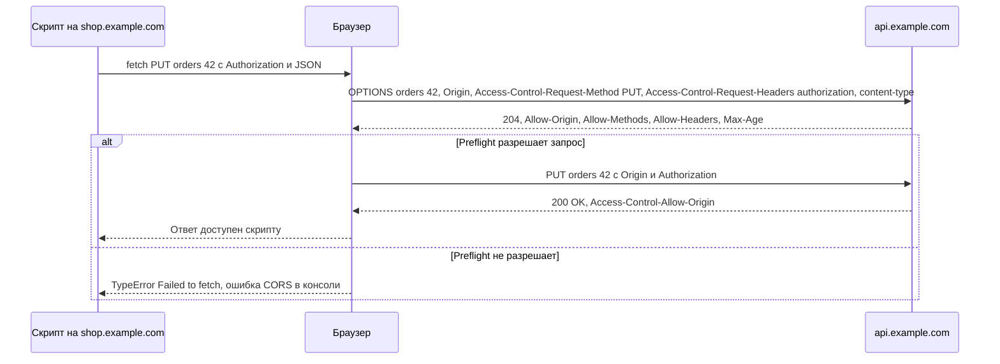

# CORS (Cross-Origin Resource Sharing)

CORS — механизм браузера, который позволяет серверу явно разрешить JavaScript-коду с другого источника (origin) читать свои ответы. Он ослабляет политику одного источника (same-origin policy) контролируемым образом. CORS касается **только браузеров**: для интеграций server-to-server, curl и Postman его не существует.

## Same-origin policy и origin {#same-origin}

**Origin** (источник) — тройка «схема + хост + порт» (RFC 6454). Два URL одного источника, только если все три части совпадают.

| URL страницы | URL запроса | Тот же origin? | Почему |
|---|---|---|---|
| `https://shop.example.com` | `https://shop.example.com/api/orders` | Да | Путь не важен |
| `https://shop.example.com` | `http://shop.example.com/api` | Нет | Другая схема |
| `https://shop.example.com` | `https://api.example.com/orders` | Нет | Другой хост (поддомен тоже другой хост) |
| `https://shop.example.com` | `https://shop.example.com:8443/api` | Нет | Другой порт |
| `http://localhost:5173` | `http://localhost:8080/api` | Нет | Другой порт — типичная ситуация в разработке |

**Same-origin policy** запрещает скрипту одного источника **читать** ответы от другого. Важно: браузер, как правило, всё равно **отправляет** простой запрос — блокируется только доступ JavaScript к ответу. Именно поэтому CORS не заменяет защиту от CSRF.

## Как работает CORS {#how-it-works}

Браузер добавляет к межсайтовому запросу заголовок `Origin`, а сервер отвечает заголовками `Access-Control-*`. Если ответ сервера не разрешает этот origin, браузер не отдаёт ответ скрипту и пишет ошибку в консоль.

### Простые запросы {#simple-requests}

Запрос считается «простым» (без preflight), если выполнены **все** условия:

| Условие | Допустимые значения |
|---|---|
| Метод | `GET`, `HEAD`, `POST` |
| Заголовки, выставленные скриптом | Только CORS-safelisted: `Accept`, `Accept-Language`, `Content-Language`, `Content-Type` (с ограничениями ниже), `Range` (простой диапазон) |
| `Content-Type` | Только `application/x-www-form-urlencoded`, `multipart/form-data`, `text/plain` |
| Прочее | Нет обработчиков событий на `XMLHttpRequest.upload`, нет `ReadableStream` в теле |

Следствие для REST API: **любой** запрос с `Authorization`, `Content-Type: application/json`, методами `PUT`, `PATCH`, `DELETE` или собственными заголовками (`X-Request-Id`, `Idempotency-Key`) вызывает preflight.

```http
GET /api/v1/rates HTTP/1.1
Host: api.example.com
Origin: https://shop.example.com
```

```http
HTTP/1.1 200 OK
Access-Control-Allow-Origin: https://shop.example.com
Vary: Origin
Content-Type: application/json

{"USD": 92.5}
```

### Preflight-запрос {#preflight}

Перед «непростым» запросом браузер автоматически отправляет `OPTIONS` и спрашивает разрешения.



```http
OPTIONS /api/v1/orders/42 HTTP/1.1
Host: api.example.com
Origin: https://shop.example.com
Access-Control-Request-Method: PUT
Access-Control-Request-Headers: authorization, content-type
```

```http
HTTP/1.1 204 No Content
Access-Control-Allow-Origin: https://shop.example.com
Access-Control-Allow-Methods: GET, POST, PUT, DELETE
Access-Control-Allow-Headers: Authorization, Content-Type, Idempotency-Key
Access-Control-Max-Age: 600
Vary: Origin, Access-Control-Request-Method, Access-Control-Request-Headers
```

Особенности preflight:

- приходит **без** заголовка `Authorization` и cookies — сервер не должен требовать аутентификацию для `OPTIONS`, иначе preflight получит 401 и основной запрос не уйдёт;
- должен вернуть успешный код (`200` или `204`);
- обрабатывается до бизнес-логики — обычно на API-шлюзе или в middleware.

## Заголовки CORS {#headers}

| Заголовок | Направление | Назначение | Пример |
|---|---|---|---|
| `Origin` | Запрос | Источник страницы, выставляет браузер, скрипт подделать не может | `https://shop.example.com` |
| `Access-Control-Request-Method` | Запрос (preflight) | Метод основного запроса | `PUT` |
| `Access-Control-Request-Headers` | Запрос (preflight) | Нестандартные заголовки основного запроса | `authorization, content-type` |
| `Access-Control-Allow-Origin` | Ответ | Разрешённый источник: **один** origin или `*` | `https://shop.example.com` |
| `Access-Control-Allow-Methods` | Ответ (preflight) | Разрешённые методы | `GET, POST, PUT` |
| `Access-Control-Allow-Headers` | Ответ (preflight) | Разрешённые заголовки запроса | `Authorization, Content-Type` |
| `Access-Control-Allow-Credentials` | Ответ | Разрешить запросы с cookies и HTTP-аутентификацией | `true` |
| `Access-Control-Expose-Headers` | Ответ | Какие заголовки ответа скрипт может читать сверх стандартных | `ETag, Location, X-Request-Id, RateLimit` |
| `Access-Control-Max-Age` | Ответ (preflight) | Сколько секунд кэшировать результат preflight | `600` |
| `Vary: Origin` | Ответ | Говорит кэшам, что ответ зависит от `Origin` | `Origin` |

Без `Access-Control-Expose-Headers` скрипту доступны только безопасные заголовки ответа: `Cache-Control`, `Content-Language`, `Content-Length`, `Content-Type`, `Expires`, `Last-Modified`, `Pragma`. Частая ошибка: фронтенд «не видит» `Location`, `ETag` или заголовки лимитов, хотя они есть в ответе.

## Credentials и запрет `*` {#credentials}

Запрос «с учётными данными» — с cookies, HTTP-аутентификацией или клиентским TLS-сертификатом (`fetch(url, { credentials: 'include' })`). Для него правила строже:

- `Access-Control-Allow-Credentials: true` обязателен;
- `Access-Control-Allow-Origin` должен быть **конкретным origin**, `*` не допускается;
- `*` в `Allow-Headers`, `Allow-Methods`, `Expose-Headers` трактуется буквально, а не как «всё».

Почему: `*` + credentials означало бы, что **любой сайт** в интернете может от имени залогиненного пользователя читать его данные из вашего API.

::: danger Отражение Origin без проверки
Антипаттерн: сервер берёт `Origin` из запроса и копирует его в `Access-Control-Allow-Origin` вместе с `Allow-Credentials: true`. Это эквивалентно отключению защиты. Сверяйте `Origin` с **белым списком** точных значений. Также не используйте проверки вида «оканчивается на `example.com`» — под неё подходит `evil-example.com`. Значение `null` в белый список не добавляйте.
:::

Заметка: если `Authorization: Bearer ...` выставляется скриптом явно, это не «credentials» в терминах CORS — достаточно разрешить заголовок `Authorization` в `Allow-Headers`, а `Allow-Origin` может быть и `*` (для публичных API). При этом `Access-Control-Allow-Headers: *` заголовок `Authorization` **не покрывает** — его нужно перечислить явно.

## Кэширование preflight {#max-age}

`Access-Control-Max-Age` задаёт время в секундах, на которое браузер запоминает результат preflight для пары «origin + URL». Без заголовка значение по умолчанию — 5 секунд, то есть preflight идёт почти перед каждым запросом. Браузеры ограничивают максимум: Chromium — 2 часа (7200), Firefox — 24 часа (86400).

Preflight — это дополнительная сетевая задержка. Для «болтливых» SPA выставляйте `Max-Age` 600–7200 секунд.

## Типовые ошибки в консоли браузера {#console-errors}

| Сообщение (Chromium) | Причина | Исправление на сервере |
|---|---|---|
| `No 'Access-Control-Allow-Origin' header is present on the requested resource` | Сервер не вернул заголовок: CORS не настроен, origin не в белом списке, или ответ — ошибка (4xx/5xx от шлюза без CORS-заголовков) | Добавить origin в белый список; CORS-заголовки должны быть и в ответах с ошибками |
| `Response to preflight request doesn't pass access control check: It does not have HTTP ok status` | `OPTIONS` вернул 401, 404, 405 или 500 | Обрабатывать `OPTIONS` без аутентификации, возвращать 204 |
| `Request header field authorization is not allowed by Access-Control-Allow-Headers in preflight response` | Заголовок не перечислен в `Allow-Headers` | Добавить заголовок в список |
| `Method PATCH is not allowed by Access-Control-Allow-Methods in preflight response` | Метод не перечислен | Добавить метод |
| `The value of the 'Access-Control-Allow-Origin' header in the response must not be the wildcard '*' when the request's credentials mode is 'include'` | `*` вместе с credentials | Возвращать конкретный origin и `Allow-Credentials: true` |
| `The 'Access-Control-Allow-Origin' header contains multiple values ..., but only one is allowed` | Заголовок добавлен дважды: и приложением, и прокси/шлюзом | Настраивать CORS в одном месте |
| `The 'Access-Control-Allow-Origin' header has a value 'https://a.example.com' that is not equal to the supplied origin` | Origin в ответе не совпадает (другой поддомен, порт, `http` вместо `https`, лишний слэш) | Точное совпадение с белым списком; не забыть `Vary: Origin` при кэшировании |
| `net::ERR_FAILED` / `TypeError: Failed to fetch` без подробностей | Ошибка CORS, но также недоступность сервера или ошибка сертификата | Смотреть вкладку Network и сам ответ preflight |

::: tip Как диагностировать
В DevTools на вкладке Network найдите запрос `OPTIONS` (в Chromium — тип `preflight`) и посмотрите его ответ. Повторите тот же запрос через curl с заголовком `Origin` — так видно, что реально возвращает сервер:

```bash
curl -i -X OPTIONS https://api.example.com/api/v1/orders/42 \
  -H "Origin: https://shop.example.com" \
  -H "Access-Control-Request-Method: PUT" \
  -H "Access-Control-Request-Headers: authorization, content-type"
```
:::

## CORS не защищает сервер {#not-server-protection}

::: warning Главное заблуждение
CORS — защита **пользователя браузера** от того, что чужой сайт прочитает его данные, используя его сессию. CORS **не защищает API** от вызовов: злоумышленник просто отправит запрос curl-ом или скриптом на сервере, где CORS нет вообще. Аутентификация, авторизация и лимиты нужны независимо от CORS.
:::

| Ожидание | Реальность |
|---|---|
| «Закроем CORS — и чужие не смогут вызвать API» | Смогут — из любого клиента вне браузера |
| «CORS защищает от CSRF» | Нет: простые запросы (форма с `POST`) уходят и меняют данные, блокируется только чтение ответа. От CSRF защищают SameSite-cookies, CSRF-токены, проверка `Origin` на сервере |
| «Нужно настроить CORS для интеграции с партнёром» | Только если партнёр вызывает API из браузера. Server-to-server CORS не нужен |
| «Postman работает, а браузер — нет, значит, сервер сломан» | Скорее всего, не настроен CORS: Postman и curl его не применяют |

## Обход при разработке: прокси {#dev-proxy}

Когда фронтенд на `localhost:5173`, а API — на другом домене, вместо ослабления CORS на сервере используют прокси dev-сервера: браузер обращается к тому же origin, а dev-сервер перенаправляет запрос на API (между серверами CORS нет).

```js
// vite.config.js
export default {
  server: {
    proxy: {
      '/api': {
        target: 'https://api.example.com',
        changeOrigin: true,
      },
    },
  },
}
```

В проде аналогично работает обратный прокси (nginx, API-шлюз) или BFF: фронтенд и API отдаются с одного origin, и CORS не требуется вовсе.

::: info Для браузерного API-тестера
Любой инструмент, который отправляет запросы **из браузера** (в том числе [API-тестер](/tester/) этого сайта), подчиняется CORS: запрос к чужому API, не разрешившему ваш origin, будет заблокирован браузером, даже если API исправен. Варианты: API разрешает origin тестера, запрос идёт через серверный прокси, либо используется настольный инструмент (curl, Postman — см. [инструменты](/tools/)).
:::

Не используйте публичные «CORS-прокси» с реальными токенами и данными — весь трафик, включая заголовок `Authorization`, проходит через чужой сервер.

## Пример конфигурации {#config-example}

```nginx
map $http_origin $cors_origin {
    default "";
    "https://shop.example.com"   $http_origin;
    "https://admin.example.com"  $http_origin;
}

server {
    location /api/ {
        if ($request_method = OPTIONS) {
            add_header Access-Control-Allow-Origin  $cors_origin always;
            add_header Access-Control-Allow-Methods "GET, POST, PUT, PATCH, DELETE" always;
            add_header Access-Control-Allow-Headers "Authorization, Content-Type, Idempotency-Key" always;
            add_header Access-Control-Max-Age       600 always;
            add_header Vary "Origin" always;
            return 204;
        }
        add_header Access-Control-Allow-Origin   $cors_origin always;
        add_header Access-Control-Expose-Headers "ETag, Location, X-Request-Id" always;
        add_header Vary "Origin" always;
        proxy_pass http://backend;
    }
}
```

`always` нужен, чтобы заголовки добавлялись и к ответам с ошибками.

## На что обратить внимание аналитику {#analyst-checklist}

- [ ] Определено, вызывается ли API из браузера; если нет — CORS не нужен и не настраивается.
- [ ] Составлен белый список origin по окружениям (dev, test, prod) — точные значения со схемой и портом.
- [ ] Определено, нужны ли credentials (cookies); если да — без `*`, с конкретными origin.
- [ ] Перечислены разрешённые методы и заголовки запроса (включая `Authorization`, `Idempotency-Key` и пр.).
- [ ] Перечислены заголовки ответа, которые нужны фронтенду (`Location`, `ETag`, лимиты) — в `Expose-Headers`.
- [ ] `OPTIONS` обрабатывается без аутентификации и возвращает 204.
- [ ] CORS-заголовки присутствуют и в ответах с ошибками.
- [ ] Задан `Access-Control-Max-Age`.
- [ ] CORS настраивается в одном месте (шлюз или приложение), а не в двух.
- [ ] Требования не опираются на CORS как на средство защиты API.

## Стандарты и ссылки {#links}

- [Fetch Standard — CORS protocol (WHATWG)](https://fetch.spec.whatwg.org/#http-cors-protocol)
- [RFC 6454 — The Web Origin Concept](https://www.rfc-editor.org/rfc/rfc6454)
- [MDN: Cross-Origin Resource Sharing (CORS)](https://developer.mozilla.org/en-US/docs/Web/HTTP/CORS)
- [MDN: CORS errors](https://developer.mozilla.org/en-US/docs/Web/HTTP/CORS/Errors)
- [MDN: Same-origin policy](https://developer.mozilla.org/en-US/docs/Web/Security/Same-origin_policy)
- [OWASP: Cross-Site Request Forgery Prevention Cheat Sheet](https://cheatsheetseries.owasp.org/cheatsheets/Cross-Site_Request_Forgery_Prevention_Cheat_Sheet.html)
- [PortSwigger: CORS vulnerabilities](https://portswigger.net/web-security/cors)
