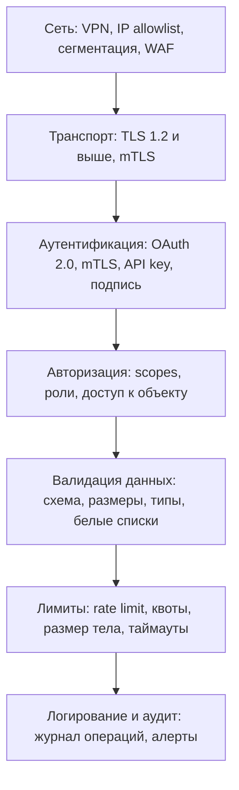
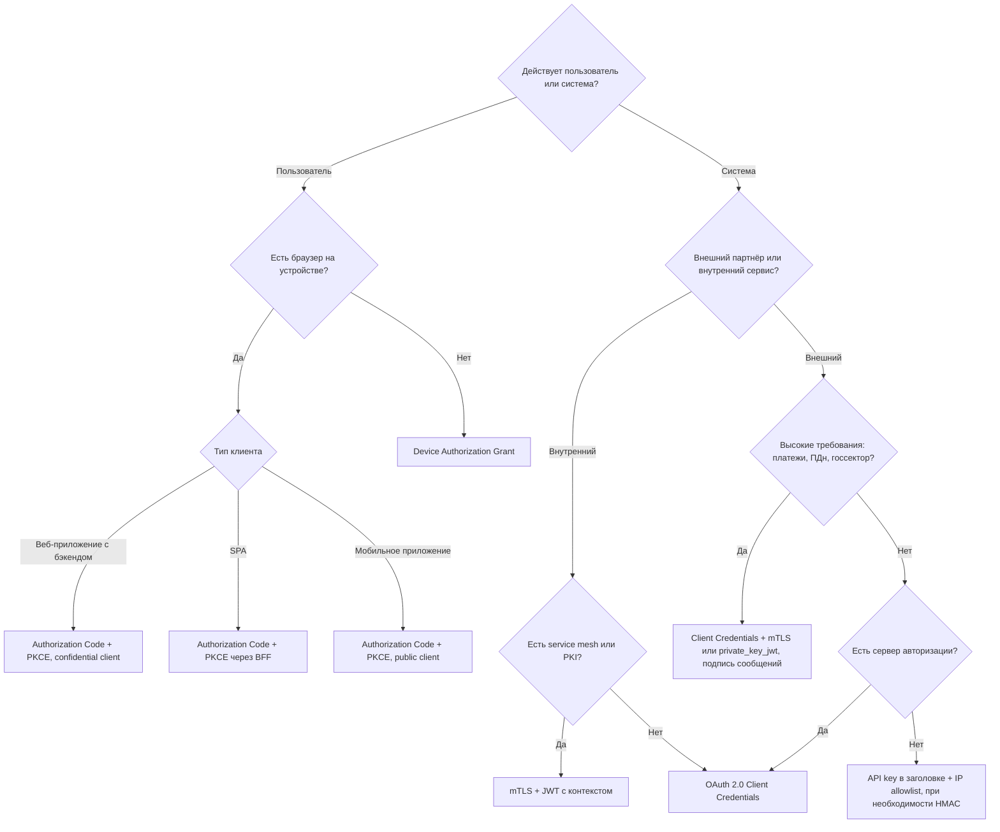

# Безопасность интеграций: обзор

Безопасность интеграции — это не одна галочка «включили HTTPS», а несколько независимых слоёв защиты: от сети и транспорта до авторизации каждого объекта и аудита. На этой странице — общая картина, сравнение способов аутентификации и дерево выбора; детали — на подстраницах раздела.

## AAA: аутентификация, авторизация, аудит {#aaa}

| Понятие | Вопрос | Пример в интеграции | Ошибка, если не сделано |
|---|---|---|---|
| **Аутентификация** (authentication, AuthN) | Кто ты? | Проверка client secret, подписи JWT, клиентского сертификата | [401 Unauthorized](/http/status-codes#401) |
| **Авторизация** (authorization, AuthZ) | Что тебе можно? | Проверка scope `orders:write`, роли, владельца заказа | [403 Forbidden](/http/status-codes#403) (или 404, чтобы скрыть существование объекта) |
| **Аудит / учёт** (accounting, audit) | Что ты сделал? | Журнал: кто, когда, какой ресурс, с каким результатом | Невозможно расследовать инцидент и доказать факт операции |

::: warning Частая путаница
«Клиент прошёл аутентификацию» не значит «клиенту можно всё». Самая распространённая уязвимость API — отсутствие проверки, что объект принадлежит вызывающему ([BOLA](/security/owasp-api)). Аутентификация и авторизация проектируются и описываются в постановке **отдельно**.
:::

Подробнее: [Аутентификация и авторизация](/security/authentication).

## Уровни защиты интеграции {#layers}

Принцип «эшелонированной обороны» (defense in depth): каждый слой исходит из того, что предыдущий может быть пробит.

| Слой | Что даёт | Чем реализуется | Что прописать в постановке |
|---|---|---|---|
| Сеть | Отсекает весь «чужой» трафик | VPN/IPsec-туннель, IP allowlist на firewall/балансировщике, частные каналы, WAF | Список IP/подсетей партнёра, способ подключения, кто администрирует |
| Транспорт | Конфиденциальность и целостность канала, подлинность сервера | [TLS 1.2/1.3](/security/tls), mTLS | Минимальная версия TLS, CA, требования к сертификатам |
| Аутентификация | Знаем, кто вызывает | [OAuth 2.0](/security/oauth2), [JWT](/security/jwt), mTLS, API key, HMAC | Способ, точка выдачи токена, срок жизни, ротация секретов |
| Авторизация | Вызывающий делает только разрешённое | Scopes, RBAC/ABAC, проверка владельца объекта | Матрица «клиент/роль → операции → объекты» |
| Валидация данных | Нет инъекций, мусора, mass assignment | JSON Schema/OpenAPI, белые списки полей | Схема, ограничения полей, поведение при лишних полях |
| Лимиты | Защита от перегрузки и злоупотреблений | [Rate limiting](/design/rate-limiting), лимит тела, таймауты | Лимиты на клиента, коды [429](/http/status-codes#429) и [413](/http/status-codes#413) |
| Логирование и аудит | Расследование, мониторинг, неотказуемость | Журнал аудита, SIEM, [наблюдаемость](/reliability/observability) | Что логируем, что маскируем, срок хранения |

::: tip IP allowlist — не аутентификация
Белый список IP-адресов полезен как дополнительный слой, но не заменяет аутентификацию: адреса бывают общими (NAT, облака), меняются, а внутри доверенной сети атакующий может оказаться где угодно. Используйте allowlist **вместе** с токеном или mTLS.
:::

## Модель угроз кратко: STRIDE {#stride}

Моделирование угроз (threat modeling) — систематический поиск того, что может пойти не так. Для интеграций удобна классификация STRIDE (Microsoft):

| Угроза | Нарушаемое свойство | Пример в API-интеграции | Типичная защита |
|---|---|---|---|
| **S**poofing — подмена личности | Аутентичность | Чужой клиент выдаёт себя за партнёра, украденный API key | Сильная аутентификация, mTLS, короткоживущие токены |
| **T**ampering — изменение данных | Целостность | Изменение суммы платежа в пути, подмена тела вебхука | TLS, подпись запросов (HMAC, JWS, RFC 9421) |
| **R**epudiation — отказ от авторства | Неотказуемость | Партнёр утверждает, что не отправлял заявку | Журнал аудита, подпись сообщений, синхронизированное время |
| **I**nformation disclosure — раскрытие информации | Конфиденциальность | Ответ с лишними ПДн, стектрейс в ошибке, токен в логах | Минимизация данных, маскирование, единый формат [ошибок](/design/errors) |
| **D**enial of service — отказ в обслуживании | Доступность | Огромные пакеты, неограниченная пагинация, шквал повторов | Лимиты, квоты, таймауты, [паттерны устойчивости](/reliability/resilience-patterns) |
| **E**levation of privilege — повышение привилегий | Авторизация | Пользователь вызывает админский метод, меняет поле `role` | Проверка прав на каждый метод и объект, белые списки полей |

Как применять на практике: нарисуйте схему потоков данных интеграции (кто → кому → что передаёт → через какие границы доверия) и для каждой стрелки пройдитесь по шести буквам. Результат — список требований в постановку.

## Сравнение способов аутентификации {#auth-comparison}

| Способ | Безопасность | Сложность внедрения | Срок жизни учётных данных | Ключевые риски |
|---|---|---|---|---|
| HTTP Basic | Низкая (пароль в каждом запросе) | Минимальная | Долгий (пароль) | Утечка пароля = полный доступ, нет scopes |
| API key | Низкая–средняя | Минимальная | Долгий | Утечка ключа, ключ в URL/логах, нет scopes «из коробки» |
| OAuth 2.0 Client Credentials (Bearer) | Средняя–высокая | Средняя (нужен сервер авторизации) | Короткий токен + долгий секрет | Утечка client secret, долгоживущие токены |
| JWT (самостоятельно выпускаемый или от сервера авторизации) | Средняя–высокая | Средняя | Короткий | Ошибки проверки подписи/`aud`, невозможность мгновенного отзыва |
| mTLS | Высокая | Высокая (PKI, выпуск и ротация сертификатов) | Срок сертификата | Истечение сертификата, сложность эксплуатации |
| HMAC-подпись запроса | Высокая для целостности | Средняя (канонизация, синхронизация времени) | Долгий общий секрет | Ошибки канонизации, общий секрет у обеих сторон |
| OAuth 2.0 + mTLS / DPoP (sender-constrained) | Очень высокая | Высокая | Короткий | Сложность, поддержка не во всех продуктах |

### Применимость по сценариям {#scenarios}

| Сценарий | Рекомендуется | Допустимо | Не рекомендуется |
|---|---|---|---|
| Server-to-server внутри компании | OAuth 2.0 Client Credentials, mTLS (часто через service mesh) | API key во внутренней сети + сетевая изоляция | Basic с общим паролем на все системы |
| Партнёрская интеграция (B2B) | Client Credentials + mTLS или `private_key_jwt`, IP allowlist | API key + HMAC-подпись + IP allowlist | API key в query-параметре |
| Мобильное приложение | Authorization Code + PKCE, короткие токены, ротация refresh | — | Секрет клиента внутри приложения, Basic, ROPC |
| SPA (браузер) | Authorization Code + PKCE, лучше через BFF (токены на сервере, сессия в cookie) | Code + PKCE в браузере с токенами в памяти | Implicit grant, токены в `localStorage` |
| Внутренние микросервисы | mTLS (service mesh) + JWT с контекстом пользователя, Token Exchange | Client Credentials | Отсутствие аутентификации «потому что внутренняя сеть» |
| Вебхуки от внешней системы к вам | HMAC-подпись тела + timestamp, mTLS | Секретный токен в заголовке + IP allowlist | Без проверки источника |
| Устройства без браузера (ТВ, CLI) | Device Authorization Grant | — | Ввод пароля пользователя в устройство |

## Дерево выбора способа аутентификации {#decision-tree}

## Регуляторные требования (РФ и отраслевые) {#regulation}

Здесь только ориентиры — юридические детали уточняйте у службы ИБ и юристов.

- **152-ФЗ «О персональных данных»** — если интеграция передаёт ПДн, нужны правовое основание передачи, защита по уровню защищённости ИСПДн, локализация хранения ПДн граждан РФ, учёт передачи третьим лицам. Аналитику: явно перечислять поля с ПДн в спецификации и минимизировать их состав.
- **ГОСТ-криптография** — для интеграций с госсистемами (СМЭВ, ЕСИА, ГИС) и в ряде отраслей требуются сертифицированные ФСБ СКЗИ (например, КриптоПро CSP), подпись по ГОСТ Р 34.10-2012, хэш ГОСТ Р 34.11-2012, TLS с ГОСТ-шифронаборами. Это влияет на выбор библиотек, HTTP-клиентов и балансировщиков.
- **Финансовый сектор** — стандарты Банка России (в т. ч. ГОСТ Р 57580) и требования к защите информации при переводах денежных средств.
- **КИИ (187-ФЗ)** — для объектов критической информационной инфраструктуры действуют дополнительные требования.
- **PCI DSS** — если интеграция касается данных платёжных карт (PAN, CVV): номер карты маскируется, CVV не хранится, область (scope) PCI DSS стараются сузить через токенизацию на стороне платёжного провайдера.

::: info
Регуляторные требования часто определяют архитектуру сильнее, чем технические предпочтения: например, необходимость ГОСТ TLS может исключить использование стандартного облачного балансировщика. Выясняйте их на старте проекта.
:::

## Разделы {#pages}

| Страница | О чём |
|---|---|
| [Аутентификация и авторизация](/security/authentication) | Basic, API key, Bearer, cookies, HMAC-подписи, RBAC/ABAC, 401 vs 403, хранение секретов |
| [OAuth 2.0 и OpenID Connect](/security/oauth2) | Роли, гранты с диаграммами, токены, introspection, DPoP, PAR, OAuth 2.1 |
| [JWT](/security/jwt) | Структура, claims, алгоритмы, проверка, уязвимости, JWKS и ротация ключей |
| [TLS и mTLS](/security/tls) | Версии, handshake, сертификаты, mTLS с партнёром, openssl и curl |
| [CORS](/security/cors) | Same-origin policy, preflight, заголовки, типовые ошибки |
| [OWASP API Top 10](/security/owasp-api) | Десять главных рисков API (2023) и требования против них |
| [Чек-лист безопасности](/security/best-practices) | Большой чек-лист для проектирования и ревью интеграции |

## На что обратить внимание аналитику {#analyst-checklist}

- [ ] Описаны все участники интеграции и границы доверия (кто кому доверяет и почему).
- [ ] Выбран и задокументирован способ аутентификации для каждого направления вызовов (в том числе для обратных вызовов и вебхуков).
- [ ] Авторизация описана отдельно: какие операции и какие объекты доступны каждому клиенту.
- [ ] Указаны требования к транспорту: HTTPS, минимальная версия TLS, нужен ли mTLS.
- [ ] Определены сетевые ограничения: IP allowlist, VPN, кто и как их меняет.
- [ ] Перечислены поля с персональными и чувствительными данными, обоснована их необходимость.
- [ ] Заданы лимиты: частота запросов, размер тела, размер страницы.
- [ ] Определено, что логируется для аудита и что маскируется.
- [ ] Определены процедуры: выдача и ротация секретов/сертификатов, отзыв доступа, контакты ИБ обеих сторон.
- [ ] Учтены регуляторные требования (152-ФЗ, ГОСТ, PCI DSS) — с участием службы ИБ.
- [ ] Пройдена модель угроз (STRIDE) по схеме потоков данных.

## Стандарты и ссылки {#links}

- [OWASP API Security Top 10 (2023)](https://owasp.org/API-Security/editions/2023/en/0x00-header/)
- [OWASP Cheat Sheet Series](https://cheatsheetseries.owasp.org/)
- [OWASP Threat Modeling Cheat Sheet](https://cheatsheetseries.owasp.org/cheatsheets/Threat_Modeling_Cheat_Sheet.html)
- [Microsoft: STRIDE в Threat Modeling Tool](https://learn.microsoft.com/en-us/azure/security/develop/threat-modeling-tool-threats)
- [RFC 9700 — Best Current Practice for OAuth 2.0 Security](https://www.rfc-editor.org/rfc/rfc9700)
- [RFC 8446 — TLS 1.3](https://www.rfc-editor.org/rfc/rfc8446)
- [152-ФЗ «О персональных данных» (КонсультантПлюс)](https://www.consultant.ru/document/cons_doc_LAW_61801/)
- [PCI Security Standards Council](https://www.pcisecuritystandards.org/)
