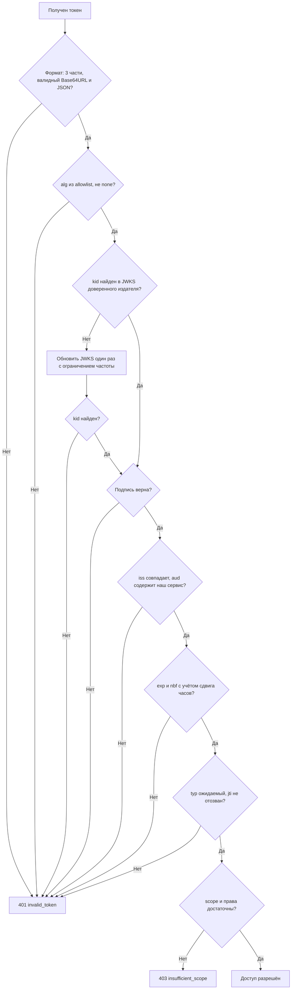
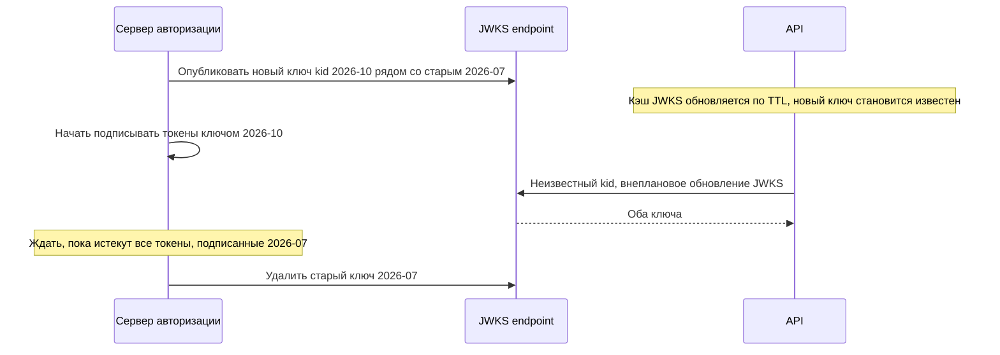

# JWT (JSON Web Token)

JWT (RFC 7519) — компактный формат передачи утверждений (claims) в виде JSON, защищённых подписью (JWS) или шифрованием (JWE). В интеграциях JWT чаще всего используется как access token OAuth 2.0, ID token OpenID Connect, утверждение для аутентификации клиента (`private_key_jwt`) и подписанное сообщение между системами.

## Структура {#structure}

Подписанный JWT (JWS Compact Serialization) — три части в Base64URL, разделённые точками: `header.payload.signature`.

```text
eyJhbGciOiJSUzI1NiIsInR5cCI6IkpXVCIsImtpZCI6IjIwMjYtMTAifQ
.
eyJpc3MiOiJodHRwczovL2F1dGguZXhhbXBsZS5jb20iLCJzdWIiOiJwYXJ0bmVyLWFjbWUiLCJhdWQiOiJvcmRlcnMtYXBpIiwiZXhwIjoxNzkxMDE5MjAwLCJpYXQiOjE3OTEwMTg5MDAsImp0aSI6IjliMmY2YzFlLTNhNGQtNGU4Zi1iN2ExLTBjNWQyZTZmOGE5YiIsInNjb3BlIjoib3JkZXJzOnJlYWQifQ
.
NHVaYe26MbtOYhSKkoKYdFVomg4i8ZJd8_-RU8VNbftc4TSMb4bXP3l3YlNWACwyXPGffz5aXHc6lty1Y2t4SWRqGteragsVdZufDn5BlnJl9pdR_kdVFUsra2rWKEofkZeIC4yWytE58sMIihvo9H1ScmmVwBcQP6XETqYd0aSHp1gOa9RdUPDvoXQ5oqygTqVtxaDr6wUFKrKItgBMzWIdNZ6y7O9E0DhEPTbE9rfBo6KTFsHAZnMg4k68CDp2woYIaXbmYTWcvbzIuHO7_37GT79XdIwkm95QJ7hYC9RiwrV7mesbY4PAahERJawntho0my942XheVLmGwLMBkQ
```

Переносы строк — только для читаемости; в реальности это одна строка без пробелов. Подпись в примере условная.

::: code-group

```json [Header]
{
  "alg": "RS256",
  "typ": "JWT",
  "kid": "2026-10"
}
```

```json [Payload]
{
  "iss": "https://auth.example.com",
  "sub": "partner-acme",
  "aud": "orders-api",
  "exp": 1791019200,
  "iat": 1791018900,
  "jti": "9b2f6c1e-3a4d-4e8f-b7a1-0c5d2e6f8a9b",
  "scope": "orders:read"
}
```

```text [Signature]
RSASSA-PKCS1-v1_5-SHA256(
  ASCII( BASE64URL(header) + "." + BASE64URL(payload) ),
  закрытый ключ сервера авторизации с kid = 2026-10
)
```

:::

| Часть | Содержимое | Защищено от изменения? | Скрыто от чтения? |
|---|---|---|---|
| Header | Алгоритм (`alg`), тип (`typ`), идентификатор ключа (`kid`) | Да (входит в подпись) | **Нет** |
| Payload | Claims — утверждения о субъекте и токене | Да | **Нет** |
| Signature | Подпись первых двух частей | — | — |

`iat` = 1791018900 — это 2026-10-03 09:15:00 UTC, `exp` = 1791019200 — через 5 минут. Время в JWT — **NumericDate**: секунды Unix-времени (не миллисекунды).

::: danger JWT не шифрует данные
Payload — это просто Base64URL, его прочтёт любой, у кого есть токен: клиент, прокси, система логирования. **Не кладите в JWT персональные данные, номера карт, паспорта, секреты, внутреннюю информацию.** Если без конфиденциальных данных не обойтись — используйте JWE или opaque-токен с introspection.
:::

## Зарегистрированные claims {#claims}

RFC 7519, раздел 4.1. Все необязательны на уровне формата, но обязательность определяет профиль использования (OIDC, RFC 9068, ваша спецификация).

| Claim | Название | Значение | Как проверять |
|---|---|---|---|
| `iss` | Issuer | Кто выпустил токен (URL сервера авторизации) | Точное совпадение со списком доверенных издателей |
| `sub` | Subject | Субъект: пользователь или клиент | Использовать как идентификатор, уникален в рамках `iss` |
| `aud` | Audience | Для кого предназначен токен (строка или массив) | Должен содержать идентификатор **вашего** сервиса |
| `exp` | Expiration Time | Момент истечения | Текущее время меньше `exp` (с допуском сдвига часов) |
| `nbf` | Not Before | Токен недействителен до этого момента | Текущее время не меньше `nbf` (с допуском) |
| `iat` | Issued At | Момент выпуска | Не в будущем; можно ограничивать максимальный возраст токена |
| `jti` | JWT ID | Уникальный идентификатор токена | Для защиты от повторов и отзыва (denylist) |

Часто встречающиеся дополнительные claims: `scope` (RFC 8693, строка через пробел), `client_id`, `azp`, `cnf` (привязка к ключу — RFC 7800), `roles`/`groups` (продуктовые), `nonce`, `auth_time`, `acr`, `amr` (OIDC). Собственные claims называйте с пространством имён или уникальным префиксом, чтобы избежать коллизий.

## JWS и JWE {#jws-jwe}

| | JWS (RFC 7515) | JWE (RFC 7516) |
|---|---|---|
| Что обеспечивает | Целостность и подлинность (подпись или MAC) | Конфиденциальность (шифрование) и целостность |
| Частей в compact-форме | 3: `header.payload.signature` | 5: `header.encryptedKey.iv.ciphertext.tag` |
| Читается без ключа | Да | Нет |
| Пример `alg` | `RS256`, `ES256`, `HS256` | `RSA-OAEP-256`, `ECDH-ES+A256KW` + `enc`: `A256GCM` |
| Где применяется | Access token, ID token, подпись запросов | Токены с конфиденциальными данными, зашифрованные ID token |

Если нужны и подпись, и шифрование — сначала подписывают (JWS), затем шифруют результат (вложенный JWT, `cty: JWT`). Алгоритмы определены в JWA (RFC 7518), формат ключей — JWK (RFC 7517).

## Алгоритмы подписи {#algorithms}

| `alg` | Тип | Ключ | Размер подписи | Особенности | Когда использовать |
|---|---|---|---|---|---|
| `HS256` | Симметричный (HMAC-SHA256) | Общий секрет, не менее 256 бит | 32 байта | Кто может проверить — тот может и подделать | Один сервис сам выпускает и сам проверяет; простые внутренние сценарии |
| `RS256` | Асимметричный (RSASSA-PKCS1-v1_5, SHA-256) | RSA, не менее 2048 бит | 256 байт (RSA-2048) | Максимальная совместимость | Стандарт де-факто для OAuth/OIDC, много проверяющих сторон |
| `PS256` | Асимметричный (RSASSA-PSS) | RSA, не менее 2048 бит | 256 байт | Более современная схема RSA | Профили высокой безопасности (FAPI) |
| `ES256` | Асимметричный (ECDSA P-256, SHA-256) | EC P-256 | 64 байта | Короткие ключи и подписи, требует качественного генератора случайных чисел | Мобильные клиенты, DPoP, большие нагрузки |
| `EdDSA` | Асимметричный (Ed25519, RFC 8037) | OKP Ed25519 | 64 байта | Быстрый, детерминированный, без подводных камней ECDSA | Новые системы при поддержке библиотеками |
| `none` | Без подписи | — | 0 | **Небезопасен** | Никогда не принимать |

::: tip Симметричный или асимметричный
Если токен проверяют **другие** системы (партнёры, несколько микросервисов) — только асимметричный алгоритм: проверяющие получают открытый ключ через JWKS и не могут выпускать токены сами. С HS256 общий секрет пришлось бы раздать всем проверяющим, и любой из них смог бы подделать токен.
:::

Для госинтеграций РФ могут требоваться подписи по ГОСТ Р 34.10-2012 — такие алгоритмы не входят в стандартный реестр JOSE, их поддержка и идентификаторы согласуются отдельно.

## Проверка токена: полный чек-лист {#validation}

Проверку выполняет **каждый** получатель токена, в т. ч. API-шлюз и сервисы за ним, если они принимают решения на основе claims. Используйте зрелую библиотеку, а не самописный разбор.



1. **Формат.** Ровно три части (для JWS), корректный Base64URL, корректный JSON. Ограничение на размер токена.
2. **Алгоритм.** `alg` входит в заранее заданный **allowlist** для этого издателя (например, только `RS256`). Алгоритм определяется конфигурацией, а не заголовком токена. `none` отвергается всегда.
3. **Ключ.** Ключ выбирается по `kid` только из JWKS доверенного издателя, полученного по заранее настроенному адресу. Тип ключа соответствует алгоритму (RSA-ключ — только для RS/PS).
4. **Подпись.** Проверяется до того, как используется хоть один claim.
5. **`iss`.** Точное строковое совпадение с ожидаемым издателем.
6. **`aud`.** Содержит идентификатор вашего API. Токен для другого сервиса — отказ.
7. **`exp` и `nbf`.** С допуском сдвига часов (clock skew) — обычно 30–60 секунд, не больше нескольких минут.
8. **`iat`.** Не в будущем; при необходимости — ограничение максимального возраста.
9. **`typ`.** Явная типизация (RFC 8725): access token по RFC 9068 имеет `typ: at+jwt`, DPoP proof — `dpop+jwt`. Это не даёт выдать ID token за access token.
10. **Отзыв.** При необходимости — проверка `jti` по denylist или introspection.
11. **Авторизация.** Проверка scopes, ролей и доступа к конкретному объекту — уже после успешной аутентификации.

## Известные уязвимости и защита {#attacks}

| Атака | Суть | Защита |
|---|---|---|
| **`alg: none`** | Злоумышленник убирает подпись и ставит `"alg":"none"`; уязвимая библиотека принимает токен без проверки | Allowlist алгоритмов в конфигурации; актуальные версии библиотек |
| **Подмена алгоритма RS256 → HS256** (algorithm confusion) | Сервер ожидает RS256, а атакующий подписывает токен HMAC, используя **открытый** RSA-ключ как секрет. Если библиотека берёт `alg` из токена, подпись сойдётся | Жёстко задавать алгоритм на стороне проверяющего; привязывать ключ к алгоритму (`alg` в JWK) |
| **Инъекции через `kid`** | `kid` используется в SQL-запросе или пути к файлу (`../../dev/null`) для выбора ключа | `kid` — только ключ поиска в заранее загруженном наборе ключей; никогда не подставлять в запросы и пути |
| **`jku`, `x5u`, встроенный `jwk`** | Токен сам указывает, откуда взять ключ для проверки, — атакующий указывает свой | Игнорировать эти заголовки или сверять с жёстким allowlist URL; ключи — только из настроенного JWKS |
| **Отсутствие проверки `aud`** | Токен, выданный для сервиса A, принимается сервисом B того же издателя | Обязательная проверка `aud` |
| **Отсутствие проверки `iss`** | Принимается токен от другого издателя или другого тенанта (в мультитенантных AS) | Точная проверка `iss` |
| **Слабый HMAC-секрет** | Секрет подбирается офлайн по перехваченному токену | Случайный секрет длиной не меньше длины хэша (256 бит для HS256) |
| **Межтокенная путаница** | ID token или токен другого типа используется как access token | Явная типизация `typ`, проверка `aud` |
| **Повтор (replay)** | Перехваченный токен используется повторно | TLS, короткий `exp`, sender-constrained токены (mTLS, DPoP), `jti` для одноразовых утверждений |

Рекомендации RFC 8725 (JWT BCP) сводятся к: проверять алгоритмы, проверять все криптографические операции, использовать явную типизацию, проверять `iss` и `aud`, не доверять полученным из токена указаниям на ключи.

## JWKS и ротация ключей {#jwks}

Издатель публикует открытые ключи в формате JWK Set по адресу `jwks_uri` (из discovery-документа).

```json
{
  "keys": [
    {
      "kty": "RSA",
      "use": "sig",
      "alg": "RS256",
      "kid": "2026-10",
      "n": "0vx7agoebGcQSuuPiLJXZptN9nndrQmbXEps2aiAFbWhM78LhWx4cbbfAAtVT86zwu1RK7aPFFxuhDR1L6tSoc_BJECPebWKRXjBZCiFV4n3oknjhMstn64tZ_2W-5JsGY4Hc5n9yBXArwl93lqt7_RN5w6Cf0h4QyQ5v-65YGjQR0_FDW2QvzqY368QQMicAtaSqzs8KJZgnYb9c7d0zgdAZHzu6qMQvRL5hajrn1n91CbOpbISD08qNLyrdkt-bFTWhAI4vMQFh6WeZu0fM4lFd2NcRwr3XPksINHaQ-G_xBniIqbw0Ls1jF44-csFCur-kEgU8awapJzKnqDKgw",
      "e": "AQAB"
    },
    {
      "kty": "EC",
      "use": "sig",
      "alg": "ES256",
      "kid": "2026-07-ec",
      "crv": "P-256",
      "x": "f83OJ3D2xF1Bg8vub9tLe1gHMzV76e8Tus9uPHvRVEU",
      "y": "x_FEzRu9m36HLN_tue659LNpXW6pCyStikYjKIWI5a0"
    }
  ]
}
```

### Ротация ключей без простоя {#key-rotation}



Правила для проверяющей стороны:

- кэшировать JWKS (например, на 5–60 минут, с учётом `Cache-Control`), а не запрашивать на каждый токен;
- при неизвестном `kid` — однократно обновить JWKS, но **с ограничением частоты** (иначе поток токенов со случайными `kid` превратится в DoS на JWKS endpoint);
- не «прибивать» ключ гвоздями в конфигурации, если издатель публикует JWKS — иначе плановая ротация сломает интеграцию;
- если JWKS недоступен — продолжать работу на кэшированных ключах.

При компрометации ключа — немедленное удаление из JWKS и сброс кэшей у проверяющих (это нужно прописать как процедуру).

## Отзыв JWT {#revocation}

Самодостаточный JWT проверяется локально, поэтому «отозвать» его на сервере авторизации недостаточно — ресурсный сервер об этом не узнает.

| Способ | Как работает | Цена |
|---|---|---|
| Короткий TTL | Токен живёт 5–15 минут, отзывается refresh token или клиент | Окно, в течение которого украденный токен работает |
| Denylist по `jti` | Список отозванных `jti` (до их `exp`) в общем хранилище, например Redis | Сетевой запрос или распространение списка на каждый RS |
| Отзыв по субъекту | «Токены `sub` X, выпущенные до момента T, недействительны» | Хранение отметок времени по субъектам |
| Introspection | RS спрашивает AS о каждом токене (с кэшированием) | Нагрузка на AS, задержка, теряется смысл JWT |
| Ротация ключа подписи | Все токены, подписанные ключом, становятся недействительными | Только для аварийных ситуаций |

## JWT или opaque-токен {#jwt-vs-opaque}

| Критерий | JWT (self-contained) | Opaque (ссылочный) |
|---|---|---|
| Проверка | Локально, по подписи и JWKS | Introspection на сервере авторизации |
| Нагрузка на AS | Низкая | На каждый запрос (смягчается кэшем) |
| Мгновенный отзыв | Сложно | Просто |
| Конфиденциальность содержимого | Видно всем, у кого есть токен | Ничего не раскрывает |
| Размер | 0,5–2 КБ и больше | 20–60 байт |
| Сложность у RS | Проверка подписи, claims, JWKS | Вызов introspection |
| Подходит для | Микросервисы, высокие нагрузки, внешние RS | Публичные клиенты, чувствительные данные, требование мгновенного отзыва |

Распространённый гибрид («phantom token»): наружу клиенту выдаётся opaque-токен, а API-шлюз обменивает его на JWT для внутренних сервисов.

## Размер токена {#size}

Каждый claim увеличивает токен, а он передаётся **в каждом запросе**. Типичные проблемы:

- серверы и прокси ограничивают суммарный размер заголовков (часто 8–16 КБ) — большой токен вызывает [431 Request Header Fields Too Large](/http/status-codes#431) или [400](/http/status-codes#400);
- длинные списки ролей и групп (сотни групп из каталога) — лучше передавать ссылку или проверять права на стороне сервиса;
- RSA-4096 даёт подпись 512 байт против 64 у ES256.

## Отладка {#debugging}

Для декодирования удобно использовать [jwt.io](https://jwt.io) или локальные утилиты:

```bash
# Декодировать payload без проверки подписи (только для отладки)
echo 'eyJpc3MiOiJodHRwczovL2F1dGguZXhhbXBsZS5jb20ifQ' | tr '_-' '/+' | base64 -d 2>/dev/null; echo
```

::: warning Не вставляйте боевые токены в онлайн-сервисы
Действующий access token — это пароль с ограниченным сроком. Вставляя его на сторонний сайт, вы передаёте доступ третьей стороне и нарушаете политику ИБ. Для боевых токенов — только локальные утилиты; онлайн-декодеры — для тестовых токенов и после истечения срока.
:::

## На что обратить внимание аналитику {#analyst-checklist}

- [ ] Указан формат токена (JWT или opaque) и кто его проверяет.
- [ ] Задан алгоритм подписи (асимметричный, если проверяющих несколько) и allowlist алгоритмов.
- [ ] Указаны `jwks_uri`, политика кэширования JWKS и процедура ротации ключей.
- [ ] Перечислены обязательные claims и правила их проверки: `iss`, `aud`, `exp`, `nbf`, `typ`.
- [ ] Определён допустимый сдвиг часов и требование синхронизации времени (NTP).
- [ ] Описаны собственные claims с типами и смыслом.
- [ ] В payload нет ПДн и секретов; если нужны — JWE или opaque-токен.
- [ ] Определены срок жизни и способ отзыва (короткий TTL, denylist, introspection).
- [ ] Оценён размер токена с учётом лимитов заголовков на шлюзах.
- [ ] Боевые токены не используются в онлайн-инструментах и не попадают в логи.

## Стандарты и ссылки {#links}

- [RFC 7519 — JSON Web Token (JWT)](https://www.rfc-editor.org/rfc/rfc7519)
- [RFC 7515 — JSON Web Signature (JWS)](https://www.rfc-editor.org/rfc/rfc7515)
- [RFC 7516 — JSON Web Encryption (JWE)](https://www.rfc-editor.org/rfc/rfc7516)
- [RFC 7517 — JSON Web Key (JWK)](https://www.rfc-editor.org/rfc/rfc7517)
- [RFC 7518 — JSON Web Algorithms (JWA)](https://www.rfc-editor.org/rfc/rfc7518)
- [RFC 8037 — EdDSA в JOSE](https://www.rfc-editor.org/rfc/rfc8037)
- [RFC 8725 — JSON Web Token Best Current Practices](https://www.rfc-editor.org/rfc/rfc8725)
- [RFC 9068 — JWT Profile for OAuth 2.0 Access Tokens](https://www.rfc-editor.org/rfc/rfc9068)
- [RFC 7800 — Proof-of-Possession Key Semantics for JWTs](https://www.rfc-editor.org/rfc/rfc7800)
- [IANA: JSON Web Token Claims](https://www.iana.org/assignments/jwt/jwt.xhtml)
- [OWASP JSON Web Token Cheat Sheet](https://cheatsheetseries.owasp.org/cheatsheets/JSON_Web_Token_for_Java_Cheat_Sheet.html)
- [jwt.io — отладчик и список библиотек](https://jwt.io)
