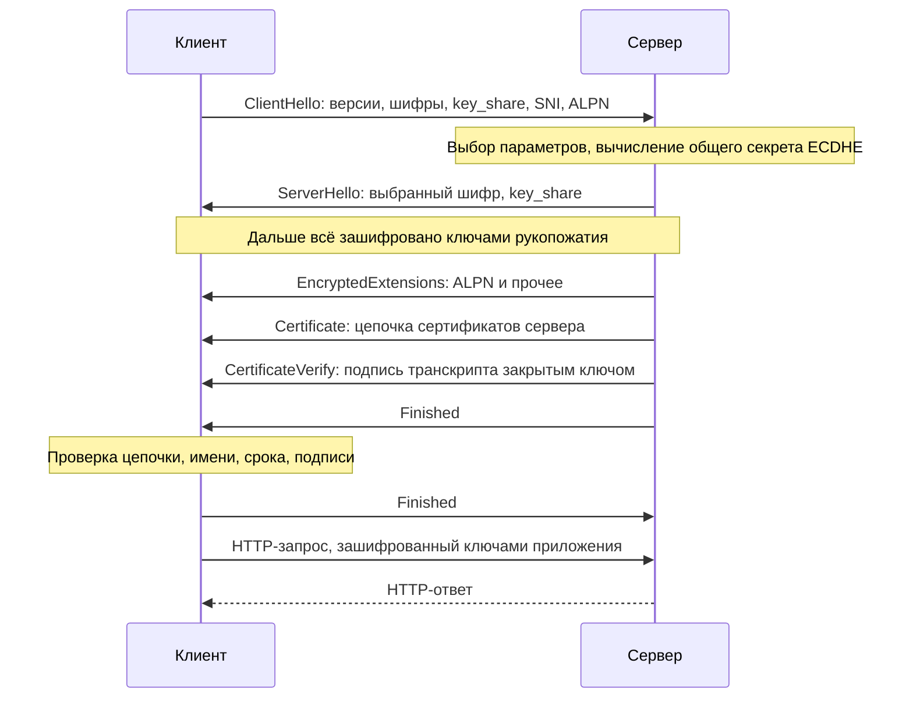
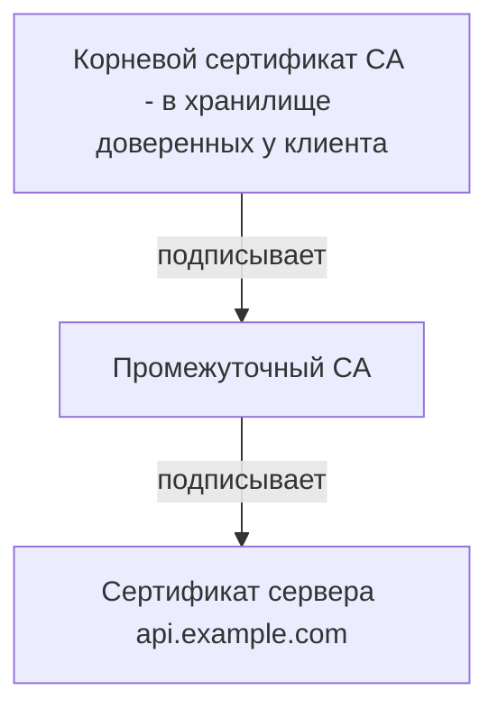
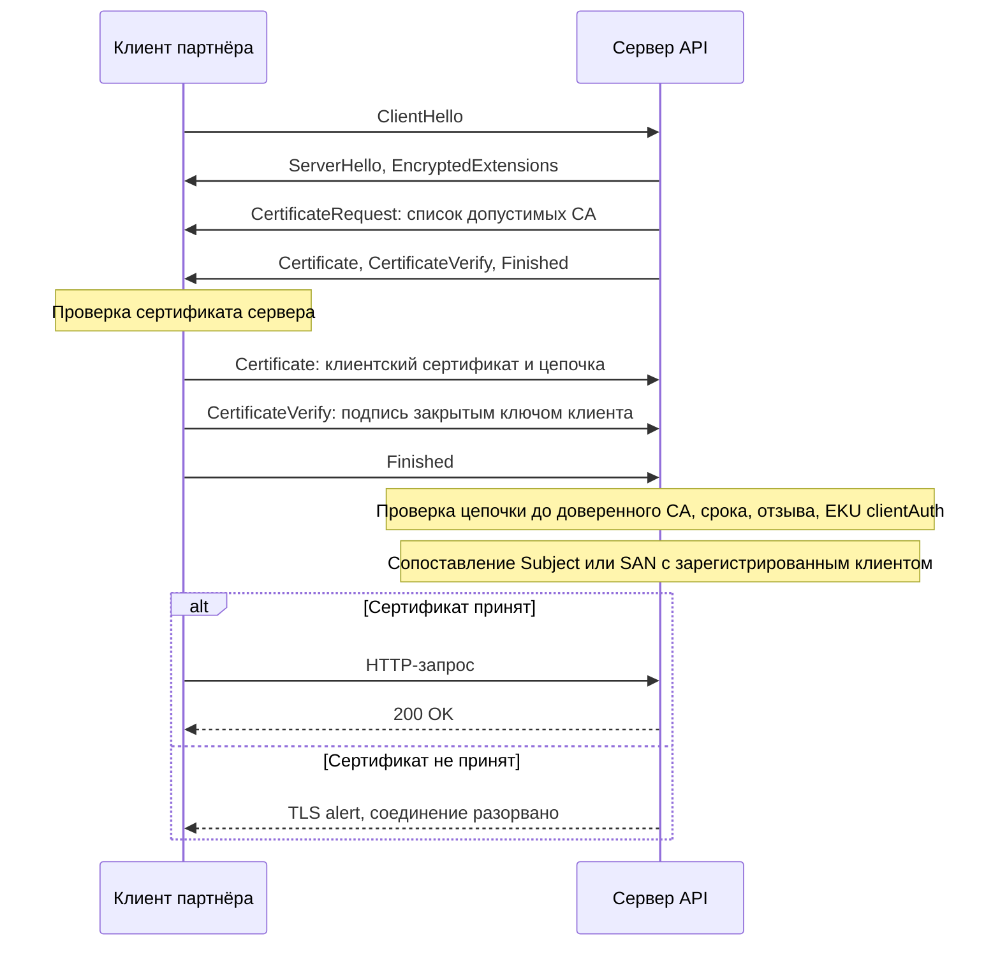
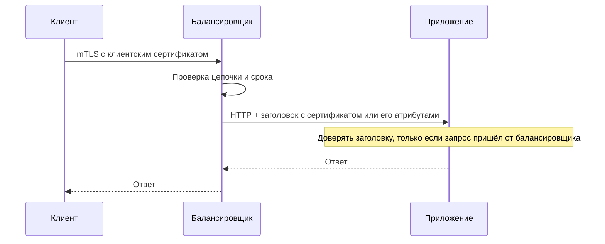

# TLS и mTLS

TLS (Transport Layer Security) — протокол, который защищает канал между клиентом и сервером; HTTPS — это HTTP поверх TLS. mTLS (mutual TLS) — режим, в котором сертификат предъявляет не только сервер, но и клиент. Для интеграций TLS обязателен всегда, mTLS — частый выбор для партнёрских и межсервисных взаимодействий.

## Что даёт TLS {#what-tls-gives}

| Свойство | Что означает | Чего TLS **не** даёт |
|---|---|---|
| Конфиденциальность | Посредник видит IP-адреса, имя хоста (SNI) и объём трафика, но не содержимое | Защиту данных на концах: в логах, базе, на балансировщике после терминации |
| Целостность | Изменение данных в пути обнаруживается | Подпись конкретного сообщения для третьих лиц (неотказуемость) |
| Аутентификация сервера | Клиент убеждается, что говорит с владельцем имени `api.example.com` | Аутентификацию клиента (если не mTLS) |
| Forward secrecy (в TLS 1.3 всегда) | Кража ключа сервера не позволяет расшифровать записанный ранее трафик | — |

## Версии протокола {#versions}

| Версия | Год | Статус | Комментарий |
|---|---|---|---|
| SSL 2.0 | 1995 | **Запрещён** (RFC 6176) | Фундаментально уязвим |
| SSL 3.0 | 1996 | **Запрещён** (RFC 7568) | Атака POODLE |
| TLS 1.0 | 1999 | **Запрещён** (RFC 8996) | BEAST, слабые шифры, не соответствует PCI DSS |
| TLS 1.1 | 2006 | **Запрещён** (RFC 8996) | Устаревшие хэш-функции |
| TLS 1.2 | 2008 | Допустим (RFC 5246) | Только с AEAD-шифрами (AES-GCM, ChaCha20-Poly1305) и ECDHE; без RC4, 3DES, CBC-шифров, статического RSA-обмена |
| TLS 1.3 | 2018 | **Рекомендуется** (RFC 8446) | Быстрее (1-RTT), только стойкие шифры, обязательный forward secrecy |

Типовое требование для постановки: «Минимальная версия — TLS 1.2, предпочтительно TLS 1.3; шифронаборы TLS 1.2 — только ECDHE с AEAD». Рекомендации по конфигурации — RFC 9325 (BCP 195) и Mozilla SSL Configuration Generator.

## Рукопожатие TLS 1.3 {#handshake}



Ключевые отличия от TLS 1.2: одна сетевая задержка (1-RTT) вместо двух, сертификат сервера передаётся уже зашифрованным, нет статического RSA-обмена ключами. Режим 0-RTT (ранние данные при возобновлении сессии) ускоряет повторные соединения, но **уязвим к повтору** — допустим только для идемпотентных запросов, и часто его просто отключают.

## Сертификаты X.509 {#certificates}

Сертификат связывает открытый ключ с именем и подписан удостоверяющим центром (CA, Certificate Authority).

| Поле | Смысл | На что смотреть |
|---|---|---|
| Subject | Владелец, например `CN=api.example.com, O=Example LLC` | CN для проверки имени сервера **устарел** — браузеры и клиенты смотрят SAN |
| Subject Alternative Name (SAN) | Список DNS-имён и IP, для которых действителен сертификат | Должен содержать именно то имя, по которому подключается клиент |
| Issuer | Кто выпустил (CA) | Корпоративный или публичный CA |
| Validity: Not Before / Not After | Срок действия | Мониторинг истечения |
| Public Key | Открытый ключ (RSA 2048+ или ECDSA P-256) | Длина ключа |
| Key Usage / Extended Key Usage | Назначение: `serverAuth`, `clientAuth` | Для mTLS клиентскому сертификату нужен `clientAuth` |
| Serial Number | Уникальный номер у CA | Нужен для отзыва и учёта |
| CRL Distribution Points / AIA (OCSP) | Где проверить отзыв, где взять промежуточный сертификат | Доступность этих адресов из вашего контура |

### Цепочка доверия {#chain}



- Корневые сертификаты лежат в хранилище доверенных (trust store) ОС, JVM (`cacerts`), браузера, контейнера.
- Сервер **обязан** отдавать свой сертификат вместе с промежуточными (fullchain). Корневой отдавать не нужно.
- Браузеры иногда «прощают» неполную цепочку (докачивают промежуточный через AIA), а серверные клиенты (Java, Go, curl, .NET в Linux) — нет. Классическая ситуация: «в браузере открывается, а интеграция падает».

### Wildcard, самоподписанные и корпоративные CA {#ca-types}

| Тип | Описание | Когда уместен | Риски |
|---|---|---|---|
| Публичный CA | Доверен всеми ОС и браузерами | Публичные API | Сроки жизни сокращаются (см. ниже) — нужна автоматизация |
| Wildcard `*.example.com` | Покрывает один уровень поддоменов (`a.example.com`, но не `a.b.example.com` и не сам `example.com`) | Много однотипных хостов | Компрометация ключа затрагивает все хосты |
| Корпоративный (частный) CA | Собственная PKI организации | Внутренние сервисы, mTLS с партнёрами | Корень нужно распространить во все trust store клиентов |
| Самоподписанный | Подписан сам собой | Только локальная разработка | Нет механизма отзыва, приучает отключать проверку |

::: info Сроки жизни публичных сертификатов
Решением CA/Browser Forum (2025) максимальный срок публичных TLS-сертификатов поэтапно сокращается: 200 дней с марта 2026 года, 100 дней с марта 2027 года, 47 дней с марта 2029 года. Ручная замена сертификатов перестаёт быть реалистичной — закладывайте автоматизацию (ACME) и мониторинг. На частные (корпоративные) CA эти правила не распространяются.
:::

## mTLS: взаимная аутентификация {#mtls}

В mTLS сервер запрашивает сертификат клиента, клиент доказывает владение закрытым ключом. Сервер проверяет цепочку до доверенного CA и сопоставляет сертификат с зарегистрированным клиентом.



::: warning Ошибка mTLS — это не HTTP-ошибка
Если клиентский сертификат не принят, соединение рвётся на уровне TLS (alert `bad_certificate`, `unknown_ca`, `certificate_required`) — клиент не получит ни 401, ни 403, ни тела ошибки. Это сильно усложняет диагностику; в постановке полезно определить, нужен ли «мягкий» режим (TLS-сессия устанавливается, а сервер отвечает 401/403 с понятным описанием).
:::

### Привязка сертификата к клиенту {#cert-binding}

Доверять «любому сертификату от нашего CA» недостаточно, если CA выпускает сертификаты многим. Сервер должен определить конкретного клиента:

- по Subject DN или CN (`CN=partner-acme, O=ACME LLC`);
- по SAN (DNS-имя, URI, например SPIFFE ID `spiffe://example.com/ns/prod/sa/billing` в service mesh);
- по отпечатку сертификата (SHA-256 fingerprint) — надёжно, но требует обновления при каждой замене сертификата;
- по выделенному промежуточному CA на каждого партнёра.

Затем к клиенту применяются права: какие API и операции ему доступны. mTLS-аутентификация — это ещё не авторизация.

### Выпуск, сроки и ротация {#cert-lifecycle}

1. Клиент генерирует **у себя** ключевую пару и CSR (запрос на сертификат). Закрытый ключ никогда не передаётся.
2. CSR передаётся владельцу CA, тот выпускает сертификат с EKU `clientAuth`.
3. Сертификат и цепочка CA возвращаются клиенту, клиент устанавливает их.
4. Сервер добавляет привязку (DN/SAN/fingerprint) к учётной записи клиента.
5. До истечения срока (обычно за 30 дней) выпускается новый сертификат; на время перехода сервер принимает оба.

Типичные сроки клиентских сертификатов в партнёрских интеграциях — 1–2 года; в service mesh — часы или дни с автоматической ротацией.

### TLS termination и передача сертификата дальше {#termination}

Часто TLS завершается на балансировщике или API-шлюзе, а до приложения идёт уже другой (или незашифрованный) канал. Тогда приложение не видит клиентский сертификат напрямую.



| Заголовок | Кто использует |
|---|---|
| `Client-Cert`, `Client-Cert-Chain` | Стандарт RFC 9440 — сертификат в формате DER, Base64, в обрамлении двоеточий |
| `X-SSL-Client-Cert`, `X-SSL-Client-DN`, `X-SSL-Client-Verify` | Распространённые нестандартные варианты (nginx, HAProxy и др.) |
| `X-Forwarded-Client-Cert` (XFCC) | Envoy, Istio |
| `X-ARR-ClientCert` | Azure App Service |

::: danger Подделка заголовков
Балансировщик обязан **удалять** такие заголовки из входящих запросов клиента, а приложение — принимать их только от доверенного балансировщика (сетевая изоляция, mTLS между балансировщиком и приложением). Иначе любой сможет прислать заголовок с «чужим» сертификатом.
:::

## Certificate pinning {#pinning}

Пиннинг — клиент доверяет не любому сертификату от доверенного CA, а только конкретному сертификату, ключу или CA.

| Плюсы | Минусы |
|---|---|
| Защита от выпуска поддельного сертификата скомпрометированным CA | Плановая замена сертификата на сервере ломает клиентов |
| Защита от перехвата корпоративными прокси и вредоносными корневыми сертификатами | Для мобильных приложений нужен выпуск новой версии, чтобы обновить пин |
| | Сокращение сроков сертификатов делает пиннинг конечного сертификата почти невозможным |

Если пиннинг всё-таки нужен (мобильные банковские приложения, высокие требования) — пиннить открытый ключ (SPKI) или промежуточный CA, держать запасной пин и процедуру обновления. Для B2B-интеграций чаще надёжнее mTLS + корпоративный CA, чем пиннинг. HTTP Public Key Pinning (HPKP) в браузерах упразднён.

## HSTS {#hsts}

HTTP Strict Transport Security (RFC 6797) — сервер сообщает браузеру «обращайся ко мне только по HTTPS»:

```http
Strict-Transport-Security: max-age=31536000; includeSubDomains; preload
```

HSTS защищает от SSL stripping (понижения до HTTP) для браузерных клиентов. Для server-to-server интеграций он не имеет эффекта — там просто не должно быть HTTP-адресов в конфигурации, а HTTP-порт лучше закрыть.

## Частые ошибки {#mistakes}

| Симптом | Причина | Решение |
|---|---|---|
| `certificate has expired` | Истёк сертификат сервера или клиента | Мониторинг сроков с алертами за 30/14/7 дней, автоматизация выпуска |
| `unable to get local issuer certificate`, `PKIX path building failed` | Сервер не отдаёт промежуточный сертификат или у клиента нет корневого CA | Отдавать fullchain; добавить корень корпоративного CA в trust store клиента |
| `hostname mismatch`, `No subject alternative names matching` | Подключение по имени или IP, которых нет в SAN | Выпустить сертификат с нужными SAN, подключаться по правильному имени |
| `handshake failure`, `protocol version` | Нет общих версий или шифров (старый клиент, только TLS 1.0) | Обновить клиента, согласовать версии и шифры |
| `unknown ca`, `bad certificate` при mTLS | Сервер не доверяет CA клиентского сертификата или у сертификата нет `clientAuth` | Согласовать CA, проверить EKU |
| Клиент не отправляет сертификат | Сертификат не выпущен этим CA из списка `CertificateRequest`, или ключ не соответствует сертификату | Проверить соответствие ключа и сертификата, список CA сервера |
| «Работает только с `-k`» | Проверка сертификата отключена | **Никогда не отключать проверку** в тестах и проде — исправить trust store |

::: danger Отключённая проверка сертификата
Опции вроде `curl -k`, `verify=False` (Python requests), `InsecureSkipVerify` (Go), «trust all» TrustManager (Java) превращают TLS в шифрование без аутентификации: любой посредник может выдать себя за сервер. Такой код часто «утекает» из тестов в прод — запрещайте его на уровне код-ревью.
:::

## Полезные команды {#commands}

::: code-group

```bash [openssl: подключение]
# Посмотреть сертификат и цепочку сервера (SNI обязателен)
openssl s_client -connect api.example.com:443 -servername api.example.com -showcerts

# Проверить поддержку конкретной версии
openssl s_client -connect api.example.com:443 -servername api.example.com -tls1_3
openssl s_client -connect api.example.com:443 -servername api.example.com -tls1_2

# Подключиться с клиентским сертификатом (mTLS)
openssl s_client -connect api.partner.ru:443 -servername api.partner.ru \
  -cert client.crt -key client.key -CAfile partner-ca.pem
```

```bash [openssl: сертификаты]
# Содержимое сертификата
openssl x509 -in cert.pem -noout -text

# Кратко: владелец, издатель, сроки, SAN
openssl x509 -in cert.pem -noout -subject -issuer -dates -ext subjectAltName

# Отпечаток SHA-256
openssl x509 -in cert.pem -noout -fingerprint -sha256

# Проверить цепочку
openssl verify -CAfile root-ca.pem -untrusted intermediate.pem cert.pem

# Ключ соответствует сертификату? Хэши должны совпасть
openssl x509 -in client.crt -noout -pubkey | openssl sha256
openssl pkey -in client.key -pubout | openssl sha256
```

```bash [openssl: выпуск]
# Сгенерировать ключ и CSR для клиентского сертификата
openssl req -new -newkey rsa:2048 -nodes \
  -keyout client.key -out client.csr \
  -subj "/C=RU/O=ACME LLC/CN=partner-acme"

# Посмотреть CSR перед отправкой
openssl req -in client.csr -noout -text

# Упаковать сертификат и ключ в PKCS#12 (для Java, Windows)
openssl pkcs12 -export -in client.crt -inkey client.key \
  -certfile partner-ca.pem -out client.p12
```

```bash [curl]
# Подробный вывод рукопожатия
curl -v https://api.example.com/health

# Свой CA (корпоративный)
curl --cacert corp-root-ca.pem https://api.internal.example.com/health

# mTLS
curl --cert client.crt --key client.key --cacert partner-ca.pem \
  https://api.partner.ru/v1/orders

# Принудительно TLS 1.3
curl --tlsv1.3 https://api.example.com/health
```

:::

## ГОСТ TLS {#gost}

Для взаимодействия с государственными информационными системами и в ряде отраслей РФ требуется TLS с российскими криптоалгоритмами: подпись ГОСТ Р 34.10-2012, хэш ГОСТ Р 34.11-2012 («Стрибог»), шифры ГОСТ Р 34.12-2015 («Кузнечик», «Магма»). Шифронаборы описаны в RFC 9189 (TLS 1.2) и RFC 9367 (TLS 1.3).

Что важно для проекта:

- нужны сертифицированные СКЗИ (КриптоПро CSP, ViPNet и др.) и сертификаты от аккредитованного УЦ;
- стандартные OpenSSL, JDK, браузеры и облачные балансировщики ГОСТ «из коробки» не поддерживают — нужны специальные сборки, криптопровайдеры, ГОСТ-шлюзы или прокси (например, на базе КриптоПро);
- часто архитектура — ГОСТ-шлюз на границе, который терминирует ГОСТ TLS, а внутри используется обычный TLS;
- учитывайте это в сроках: настройка и сертификация занимают время.

## Чек-лист обмена сертификатами с партнёром {#partner-checklist}

**Что запросить у партнёра:**

- [ ] CSR клиентского сертификата (если выпускает ваш CA) или готовый сертификат с цепочкой (если выпускает их CA).
- [ ] Корневой и промежуточные сертификаты CA партнёра (если вы доверяете их CA).
- [ ] Ожидаемые значения Subject/SAN или отпечаток для привязки к учётной записи.
- [ ] Исходящие IP-адреса (для allowlist).
- [ ] Контакты ответственных за сертификаты и график их замены.

**Что передать партнёру:**

- [ ] Адреса тестового и боевого API (FQDN, порт).
- [ ] Корневой и промежуточные сертификаты CA, которым подписан сертификат вашего сервера (если CA частный).
- [ ] Требования к клиентскому сертификату: CA, алгоритм и длина ключа, обязательные поля Subject/SAN, EKU `clientAuth`, срок.
- [ ] Минимальная версия TLS и допустимые шифронаборы.
- [ ] Процедура замены сертификата (за сколько дней, период одновременной работы двух сертификатов).
- [ ] Способ передачи: CSR и сертификаты — открытые данные, но передаются через согласованный канал с проверкой подлинности; **закрытые ключи не передаются никогда**.

**Проверка после настройки:**

- [ ] `openssl s_client` с клиентским сертификатом проходит с обеих сторон.
- [ ] Негативный тест: подключение без сертификата и с чужим сертификатом отвергается.
- [ ] Сроки сертификатов поставлены на мониторинг.

## На что обратить внимание аналитику {#analyst-checklist}

- [ ] Все взаимодействия только по HTTPS, HTTP отключён.
- [ ] Указаны минимальная версия TLS и требования к шифрам.
- [ ] Определён тип CA (публичный или корпоративный) и как клиенты получат корневой сертификат.
- [ ] Если mTLS — описаны выпуск, привязка к клиенту, сроки, ротация, процедура отзыва.
- [ ] Определено, где терминируется TLS и как атрибуты клиентского сертификата доходят до приложения.
- [ ] Заголовки с сертификатом от балансировщика защищены от подделки.
- [ ] Определено поведение при ошибке mTLS и как диагностировать проблемы.
- [ ] Сроки всех сертификатов на мониторинге, ответственные назначены.
- [ ] Отключение проверки сертификата запрещено требованием.
- [ ] Для госинтеграций учтены требования ГОСТ TLS и СКЗИ.

## Стандарты и ссылки {#links}

- [RFC 8446 — TLS 1.3](https://www.rfc-editor.org/rfc/rfc8446)
- [RFC 5246 — TLS 1.2](https://www.rfc-editor.org/rfc/rfc5246)
- [RFC 8996 — Deprecating TLS 1.0 and TLS 1.1](https://www.rfc-editor.org/rfc/rfc8996)
- [RFC 9325 — Recommendations for Secure Use of TLS and DTLS](https://www.rfc-editor.org/rfc/rfc9325)
- [RFC 5280 — X.509 Certificate and CRL Profile](https://www.rfc-editor.org/rfc/rfc5280)
- [RFC 8705 — OAuth 2.0 Mutual-TLS](https://www.rfc-editor.org/rfc/rfc8705)
- [RFC 9440 — Client-Cert HTTP Header Field](https://www.rfc-editor.org/rfc/rfc9440)
- [RFC 6797 — HTTP Strict Transport Security](https://www.rfc-editor.org/rfc/rfc6797)
- [RFC 9189 — GOST Cipher Suites for TLS 1.2](https://www.rfc-editor.org/rfc/rfc9189)
- [RFC 9367 — GOST Cipher Suites for TLS 1.3](https://www.rfc-editor.org/rfc/rfc9367)
- [Mozilla SSL Configuration Generator](https://ssl-config.mozilla.org/)
- [SSL Labs Server Test](https://www.ssllabs.com/ssltest/)
- [OWASP Transport Layer Security Cheat Sheet](https://cheatsheetseries.owasp.org/cheatsheets/Transport_Layer_Security_Cheat_Sheet.html)
- [CA/Browser Forum](https://cabforum.org/)
