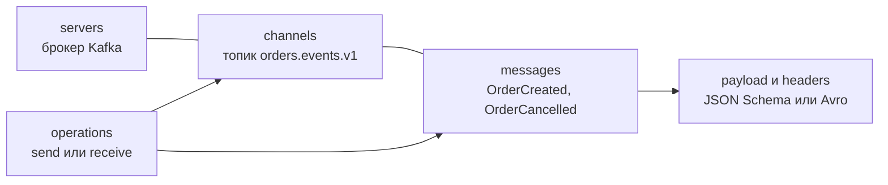

# AsyncAPI

AsyncAPI — спецификация машиночитаемого описания событийных и асинхронных API: топиков Kafka, очередей RabbitMQ, MQTT, WebSocket и других каналов. Это «OpenAPI для сообщений»: тот же YAML, похожая структура, JSON Schema для данных. По документу AsyncAPI генерируют документацию, модели данных и код, проверяют совместимость. Для аналитика это способ зафиксировать контракт событий так же строго, как контракт REST API.

## Зачем нужна {#why}

OpenAPI описывает запрос-ответ по HTTP. Для событийной интеграции нужно описать другое:

| Вопрос | Где в AsyncAPI |
|---|---|
| Через какой брокер и сервер идёт обмен | `servers` |
| В какой топик, очередь или канал | `channels` и `address` |
| Кто отправляет, кто получает | `operations` с `action: send` или `receive` |
| Какие сообщения ходят в канале, их заголовки и тело | `messages`, `headers`, `payload` |
| Специфика брокера: партиции, consumer group, exchange, QoS | `bindings` |
| Как связать запрос и ответ | `correlationId`, `reply` |
| Как аутентифицироваться | `securitySchemes` |

## Версии: 2.x и 3.0 {#versions}

| Версия | Год | Статус |
|---|---|---|
| 2.0.0 | 2019 | Первая массово используемая версия |
| 2.6.0 | 2023 | Последняя в линейке 2.x |
| 3.0.0 | Декабрь 2023 | Текущая мажорная версия, существенно переработана |

### Главная путаница 2.x: publish и subscribe {#publish-subscribe-confusion}

В 2.x операции внутри канала назывались `publish` и `subscribe` и описывались **с точки зрения клиента** приложения, а не самого приложения:

- `subscribe` в документе сервиса заказов означало «**клиенты могут подписаться**» — то есть сервис заказов **отправляет** сообщения;
- `publish` означало «**клиенты могут публиковать**» — то есть сервис **получает** сообщения.

```yaml
# AsyncAPI 2.6 — сервис заказов ОТПРАВЛЯЕТ события
channels:
  orders.events.v1:
    subscribe:            # читается как «подпишитесь», а сервис при этом публикует
      operationId: publishOrderEvent
      message:
        $ref: '#/components/messages/OrderCreated'
```

Это постоянно приводило к ошибкам: команды описывали операции «наоборот», генераторы кода создавали не ту сторону.

### Что изменилось в 3.0 {#changes-3-0}

| Аспект | 2.x | 3.0 |
|---|---|---|
| Операции | Внутри канала: `publish` / `subscribe` с точки зрения клиента | Отдельный раздел `operations`, `action: send` / `receive` с точки зрения **описываемого приложения** |
| Канал | Ключ канала = адрес топика | Ключ — идентификатор, адрес отдельно в `address`. Канал можно описать один раз и переиспользовать |
| Сообщения | Привязаны к операции | Определяются в канале, операция ссылается на подмножество сообщений канала |
| Request-reply | Нет штатного способа | Объект `reply` у операции: канал или адрес ответа, сообщения ответа |
| Сервер | `url` целиком | `host` и `pathname` раздельно, `protocol` |
| Привязка канала к серверам | Через `servers` в канале по именам | Через `$ref` на серверы |
| Схема payload другого формата | `schemaFormat` у сообщения | Multi Format Schema Object: `schemaFormat` + `schema` прямо в `payload` |
| Теги и внешние документы | На верхнем уровне | Внутри `info` |
| Переиспользование | `components` | Расширены: `operations`, `channels`, `replies`, `replyAddresses`, трейты |

Миграция: `asyncapi convert` в AsyncAPI CLI переводит документ 2.x в 3.0.

## Структура документа 3.0 {#structure}

| Раздел | Назначение |
|---|---|
| `asyncapi` | Версия спецификации: `3.0.0` |
| `id` | Уникальный идентификатор приложения (URN или URL) |
| `info` | Название, версия, описание, контакты, теги, внешние ссылки |
| `servers` | Брокеры: `host`, `protocol`, `pathname`, безопасность, bindings |
| `defaultContentType` | Медиатип сообщений по умолчанию |
| `channels` | Каналы: `address`, `messages`, `parameters`, `servers`, `bindings` |
| `operations` | Что делает приложение: `action`, `channel`, `messages`, `reply`, `bindings`, `security` |
| `components` | Переиспользуемые схемы, сообщения, трейты, схемы безопасности, bindings |



## Пример: события заказа в Kafka {#example}

Документ описывает сервис заказов, который **публикует** события в топик Kafka.

::: details Открыть order-events.asyncapi.yaml целиком

```yaml
asyncapi: 3.0.0
id: urn:example:order-service
info:
  title: Order Events
  version: 1.3.0
  description: |
    События жизненного цикла заказа. Публикует сервис заказов.
    Гарантия доставки — at-least-once, потребители обязаны быть идемпотентными
    по полю id (заголовок ce_id).
    Порядок гарантируется в пределах одного заказа (ключ сообщения = orderId).
  contact:
    name: Команда Orders
    email: orders-team@example.com
  tags:
    - name: orders

defaultContentType: application/json

servers:
  production:
    host: kafka-1.example.com:9093
    protocol: kafka
    description: Продуктивный кластер
    security:
      - $ref: '#/components/securitySchemes/saslScram'
    bindings:
      kafka:
        schemaRegistryUrl: https://schema-registry.example.com
        schemaRegistryVendor: confluent
  test:
    host: kafka-test.example.com:9093
    protocol: kafka
    security:
      - $ref: '#/components/securitySchemes/saslScram'

channels:
  orderEvents:
    address: orders.events.v1
    description: Все события по заказам
    messages:
      orderCreated:
        $ref: '#/components/messages/OrderCreated'
      orderCancelled:
        $ref: '#/components/messages/OrderCancelled'
    bindings:
      kafka:
        partitions: 12
        replicas: 3
        topicConfiguration:
          cleanup.policy: [delete]
          retention.ms: 604800000

operations:
  sendOrderCreated:
    action: send
    channel:
      $ref: '#/channels/orderEvents'
    summary: Публикация события о создании заказа
    messages:
      - $ref: '#/channels/orderEvents/messages/orderCreated'
  sendOrderCancelled:
    action: send
    channel:
      $ref: '#/channels/orderEvents'
    messages:
      - $ref: '#/channels/orderEvents/messages/orderCancelled'

components:
  securitySchemes:
    saslScram:
      type: scramSha512
      description: SASL/SCRAM-SHA-512 поверх TLS

  messageTraits:
    cloudEventsHeaders:
      description: Атрибуты CloudEvents в binary content mode
      headers:
        type: object
        required: [ce_specversion, ce_id, ce_source, ce_type, ce_time]
        properties:
          ce_specversion:
            type: string
            const: '1.0'
          ce_id:
            type: string
            format: uuid
            description: Уникальный ID события, ключ идемпотентности для потребителя
          ce_source:
            type: string
            examples: ['/order-service']
          ce_type:
            type: string
          ce_time:
            type: string
            format: date-time
          traceparent:
            type: string
            description: W3C Trace Context
      bindings:
        kafka:
          key:
            type: string
            format: uuid
            description: orderId — гарантирует порядок событий одного заказа

  messages:
    OrderCreated:
      name: OrderCreated
      title: Заказ создан
      contentType: application/json
      traits:
        - $ref: '#/components/messageTraits/cloudEventsHeaders'
      payload:
        $ref: '#/components/schemas/OrderCreatedPayload'
      examples:
        - name: simple
          headers:
            ce_specversion: '1.0'
            ce_id: 9b2f6c1e-2d4a-4b8e-9f1a-3c5d7e9f0a12
            ce_source: /order-service
            ce_type: com.example.order.created.v1
            ce_time: '2026-10-03T10:15:00Z'
          payload:
            orderId: 3fa85f64-5717-4562-b3fc-2c963f66afa6
            externalId: PARTNER-77812
            status: NEW
            total: { amount: '2980.00', currency: RUB }
            createdAt: '2026-10-03T10:15:00Z'

    OrderCancelled:
      name: OrderCancelled
      title: Заказ отменён
      contentType: application/json
      traits:
        - $ref: '#/components/messageTraits/cloudEventsHeaders'
      payload:
        type: object
        required: [orderId, reason, cancelledAt]
        properties:
          orderId:
            type: string
            format: uuid
          reason:
            type: string
            enum: [CUSTOMER_REQUEST, OUT_OF_STOCK, PAYMENT_FAILED]
          cancelledAt:
            type: string
            format: date-time

  schemas:
    Money:
      type: object
      required: [amount, currency]
      properties:
        amount:
          type: string
        currency:
          type: string
          pattern: '^[A-Z]{3}$'

    OrderCreatedPayload:
      type: object
      required: [orderId, status, total, createdAt]
      properties:
        orderId:
          type: string
          format: uuid
        externalId:
          type: string
        status:
          type: string
          enum: [NEW]
        total:
          $ref: '#/components/schemas/Money'
        createdAt:
          type: string
          format: date-time
```

:::

### Документ потребителя

Потребитель (например, склад) описывает **свою** сторону: тот же канал, но `action: receive`, плюс bindings операции — consumer group.

```yaml
operations:
  receiveOrderCreated:
    action: receive
    channel:
      $ref: 'https://schemas.example.com/order-service/asyncapi.yaml#/channels/orderEvents'
    messages:
      - $ref: 'https://schemas.example.com/order-service/asyncapi.yaml#/channels/orderEvents/messages/orderCreated'
    bindings:
      kafka:
        groupId:
          type: string
          enum: [warehouse-order-consumer]
```

::: tip Один канал — много приложений
Канал и сообщения принадлежат владельцу топика и описываются у него. Остальные приложения ссылаются на них через `$ref` и описывают только свои операции. Так контракт события живёт в одном месте.
:::

## Bindings {#bindings}

Bindings — расширения для специфики конкретного протокола. Бывают на уровне сервера, канала, операции и сообщения. Описываются в отдельном репозитории спецификаций bindings и имеют собственные версии (`bindingVersion`).

| Протокол | Уровень | Основные поля |
|---|---|---|
| **Kafka** | server | `schemaRegistryUrl`, `schemaRegistryVendor` |
| | channel | `topic`, `partitions`, `replicas`, `topicConfiguration` (`cleanup.policy`, `retention.ms` и др.) |
| | operation | `groupId`, `clientId` |
| | message | `key`, `schemaIdLocation`, `schemaIdPayloadEncoding`, `schemaLookupStrategy` |
| **AMQP 0-9-1** (RabbitMQ) | channel | `is: routingKey` или `queue`, параметры `exchange` (имя, тип topic/direct/fanout, durable) и `queue` |
| | operation | `deliveryMode`, `priority`, `expiration`, `mandatory`, `ack`, `cc`, `bcc` |
| | message | `contentEncoding`, `messageType` |
| **MQTT** | server | `clientId`, `cleanSession`, `lastWill`, `keepAlive` |
| | operation | `qos`, `retain` |
| **WebSocket** | channel | `method`, `query`, `headers` для установления соединения |
| **HTTP** | operation | `method`, `query` |

Пример AMQP:

```yaml
channels:
  orderCreatedQueue:
    address: warehouse.order-created
    bindings:
      amqp:
        is: queue
        queue:
          name: warehouse.order-created
          durable: true
          exclusive: false
          autoDelete: false
```

См. [Брокеры сообщений](/protocols/messaging), [WebSocket](/protocols/websocket).

## Message traits {#message-traits}

Трейт (trait) — переиспользуемый фрагмент описания сообщения или операции, который **сливается** с основным объектом. Типичные применения:

- общие заголовки всех событий компании: `ce_id`, `ce_type`, `traceparent`, `correlationId`;
- общий `contentType` и bindings;
- общие теги и внешние ссылки.

Трейты операций (`operationTraits`) аналогично выносят общие bindings операций, например общий префикс consumer group или параметры безопасности.

## Схемы данных: JSON Schema, Avro, Protobuf {#schemas}

По умолчанию `payload` описывается схемой AsyncAPI — надмножеством JSON Schema draft 07. Другие форматы подключаются через Multi Format Schema Object:

```yaml
messages:
  OrderCreated:
    contentType: application/octet-stream
    payload:
      schemaFormat: application/vnd.apache.avro+json;version=1.9.0
      schema:
        $ref: './avro/OrderCreated.avsc'
```

Поддерживаются, в частности, Avro (`application/vnd.apache.avro+json`, `application/vnd.apache.avro+yaml`), OpenAPI Schema (`application/vnd.oai.openapi`), JSON Schema, RAML data types. Поддержка Protobuf зависит от инструмента.

### Связь со Schema Registry

В Kafka схемы сообщений обычно хранятся в Schema Registry (Confluent, Apicurio, Karapace). Producer регистрирует схему и добавляет её ID в сообщение, consumer по ID получает схему.

| Что | Где |
|---|---|
| Адрес реестра | `servers.*.bindings.kafka.schemaRegistryUrl` |
| Где лежит ID схемы в сообщении | `messages.*.bindings.kafka.schemaIdLocation`: `payload` или `header` |
| Стратегия имени subject | `schemaLookupStrategy`, например `TopicIdStrategy` |
| Правила совместимости схем | В самом реестре: `BACKWARD`, `FORWARD`, `FULL` и транзитивные варианты |

AsyncAPI описывает контракт для людей и инструментов, а Schema Registry **обеспечивает** его во время работы: не даст опубликовать несовместимую версию схемы. Синхронизируйте их: схема в AsyncAPI либо ссылается на ту же `.avsc`, что регистрируется в реестре, либо генерируется из неё. Про форматы — см. [Форматы данных](/protocols/data-formats).

## CloudEvents вместе с AsyncAPI {#cloudevents}

CloudEvents (спецификация CNCF, версия 1.0) стандартизирует **метаданные события** независимо от брокера. AsyncAPI описывает канал и полезную нагрузку, CloudEvents — общий «конверт».

| Атрибут CloudEvents | Обязательный | Смысл |
|---|---|---|
| `specversion` | Да | `1.0` |
| `id` | Да | Уникальный ID события. Пара `source` + `id` уникальна |
| `source` | Да | Источник события (URI-reference) |
| `type` | Да | Тип события, например `com.example.order.created.v1` |
| `time` | Нет | Время события |
| `datacontenttype` | Нет | Медиатип данных |
| `dataschema` | Нет | Ссылка на схему данных |
| `subject` | Нет | Объект внутри источника, например ID заказа |

Два режима передачи в Kafka и HTTP:

- **binary content mode** — атрибуты в заголовках (`ce_id`, `ce_type` в Kafka; `ce-id`, `ce-type` в HTTP), в теле только данные. Удобно: тело остаётся «чистым», схема в реестре — только для данных;
- **structured content mode** — всё событие целиком в теле с медиатипом `application/cloudevents+json`.

В AsyncAPI атрибуты CloudEvents удобно оформлять как трейт сообщения — см. пример выше.

## Request-reply в 3.0 {#request-reply}

```yaml
operations:
  requestStockCheck:
    action: send
    channel:
      $ref: '#/channels/stockCheckRequests'
    reply:
      address:
        location: '$message.header#/replyTo'
      channel:
        $ref: '#/channels/stockCheckReplies'

components:
  messages:
    StockCheckRequest:
      correlationId:
        location: '$message.header#/correlationId'
```

Описывает, что ответ приходит в канал, адрес которого указан в заголовке `replyTo` запроса, а запрос и ответ связаны по заголовку `correlationId`. Сам паттерн — см. [Интеграционные паттерны](/reliability/integration-patterns).

## Инструменты {#tools}

| Инструмент | Назначение |
|---|---|
| **AsyncAPI Studio** | Веб-редактор с валидацией и предпросмотром документации, конвертация 2.x → 3.0 |
| **AsyncAPI CLI** | `asyncapi validate`, `asyncapi convert`, `asyncapi generate fromTemplate`, `asyncapi bundle` |
| **AsyncAPI Generator** и шаблоны | HTML и Markdown документация, код клиентов и серверов |
| **Modelina** | Генерация моделей данных (Java, TypeScript, C#, Python, Go и др.) из схем |
| **Spectral** | Линтинг AsyncAPI встроенным набором `spectral:asyncapi` и правилами компании |
| **Microcks** | Моки и контрактное тестирование событийных API |
| **EventCatalog** | Каталог событий и сервисов компании, умеет импортировать AsyncAPI |

```bash
asyncapi validate order-events.asyncapi.yaml
asyncapi convert asyncapi-2.6.yaml --output asyncapi-3.yaml
asyncapi generate fromTemplate order-events.asyncapi.yaml @asyncapi/html-template -o ./docs
```

## Что описать в контракте события {#contract}

Помимо структуры сообщения, AsyncAPI-документ (в `description` и bindings) должен отвечать на вопросы, без которых событийная интеграция не работает:

| Вопрос | Пример ответа |
|---|---|
| Гарантия доставки | At-least-once, возможны дубли |
| Ключ идемпотентности | `ce_id` |
| Порядок | Гарантирован в пределах ключа `orderId` |
| Ключ партиционирования | `orderId` |
| Срок хранения | 7 дней |
| Версионирование | Версия в имени топика и в `type`, обратно совместимые изменения в рамках версии |
| Политика совместимости схем | `BACKWARD` в Schema Registry |
| Поведение потребителя при ошибке | 5 повторов, затем DLQ `orders.events.v1.dlq` |
| Объёмы | Средний поток 50 сообщений в секунду, пик 500, размер до 5 КБ |

## На что обратить внимание аналитику {#checklist}

- [ ] Используется AsyncAPI 3.0. Если в компании 2.x — команда понимает смысл `publish` и `subscribe`.
- [ ] Каналы и сообщения описывает владелец топика, остальные ссылаются через `$ref`.
- [ ] У каждой операции указана сторона: `send` или `receive`.
- [ ] Для каждого сообщения описаны заголовки и payload с типами, обязательностью, ограничениями и примерами.
- [ ] Определены ID события, ключ сообщения и правила порядка.
- [ ] Указаны bindings: партиции, consumer group, параметры очереди и exchange.
- [ ] Схемы синхронизированы со Schema Registry, выбран режим совместимости.
- [ ] Согласован конверт события (CloudEvents или собственный стандарт компании).
- [ ] В описании указаны гарантии доставки, срок хранения, DLQ и объёмы.
- [ ] Документ валидируется в CI, изменения проверяются на совместимость.

## Стандарты и ссылки {#links}

- [AsyncAPI Specification 3.0.0](https://www.asyncapi.com/docs/reference/specification/v3.0.0)
- [AsyncAPI — миграция на 3.0](https://www.asyncapi.com/docs/migration/migrating-to-v3)
- [AsyncAPI Bindings](https://github.com/asyncapi/bindings)
- [AsyncAPI Studio](https://studio.asyncapi.com/)
- [AsyncAPI CLI](https://www.asyncapi.com/docs/tools/cli)
- [CloudEvents Specification](https://github.com/cloudevents/spec)
- [CloudEvents — Kafka Protocol Binding](https://github.com/cloudevents/spec/blob/main/cloudevents/bindings/kafka-protocol-binding.md)
- [Confluent Schema Registry — Schema Evolution and Compatibility](https://docs.confluent.io/platform/current/schema-registry/fundamentals/schema-evolution.html)
- [Apache Avro Specification](https://avro.apache.org/docs/current/specification/)
