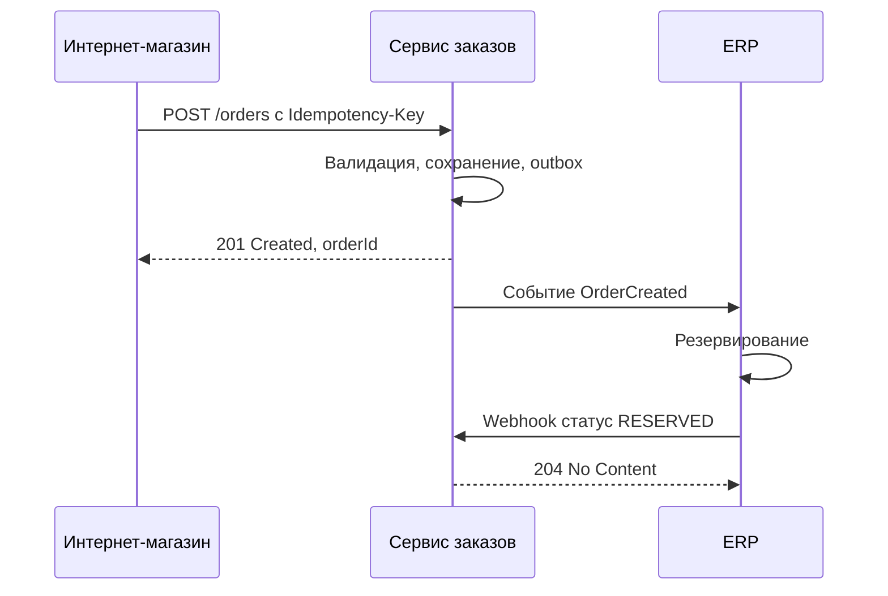

# Шаблон описания интеграции

Готовый шаблон постановки на интеграцию для системного аналитика. Его можно скопировать целиком в Confluence, Git или Word и заполнить. Шаблон покрывает то, о чём чаще всего забывают: нефункциональные требования, поведение при сбоях, маппинг и справочники, логирование, приёмку. Ниже шаблона — пояснения к каждому разделу со ссылками на страницы справочника.

::: tip Как пользоваться
- Не удаляйте разделы, которые кажутся неактуальными. Напишите «Не применимо» и причину — так видно, что вопрос рассмотрен.
- Для REST API контракт ведите в [OpenAPI](/specs/openapi), для событий — в [AsyncAPI](/specs/asyncapi). Постановка описывает бизнес-смысл, маппинг и нефункциональные требования и ссылается на спецификацию, а не дублирует её.
- Для финальной проверки используйте [Чек-лист интеграции](/guide/integration-checklist).
:::

## Шаблон {#template}

Нажмите на значок копирования в правом верхнем углу блока.

````md
# Интеграция: <Система А> → <Система Б>. <Краткое название потока>

| Атрибут документа | Значение |
|---|---|
| Версия документа | 0.1 |
| Статус | Черновик / На согласовании / Согласовано |
| Автор | <ФИО, роль> |
| Задача / эпик | <ссылка> |
| Спецификация API | <ссылка на OpenAPI / AsyncAPI в Git> |

## 1. Общие сведения

### 1.1. Цель интеграции
<Какую бизнес-задачу решает интеграция. 2–3 предложения.
Пример: «Передавать заказы из интернет-магазина в ERP для резервирования
и отгрузки в течение 1 минуты после оформления».>

### 1.2. Бизнес-процесс
<Название процесса и шаги, в которых участвует интеграция. Ссылка на модель процесса (BPMN).
Какие события процесса запускают обмен.>

### 1.3. Системы-участники

| Система | Роль в интеграции | Владелец (команда) | Контакт: тех. / бизнес | Дежурная поддержка |
|---|---|---|---|---|
| <Система А> | Источник / инициатор | <команда> | <ФИО, email, чат> | <канал, часы> |
| <Система Б> | Приёмник | | | |
| <API Gateway / шина> | Посредник | | | |

### 1.4. Среды и адреса

| Среда | Система А | Система Б (базовый URL / брокер / топик) | Примечание |
|---|---|---|---|
| DEV | | | |
| TEST | | | |
| PREPROD | | | Данные, близкие к продуктиву |
| PROD | | | |

### 1.5. Термины и сокращения
| Термин | Определение |
|---|---|
| | |

## 2. Схема взаимодействия

### 2.1. Контекстная диаграмма
<Какие системы и через какие каналы связаны. Пример:>


### 2.2. Диаграмма последовательности
<Основной сценарий и альтернативные: ошибка валидации, недоступность приёмника, повтор.>



### 2.3. Сценарии
| № | Сценарий | Триггер | Результат |
|---|---|---|---|
| С1 | Основной: создание заказа | Клиент оформил заказ | Заказ создан в ERP, статус RESERVED |
| С2 | Ошибка валидации | | |
| С3 | Приёмник недоступен | | |
| С4 | Повторная отправка | | |

## 3. Технология и протокол

| Параметр | Значение |
|---|---|
| Стиль / протокол | REST over HTTPS / gRPC / SOAP / Kafka / файловый обмен / вебхуки |
| Формат данных | JSON (UTF-8) / XML / Avro / CSV |
| Направление | А → Б / Б → А / двустороннее |
| Инициатор | Какая система начинает обмен |
| Синхронность | Синхронно / асинхронно / асинхронно с callback |
| Режим запуска | По событию / по расписанию (cron, окно) / по запросу пользователя |
| Спецификация | Ссылка на OpenAPI / AsyncAPI, версия |
| Версия API | v1 |
| Обоснование выбора | <почему этот протокол, а не другой> |

## 4. Безопасность

| Параметр | Значение |
|---|---|
| Аутентификация | OAuth 2.0 Client Credentials / mTLS / API-ключ / Basic |
| Сервер авторизации, token URL | |
| Client ID, способ передачи секрета | <через хранилище секретов, не в документе> |
| Scopes / роли | orders:write |
| Авторизация на уровне данных | <какие объекты доступны клиенту: только свои заказы и т. п.> |
| Сетевой доступ | Интернет / VPN / внутренняя сеть, IP allowlist, порты, открытие доступов (заявка №) |
| TLS | Версия не ниже 1.2, кто выпускает сертификаты, срок действия, процедура ротации |
| Подпись сообщений / вебхуков | HMAC-SHA256 в заголовке …, секрет, ротация |
| Персональные данные | Какие ПДн передаются, основание, категория, маскирование в логах, срок хранения |
| Прочие требования ИБ | Согласование с ИБ, классификация информации |

## 5. Описание методов

<Повторить раздел для каждого метода / эндпоинта / типа сообщения.>

### 5.1. <Название операции, например «Создание заказа»>

| Параметр | Значение |
|---|---|
| Метод и URI | `POST /api/v1/orders` |
| Назначение | |
| Вызывающая система | |
| Идемпотентность | Да, заголовок Idempotency-Key, хранение 24 ч |
| Права (scope) | orders:write |
| Ожидаемая нагрузка | 10 RPS, пик 50 RPS |
| Целевое время ответа | p95 ≤ 500 мс, p99 ≤ 1 с |

#### Параметры

| Имя | Где | Тип / формат | Обяз. | Описание | Пример |
|---|---|---|---|---|---|
| Authorization | header | string | Да | Bearer-токен | Bearer eyJ… |
| Idempotency-Key | header | string / uuid | Да | Ключ операции, одинаков при повторах | 7f3c2a10-… |
| X-Request-ID | header | string / uuid | Нет | ID запроса для трассировки | |
| orderId | path | string / uuid | Да | ID заказа | |
| limit | query | integer, 1..100 | Нет | Размер страницы, по умолчанию 20 | 50 |

#### Тело запроса

| Атрибут (JSON path) | Тип / формат | Обяз. | Ограничения | Описание | Источник: поле системы А | Приёмник: поле системы Б |
|---|---|---|---|---|---|---|
| externalId | string | Да | до 64 символов, уникален | Номер заказа в магазине | shop.orders.number | ERP: VBELN_EXT |
| customer.phone | string | Да | E.164 | Телефон клиента (ПДн) | shop.customers.phone | |
| items[] | array | Да | 1..100 элементов | Позиции заказа | | |
| items[].sku | string | Да | до 64 символов | Артикул | | ERP: MATNR (перекодировка по справочнику) |
| items[].quantity | integer | Да | 1..999 | Количество | | |
| total.amount | string (decimal) | Да | 2 знака после точки | Сумма | | |
| comment | string, nullable | Нет | до 1000 символов | Комментарий | | |

Пример запроса:
```json
{
  "externalId": "PARTNER-77812",
  "customer": { "name": "Иван Петров", "phone": "+79001234567" },
  "items": [ { "sku": "SKU-1001", "quantity": 2 } ],
  "total": { "amount": "2980.00", "currency": "RUB" },
  "comment": null
}
```

#### Ответы

| Код | Когда | Тело | Действие вызывающей системы |
|---|---|---|---|
| 201 Created | Заказ создан | Order | Сохранить orderId |
| 200 OK | Повтор с тем же Idempotency-Key | Order (исходный ответ) | Как для 201 |
| 400 Bad Request | Ошибка валидации | Problem + errors[] | Не повторять, исправить данные, алерт |
| 401 Unauthorized | Токен недействителен | Problem | Обновить токен, повторить 1 раз |
| 403 Forbidden | Нет прав | Problem | Не повторять, инцидент |
| 409 Conflict | Запрос с этим ключом ещё обрабатывается | Problem | Повторить позже |
| 422 Unprocessable Content | Бизнес-ошибка | Problem | По коду ошибки, см. каталог |
| 429 Too Many Requests | Превышен лимит | Problem, Retry-After | Повторить после паузы |
| 5xx / таймаут | Сбой приёмника | Problem или пусто | Повтор по политике раздела 8 |

Пример ответа:
```json
{ "id": "3fa85f64-5717-4562-b3fc-2c963f66afa6", "status": "NEW" }
```

#### Каталог ошибок

| HTTP-код | Код ошибки (type / code) | Описание | Причина | Действие |
|---|---|---|---|---|
| 422 | OUT_OF_STOCK | Нет товара | | Показать пользователю «Товар закончился» |
| 422 | INVALID_ADDRESS | Адрес не распознан | | |

## 6. Маппинг данных

### 6.1. Соответствие полей

| № | Поле системы А | Тип | Поле системы Б | Тип | Обяз. в Б | Преобразование | Комментарий |
|---|---|---|---|---|---|---|---|
| 1 | order.number | string(20) | VBELN_EXT | CHAR(35) | Да | Без изменений | |
| 2 | order.created_at | timestamp (MSK) | ERDAT + ERZET | DATE + TIME | Да | Перевод в UTC, разбиение | |
| 3 | customer.full_name | string | NAME1, NAME2 | CHAR(40) ×2 | Да | Разбиение по 40 символов | Обрезка с логированием |
| 4 | status | enum | STATUS | CHAR(2) | Да | По справочнику 6.2 | |

### 6.2. Справочники и перекодировки

| Справочник | Значение в А | Значение в Б | Описание |
|---|---|---|---|
| Статус заказа | NEW | 01 | Новый |
| | CANCELLED | 99 | Отменён |
| Значение не найдено | — | — | <Поведение: ошибка / значение по умолчанию / пропуск> |

<Кто владелец справочника, как синхронизируется, что делать при появлении нового значения.>

### 6.3. Правила
- Кодировка, формат дат и часовой пояс, формат денег и округление.
- Обработка пустых значений и null.
- Длины и обрезка строк.
- Уникальность и ключи сопоставления записей (по какому полю ищем существующую запись).

## 7. Нефункциональные требования

| Параметр | Значение | Обоснование / источник |
|---|---|---|
| Объём в сутки | 20 000 заказов | Статистика за прошлый год + 30 % |
| Средняя нагрузка | 5 RPS | |
| Пиковая нагрузка | 50 RPS, распродажи в ноябре | |
| Размер сообщения | Средний 3 КБ, максимум 200 КБ | |
| Время ответа | p95 ≤ 500 мс, p99 ≤ 1 с | |
| Время доставки (асинхронно) | 99 % событий за 1 мин | |
| Доступность | 99,9 % в месяц | SLA системы Б |
| Окна обслуживания | Вс 02:00–04:00 MSK, уведомление за 3 дня | |
| Режим работы | 24/7 | |
| Хранение данных | | |
| Рост | | |

## 8. Надёжность

| Параметр | Значение |
|---|---|
| Таймауты | connect 2 с, read 5 с, общий 12 с |
| Повторы | 3 попытки, экспоненциально 0,5 / 1 / 2 с с джиттером. Коды: 408, 429, 502, 503, 504, сетевые ошибки |
| Идемпотентность | Idempotency-Key = UUID операции; потребитель событий — дедупликация по ID события |
| Гарантия доставки | At-least-once |
| Порядок | Важен в пределах заказа, ключ партиции = orderId |
| Поведение при недоступности Б | Заказ принимается, сообщение ждёт в outbox / очереди; алерт через 15 мин |
| Поведение при недоступности А | |
| DLQ | После 5 попыток; разбор — команда Б, срок — 1 рабочий день |
| Circuit Breaker / fallback | |
| Сверка | Ежедневная сверка количества и статусов заказов А и Б, отчёт расхождений |
| Ручное восстановление | Переотправка из журнала обмена, роль, инструкция |

## 9. Логирование, мониторинг, алерты

| Параметр | Значение |
|---|---|
| Сквозной идентификатор | traceparent / X-Request-ID, проброс через Kafka headers |
| Что логируется | Время, метод, URI, статус, длительность, размер, клиент, correlation id, бизнес-ключ |
| Что НЕ логируется | Токены, секреты, ПДн в открытом виде, номера карт |
| Журнал обмена | Да / нет, срок хранения, доступ |
| Метрики | RPS, доля ошибок, p95/p99 по операциям, lag очереди, размер DLQ |
| Алерты | Условие → получатель → приоритет → runbook |
| Дашборд | Ссылка |

## 10. Версионирование и обратная совместимость

- Текущая версия API / схем событий.
- Способ версионирования: в URI / заголовке / имени топика.
- Что считается обратно совместимым изменением (добавление необязательных полей, новых значений enum — по договорённости).
- Требование к приёмнику: игнорировать неизвестные поля.
- Срок поддержки старой версии, порядок уведомления о выводе (Deprecation, Sunset).
- Политика совместимости схем в Schema Registry.

## 11. Тестирование и приёмка

### 11.1. Стенды
| Стенд | Система А | Система Б | Тестовые учётные данные | Ограничения |
|---|---|---|---|---|

### 11.2. Тестовые сценарии
| № | Сценарий | Входные данные | Ожидаемый результат | Тип |
|---|---|---|---|---|
| Т1 | Создание заказа | Валидный заказ из 2 позиций | 201, заказ в ERP со статусом 01 | Позитивный |
| Т2 | Повтор с тем же ключом | Повтор Т1 | Тот же ответ, дубля в ERP нет | Идемпотентность |
| Т3 | Ошибка валидации | Без телефона | 400, errors[0].field = customer.phone | Негативный |
| Т4 | Недоступность ERP | ERP остановлена | Заказ принят, доставлен после восстановления | Отказоустойчивость |
| Т5 | Пиковая нагрузка | 50 RPS 15 минут | p99 ≤ 1 с, ошибок нет | Нагрузочный |

### 11.3. Тестовые данные
<Набор данных, кто готовит, обезличивание.>

### 11.4. Критерии приёмки
- Все сценарии раздела 11.2 пройдены на PREPROD.
- Мониторинг и алерты настроены и проверены.
- Инструкции по эксплуатации переданы поддержке.

## 12. Открытые вопросы

| № | Вопрос | Кому адресован | Срок | Статус | Решение |
|---|---|---|---|---|---|
| 1 | | | | Открыт | |

## 13. История изменений

| Версия | Дата | Автор | Изменения |
|---|---|---|---|
| 0.1 | | | Первая версия |
````

## Пояснения к разделам {#explanations}

### 1. Общие сведения {#s1}

Главное в этом разделе — **цель в бизнес-терминах** и **конкретные люди**. Через полгода никто не вспомнит, зачем делали интеграцию и кому звонить при сбое. Обязательно укажите дежурную поддержку каждой стороны и её часы работы: интеграция с партнёром, у которого поддержка работает 9:00–18:00, не может иметь SLA 24/7.

Адреса сред фиксируйте сразу. Частая ошибка — тестовый стенд партнёра обнаруживается за неделю до релиза.

### 2. Схема взаимодействия {#s2}

Контекстная диаграмма показывает **все** системы, включая посредников: API Gateway, шину, брокер, прокси. Каждый посредник — это свои таймауты, лимиты, логи и точки отказа. Sequence-диаграмму рисуйте не только для успешного сценария, но и для ошибки и недоступности. Синтаксис диаграмм — Mermaid, он поддерживается в Confluence (плагином), GitLab, GitHub и на этом сайте.

### 3. Технология и протокол {#s3}

Выбор протокола обоснуйте: почему синхронно, а не через брокер, почему REST, а не файл. Сравнение технологий — в разделе [Обзор и выбор технологии](/protocols/). Подробности: [REST](/protocols/rest), [Брокеры сообщений](/protocols/messaging), [Webhooks](/protocols/webhooks), [Файловый обмен](/protocols/file-exchange), [Форматы данных](/protocols/data-formats). Синхронный и асинхронный стиль — [Интеграционные паттерны](/reliability/integration-patterns).

### 4. Безопасность {#s4}

Секреты (client secret, пароли, ключи) **никогда** не пишутся в постановку — только способ их передачи и хранения. Сетевые доступы часто становятся самой долгой частью проекта: заявки на открытие портов и IP-allowlist подавайте заранее. Для ПДн укажите правовое основание и минимизируйте состав полей.

См. [Обзор безопасности](/security/), [Аутентификация](/security/authentication), [OAuth 2.0 и OpenID Connect](/security/oauth2), [TLS и mTLS](/security/tls), [Чек-лист безопасности](/security/best-practices).

### 5. Описание методов {#s5}

Таблицы параметров и тела — для людей. Машиночитаемый контракт — в [OpenAPI](/specs/openapi) или [AsyncAPI](/specs/asyncapi). Обязательно согласуйте:

- обязательность **и** nullable — это разные свойства;
- ограничения: длины, диапазоны, форматы, перечисления;
- форматы дат, денег, идентификаторов — [Соглашения о данных](/design/data-conventions);
- реакцию вызывающей системы на **каждый** код ответа — [Коды состояния](/http/status-codes), [Ошибки (RFC 9457)](/design/errors);
- идемпотентность для операций создания — [Идемпотентность](/design/idempotency);
- пагинацию и фильтры для списков — [Пагинация](/design/pagination), [Фильтрация и сортировка](/design/filtering);
- конкурентное изменение — [Конкурентный доступ](/design/concurrency);
- длительные операции — [Асинхронные операции](/design/async-operations), массовые — [Пакетные операции](/design/bulk).

::: warning Колонка «действие вызывающей системы»
Таблица ответов без колонки «что делать» бесполезна для разработчика вызывающей стороны. Для каждого кода нужно решение: повторить, показать пользователю, завести инцидент, перевести объект в статус ошибки.
:::

### 6. Маппинг данных {#s6}

Самый трудоёмкий и самый ценный раздел. Типичные проблемы, которые он должен закрыть:

- разные длины полей — что делать, если строка не помещается;
- часовые пояса и формат дат;
- точность и округление денежных сумм;
- справочники с разными кодами и **поведение при неизвестном значении**;
- разбиение и склейка полей (ФИО, адрес);
- ключ сопоставления: как найти уже существующую запись в приёмнике (внешний ID, бизнес-ключ).

### 7. Нефункциональные требования {#s7}

Цифры должны быть обоснованы: из статистики, прогноза, SLA. «Высокая производительность» — не требование. Учитывайте сезонные пики и пакетные загрузки после простоя: после восстановления приёмник получит накопленный поток. Проверьте, что лимиты партнёра выдерживают ваш пик — [Rate limiting](/design/rate-limiting). Для частых чтений рассмотрите [Кэширование](/design/caching).

### 8. Надёжность {#s8}

Опишите, что происходит при каждом виде сбоя: таймаут, ошибка 5xx, недоступность, дубль, нарушение порядка. Ответ «разработчики сделают ретраи» недостаточен — нужны конкретные значения.

См. [Таймауты и повторы](/reliability/timeouts-retries), [Паттерны устойчивости](/reliability/resilience-patterns), [Интеграционные паттерны](/reliability/integration-patterns).

### 9. Логирование, мониторинг, алерты {#s9}

Определите сквозной идентификатор и как он проходит через все системы, включая брокер. Перечислите алерты с получателями. Предусмотрите алерт на **отсутствие** ожидаемого трафика. См. [Наблюдаемость](/reliability/observability).

### 10. Версионирование {#s10}

Договоритесь заранее, какие изменения считаются ломающими и как о них уведомляют. Требование «игнорировать неизвестные поля» к приёмнику избавляет от большинства проблем при развитии API. См. [Версионирование](/design/versioning).

### 11. Тестирование и приёмка {#s11}

Включите в сценарии не только позитивные, но и негативные случаи, повторы, недоступность и нагрузку. Договоритесь о стендах и тестовых данных: у внешних партнёров песочница часто ведёт себя не так, как продуктив. Инструменты — [Тестирование API](/tools/testing), [Шпаргалка curl](/tools/curl).

### 12–13. Открытые вопросы и история изменений {#s12}

Открытые вопросы ведите в документе, а не в переписке: у каждого — адресат, срок и итоговое решение. История изменений нужна, потому что постановку согласуют несколько сторон, и каждая должна видеть, что поменялось с прошлой версии.

## На что обратить внимание аналитику {#checklist}

- [ ] Заполнены все разделы, неактуальные помечены «Не применимо» с причиной.
- [ ] Указаны конкретные люди и каналы поддержки с каждой стороны.
- [ ] Есть диаграммы основного и ошибочных сценариев.
- [ ] Для каждого метода описаны все коды ответов и реакция на них.
- [ ] Маппинг покрывает все поля, справочники и поведение при неизвестных значениях.
- [ ] Нефункциональные требования выражены числами с обоснованием.
- [ ] Определены таймауты, повторы, идемпотентность, порядок, DLQ, сверка.
- [ ] Описаны логирование, метрики, алерты и сквозной идентификатор.
- [ ] Согласованы правила версионирования и обратной совместимости.
- [ ] Есть тестовые сценарии и критерии приёмки.
- [ ] Документ согласован всеми сторонами, версия зафиксирована.
- [ ] Пройден [Чек-лист интеграции](/guide/integration-checklist).
