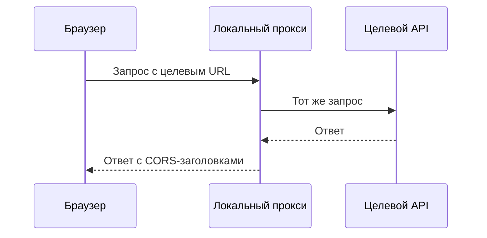

# API-тестер

::: info В разработке
Здесь появится страница для отправки HTTP-запросов и просмотра ответов прямо из справочника. Пока используйте инструменты из раздела [Инструменты](/tools/) и [шпаргалку curl](/tools/curl).
:::

## Что планируется

- Конструктор запроса: метод, URL, query-параметры, заголовки, тело (JSON, form, raw).
- Авторизация: Basic, Bearer, API key, OAuth 2.0 Client Credentials.
- Просмотр ответа: код с расшифровкой и ссылкой на [справочник кодов](/http/status-codes), заголовки, тело с подсветкой, время и размер.
- Экспорт запроса в `curl`.
- История запросов и окружения (переменные `baseUrl`, токены) в браузере.
- Проверка ответа на соответствие JSON Schema.

## Ограничение: CORS

Браузер не даст странице отправить запрос к чужому API, если тот не разрешает это заголовками CORS — подробнее в разделе [CORS](/security/cors). Поэтому тестер будет работать в двух режимах:

| Режим | Как работает | Когда подходит |
|---|---|---|
| Напрямую из браузера | `fetch` со страницы | API разрешает CORS, публичные тестовые сервисы |
| Через локальный прокси | Небольшой сервер из этого репозитория (`npm run proxy`) пересылает запрос | Любые API, в том числе внутренние и без CORS |

