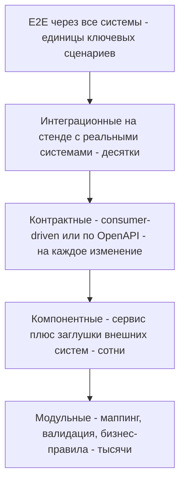
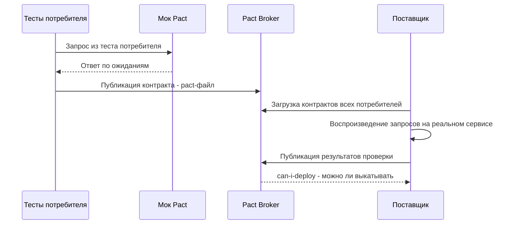

# Тестирование API

Как проверить, что интеграция работает правильно, надёжно и безопасно: виды тестирования, чек-лист проверок эндпоинта, техники тест-дизайна, контрактное тестирование, заглушки, автоматизация, нагрузка и приёмка с партнёром. Аналитик здесь отвечает за то, **что** проверять: сценарии, данные, критерии приёмки и требования к стендам.

## Виды тестирования {#types}

| Вид | Что проверяет | Кто обычно делает | Пример для интеграции |
|---|---|---|---|
| **Функциональное** | Эндпоинт делает то, что описано в требованиях | QA, разработчик | `POST /orders` создаёт заказ с правильными суммами и статусом `new` |
| **Негативное** | Корректная реакция на неправильный ввод и нештатные ситуации | QA | Нет обязательного поля — [400](/http/status-codes#400) с понятной ошибкой, а не [500](/http/status-codes#500) |
| **Контрактное** | Поставщик и потребитель одинаково понимают формат обмена | Разработчики обеих сторон | Ответ поставщика соответствует OpenAPI / ожиданиям потребителя (Pact) |
| **Интеграционное** | Две и более реальные системы корректно работают вместе | QA, команды систем | CRM отправила заказ, ERP его приняла и вернула номер |
| **End-to-end (E2E)** | Бизнес-сценарий целиком через все системы | QA, аналитики, бизнес | Клиент оформил заказ на сайте — заказ собран на складе — пришло SMS |
| **Нагрузочное** | Производительность и поведение под нагрузкой | Инженеры по нагрузке | API выдерживает 300 RPS с p95 не более 300 мс |
| **Безопасности** | Аутентификация, авторизация, уязвимости | ИБ, пентестеры, QA | Нельзя получить чужой заказ, подставив его ID (BOLA) |
| **Регрессионное** | Изменения не сломали то, что работало | Автотесты | Прогон коллекции после каждого релиза |
| **Смоук (smoke)** | Система в принципе жива после развёртывания | Автотесты, дежурные | `GET /health` отвечает 200, основной сценарий проходит |

## Пирамида тестов для интеграций {#pyramid}

Чем выше уровень, тем тесты дороже, медленнее и нестабильнее — значит, их должно быть меньше. Основную массу проверок формата и логики делаем внизу, а E2E оставляем для ключевых бизнес-сценариев.



::: tip Почему контрактные тесты так важны
Интеграционный стенд со всеми системами часто нестабилен, занят или вообще недоступен (партнёр даёт тестовый контур раз в квартал). Контрактные тесты позволяют поймать несовместимость форматов **без** запуска обеих систем одновременно — до того, как она доберётся до стенда.
:::

## Что проверять в каждом эндпоинте {#endpoint-checklist}

Чек-лист для составления тест-кейсов. Не все пункты применимы к каждому эндпоинту, но пройтись по списку стоит всегда.

### Позитивные сценарии и формат ответа

- [ ] **Код ответа** соответствует сценарию: [200](/http/status-codes#200) для чтения, [201](/http/status-codes#201) с заголовком `Location` для создания, [204](/http/status-codes#204) без тела, [202](/http/status-codes#202) для асинхронных операций. См. [Коды состояния](/http/status-codes).
- [ ] **Схема ответа** совпадает со спецификацией: типы полей, форматы (`date-time`, `uuid`), enum.
- [ ] **Обязательные поля** присутствуют всегда, в том числе у «пустых» объектов.
- [ ] **Заголовки ответа**: `Content-Type`, `Cache-Control`, `ETag`, `Location`, заголовки rate limit.
- [ ] **Побочные эффекты**: объект действительно создан/изменён (проверить последующим `GET`), отправлено событие или вебхук.

### Валидация входных данных (негативные сценарии)

- [ ] **Отсутствующие обязательные поля** — [400](/http/status-codes#400) или [422](/http/status-codes#422) с указанием, какое поле.
- [ ] **Некорректные типы**: строка вместо числа, число вместо строки, объект вместо массива, `null` там, где он не разрешён.
- [ ] **Граничные значения**: минимум, максимум, минимум минус один, максимум плюс один; пустая строка, строка максимальной длины, длина +1.
- [ ] **Лишние (неизвестные) поля** — договорённое поведение: игнорировать или отклонять. Опасно, если лишнее поле молча применяется (mass assignment: клиент передал `"role": "admin"` или `"price": 0`).
- [ ] **Некорректный формат**: невалидный JSON, неверная дата (`2026-02-30`), неверный email, неизвестное значение enum.
- [ ] **Неверный `Content-Type`** — [415](/http/status-codes#415); неподдерживаемый `Accept` — [406](/http/status-codes#406).
- [ ] **Большие тела**: тело больше лимита — [413](/http/status-codes#413), а не падение сервиса; массив из 10 000 элементов.
- [ ] **Юникод и спецсимволы**: кириллица, эмодзи, символы `&`, `%`, `'`, `"`, обратный слеш, переводы строк, пробелы в начале и конце, очень длинные слова. Данные должны сохраниться и вернуться без искажений.
- [ ] **Числа и деньги**: отрицательные, ноль, дробные с большим числом знаков, очень большие (переполнение), точность округления. См. [Соглашения о данных](/design/data-conventions).
- [ ] **Формат ошибок** единообразен (например, Problem Details) и не раскрывает внутренности: стектрейсы, SQL, пути к файлам. См. [Ошибки](/design/errors).

### Списки

- [ ] **Пагинация**: первая, средняя, последняя страница, страница за пределами, размер страницы 0, отрицательный, больше максимума; нет пропусков и дублей при переходе по страницам, в том числе когда данные меняются во время обхода. См. [Пагинация](/design/pagination).
- [ ] **Фильтрация и сортировка**: каждый фильтр по отдельности и в комбинации, сортировка по возрастанию и убыванию, стабильность порядка при равных значениях, неизвестное поле сортировки. См. [Фильтрация и сортировка](/design/filtering).
- [ ] **Пустой список** — `200` с пустым массивом, а не [404](/http/status-codes#404).

### Доступ и безопасность

- [ ] **Без токена** — [401](/http/status-codes#401); с истёкшим, отозванным, поддельным токеном — тоже 401.
- [ ] **Недостаточно прав** (нет нужного scope или роли) — [403](/http/status-codes#403).
- [ ] **Чужие объекты!** Пользователь или клиент A запрашивает, меняет, удаляет объект клиента B, подставив его ID. Должно быть 403 или 404, и ни в коем случае не данные. Это самая частая уязвимость API (BOLA) — см. [OWASP API Top 10](/security/owasp-api).
- [ ] **Чужие поля**: ответ не содержит данных, которые этому потребителю видеть не положено (избыточная выдача).
- [ ] **Rate limiting**: при превышении лимита — [429](/http/status-codes#429) с `Retry-After`. См. [Rate limiting](/design/rate-limiting).

### Надёжность и конкурентность

- [ ] **Идемпотентность**: повтор `PUT`/`DELETE` даёт тот же результат; повтор `POST` с тем же `Idempotency-Key` не создаёт дубль и возвращает исходный ответ; тот же ключ с другим телом — ошибка. См. [Идемпотентность](/design/idempotency).
- [ ] **Конкурентные запросы**: два одновременных изменения одного объекта — одно должно получить [409](/http/status-codes#409) или [412](/http/status-codes#412) (при `If-Match`), а не «последний затёр первого». Два одновременных `POST` с одним ключом идемпотентности. См. [Конкурентный доступ](/design/concurrency).
- [ ] **Таймауты**: что видит потребитель, если поставщик отвечает медленно; не остаётся ли «полусозданных» объектов. См. [Таймауты и повторы](/reliability/timeouts-retries).
- [ ] **Недоступность зависимостей**: внешняя система лежит — понятная ошибка ([502](/http/status-codes#502), [503](/http/status-codes#503), [504](/http/status-codes#504)), а не зависание; после восстановления всё догоняется.
- [ ] **Порядок и дубли сообщений** (для асинхронных интеграций): событие пришло дважды, события пришли не по порядку, пришло событие об объекте, которого ещё нет.

## Техники тест-дизайна для API {#test-design}

### Классы эквивалентности {#equivalence}

Входные значения делят на группы, внутри которых система ведёт себя одинаково, и берут по одному представителю из каждой группы.

Пример: поле `quantity` (целое, от 1 до 999).

| Класс | Представитель | Ожидание |
|---|---|---|
| Корректные значения | `5` | 201 |
| Меньше минимума | `-3` | 400 / 422 |
| Больше максимума | `5000` | 400 / 422 |
| Не целое число | `2.5` | 400 / 422 |
| Не число | `"пять"` | 400 |
| `null` | `null` | 400 / 422 |
| Поле отсутствует | — | 400 / 422 (или значение по умолчанию, если так задумано) |

### Граничные значения {#boundary}

Ошибки чаще всего живут на границах. Для диапазона от 1 до 999 проверяем: `0`, `1`, `2`, `998`, `999`, `1000`. Для строки длиной до 255 символов: пустая, 1, 254, 255, 256. Для дат: начало и конец периода, полночь, 29 февраля, переход на другой часовой пояс, конец месяца.

::: warning Граница в символах или байтах
«Не более 255 символов» и «не более 255 байт» — разные требования: одна кириллическая буква в UTF-8 занимает 2 байта, эмодзи — 4. Уточняйте это в контракте и проверяйте на кириллице.
:::

### Попарное тестирование (pairwise) {#pairwise}

Если у запроса много параметров, перебрать все комбинации невозможно: 5 фильтров по 4 значения — это 1024 комбинации. Большинство дефектов проявляется на сочетании **двух** параметров, поэтому набирают минимальный набор тестов, где каждая пара значений встречается хотя бы раз, — получается порядка 20–25 тестов вместо тысячи. Наборы генерируют инструментами (например, PICT от Microsoft или онлайн-генераторами).

### Другие полезные техники

- **Таблицы решений** — когда результат зависит от комбинации условий (тип клиента × способ оплаты × наличие скидки).
- **Переходы состояний** — для ресурсов с жизненным циклом: проверить все разрешённые переходы статуса и попытки запрещённых (отменить уже доставленный заказ — [409](/http/status-codes#409)).
- **Сценарии на основе вариантов использования** — для интеграционных и E2E тестов.

## Контрактное тестирование {#contract-testing}

Контракт — это договорённость о формате взаимодействия: эндпоинты, поля, типы, коды ответов. Контрактный тест проверяет, что реализация соответствует этой договорённости, и делает это изолированно — без одновременного запуска обеих систем.

### Consumer-driven contracts (Pact) {#pact}

Потребитель сам формулирует ожидания: «на такой запрос я жду ответ с такими полями». Эти ожидания проверяются против реального поставщика.



- **Плюсы**: поставщик видит, какие поля реально используют потребители, и может безопасно менять остальные; ломающее изменение обнаруживается до релиза.
- **Минусы**: обе стороны должны внедрить Pact и брокер, нужна дисциплина. С внешними партнёрами так договориться удаётся редко — это инструмент для команд внутри компании.

### Schema-based: проверка по OpenAPI {#schema-based}

Источник истины — спецификация [OpenAPI](/specs/openapi). Проверки:

- ответы реального сервиса валидируются по схеме (Prism в режиме proxy, валидаторы в автотестах, Schemathesis — генерирует запросы по спецификации и ищет расхождения и падения);
- изменения спецификации проверяются на обратную совместимость (инструменты сравнения версий OpenAPI, например oasdiff) — см. [Версионирование](/design/versioning);
- спецификация проходит линтер (Spectral) на соответствие стайлгайду.

| | Consumer-driven (Pact) | Schema-based (OpenAPI) |
|---|---|---|
| Источник истины | Ожидания потребителей | Спецификация поставщика |
| Видно, какие поля используются | Да | Нет |
| Подходит для внешних партнёров | Редко | Да |
| Порог входа | Высокий | Низкий, если OpenAPI уже есть |

## Моки и заглушки внешних систем {#mocks}

Заглушка (mock, stub) имитирует внешнюю систему, которая недоступна, нестабильна, платная за вызов или ещё не готова.

| Инструмент | Когда брать |
|---|---|
| **Prism** | Есть OpenAPI — мок поднимается одной командой, ответы берутся из примеров спецификации, входящие запросы валидируются по схеме |
| **WireMock** | Нужна гибкость: ответ зависит от тела запроса, сценарии с состоянием («первый вызов — 503, второй — 200»), задержки, обрывы соединения, запись реального трафика |
| **Mockoon** | Нужен GUI, чтобы заглушку настраивали аналитики и тестировщики без кода |

```bash
# Prism: мок по спецификации на порту 4010
npx @stoplight/prism-cli mock openapi.yaml

# WireMock в Docker
docker run -it --rm -p 8080:8080 wiremock/wiremock
```

Пример заглушки WireMock: ответ с задержкой и сценарий отказа для проверки повторов на стороне клиента.

```json
{
  "request": {
    "method": "POST",
    "urlPath": "/v1/payments"
  },
  "response": {
    "status": 503,
    "headers": { "Retry-After": "2" },
    "fixedDelayMilliseconds": 1500
  }
}
```

::: warning Заглушка — не замена реальной системе
Мок отвечает так, как вы его научили. Если вы неправильно поняли контракт партнёра — и код, и мок будут одинаково неправы, и тесты пройдут. Поэтому моки делают по официальной спецификации или записи реального трафика, а интеграционный тест на реальном тестовом контуре партнёра всё равно обязателен перед запуском.
:::

Что стоит предусмотреть в заглушке, помимо успешных ответов: все документированные ошибки, медленные ответы (дольше таймаута клиента), обрыв соединения, некорректный JSON, [429](/http/status-codes#429) с `Retry-After`, пустые списки и максимальные страницы.

## Тестовые стенды и данные {#environments}

Требования, которые аналитику стоит зафиксировать заранее:

- **Какие контуры есть у каждой стороны**: dev, test, preprod (stage), prod. Какой контур партнёра с каким нашим связан, адреса, способ доступа (VPN, белые списки IP, mTLS-сертификаты для тестового контура).
- **Тестовые данные**: кто их создаёт, как сбрасываются, есть ли «эталонные» клиенты и объекты для каждого сценария (в том числе для негативных: заблокированный клиент, просроченный договор).
- **Персональные данные**: на тестовых контурах — только обезличенные или синтетические данные. Копия продовой базы на тестовом стенде — нарушение требований к защите ПДн.
- **Изоляция**: несколько команд на одном стенде мешают друг другу. Договоритесь о префиксах в данных или выделенных учётках.
- **Время на стенде**: можно ли сдвигать дату для проверки сценариев «конец месяца», «истёк срок».
- **Тестовые режимы внешних сервисов**: платёжные шлюзы и сервисы доставки обычно дают sandbox с «магическими» значениями (номер карты, который всегда отклоняется) — выпишите их в документацию интеграции.

## Автоматизация {#automation}

| Инструмент | Язык / формат | Когда подходит |
|---|---|---|
| **Postman + Newman / Postman CLI** | JavaScript в тестах коллекции | Коллекция уже есть в Postman, нужно прогонять её в CI |
| **Bruno CLI** | JavaScript в тестах коллекции | Коллекции хранятся в git, команда не хочет облака |
| **REST Assured** | Java / Kotlin | Команда пишет на JVM, тесты живут рядом с кодом |
| **pytest + requests (или httpx)** | Python | Универсальный вариант, низкий порог входа, легко генерировать данные |
| **Karate** | Собственный DSL в стиле Gherkin | Тесты API читаемы аналитиками; встроены моки, проверки схем, простая нагрузка (через Gatling) |
| **Schemathesis** | Python / CLI | Генеративные тесты по OpenAPI: сам придумывает запросы и находит падения и расхождения со схемой |

### Пример: тесты в Postman {#postman-example}

Скрипт во вкладке Tests (Post-response) запроса `POST /orders`:

```js
const schema = {
  type: "object",
  required: ["id", "status", "createdAt"],
  properties: {
    id: { type: "string" },
    status: { type: "string", enum: ["new", "paid", "cancelled"] },
    createdAt: { type: "string" }
  }
};

pm.test("Статус 201 Created", function () {
  pm.response.to.have.status(201);
});

pm.test("Есть заголовок Location", function () {
  pm.response.to.have.header("Location");
});

pm.test("Ответ соответствует схеме", function () {
  pm.response.to.have.jsonSchema(schema);
});

pm.test("Новый заказ в статусе new", function () {
  const body = pm.response.json();
  pm.expect(body.status).to.eql("new");
});

pm.test("Время ответа меньше 1 секунды", function () {
  pm.expect(pm.response.responseTime).to.be.below(1000);
});

// Сохранить ID для следующих запросов цепочки
pm.collectionVariables.set("orderId", pm.response.json().id);
```

Прогон в CI:

```bash
npx newman run orders.postman_collection.json \
  -e test.postman_environment.json \
  --reporters cli,junit \
  --reporter-junit-export results.xml
```

### Пример: pytest + requests {#pytest-example}

```python
import os
import uuid
import requests

BASE_URL = os.environ["BASE_URL"]
HEADERS = {"Authorization": f"Bearer {os.environ['TOKEN']}"}


def test_create_order_is_idempotent():
    key = str(uuid.uuid4())
    body = {"customerId": "c-1001", "items": [{"sku": "SKU-1", "quantity": 2}]}
    headers = {**HEADERS, "Idempotency-Key": key}

    first = requests.post(f"{BASE_URL}/orders", json=body, headers=headers, timeout=10)
    second = requests.post(f"{BASE_URL}/orders", json=body, headers=headers, timeout=10)

    assert first.status_code == 201
    assert second.status_code in (200, 201)
    assert second.json()["id"] == first.json()["id"]


def test_cannot_read_foreign_order():
    # Заказ, принадлежащий другому клиенту
    foreign_id = os.environ["FOREIGN_ORDER_ID"]
    resp = requests.get(f"{BASE_URL}/orders/{foreign_id}", headers=HEADERS, timeout=10)
    assert resp.status_code in (403, 404)
```

## Нагрузочное тестирование {#load-testing}

### Инструменты

| Инструмент | Сценарии на | Особенности |
|---|---|---|
| **k6** (Grafana) | JavaScript | Консольный, легко встраивается в CI, пороги (thresholds) прямо в скрипте |
| **Apache JMeter** | GUI / XML | Старейший и самый распространённый, много плагинов и протоколов (HTTP, JDBC, JMS) |
| **Gatling** | Scala, Java, Kotlin, JS | Высокая производительность генератора, подробные HTML-отчёты |
| **Locust** | Python | Сценарии на обычном Python, веб-интерфейс, распределённый запуск |

### Ключевые метрики {#load-metrics}

- **RPS** (requests per second) — сколько запросов в секунду обрабатывает система; **пропускная способность** — максимальный RPS, при котором метрики ещё в норме.
- **Латентность в перцентилях**: p50 (медиана), p95, p99. Среднее время скрывает «хвосты»: при среднем 100 мс каждый сотый запрос может идти 5 секунд. Требования формулируйте в перцентилях: «p95 не более 300 мс при 200 RPS».
- **Доля ошибок**: процент ответов 5xx, таймаутов, отказов в соединении. Обычно требование — не более 0,1–1%.
- **Ресурсы**: CPU, память, пулы соединений, очереди — чтобы найти узкое место.

### Виды нагрузочных тестов

| Вид | Что делаем | Что узнаём |
|---|---|---|
| Нагрузочный (load) | Ожидаемая рабочая нагрузка | Укладываемся ли в SLA |
| Стресс (stress) | Нагрузка растёт до отказа | Предел системы и как она деградирует |
| Пиковый (spike) | Резкий скачок нагрузки | Переживёт ли «чёрную пятницу», рассылку, массовый перезапуск клиентов |
| Стабильность (soak, endurance) | Рабочая нагрузка много часов | Утечки памяти, переполнение логов и очередей |

### Пример сценария k6

```js
import http from "k6/http";
import { check, sleep } from "k6";

export const options = {
  stages: [
    { duration: "2m", target: 50 },   // разгон до 50 виртуальных пользователей
    { duration: "10m", target: 50 },  // держим нагрузку
    { duration: "1m", target: 0 },    // снижение
  ],
  thresholds: {
    http_req_duration: ["p(95)<300", "p(99)<1000"], // перцентили времени ответа, мс
    http_req_failed: ["rate<0.01"],                  // ошибок меньше 1%
  },
};

export default function () {
  const res = http.get(`${__ENV.BASE_URL}/orders?limit=20`, {
    headers: { Authorization: `Bearer ${__ENV.TOKEN}` },
  });
  check(res, { "status 200": (r) => r.status === 200 });
  sleep(1);
}
```

::: warning Нагрузку на чужую систему — только по согласованию
Нагрузочный тест против тестового контура партнёра без предупреждения выглядит как DDoS-атака: вас заблокируют, а партнёр будет прав. Согласуйте окно, профиль нагрузки и контакты на время теста. Против production — только по отдельному решению обеих сторон.
:::

## Приёмка интеграции с партнёром {#acceptance}

Приёмо-сдаточные испытания (ПСИ) — формальная проверка того, что интеграция работает по согласованному контракту на контуре, максимально близком к боевому.

### Подготовка

- [ ] Согласована и подписана (утверждена) версия спецификации, по которой идёт приёмка.
- [ ] Утверждена программа и методика испытаний (ПМИ): перечень сценариев, входные данные, ожидаемые результаты, критерии успешности.
- [ ] Стенды обеих сторон развёрнуты на нужных версиях, сетевая связность проверена (VPN, белые списки IP, DNS).
- [ ] Выпущены и установлены сертификаты (TLS, mTLS), выданы учётные данные (client_id, ключи) **для тестового контура**.
- [ ] Подготовлены тестовые данные с обеих сторон.
- [ ] Назначены ответственные и каналы связи на время испытаний.
- [ ] Обеспечен доступ к логам и трассировке, чтобы разбирать ошибки по `X-Request-ID` / correlation ID.

### Что проверить в ходе ПСИ

- [ ] Все позитивные бизнес-сценарии из ПМИ, включая граничные (максимальный объём данных, пограничные даты).
- [ ] Все документированные ошибки: каждая сторона корректно обрабатывает ошибки другой.
- [ ] Аутентификация и авторизация: истёкший токен, отозванный сертификат, неверные учётные данные.
- [ ] Повторы и идемпотентность: повторная отправка не порождает дублей.
- [ ] Недоступность одной из сторон: сообщения не теряются, после восстановления всё догоняется, нет «зависших» статусов.
- [ ] Асинхронные сценарии: вебхуки и сообщения доходят, подпись проверяется, дубли и нарушение порядка обрабатываются.
- [ ] Производительность на согласованном профиле нагрузки (если требуется).
- [ ] Сверка данных: то, что ушло из системы A, совпадает с тем, что сохранила система B (суммы, даты с часовыми поясами, справочные значения, кириллица).
- [ ] Мониторинг и алерты срабатывают на тестовые сбои.

### Завершение

- [ ] Оформлен протокол испытаний: что проверено, результаты, найденные дефекты и их критичность.
- [ ] Дефекты, блокирующие запуск, исправлены и перепроверены; некритичные — зафиксированы с плановыми сроками.
- [ ] Подписан акт (или иное подтверждение готовности обеих сторон).
- [ ] Согласован план запуска: дата, окно, порядок включения, критерии отката, кто на связи.

Полный путь от требований до запуска — в [Чек-листе интеграции](/guide/integration-checklist).

## Типичные ошибки {#mistakes}

- Тестируют только «счастливый путь» — а в бою ломаются таймауты, повторы и дубли.
- Нет проверки доступа к чужим объектам — классическая утечка данных через API.
- Тест проверяет только код ответа, но не тело и не побочные эффекты.
- Тестовые данные зависят друг от друга и от порядка запуска — тесты «мигают».
- Среднее время ответа вместо перцентилей в требованиях к производительности.
- Моки написаны «по памяти», а не по спецификации, — тесты зелёные, интеграция не работает.
- Приёмка без утверждённой версии контракта — спор «а мы думали, что поле необязательное» на финише.

## Связанные страницы

- [Обзор инструментов](/tools/) и [Шпаргалка curl](/tools/curl)
- [OpenAPI](/specs/openapi) — источник истины для schema-based тестов
- [Чек-лист безопасности](/security/best-practices)
- [Наблюдаемость](/reliability/observability)
